<hr>

<h1 align="center"> Informe de Trabajo Final </h1>

<h3 align="center"> Universidad Peruana de Ciencias Aplicadas </h3>

<h3 align="center"> Ingeniería de Software </h3>

<h3 align="center">Ciclo 2025 - 2</h3>

<div align="center">
  
</div>

<h1 align="center"> TB2 Report </h1>

<h3 align="center"> Docente: Vera Olivera, David Carlos </h3>

<h3 align="center"> 1ASI0572 - Desarrollo de Soluciones IoT </h3>

<h4 align="center"> NRC: 3355 </h4>


<h3> Startup: CleanWave </h3>

<h3> Product: Metalix </h3>

<h3> Team Members: </h3>

<div align="center">
  <table>
    <thead>
      <tr>
        <th>Member</th>
        <th>Code</th>
      </tr>
    </thead>
    <tbody>
      <tr>
        <td>Roca Huapaya, Orlando Arturo</td>
        <td>U201919742</td>
      </tr>
      <tr>
        <td>Del Carmen Zorrilla, Ray Alessandro</td>
        <td>U202124061</td>
      </tr>
      <tr>
        <td>Pardo Zapata, Gustavo Adolfo</td>
        <td>U202120347</td>
      </tr>
      <tr>
        <td>Cruz Palomino, Adriano Sebastian</td>
        <td>U202210697</td>
      </tr>
      <tr>
        <td>Mancilla Ordaya, Eduardo Vicente</td>
        <td>U202018894</td>
      </tr>
      <tr>
        <td>Quiñones Tintaya, Johan Jorge</td>
        <td>U202218183</td>
      </tr>
    </tbody>
  </table>
</div>

<h3 align="center">Agosto, 2025</h3>

<br><br>

# Registro de Versiones del Informe

Esta sección tiene como propósito detallar las actualizaciones significativas realizadas al informe durante su evolución. Se presenta en una página independiente y se organiza en un cuadro con el formato que se muestra a continuación.

<table align="center">
  <thead>
    <tr>
      <th>Versión</th>
      <th>Fecha</th>
      <th>Autor</th>
      <th>Descripción de modificación</th>
    </tr>
  </thead>
  <tbody>
  <!-- TB1 -->
    <tr>
      <td rowspan="7">TB1</td>
      <td rowspan="7">16/09/2025</td>
    </tr>
    <tr>
      <td>Del Carmen Zorrilla, Ray Alessandro</td>
      <td>
        - Diseñé las entrevistas para recolectar información de usuarios.<br>
        - Realicé entrevistas al segmento de <b>municipalidades costeras</b> para identificar necesidades y problemáticas.<br>
        - Segmenté y definí los <b>segmentos objetivo</b> principales del proyecto (bañistas y municipalidades).<br>
        - Desarrollé el <b>To-Be Scenario Mapping</b> de ambos segmentos, mostrando el flujo ideal de interacción con el sistema.<br>
        - Redacté y estructuré las <b>User Stories</b> centradas en los bañistas.<br>
        - Elaboré el <b>Impact Mapping</b> conectando objetivos estratégicos, impactos y entregables.<br>
        - Organicé y documenté el <b>Product Backlog</b>, priorizando las historias y asignando story points.<br>
      </td>
    </tr>
    <tr>
      <td>Cruz Palomino, Adriano Sebastian</td>
      <td>
        - Realicé entrevistas al segmento de municipalidades.<br>
        - Desarrollé el <b>análisis competitivo</b> identificando fortalezas, debilidades, oportunidades y amenazas de los competidores.<br>- Propuse <b>estrategias y tácticas frente a competidores</b> para diferenciar la solución.<br>
        - Elaboré el proceso de <b>Needfinding</b>.<br>
        - Construí los <b>User Personas</b> representativos de los segmentos clave.<br>
        - Diseñé la <b>User Task Matrix</b>.<br>
        - Desarrollé el <b>User Journey Mapping</b> destacando fases y sentimientos del usuario.<br>
        - Creé el <b>Empathy Mapping</b> para comprender motivaciones y frustraciones.<br>
        - Documenté el <b>As-is Scenario Mapping</b>, mostrando el flujo actual de interacción con la problemática.<br>
        - Definí el <b>Ubiquitous Language</b>, estableciendo el lenguaje común del dominio.<br> 
      </td>
    </tr>
        <tr>
      <td>Quiñones Tintaya, Johan Jorge</td>
      <td>
        - Realice entrevista a usuario<br>
        - Desarrolle el analisis completo de todas las entrevistas<br>
        - Desarrolle completamente el punto de Tactical-Level Domain-Driven Design para el BD de WasteCollection<br>
        - Desarrolle completamente el punto de Tactical-Level Domain-Driven Design para el BD de UserIdentification<br>
        - Desarrolle completamente el punto de Tactical-Level Domain-Driven Design para el BD de RewardManagement<br>
        - Desarrolle completamente el punto de Tactical-Level Domain-Driven Design para el BD de MunicipalityManagement<br>
        - Desarrolle completamente el punto de Tactical-Level Domain-Driven Design para el BD de Monitoring & Reporting 
      </td>
    </tr>
    <tr>
      <td>Pardo Zapata, Gustavo Adolfo</td>
      <td>
        - Realicé entrevista para el primer segmento objetivo<br>
        - Elaboré el resumen de mi entrevista dedicada<br>
        - Desarrollé completamente parte del capítulo 4<br>
        - Desarrollé completamente el punto de Strategic-Level Domain-Driven Design<br>
        - Desarrollé, analicé y completé el punto de EventStorming<br>
        - Desarrollé completamente el punto de Candidate Context Discovery<br>
        - Desarrollé completamente el punto de Bounded Context Canvases<br>
        - Implementé el punto de Context Mapping
      </td>
    </tr>
        <tr>
      <td>Roca Huapaya, Orlando Arturo</td>
      <td>
        - Realicé entrevista para el primer segmento objetivo<br>
        - Elaboré el resumen de mi entrevista dedicada<br>
        - Desarrollé completamente parte del capítulo 1<br>
        - Desarrollé completamente el punto de Lean UX Process<br>
        - Desarrollé completamente el punto de Lean UX Problem Statements<br>
        - Desarrollé completamente el punto de Lean UX Assumptions<br>
        - Implementé el punto de Lean UX Hypothesis Statements
    </td>
    </tr>
        <tr>
      <td>Mancilla Ordaya, Eduardo Vicente</td>
      <td>
        - Realicé entrevista para el primer segmento objetivo.<br>
        - Realicé el resumen correspondiente de la entrevista realizada<br>
        - Actualicé la presentación con los diagramas C4 para su exposición<br>
           - Desarrolle el System Landscape Diagram.<br>
           - Desarrolle el Context Level Diagram.<br>
           - Desarrolle el Deployment Diagram.<br>
      </td>
    </tr>
    <!-- TP -->
    <tr>
      <td rowspan="7">TP</td>
      <td rowspan="7">10/10/2025</td>
    </tr>
    <tr>
      <td>Del Carmen Zorrilla, Ray Alessandro</td>
      <td>
        - Diseñé la <b>Landing Page UI</b> aplicando principios de usabilidad y comunicación visual orientados al público general y a las municipalidades.<br>
        - Desarrollé el <b>Wireframe</b> de la Landing Page en Figma, estructurando la jerarquía de secciones informativas, el formulario de contacto y los llamados a la acción.<br>
        - Elaboré el <b>Mock-up</b> final de la Landing Page con la línea gráfica oficial del proyecto, integrando la paleta de colores, tipografía y diseño responsivo.<br>
        - Lideré la <b>planificación del Sprint</b> definiendo los objetivos, tareas priorizadas y responsables, alineados con el Product Backlog del proyecto.<br>
        - Documenté la sección de <b>Sprint Planning</b> en el informe, detallando los entregables de la iteración, tiempos estimados y dependencias entre actividades.<br>
      </td>
    </tr>
    <tr>
      <td>Cruz Palomino, Adriano Sebastian</td>
      <td>
        - Desarrollé los <b>wireframes</b> de la aplicación web estructurando la interfaz de usuario para todas las pantallas principales.<br>
        - Creé los <b>wireflow diagrams</b> mostrando los flujos de navegación entre las diferentes pantallas de la aplicación.<br>
        - Elaboré los <b>mockups</b> de la aplicación web con el diseño visual completo aplicando las Style Guidelines establecidas.<br>
        - Desarrollé los <b>user flow diagrams</b> detallando los recorridos completos del usuario en escenarios clave.<br>
        - Diseñé el <b>prototipo interactivo</b> en Figma permitiendo la validación temprana del diseño UI/UX con el equipo.<br>
        - Coordiné con el equipo la consistencia visual y funcional de todos los componentes de diseño.<br>
      </td>
    </tr>
        <tr>
      <td>Quiñones Tintaya, Johan Jorge</td>
      <td>
        - Implementé el <b>backend completo</b> con Spring Boot 3.5.6 y Java 21 siguiendo arquitectura Domain-Driven Design.<br>
        - Desarrollé los <b>6 bounded contexts</b>: IAM, WasteCollection, UserIdentification, RewardManagement, MunicipalityManagement, Monitoring & Reporting.<br>
        - Diseñé la arquitectura de <b>capas por contexto</b>: Domain Layer, Interface Layer, Application Layer e Infrastructure Layer.<br>
        - Creé los <b>diagramas de componentes</b> para visualizar la arquitectura de cada bounded context.<br>
        - Elaboré los <b>diagramas de clases</b> del dominio detallando entidades, value objects y servicios para todos los contextos.<br>
        - Diseñé los <b>diagramas de base de datos</b> con sus relaciones, restricciones y estrategia de persistencia.<br>
        - Documenté todos los <b>endpoints REST</b> con Swagger/OpenAPI para facilitar la integración con frontend.<br>
      </td>
    </tr>
    <tr>
      <td>Pardo Zapata, Gustavo Adolfo</td>
      <td>
        - Diseño e implementacion tecnica del sistema Metalix BC<br>
        - Desarrolle el capitulo VI Product Implementation,Validation and Deployment<br>
        - Se implemento la estrategia de Software Configuration Management con Gitflow<br>
        - Configuré y documenté el entorno completo de desarrollo (VSCode, IntelliJ, Discord, Trello, Figma)<br>
        - Desarrollé, analicé y completé el punto de EventStorming<br>
        - Documenté la gestión de configuración de software y control de versionesy<br>
        - Colaboré en las correcciones y mejoras del Event Storming para el modelado de dominio
      </td>
    </tr>
        <tr>
      <td>Roca Huapaya, Orlando Arturo</td>
      <td>
        - Desarrollé la sección completa de <b>Information Architecture</b> con Organization Systems, Labeling Systems y Navigation Systems.<br>
        - Elaboré las <b>Style Guidelines</b> generales y específicas para Web, Mobile e IoT estableciendo la identidad visual del proyecto.<br>
        - Documenté los <b>SEO Tags y Meta Tags</b> para optimizar la presencia digital de la landing page.<br>
        - Definí los <b>Searching Systems</b> y estrategias de búsqueda para mejorar la experiencia del usuario.<br>
        - Coordiné la integración entre los principios de Lean UX y el diseño UI/UX para mantener coherencia conceptual.<br>
        - Aseguré la consistencia del tono de comunicación y branding a través de todos los entregables de diseño.<br>
    </td>
    </tr>
        <tr>
      <td>Mancilla Ordaya, Eduardo Vicente</td>
      <td>
        - Desarrollé los <b>diagramas C4 completos</b> del sistema Metalix: Landscape, Context, Container y Deployment.<br>
        - Documenté la <b>arquitectura de software</b> a nivel estratégico mostrando la interacción entre sistemas externos.<br>
        - Diseñé el <b>Context Level Diagram</b> identificando actores y sistemas relacionados con Metalix.<br>
        - Elaboré el <b>Container Level Diagram</b> detallando la arquitectura de contenedores (frontend, backend, bases de datos).<br>
        - Creé el <b>Deployment Diagram</b> especificando la infraestructura de despliegue en GitHub Pages, Vercel y Railway.<br>
        - Coordiné con el equipo backend la coherencia entre arquitectura documentada e implementación real.<br>
      </td>
    </tr>
     <!-- TB2 -->
    <!-- TB2 -->
<tr>
  <td rowspan="7">TB2</td>
  <td rowspan="7">10/11/2025</td>
</tr>
<tr>
  <td>Roca Huapaya, Orlando Arturo</td>
  <td>
    - Completó su Student Outcome.<br>
    - Elaboró su Video de Entrevista.<br>
    - Se encargó de la configuración de los repositorios de la organización, asegurando:<br>
    - Correcta estructura del repositorio raíz.<br>
    - Políticas de ramas y permisos.<br>
    - Convenciones para commits y pull requests.<br>
    - Documentación organizada en el README, descrita de manera clara y profesional.<br>
    - Validó la correcta conexión entre repositorios de backend, frontend y mobile.<br>
  </td>
</tr>
<tr>
  <td>Cruz Palomino, Adriano Sebastian</td>
  <td>
    - Completó su Student Outcome.<br>
    - Entregó su Video de Entrevista.<br>
    - Avanzó con el desarrollo tanto en mobile como en el backend, logrando:<br>
    - Estructurar las vistas principales del aplicativo móvil.<br>
    - Implementar endpoints iniciales y pruebas básicas en backend.<br>
    - Integrar las funcionalidades desarrolladas con el flujo general del sistema.<br>
  </td>
</tr>
<tr>
  <td>Del Carmen Zorrilla, Ray Alessandro</td>
  <td>
    - Completó su Student Outcome.<br>
    - Entregó su Video de Entrevista.<br>
    - Trabajó en el sistema embebido IoT, específicamente:<br>
    - Configuración del dispositivo (ESP32 u otros).<br>
    - Interacción con sensores, lectores o actuadores.<br>
    - Preparación del entorno de pruebas para integración futura con el backend.<br>
    - Asimismo, avanzó en la configuración del entorno general del sistema y soporte técnico transversal.<br>
  </td>
</tr>
<tr>
  <td>Pardo Zapata, Gustavo Adolfo</td>
  <td>
    - Completó su Student Outcome.<br>
    - Entregó su Video de Entrevista.<br>
    - Avanzó en la sección "About the Product" del informe general, detallando:<br>
    - Descripción del producto.<br>
    - Alcance funcional.<br>
    - Justificación y propuesta de valor.<br>
    - Participó en la elaboración y corrección de puntos del informe del sprint, incluyendo mejoras según la retroalimentación.<br>
  </td>
</tr>
<tr>
  <td>Mancilla Ordaya, Eduardo Vicente</td>
  <td>
    - Completó su Student Outcome.<br>
    - Entregó su Video de Entrevista.<br>
    - Avanzó en el módulo mobile, logrando:<br>
    - Implementación de vistas adicionales.<br>
    - Integración con endpoints backend entregados en el sprint.<br>
    - Aportó evidencias del sprint y trabajó en la configuración de entornos, tanto de producción como de prueba, asegurando la correcta ejecución de los endpoints implementados.<br>
  </td>
</tr>
<tr>
  <td>Quiñones Tintaya, Johan Jorge</td>
  <td>
    - Completó su Student Outcome.<br>
    - Entregó su Video de Entrevista.<br>
    - Avanzó en la aplicación web (frontend) y en el backend, logrando:<br>
    - Desarrollo de componentes del frontend.<br>
    - Consumo e integración de endpoints.<br>
    - Ajustes en servicios, controladores o vistas según los requerimientos del sprint.<br>
    - Además, participó en correcciones según la retroalimentación del sprint anterior.<br>
  </td>
</tr>
  <!-- Otras entrega -->
  </tbody>
</table>

<br><br>

# Project Report Collaboration Insights

**Repositorios del Proyecto:**
- Link de la organización: https://github.com/Desarrollo-Soluciones-IOT-Grupo-02
- Link del reporte: https://github.com/Desarrollo-Soluciones-IOT-Grupo-02/Report

## TB1 - Collaboration Insights

Durante la entrega TB1, el equipo estableció las bases del proyecto mediante la definición de requisitos, análisis de usuarios y diseño estratégico del sistema. Las coordinaciones iniciales se realizaron en Google Meet, mientras que el seguimiento continuo se llevó a cabo principalmente en WhatsApp. Para la gestión del código se utilizó GitHub, donde los commits reflejan las contribuciones y el trabajo colaborativo del equipo.

**Principales actividades realizadas:**
- Análisis de competidores y definición de segmentos objetivo
- Realización de entrevistas a usuarios y análisis de needfinding
- Desarrollo de User Personas, Journey Maps y Empathy Maps
- Diseño estratégico con EventStorming y Domain-Driven Design
- Definición de Bounded Contexts y arquitectura C4
- Elaboración de User Stories y Product Backlog

**Commits del equipo - TB1:**

<div align="center">
  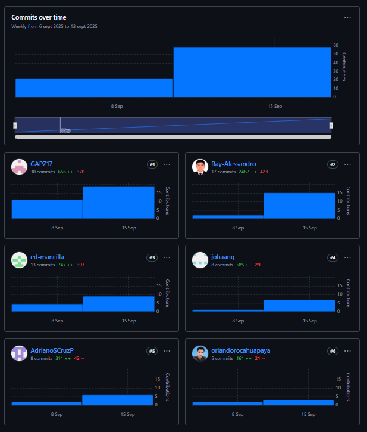
</div>

## TP - Collaboration Insights

En la entrega del Trabajo Parcial (TP), el equipo avanzó significativamente en la implementación técnica del proyecto, desarrollando la landing page, el frontend base de la aplicación web y el backend completo con Spring Boot. La colaboración se intensificó con el uso de GitHub para control de versiones y despliegues automatizados.

**Principales actividades realizadas:**
- Desarrollo completo de la landing page con diseño responsive
- Implementación del frontend base con Angular y componentes principales
- Desarrollo del backend con Spring Boot 3.5.6 siguiendo arquitectura DDD
- Implementación de 6 bounded contexts (IAM, Waste Collection, Rewards, Municipality, Monitoring, RFID)
- Configuración de CI/CD con GitHub Pages, Vercel y Railway
- Documentación de APIs con Swagger/OpenAPI
- Diseño UI/UX completo con wireframes, mockups y prototipos
- Desarrollo del Sprint 1 con planning, ejecución y review

**Commits del equipo - TP:**

<div align="center">
  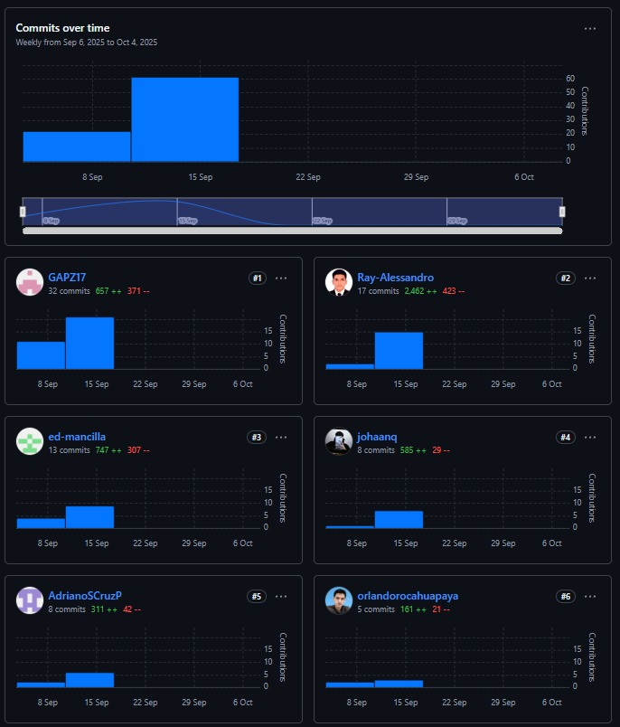
</div>

## TB2 - Collaboration Insights

En la entrega de la TB2, el equipo consolidó los avances del TP y extendió significativamente el desarrollo del proyecto. Se completaron módulos clave del backend, se avanzó en el frontend web, se integró el aplicativo móvil y se desarrolló el sistema embebido IoT necesario para la operación del sistema. Además, se reforzó la coordinación del equipo mediante ramas organizadas, evidencias en GitHub y revisión colaborativa de tareas.

**Principales actividades realizadas:**
- Avance del backend con Spring Boot 3.5.6 aplicando arquitectura DDD en los bounded contexts definidos
- Desarrollo del sistema IoT embebido (lectores, sensores, lógica MQTT/HTTP y configuración del entorno)
- Implementación de vistas y componentes adicionales en el frontend web con Angular
- Avances en el aplicativo móvil, integración con Firebase Auth y consumo inicial de endpoints
- Configuración unificada de repositorios de la organización con documentación en README
- Integración y pruebas preliminares entre IoT → Backend → Web/Mobile
- Actualización de la documentación técnica del sistema y endpoints
- Desarrollo del Sprint 2: planificación, ejecución, evidencias y revisión
- Correcciones del Sprint 1 y alineamiento con la retroalimentación del docente

**Commits del equipo - TB2:**

<div align="center">
  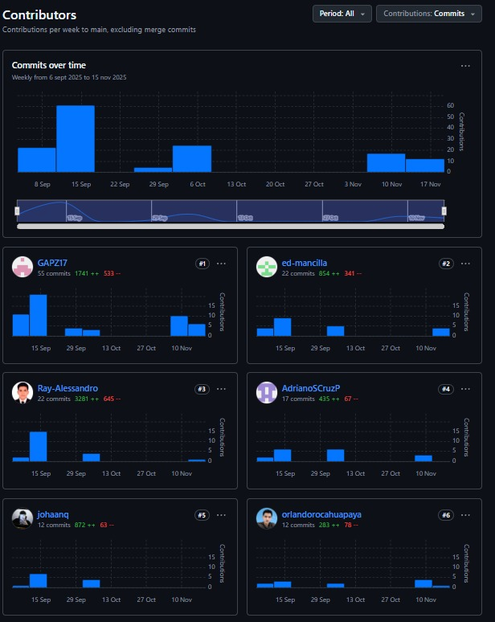
</div>

# Contenido

## Tabla de Contenidos

### [Registro de versiones del informe](#registro-de-versiones-del-informe)

### [Project Report Collaboration Insights](#project-report-collaboration-insights)

### [Contenido](#contenido)

### [Student Outcome](#student-outcome-1)

### [Capítulo I: Introducción](#capítulo-i-introducción-1)

- [1.1. Startup Profile](#11-startup-profile)
  - [1.1.1. Descripción de la Startup](#111-descripción-de-la-startup)
  - [1.1.2. Perfiles de integrantes del equipo](#112-perfiles-de-integrantes-del-equipo)
- [1.2. Solution Profile](#12-solution-profile)
  - [1.2.1 Antecedentes y problemática](#121-antecedentes-y-problemática)
  - [1.2.2 Lean UX Process](#122-lean-ux-process)
    - [1.2.2.1. Lean UX Problem Statements](#1221-lean-ux-problem-statements)
    - [1.2.2.2. Lean UX Assumptions](#1222-lean-ux-assumptions)
    - [1.2.2.3. Lean UX Hypothesis Statements](#1223-lean-ux-hyphotesis-statements)
    - [1.2.2.4. Lean UX Canvas](#1224-lean-ux-canvas)
- [1.3. Segmentos objetivo](#13-segmentos-objetivo)

### [Capítulo II: Requirements Elicitation & Analysis](#capítulo-ii-requirements-elicitation--analysis-1)

- [2.1. Competidores](#21-competidores)
  - [2.1.1. Análisis competitivo](#211-análisis-competitivo)
  - [2.1.2. Estrategias y tácticas frente a competidores](#212-estrategias-y-tácticas-frente-a-competidores)
- [2.2. Entrevistas](#22-entrevistas)
  - [2.2.1. Diseño de entrevistas](#221-diseño-de-entrevistas)
  - [2.2.2. Registro de entrevistas](#222-registro-de-entrevistas)
  - [2.2.3. Análisis de entrevistas](#223-análisis-de-entrevistas)
- [2.3. Needfinding](#23-needfinding)
  - [2.3.1. User Personas](#231-user-personas)
  - [2.3.2. User Task Matrix](#232-user-task-matrix)
  - [2.3.3. User Journey Mapping](#233-user-journey-mapping)
  - [2.3.4. Empathy Mapping](#234-empathy-mapping)
  - [2.3.5. As-is Scenario Mapping](#235-as-is-scenario-mapping)
- [2.4. Ubiquitous Language](#24-ubiquitous-language)

### [Capítulo III: Requirements Specification](#capítulo-iii-requirements-specification-1)

- [3.1. To-Be Scenario Mapping](#31-to-be-scenario-mapping)
- [3.2. User Stories](#32-user-stories)
- [3.3. Impact mapping](#33-impact-mapping)
- [3.4. Product Backlog](#34-product-backlog)

### [Capítulo IV: Solutions Software Design](#capítulo-iv-solution-software-design)

- [Registro de Versiones del Informe](#registro-de-versiones-del-informe)
- [Project Report Collaboration Insights](#project-report-collaboration-insights)
  - [TB1 - Collaboration Insights](#tb1---collaboration-insights)
  - [TP - Collaboration Insights](#tp---collaboration-insights)
  - [TB2 - Collaboration Insights](#tb2---collaboration-insights)
- [Contenido](#contenido)
  - [Tabla de Contenidos](#tabla-de-contenidos)
    - [Registro de versiones del informe](#registro-de-versiones-del-informe-1)
    - [Project Report Collaboration Insights](#project-report-collaboration-insights-1)
    - [Contenido](#contenido-1)
    - [Student Outcome](#student-outcome)
    - [Capítulo I: Introducción](#capítulo-i-introducción)
    - [Capítulo II: Requirements Elicitation \& Analysis](#capítulo-ii-requirements-elicitation--analysis)
    - [Capítulo III: Requirements Specification](#capítulo-iii-requirements-specification)
    - [Capítulo IV: Solutions Software Design](#capítulo-iv-solutions-software-design)
    - [Capítulo V: Solution UI/UX Design](#capítulo-v-solution-uiux-design)
    - [Capítulo VI: Product Implementation, Validation \& Deployment](#capítulo-vi-product-implementation-validation--deployment)
    - [Conclusiones y recomendaciones](#conclusiones-y-recomendaciones)
    - [Video About-the-Team](#video-about-the-team)
    - [Bibliografía](#bibliografía)
    - [Anexos](#anexos)
- [Student Outcome](#student-outcome-1)
- [Capítulo I: Introducción](#capítulo-i-introducción-1)
  - [1.1. StartUp Profile](#11-startup-profile)
    - [1.1.1. Descripción de la StartUp](#111-descripción-de-la-startup)
    - [1.1.2. Perfiles de integrantes del equipo](#112-perfiles-de-integrantes-del-equipo)
  - [1.2. Solution Profile](#12-solution-profile)
    - [1.2.1. Antecedentes y problemática](#121-antecedentes-y-problemática)
      - [5W + 2H](#5w--2h)
        - [What (¿qué?)](#what-qué)
        - [When (¿cuándo?)](#when-cuándo)
        - [Where (¿dónde?)](#where-dónde)
        - [Who (¿quiénes?)](#who-quiénes)
        - [Why (¿por qué?)](#why-por-qué)
        - [How (¿cómo sucede?)](#how-cómo-sucede)
        - [How much (¿cuánto?)](#how-much-cuánto)
    - [1.2.2. Lean UX Process](#122-lean-ux-process)
      - [1.2.2.1. Lean UX Problem Statements](#1221-lean-ux-problem-statements)
      - [1.2.2.2. Lean UX Assumptions](#1222-lean-ux-assumptions)
      - [1.2.2.3. Lean UX Hyphotesis Statements](#1223-lean-ux-hyphotesis-statements)
      - [1.2.2.4. Lean UX Canvas](#1224-lean-ux-canvas)
  - [1.3. Segmentos objetivo](#13-segmentos-objetivo)
    - [1.3.1 Segmento objetivo 1: Bañistas](#131-segmento-objetivo-1-bañistas)
    - [1.3.2 Segmento objetivo 2: Municipalidades costeras](#132-segmento-objetivo-2-municipalidades-costeras)
- [Capítulo II: Requirements Elicitation \& Analysis](#capítulo-ii-requirements-elicitation--analysis-1)
  - [2.1. Competidores](#21-competidores)
    - [2.1.1. Análisis competitivo](#211-análisis-competitivo)
    - [2.1.2. Estrategias y tácticas frente a competidores](#212-estrategias-y-tácticas-frente-a-competidores)
  - [2.2. Entrevistas](#22-entrevistas)
    - [2.2.1. Diseño de entrevistas](#221-diseño-de-entrevistas)
      - [Características demográficas](#características-demográficas)
      - [Características personales y sociales](#características-personales-y-sociales)
      - [Dispositivos y canales digitales](#dispositivos-y-canales-digitales)
      - [Objetivos y frustraciones (contexto de playa y sostenibilidad)](#objetivos-y-frustraciones-contexto-de-playa-y-sostenibilidad)
      - [Biografía o antecedentes](#biografía-o-antecedentes)
    - [Segmento 1: Bañistas (turistas y pobladores locales)](#segmento-1-bañistas-turistas-y-pobladores-locales)
    - [Segmento 2: Municipalidades costeras](#segmento-2-municipalidades-costeras)
    - [Validación del proyecto (para ambos segmentos)](#validación-del-proyecto-para-ambos-segmentos)
    - [2.2.2. Registro de entrevistas](#222-registro-de-entrevistas)
      - [Segmento: Bañistas](#segmento-bañistas)
        - [Entrevista 1](#entrevista-1)
        - [Entrevista 2](#entrevista-2)
        - [Entrevista 3](#entrevista-3)
      - [Segmento: Municipalidades costeras](#segmento-municipalidades-costeras)
        - [Entrevista 4](#entrevista-4)
        - [Entrevista 5](#entrevista-5)
        - [Entrevista 6](#entrevista-6)
    - [2.2.3. Análisis de entrevistas](#223-análisis-de-entrevistas)
    - [Segmento 1: Bañistas](#segmento-1-bañistas)
    - [Segmento 2: Municipalidades Costeras](#segmento-2-municipalidades-costeras-1)
  - [2.3. Needfinding](#23-needfinding)
    - [2.3.1. User Personas](#231-user-personas)
      - [**Segmento 1: Bañistas**](#segmento-1-bañistas-1)
      - [**Segmento 2: Miembros de Municipalidades Costeras**](#segmento-2-miembros-de-municipalidades-costeras)
    - [2.3.2. User Task Matrix](#232-user-task-matrix)
    - [2.3.3. User Journey Mapping](#233-user-journey-mapping)
      - [**Segmento 1: Bañistas**](#segmento-1-bañistas-2)
      - [**Segmento 2: Miembros de Municipalidades Costeras**](#segmento-2-miembros-de-municipalidades-costeras-1)
    - [2.3.4. Empathy Mapping](#234-empathy-mapping)
      - [**Segmento 1: Bañistas**](#segmento-1-bañistas-3)
      - [**Segmento 2: Miembros de Municipalidades Costeras**](#segmento-2-miembros-de-municipalidades-costeras-2)
    - [2.3.5. As-Is Scenario Mapping](#235-as-is-scenario-mapping)
      - [**Segmento 1: Bañistas**](#segmento-1-bañistas-4)
      - [**Segmento 2: Miembros de Municipalidades Costeras**](#segmento-2-miembros-de-municipalidades-costeras-3)
  - [2.4. Ubiquitous Language](#24-ubiquitous-language)
- [Capítulo III: Requirements Specification](#capítulo-iii-requirements-specification-1)
  - [3.1. To-Be Scenario Mapping](#31-to-be-scenario-mapping)
    - [Segmento objetivo 1: Bañistas](#segmento-objetivo-1-bañistas)
    - [Segmento objetivo 2: Municipalidades costeras](#segmento-objetivo-2-municipalidades-costeras)
  - [3.2. User Stories](#32-user-stories)
  - [3.3. Impact mapping](#33-impact-mapping)
    - [Segmento objetivo 1: Bañistas](#segmento-objetivo-1-bañistas-1)
    - [Segmento objetivo 2: Municipalidades costeras](#segmento-objetivo-2-municipalidades-costeras-1)
  - [3.4. Product Backlog](#34-product-backlog)
- [Capítulo IV: Solution Software Design](#capítulo-iv-solution-software-design)
  - [4.1. Strategic-Level Domain-Driven Design](#41-strategic-level-domain-driven-design)
    - [4.1.1. EventStorming](#411-eventstorming)
      - [4.1.1.1. Candidate Context Discovery](#4111-candidate-context-discovery)
      - [4.1.1.2. Domain Message Flows Modeling](#4112-domain-message-flows-modeling)
      - [4.1.1.3. Bounded Context Canvases](#4113-bounded-context-canvases)
    - [4.1.2 Context mapping](#412-context-mapping)
    - [4.1.3. Software Architecture](#413-software-architecture)
      - [4.1.3.1. Software Architecture System Landscape Diagram](#4131-software-architecture-system-landscape-diagram)
      - [4.1.3.2. Software Architecture Context Level Diagrams](#4132-software-architecture-context-level-diagrams)
      - [4.1.3.3. Software Architecture Container Level Diagrams](#4133-software-architecture-container-level-diagrams)
      - [4.1.3.4. Software Architecture Deployment Diagrams](#4134-software-architecture-deployment-diagrams)
- [4.2. Tactical-Level Domain-Driven Design](#42-tactical-level-domain-driven-design)
  - [4.2.1. Bounded Context: IAM](#421-bounded-context-iam)
    - [4.2.1.1. Domain Layer](#4211-domain-layer)
    - [4.2.1.2. Interface Layer](#4212-interface-layer)
    - [4.2.1.3. Application Layer](#4213-application-layer)
    - [4.2.1.4. Infrastructure Layer](#4214-infrastructure-layer)
    - [4.2.1.5. Bounded Context Software Architecture Component Level Diagrams](#4215-bounded-context-software-architecture-component-level-diagrams)
    - [4.2.1.6. Bounded Context Software Architecture Code Level Diagrams](#4216-bounded-context-software-architecture-code-level-diagrams)
      - [4.2.1.6.1. Bounded Context Domain Layer Class Diagrams](#42161-bounded-context-domain-layer-class-diagrams)
      - [4.2.1.6.2. Bounded Context Database Design Diagram](#42162-bounded-context-database-design-diagram)
  - [4.2.2. Bounded Context: WasteCollection](#422-bounded-context-wastecollection)
    - [4.2.2.1. Domain Layer](#4221-domain-layer)
    - [4.2.2.2. Interface Layer](#4222-interface-layer)
    - [4.2.2.3. Application Layer](#4223-application-layer)
    - [4.2.2.4. Infrastructure Layer](#4224-infrastructure-layer)
    - [4.2.2.5. Bounded Context Software Architecture Component Level Diagrams](#4225-bounded-context-software-architecture-component-level-diagrams)
    - [4.2.2.6. Bounded Context Software Architecture Code Level Diagrams](#4226-bounded-context-software-architecture-code-level-diagrams)
      - [4.2.2.6.1. Bounded Context Domain Layer Class Diagrams](#42261-bounded-context-domain-layer-class-diagrams)
      - [4.2.2.6.2. Bounded Context Database Design Diagram](#42262-bounded-context-database-design-diagram)
  - [4.2.3. Bounded Context: UserIdentification](#423-bounded-context-useridentification)
    - [4.2.3.1. Domain Layer](#4231-domain-layer)
    - [4.2.3.2. Interface Layer](#4232-interface-layer)
    - [4.2.3.3. Application Layer](#4233-application-layer)
    - [4.2.3.4. Infrastructure Layer](#4234-infrastructure-layer)
    - [4.2.3.5. Bounded Context Software Architecture Component Level Diagrams](#4235-bounded-context-software-architecture-component-level-diagrams)
    - [4.2.3.6. Bounded Context Software Architecture Code Level Diagrams](#4236-bounded-context-software-architecture-code-level-diagrams)
      - [4.2.3.6.1. Bounded Context Domain Layer Class Diagrams](#42361-bounded-context-domain-layer-class-diagrams)
      - [4.2.3.6.2. Bounded Context Database Design Diagram](#42362-bounded-context-database-design-diagram)
  - [4.2.4. Bounded Context: RewardManagement](#424-bounded-context-rewardmanagement)
    - [4.2.4.1. Domain Layer](#4241-domain-layer)
    - [4.2.4.2. Interface Layer](#4242-interface-layer)
    - [4.2.4.3. Application Layer](#4243-application-layer)
    - [4.2.4.4. Infrastructure Layer](#4244-infrastructure-layer)
    - [4.2.4.5. Bounded Context Software Architecture Component Level Diagrams](#4245-bounded-context-software-architecture-component-level-diagrams)
    - [4.2.4.6. Bounded Context Software Architecture Code Level Diagrams](#4246-bounded-context-software-architecture-code-level-diagrams)
      - [4.2.4.6.1. Bounded Context Domain Layer Class Diagrams](#42461-bounded-context-domain-layer-class-diagrams)
      - [4.2.4.6.2. Bounded Context Database Design Diagram](#42462-bounded-context-database-design-diagram)
  - [4.2.5. Bounded Context: MunicipalityManagement](#425-bounded-context-municipalitymanagement)
    - [4.2.5.1. Domain Layer](#4251-domain-layer)
    - [4.2.5.2. Interface Layer](#4252-interface-layer)
    - [4.2.5.3. Application Layer](#4253-application-layer)
    - [4.2.5.4. Infrastructure Layer](#4254-infrastructure-layer)
    - [4.2.5.5. Bounded Context Software Architecture Component Level Diagrams](#4255-bounded-context-software-architecture-component-level-diagrams)
    - [4.2.5.6. Bounded Context Software Architecture Code Level Diagrams](#4256-bounded-context-software-architecture-code-level-diagrams)
      - [4.2.5.6.1. Bounded Context Domain Layer Class Diagrams](#42561-bounded-context-domain-layer-class-diagrams)
      - [4.2.5.6.2. Bounded Context Database Design Diagram](#42562-bounded-context-database-design-diagram)
  - [4.2.6. Bounded Context: Monitoring \& Reporting](#426-bounded-context-monitoring--reporting)
    - [4.2.6.1. Domain Layer](#4261-domain-layer)
    - [4.2.6.2. Interface Layer](#4262-interface-layer)
    - [4.2.6.3. Application Layer](#4263-application-layer)
    - [4.2.6.4. Infrastructure Layer](#4264-infrastructure-layer)
    - [4.2.6.5. Bounded Context Software Architecture Component Level Diagrams](#4265-bounded-context-software-architecture-component-level-diagrams)
    - [4.2.6.6. Bounded Context Software Architecture Code Level Diagrams](#4266-bounded-context-software-architecture-code-level-diagrams)
      - [4.2.6.6.1. Bounded Context Domain Layer Class Diagrams](#42661-bounded-context-domain-layer-class-diagrams)
      - [4.2.6.6.2. Bounded Context Database Design Diagram](#42662-bounded-context-database-design-diagram)
- [Capítulo V: Solutions UI/UX Design](#capítulo-v-solutions-uiux-design)
  - [5.1. Style Guidelines](#51-style-guidelines)
    - [5.1.1. General Style Guidelines](#511-general-style-guidelines)
    - [5.1.2. Web, Mobile and IoT Style Guidelines](#512-web-mobile-and-iot-style-guidelines)
  - [5.2. Information Architecture](#52-information-architecture)
    - [5.2.1. Organization Systems](#521-organization-systems)
    - [5.2.2. Labeling Systems](#522-labeling-systems)
    - [5.2.3. SEO Tags and Meta Tags](#523-seo-tags-and-meta-tags)
    - [5.2.4. Searching Systems](#524-searching-systems)
    - [5.2.5. Navigation Systems](#525-navigation-systems)
  - [5.3. Landing Page UI Design](#53-landing-page-ui-design)
    - [5.3.1. Landing Page Wireframe](#531-landing-page-wireframe)
    - [5.3.2. Landing Page Mock-up](#532-landing-page-mock-up)
      - [Mock-ups Versión Web](#mock-ups-versión-web)
      - [Mock-ups Versión Mobile](#mock-ups-versión-mobile)
  - [5.4. Application UX/UI Design](#54-application-uxui-design)
    - [5.4.1. Applications Wireframes](#541-applications-wireframes)
    - [5.4.2. Applications Wireflow Diagrams](#542-applications-wireflow-diagrams)
    - [5.4.3. Applications Mock-ups](#543-applications-mock-ups)
    - [5.4.4. Applications User Flow Diagrams](#544-applications-user-flow-diagrams)
  - [5.5. Applications Prototyping](#55-applications-prototyping)
- [Capítulo VI: Product Implementation, Validation \& Deployment](#capítulo-vi-product-implementation-validation--deployment-1)
  - [6.1. Software Configuration Management](#61-software-configuration-management)
    - [6.1.1. Software Development Environment Configuration](#611-software-development-environment-configuration)
    - [6.1.2. Source Code Management](#612-source-code-management)
    - [6.1.3. Source Code Style Guide \& Conventions](#613-source-code-style-guide--conventions)
    - [6.1.4. Software Deployment Configuration](#614-software-deployment-configuration)
  - [6.2. Landing Page, Services \& Applications Implementation](#62-landing-page-services--applications-implementation)
    - [6.2.1. Sprint 1](#621-sprint-1)
      - [6.2.1.1. Sprint Planning 1](#6211-sprint-planning-1)
      - [6.2.1.2. Aspect Leaders and Collaborators](#6212-aspect-leaders-and-collaborators)
      - [6.2.1.3. Sprint Backlog 1](#6213-sprint-backlog-1)
      - [6.2.1.4. Development Evidence for Sprint Review](#6214-development-evidence-for-sprint-review)
      - [6.2.1.5. Testing Suite Evidence for Sprint Review](#6215-testing-suite-evidence-for-sprint-review)
      - [6.2.1.6. Execution Evidence for Sprint Review](#6216-execution-evidence-for-sprint-review)
      - [6.2.1.7. Services Documentation Evidence for Sprint Review](#6217-services-documentation-evidence-for-sprint-review)
      - [6.2.1.8. Software Deployment Evidence for Sprint Review](#6218-software-deployment-evidence-for-sprint-review)
      - [6.2.1.9. Team Collaboration Insights during Sprint](#6219-team-collaboration-insights-during-sprint)
    - [6.2.2. Sprint 2](#622-sprint-2)
      - [6.2.2.1. Sprint Planning 2](#6221-sprint-planning-2)
      - [6.2.2.2. Aspect Leaders and Collaborators](#6222-aspect-leaders-and-collaborators)
      - [6.2.2.3. Sprint Backlog 2](#6223-sprint-backlog-2)
      - [6.2.2.4. Development Evidence for Sprint Review](#6224-development-evidence-for-sprint-review)
      - [6.2.2.5. Testing Suite Evidence for Sprint Review](#6225-testing-suite-evidence-for-sprint-review)
      - [6.2.2.6. Execution Evidence for Sprint Review](#6226-execution-evidence-for-sprint-review)
      - [6.2.2.7. Services Documentation Evidence for Sprint Review](#6227-services-documentation-evidence-for-sprint-review)
      - [6.2.2.8. Software Deployment Evidence for Sprint Review](#6228-software-deployment-evidence-for-sprint-review)
      - [6.2.2.9. Team Collaboration Insights during Sprint](#6229-team-collaboration-insights-during-sprint)
  - [6.3. Validation Interviews](#63-validation-interviews)
    - [6.3.1. Diseño de Entrevistas](#631-diseño-de-entrevistas)
    - [6.3.2. Registro de Entrevistas](#632-registro-de-entrevistas)
      - [Segmento: Bañistas](#segmento-bañistas-1)
        - [Entrevista 1](#entrevista-1-1)
        - [Entrevista 2](#entrevista-2-1)
        - [Entrevista 3](#entrevista-3-1)
      - [Segmento: Municipalidades costeras](#segmento-municipalidades-costeras-1)
        - [Entrevista 1](#entrevista-1-2)
        - [Entrevista 2](#entrevista-1-2)
        - [Entrevista 3](#entrevista-1-2)
    - [6.3.3. Evaluaciones según heurísticas](#633-evaluaciones-según-heurísticas)
  - [6.4. Video About-the-Product](#64-video-about-the-product)
  - [Conclusiones y recomendaciones](#conclusiones-y-recomendaciones-1)
  - [Video About-the-Team](#video-about-the-team-1)
- [Bibliografía](#bibliografía-1)
- [Anexos](#anexos-1)

### [Capítulo V: Solution UI/UX Design](#capítulo-v-solutions-uiux-design)

- [5.1. Style Guidelines](#51-style-guidelines)
  - [5.1.1. General Style Guidelines](#511-general-style-guidelines)
  - [5.1.2. Web, Mobile and IoT Style Guidelines](#512-web-mobile-and-iot-style-guidelines)
- [5.2. Information Architecture](#52-information-architecture)
  - [5.2.1. Organization Systems](#521-organization-systems)
  - [5.2.2. Labeling Systems](#522-labeling-systems)
  - [5.2.3. SEO Tags and Meta Tags](#523-seo-tags-and-meta-tags)
  - [5.2.4. Searching Systems](#524-searching-systems)
  - [5.2.5. Navigation Systems](#525-navigation-systems)
- [5.3. Landing Page UI Design](#53-landing-page-ui-design)
  - [5.3.1. Landing Page Wireframe](#531-landing-page-wireframe)
  - [5.3.2. Landing Page Mock-up](#532-landing-page-mock-up)
- [5.4. Applications UX/UI Design](#54-web-applications-uxui-design)
  - [5.4.1. Applications Wireframes](#541-web-applications-wireframes)
  - [5.4.2. Applications Wireflow Diagrams](#542-web-applications-wireflow-diagrams)
  - [5.4.3. Applications Mock-ups](#543-web-applications-mock-ups)
  - [5.4.4. Applications User Flow Diagrams](#544-web-applications-user-flow-diagrams)
- [5.5. Aplications Prototyping](#55-applications-prototyping)

### [Capítulo VI: Product Implementation, Validation \& Deployment](#capítulo-vi-product-implementation-validation--deployment)

- [6.1. Software Configuration Management](#61-software-configuration-management)
  - [6.1.1. Software Development Environment Configuration](#611-software-development-environment-configuration)
  - [6.1.2. Source Code Management](#612-source-code-management)
  - [6.1.3. Source Code Style Guide \& Conventions](#613-source-code-style-guide--conventions)
  - [6.1.4. Software Deployment Configuration](#614-software-deployment-configuration)
- [6.2. Landing Page, Services \& Applications Implementation](#62-landing-page-services--applications-implementation)
  - [6.2.1. Sprint 1](#621-sprint-1)
    - [6.2.1.1. Sprint Planning 1](#6211-sprint-planning-1)
    - [6.2.1.2. Aspect Leaders and Collaborators](#6212-aspect-leaders-and-collaborators)
    - [6.2.1.3. Sprint Backlog 1](#6213-sprint-backlog-1)
    - [6.2.1.4. Development Evidence for Sprint Review](#6214-development-evidence-for-sprint-review)
    - [6.2.1.5. Testing Suite Evidence for Sprint Review](#6215-testing-suite-evidence-for-sprint-review)
    - [6.2.1.6. Execution Evidence for Sprint Review](#6216-execution-evidence-for-sprint-review)
    - [6.2.1.7. Services Documentation Evidence for Sprint Review](#6217-services-documentation-evidence-for-sprint-review)
    - [6.2.1.8. Software Deployment Evidence for Sprint Review](#6218-software-deployment-evidence-for-sprint-review)
    - [6.2.1.9. Team Collaboration Insights during Sprint](#6219-team-collaboration-insights-during-sprint)
  - [6.2.2. Sprint 2](#622-sprint-2)
    - [6.2.2.2. Sprint Planning 2](#6222-sprint-planning-2)
    - [6.2.2.2. Aspect Leaders and Collaborators](#6222-aspect-leaders-and-collaborators)
    - [6.2.2.3. Sprint Backlog 1](#6223-sprint-backlog-2)
    - [6.2.2.4. Development Evidence for Sprint Review](#6224-development-evidence-for-sprint-review)
    - [6.2.2.5. Testing Suite Evidence for Sprint Review](#6225-testing-suite-evidence-for-sprint-review)
    - [6.2.2.6. Execution Evidence for Sprint Review](#6226-execution-evidence-for-sprint-review)
    - [6.2.2.7. Services Documentation Evidence for Sprint Review](#6227-services-documentation-evidence-for-sprint-review)
    - [6.2.2.8. Software Deployment Evidence for Sprint Review](#6228-software-deployment-evidence-for-sprint-review)
    - [6.2.2.9. Team Collaboration Insights during Sprint](#6229-team-collaboration-insights-during-sprint)
- [6.3. Validation Interviews](#63-validation-interviews)
  - [6.3.1. Diseño de Entrevistas](#631-diseño-de-entrevistas)
  - [6.3.2. Registro de Entrevistas](#632-registro-de-entrevistas)
  - [6.3.3. Evaluaciones según heurísticas](#633-evaluaciones-según-heurísticas)
- [6.4. Video About-the-Product](#64-video-about-the-product)

### [Conclusiones y recomendaciones](#conclusiones-y-recomendaciones)

### [Video About-the-Team](#video-about-the-team)

### [Bibliografía](#bibliografía-1)

### [Anexos](#anexos-1)

<br><br>

# Student Outcome

<b>ABET – EAC - Student Outcome 5:</b>
La capacidad de funcionar efectivamente en un equipo cuyos miembros juntos proporcionan liderazgo, crean un entorno de colaboración e inclusivo, establecen objetivos, planifican tareas y cumplen objetivos.

<table align="center">
  <thead>
    <tr>
      <th>Criterio específico</th>
      <th>Acciones realizadas</th>
      <th>Conclusiones</th>
    </tr>
  </thead>
  <tbody>
    <!-- Criterio 1 -->
    <tr>
      <td rowspan="1">
        Trabaja en equipo para proporcionar liderazgo en forma conjunta
      </td>
      <!-- TB1 + TP -->
      <td>
        <table>
          <tr>
            <td rowspan="7"><b>TB1</b></td>
          </tr>
          <!-- Estudiantes TB1 -->
          <tr>
            <td align="justify">
              <b>Del Carmen Zorrilla, Ray Alessandro:</b><br>
              Durante el desarrollo del proyecto asumí un rol activo en la organización de las tareas y coordinación con mis compañeros. 
              Brindé liderazgo conjunto al proponer la segmentación de los usuarios y en la preparación de las entrevistas, 
              fomentando la toma de decisiones compartida y asegurando que el equipo avanzara de forma ordenada y alineada a los objetivos.
            </td>
          </tr>
          <tr>
            <td align="justify">
              <b>Cruz Palomino, Adriano Sebastian</b><br>
              Durante el avance del proyecto participé activamente en el análisis competitivo y en la propuesta de estrategias y tácticas frente a competidores, aportando ideas y colaborando con mis compañeros para enriquecer los resultados. También contribuí en la construcción de los User Personas, el User Journey Mapping y el Empathy Mapping, trabajando de manera conjunta con el equipo para reflejar las necesidades, motivaciones y experiencias de los usuarios de forma coherente con los objetivos planteados.
            </td>
          </tr>
          <tr>
            <td align="justify">
              <b>Quiñones Tintaya, Johan Jorge:</b><br>
              En el avance del Análisis de entrevistas, coordiné con mis compañeros la construcción de preguntas y la redacción de respuestas en primera persona, de modo que todos pudimos aportar desde distintos enfoques. Del mismo modo, en el desarrollo del Tactical-Level Domain-Driven Design y sus subpuntos por cada bounded context, ejercí el desarrollo completo de sus responsabilidades técnicas (diagramas, definición de capas y modelos).
            </td>
          </tr>
          <tr>
            <td align="justify">
              <b>Pardo Zapata Gustavo Adolfo:</b><br>
              Durante el desarrollo del proyecto participé en la entrevista al primer segmento objetivo y realicé mi propio resumen. Asumí un rol de liderazgo al desarrollar por completo el capítulo 4, incluyendo Strategic-Level Domain-Driven Design, EventStorming, Candidate Context Discovery y Bounded Context Canvases, además de implementar el Context Mapping. Con esto guié al equipo en la aplicación de herramientas estratégicas y técnicas, asegurando coherencia y alineación con los objetivos.
            </td>
          </tr>
          <tr>
            <td align="justify">
              <b>Roca Huapaya, Orlando Arturo:</b><br>
              Participé en la entrevista al primer segmento objetivo y elaboré mi propio resumen. Lideré el desarrollo del capítulo 1 y asumí la responsabilidad en los apartados del Lean UX Process, como Problem Statements, Assumptions e Hypothesis Statements. De esta forma, ejercí un liderazgo compartido que permitió al equipo tener una base clara y bien estructurada.
            </td>
          </tr>
          <tr>
            <td align="justify">
              <b>Mancilla Ordaya, Eduardo Vicente:</b><br>
              Durante el desarrollo de esta entrega apoyé en la entrevista al primer segmento objetivo, asumí mi rol de liderazgo proponiendo los diagramas C4 con las tecnologías en el que podríamos realizar el proyecto. También consideré la coherencia con los otros puntos del informe para la realización de los diagramas.
            </td>
          </tr>
        </table>
          <table>
          <tr>
            <td rowspan="7"><b>TP</b></td>
          </tr>
        <!-- Estudiantes -->
          <tr>
            <td align="justify">
              <b>Del Carmen Zorrilla, Ray Alessandro:</b><br>
              Durante el desarrollo del proyecto asumí un rol activo en la organización de las tareas y coordinación con mis compañeros. 
              Brindé liderazgo conjunto al proponer la segmentación de los usuarios y en la preparación de las entrevistas, 
              fomentando la toma de decisiones compartida y asegurando que el equipo avanzara de forma ordenada y alineada a los objetivos.
            </td>
          </tr>
          <tr>
            <td align="justify">
              <b>Cruz Palomino, Adriano Sebastian</b><br>
              Durante la TP1 ejercí un liderazgo compartido al desarrollar los mockups, el user wireflow y el prototipo funcional. 
              Coordiné con mis compañeros para alinear el diseño con los objetivos del proyecto, promoviendo decisiones conjuntas 
              y una comunicación constante entre las áreas de diseño y desarrollo.
            </td>
          </tr>
          <tr>
            <td align="justify">
              <b>Quiñones Tintaya, Johan Jorge:</b><br>
              En el avance del Análisis de entrevistas, coordine con mis compañeros la construcción de preguntas y la redacción de respuestas en primera persona, de modo que todos pudimos aportar desde distintos enfoques. Del mismo modo, en el desarrollo del Tactical-Level Domain-Driven Design y sus subpuntos por cada bounded context, ejercí el desarrollo completo de sus responsabilidades técnicas (diagramas, definición de capas y modelos).
            </td>
          </tr>
          <tr>
            <td align="justify">
              <b>Pardo Zapata Gustavo Adolfo:</b><br>
              Durante la fase de implementación del proyecto, ejercí un liderazgo técnico integral al diseñar y documentar completamente la arquitectura de despliegue y configuración del sistema Metalix. Lideré la implementación de la estrategia GitFlow, estableciendo los flujos de trabajo colaborativo que permitieron al equipo desarrollar características de manera paralela y organizada. Guié la configuración del entorno de desarrollo unificado y los estándares de calidad de código, facilitando la integración continua y el trabajo coordinado en frontend.
            </td>
          </tr>
          <tr>
            <td align="justify">
                <b>Roca Huapaya, Orlando Arturo:</b><br>
                Realicé la integración entre los entregables de Lean UX y el diseño UI de Metalix para asegurar una narrativa consistente del problema a la solución. Coordiné la priorización de hipótesis y la segmentación de usuarios, preparé sesiones de revisión de entrevistas y consolidé el capítulo 1 con criterios comunes de calidad. Definí la versión inicial de pautas del design system y del tono de comunicación, y armé un backlog de investigación y prototipado que permitió a cada integrante liderar su sección sin perder coherencia con el objetivo general.
            </td>
          </tr>
          <tr>
            <td align="justify">
                <b>Mancilla Ordaya, Eduardo Vicente:</b><br>
              Durante el desarrollo de esta entrega apoyé en la entrevista al primer segmento objetivo, asumí mi rol de liderazgo proponiendo los diagramas C4 con las tecnologías en el que podríamos realizar el proyecto. También consideré la coherencia con los otros puntos del informe para la realización de los diagramas.
            </td>
          </tr>
        </table>
         <table>
          <tr>
            <td rowspan="7"><b>TB2</b></td>
          </tr>
        <!-- Estudiantes -->
          <tr>
            <td align="justify">
              <b>Del Carmen Zorrilla, Ray Alessandro:</b><br>
              Durante el desarrollo del proyecto asumí un rol activo en la organización de las tareas y coordinación con mis compañeros. 
              Brindé liderazgo conjunto al proponer la segmentación de los usuarios y en la preparación de las entrevistas, 
              fomentando la toma de decisiones compartida y asegurando que el equipo avanzara de forma ordenada y alineada a los objetivos.
            </td>
          </tr>
          <tr>
            <td align="justify">
              <b>Cruz Palomino, Adriano Sebastian</b><br>
                Realicé la entrevista de validación correspondiente a esta fase, lo que permitió recoger comentarios directos sobre la solución 
                y reforzar la toma de decisiones colaborativas del equipo. Asimismo, participé en la alineación de los mockups y flujos 
                con los objetivos técnicos del proyecto, manteniendo una comunicación permanente que facilitó la coherencia entre el diseño, 
                las necesidades del usuario y el trabajo del resto del equipo.
            </td>
          </tr>
          <tr>
            <td align="justify">
              <b>Quiñones Tintaya, Johan Jorge:</b><br>
              En el avance del Análisis de entrevistas, coordine con mis compañeros la construcción de preguntas y la redacción de respuestas en primera persona, de modo que todos pudimos aportar desde distintos enfoques. Del mismo modo, en el desarrollo del Tactical-Level Domain-Driven Design y sus subpuntos por cada bounded context, ejercí el desarrollo completo de sus responsabilidades técnicas (diagramas, definición de capas y modelos).
            </td>
          </tr>
          <tr>
            <td align="justify">
              <b>Pardo Zapata Gustavo Adolfo:</b><br>
             Durante la TB2, ejercí un liderazgo en la reparticion de tarea y coordinar la implementación del sprint 2. Guié al equipo en la toma de decisiones de diseño, como la especificación de las interfaces de aplicación y fomentando una visión compartida de la solución. Este liderazgo conjunto permitió traducir el diseño estratégico en las preguntas de la entrevista y la recoleccion de puntos de mejora o cambio dentro del proyecto.
            </td>
          </tr>
          <tr>
            <td align="justify">
                <b>Roca Huapaya, Orlando Arturo:</b><br>
                Realicé una entrevista a un bañista para validar la propuesta de valor de Metalix, presentando la landing page y la aplicación web como demostración del funcionamiento de la solución. Recopilé percepciones sobre la utilidad, facilidad de uso y relevancia del sistema en el contexto real de playa. Además, organicé y ordené los commits del repositorio para mantener una línea de tiempo clara del trabajo realizado, asegurando trazabilidad y coherencia entre los avances del equipo.
            </td>
          </tr>
          <tr>
            <td align="justify">
                <b>Mancilla Ordaya, Eduardo Vicente:</b><br>
                Durante esta etapa, asumí un rol activo en el desarrollo del proyecto fortaleciendo tanto la parte técnica como la de validación del prototipo. Contribuí directamente en la construcción de la aplicación móvil de Metalix, desarrollando las vistas principales del sistema y asegurando un flujo de navegación coherente entre ellas. Además, apoyé en la ejecución de la entrevista de validación a nuestro primer segmento objetivo, recopilando información clave sobre la usabilidad y percepción del prototipo. A partir de estos hallazgos, realicé un análisis inicial que permitirá orientar futuras mejoras en la interfaz y en las funcionalidades planteadas.
            </td>
          </tr>
        </table>
      </td>
      <!-- Conclusiones -->
      <td>
        <table>
          <tr>
            <td><b>TB1</b></td>
            <td align="justify">
              Como grupo distribuimos las responsabilidades de manera equilibrada en cada capítulo del proyecto, 
              permitiendo que cada integrante asumiera un rol de liderazgo en sus secciones (entrevistas, Lean UX, análisis competitivo, 
              scenario mapping, user stories, arquitectura, entre otros).  
              Esto fomentó un liderazgo compartido, donde cada miembro guió al resto en su parte y, al mismo tiempo, 
              se apoyó en las ideas de los demás para enriquecer los entregables.  
            </td>
          </tr>
          <tr>
            <td><b>TP</b></td>
            <td align="justify">
              Durante el TP, el equipo continuó fortaleciendo el liderazgo compartido al integrar nuevas responsabilidades técnicas y de diseño. 
              Cada miembro asumió roles específicos en la implementación de la landing page, el desarrollo de mockups y wireframes, 
              la configuración del entorno de desarrollo y la documentación de sprints. 
              Esta distribución permitió mantener la cohesión del proyecto mientras se avanzaba hacia la materialización de la solución Metalix, 
              consolidando tanto la visión estratégica como la ejecución práctica del sistema IoT.
            </td>
          </tr>
          <tr>
            <td><b>TB2</b></td>
            <td align="justify">
              Durante la TB2, el equipo profundizó su enfoque colaborativo al enfrentar los desafíos técnicos de la implementación avanzada del sistema Metalix. Cada integrante ejerció liderazgo en componentes críticos como el desarrollo de microservicios, la arquitectura de eventos, las pruebas de integración y el despliegue en la nube. Esta especialización técnica, coordinada mediante metodologías ágiles, permitió mantener la coherencia arquitectónica mientras se escalaba la funcionalidad del producto. La distribución estratégica de responsabilidades facilitó la integración exitosa de frontend, backend e infraestructura, materializando una solución IoT robusta y alineada con los objetivos de diseño establecidos en fases anteriores.
            </td>
          </tr>
        </table>
      </td>
    </tr>
    <!-- Criterio 2 -->
    <tr>
      <td rowspan="1">
        Crea un entorno colaborativo e inclusivo, establece metas, planifica tareas y cumple objetivos.
      </td>
      <!-- TB1 + TP -->
      <td>
        <table>
          <tr>
            <td rowspan="7"><b>TB1</b></td>
          </tr>
          <!-- Estudiantes TB1 -->
          <tr>
            <td align="justify">
              <b>Del Carmen Zorrilla, Ray Alessandro:</b><br>
              Contribuí a crear un entorno colaborativo e inclusivo dentro del equipo, 
              promoviendo la participación de todos y valorando cada propuesta. 
              Establecí metas claras en la elaboración del To-Be Scenario Mapping, Impact Mapping y Product Backlog, 
              planificando tareas de manera conjunta y asegurando que se cumplieran los objetivos en los plazos acordados. 
              Mi aporte se centró en mantener un clima de confianza y compromiso para lograr entregables de calidad.
            </td>
          </tr>
          <tr>
            <td align="justify">
              <b>Cruz Palomino, Adriano Sebastian</b><br>
              En esta etapa del proyecto colaboré en la definición de metas y tareas vinculadas al análisis competitivo y al needfinding, aportando insumos que fueron revisados y mejorados en conjunto con mis compañeros. Participé en la planificación de la construcción de los user personas, la user task matrix y los distintos mapeos (user journey, empathy y as-is), cumpliendo con los plazos establecidos y adaptando mis entregables a las observaciones del equipo. Mi contribución ayudó a consolidar un entorno de trabajo colaborativo, donde cada aporte sumó al cumplimiento de los objetivos trazados.
            </td>
          </tr>
          <tr>
            <td align="justify">
              <b>Quiñones Tintaya, Johan Jorge:</b><br>
              Durante la elaboración del Análisis de entrevistas, fomenté un entorno inclusivo al integrar distintas perspectivas (usuarios, municipalidades y bañistas), garantizando que las voces recogidas se reflejaran en el documento. Asimismo, en el Tactical-Level DDD, establecí junto al equipo metas claras para cada bounded context, planificamos la entrega de diagramas y modelos en fases, y cumplimos con los objetivos trazados de manera organizada, asegurando coherencia entre todas las capas y subpuntos definidos.
            </td>
          </tr>
          <tr>
            <td align="justify">
              <b>Pardo Zapata, Gustavo Adolfo:</b><br>
              Colaboré en la organización de actividades, promoviendo la participación de todos durante el modelado del dominio. Al desarrollar los puntos estratégicos y tácticos, ayudé a establecer metas claras y a planificar tareas de manera conjunta, logrando que los entregables se completaran a tiempo. Fomenté un ambiente de confianza y cooperación que permitió al equipo trabajar de forma inclusiva y orientada a resultados.
            </td>
          </tr>
          <tr>
            <td align="justify">
              <b>Roca Huapaya, Orlando Arturo:</b><br>
              Fomenté un entorno colaborativo al integrar la visión del usuario en cada etapa del proyecto. Establecí junto a mis compañeros las metas del capítulo 1 y de los apartados Lean UX, planificando tareas y cumpliendo los plazos acordados. Mi participación permitió al equipo avanzar con claridad en los problemas, supuestos e hipótesis, asegurando un trabajo organizado, inclusivo y centrado en los resultados.
            </td>
          </tr>
          <tr>
            <td align="justify">
              <b>Mancilla Ordaya, Eduardo Vicente:</b><br>
              Formé parte de las reuniones grupales para el planteamiento y desarrollo preliminar del proyecto. Lo cual me llevó a la realización de los diagramas C4 para poder visualizar de una mejor manera los puntos clave del proyecto. El desarrollo grupal de la TB1 fue clave para poder tener coherencia en los diferentes puntos del informe.
            </td>
          </tr>
        </table>
          <table>
          <tr>
            <td rowspan="7"><b>TP</b></td>
          </tr>
        <!-- Estudiantes -->
          <tr>
            <td align="justify">
              <b>Del Carmen Zorrilla, Ray Alessandro:</b><br>
              Ejercí un liderazgo compartido en el diseño UI/UX de la landing page, coordinando la estructura visual y funcional del proyecto. 
              Lideré la planificación del Sprint definiendo objetivos claros, asignación de tareas y cronograma de entregables. 
              Desarrollé wireframes y mockups (versión web y mobile) aplicando principios de usabilidad, fomentando la toma de decisiones colaborativa 
              con el equipo y asegurando coherencia entre la propuesta de valor y la experiencia de usuario final.
            </td>
          </tr>
          <tr>
            <td align="justify">
              <b>Cruz Palomino, Adriano Sebastian</b><br>
              En esta etapa planifiqué las tareas de diseño y compartí los avances en Figma para recibir aportes del equipo. 
              Fomenté un entorno participativo y ordenado, lo que permitió cumplir los plazos y mejorar continuamente el prototipo 
              a partir del trabajo conjunto.
            </td>
          </tr>
          <tr>
            <td align="justify">
              <b>Quiñones Tintaya, Johan Jorge:</b><br>
              En el avance del Análisis de entrevistas, coordine con mis compañeros la construcción de preguntas y la redacción de respuestas en primera persona, de modo que todos pudimos aportar desde distintos enfoques. Del mismo modo, en el desarrollo del Tactical-Level Domain-Driven Design y sus subpuntos por cada bounded context, ejercí el desarrollo completo de sus responsabilidades técnicas (diagramas, definición de capas y modelos).
            </td>
          </tr>
          <tr>
            <td align="justify">
              <b>Pardo Zapata Gustavo Adolfo:</b><br>
              Creé un entorno de desarrollo colaborativo mediante la implementación de herramientas unificadas (Discord, Trello, GitHub) y documentación técnica accesible. Establecí metas claras para la configuración de los entornos de desarrollo, prueba y producción, planificando las tareas de implementación en fases sucesivas. Implementé procesos de revisión de código y convenciones que fomentaron la inclusión de todos los miembros del equipo. Cumplí con los objetivos entregando una infraestructura robusta que permitió al equipo focalizarse en el desarrollo de funcionalidades.
            </td>
          </tr>
          <tr>
            <td align="justify">
              <b>Roca Huapaya, Orlando Arturo:</b><br>
              Promoví un entorno colaborativo e inclusivo al proponer metas semanales claras con criterios de aceptación y responsables. Planifiqué tareas y dependencias por capítulo, organicé el calendario de entregas y di seguimiento a avances y bloqueos para mantener el ritmo del equipo. Integré comentarios en los apartados de Lean UX, ajusté prioridades cuando fue necesario y aseguré el cumplimiento de plazos y calidad. Mantuvimos una comunicación abierta para resolver dudas y redistribuir trabajo, lo que permitió alcanzar los objetivos sin sacrificar consistencia ni claridad.
            </td>
          </tr>
          <tr>
            <td align="justify">
                <b>Mancilla Ordaya, Eduardo Vicente:</b><br>
              Durante el desarrollo de esta entrega apoyé en la entrevista al primer segmento objetivo, asumí mi rol de liderazgo proponiendo los diagramas C4 con las tecnologías en el que podríamos realizar el proyecto. También consideré la coherencia con los otros puntos del informe para la realización de los diagramas.
            </td>
          </tr>
        </table>
        <table>
          <tr>
            <td rowspan="7"><b>TB2</b></td>
          </tr>
        <!-- Estudiantes -->
          <tr>
            <td align="justify">
              <b>Del Carmen Zorrilla, Ray Alessandro:</b><br>
              Ejercí un liderazgo compartido en el diseño UI/UX de la landing page, coordinando la estructura visual y funcional del proyecto. 
              Lideré la planificación del Sprint definiendo objetivos claros, asignación de tareas y cronograma de entregables. 
              Desarrollé wireframes y mockups (versión web y mobile) aplicando principios de usabilidad, fomentando la toma de decisiones colaborativa 
              con el equipo y asegurando coherencia entre la propuesta de valor y la experiencia de usuario final.
            </td>
          </tr>
          <tr>
            <td align="justify">
              <b>Cruz Palomino, Adriano Sebastian</b><br>
              En la TB2 contribuí a mantener un entorno colaborativo mediante la planificación de tareas de diseño y la coordinación continua con el equipo. 
              Además, realicé la entrevista de validación de esta fase, la cual permitió confirmar supuestos, ajustar prioridades 
              y orientar las tareas del sprint a partir de evidencia directa de usuarios. Esta participación reforzó el cumplimiento de metas, 
              el orden en las entregas y la integración efectiva entre diseño, validación y desarrollo.
            </td>
          </tr>
          <tr>
            <td align="justify">
              <b>Quiñones Tintaya, Johan Jorge:</b><br>
              En el avance del Análisis de entrevistas, coordine con mis compañeros la construcción de preguntas y la redacción de respuestas en primera persona, de modo que todos pudimos aportar desde distintos enfoques. Del mismo modo, en el desarrollo del Tactical-Level Domain-Driven Design y sus subpuntos por cada bounded context, ejercí el desarrollo completo de sus responsabilidades técnicas (diagramas, definición de capas y modelos).
            </td>
          </tr>
          <tr>
            <td align="justify">
              <b>Pardo Zapata Gustavo Adolfo:</b><br>
              En la TB2, consolidé un entorno de desarrollo colaborativo. Establecimos metas técnicas claras, planificando las tareas en sprints semanales con Trello y revisiones de código en GitHub. Cumplí con los objetivos al implementar  la configuración de los entornos de integración, lo que permitió al equipo comenzar el desarrollo de frontend y backend de manera paralela, coordinada y sobre una base técnica sólida.
            </td>
          </tr>
          <tr>
            <td align="justify">
              <b>Roca Huapaya, Orlando Arturo:</b><br>
              Fomenté un entorno colaborativo al mantener una comunicación clara con el equipo y organizar los avances de forma accesible para todos. Establecí metas relacionadas con la validación temprana de la solución y planifiqué la tarea de realizar una entrevista a un bañista, donde presenté la landing page y la aplicación web para obtener retroalimentación real. Además, ordené y estructuré los commits del proyecto para asegurar trazabilidad y facilitar el trabajo conjunto, lo que contribuyó al cumplimiento de los objetivos y a mantener la coherencia del desarrollo.
            </td>
          </tr>
          <tr>
            <td align="justify">
                <b>Mancilla Ordaya, Eduardo Vicente:</b><br>
              Durante el desarrollo de esta entrega asumí un rol más operativo dentro del equipo, enfocándome en la construcción del prototipo móvil. Contribuí directamente en el desarrollo de las vistas del sistema Metalix y en la configuración del flujo de navegación entre ellas, asegurando consistencia visual y funcional. Además, apoyé en la entrevista de validación realizada a nuestro primer segmento objetivo, aportando en la interpretación de los comentarios recopilados para fortalecer el diseño y orientar los siguientes pasos del proyecto.
            </td>
          </tr>
        </table>
      </td>
      <!-- Conclusiones -->
      <td>
        <table>
          <tr>
            <td><b>TB1</b></td>
            <td align="justify">
              El equipo trabajó en un entorno colaborativo, valorando las propuestas de todos y asegurando la participación equitativa.  
              Se establecieron metas claras para cada hito (entrevistas, análisis, mapeos, especificaciones y diseño), 
              planificando tareas de forma conjunta y distribuyendo el trabajo según las fortalezas de cada integrante.  
              Gracias a esta organización y compromiso colectivo, se cumplieron los objetivos en los tiempos establecidos, 
              garantizando un proyecto cohesionado y alineado a la solución propuesta.
            </td>
          </tr>
          <tr>
            <td><b>TP</b></td>
            <td align="justify">
              En el TP, el equipo mantuvo y profundizó el entorno colaborativo establecido, creando nuevas dinámicas de trabajo 
              que integraron el desarrollo técnico con la experiencia de usuario. Se planificaron sprints con metas específicas, 
              se distribuyeron tareas técnicas complejas y se establecieron procesos de revisión cruzada que aseguraron 
              la calidad y consistencia. El cumplimiento de objetivos se logró mediante una comunicación fluida, 
              adaptación ágil a los cambios y un compromiso colectivo con la excelencia en cada entregable.
            </td>
          </tr>
           <tr>
            <td><b>TB2</b></td>
            <td align="justify">
              Durante la TB2, el equipo consolidó su madurez técnica y colaborativa al ejecutar exitosamente la fase de implementación del proyecto Metalix. Cada integrante asumió roles de liderazgo y colaborativo especializado en áreas críticas como el desarrollo de frontend y backend, la implementación de DevOps y la gestión de calidad del código. Esta distribución permitió mantener un entorno de trabajo inclusivo y coordinado, donde se establecieron metas técnicas ambiciosas, se planificaron sprints con entregables claros y se cumplieron los objetivos de implementación funcional. El resultado fue la entrega de un producto integral y cohesivo, respaldado por una infraestructura técnica robusta y alineada con los principios de Domain-Driven Design y las mejores prácticas de ingeniería de software.
            </td>
          </tr>
        </table>
      </td>
    </tr>
  </tbody>
</table>


<br><br>

# Capítulo I: Introducción

## 1.1. StartUp Profile

### 1.1.1. Descripción de la StartUp

**CleanWave** nace como una startup comprometida con la preservación del medio ambiente y la mejora de la experiencia turística en las playas del Perú. Su propósito es combatir la creciente contaminación ocasionada por residuos metálicos, como latas y envases, que afectan tanto a los ecosistemas marinos como a los bañistas.  

A través de su producto **Metalix**, Clean Wave ofrece una solución tecnológica innovadora basada en Internet de las Cosas (IoT), que combina sensores, actuadores y un sistema de recompensas para fomentar el reciclaje responsable. Metalix utiliza sensores inductivos que permiten identificar residuos metálicos en el momento de la disposición, y un lector RFID/NFC que reconoce a cada usuario mediante una tarjeta única. Una vez validado el material, un servo motor de alta potencia abre la compuerta del recolector, asegurando que solo se depositen metales y evitando la contaminación cruzada.  

El sistema no solo promueve el reciclaje, sino que también incentiva la participación ciudadana a través de un programa de recompensas administrado por las municipalidades, donde los puntos acumulados pueden canjearse por beneficios locales. Además, la información recolectada se centraliza en la nube, permitiendo a las autoridades y a la startup monitorear en tiempo real el uso de los recolectores, la cantidad de residuos y la eficiencia del programa.  

**Misión:**  
Contribuir a la sostenibilidad ambiental y al desarrollo de comunidades costeras mediante soluciones tecnológicas que incentiven el reciclaje responsable y fortalezcan la cultura ecológica en el país.  

**Visión:**  
Convertirse en la startup líder en soluciones IoT para la gestión de residuos en Latinoamérica, reconocida por su capacidad de innovación, su impacto positivo en la conservación ambiental y su aporte al bienestar de la sociedad.

<div align="center">
  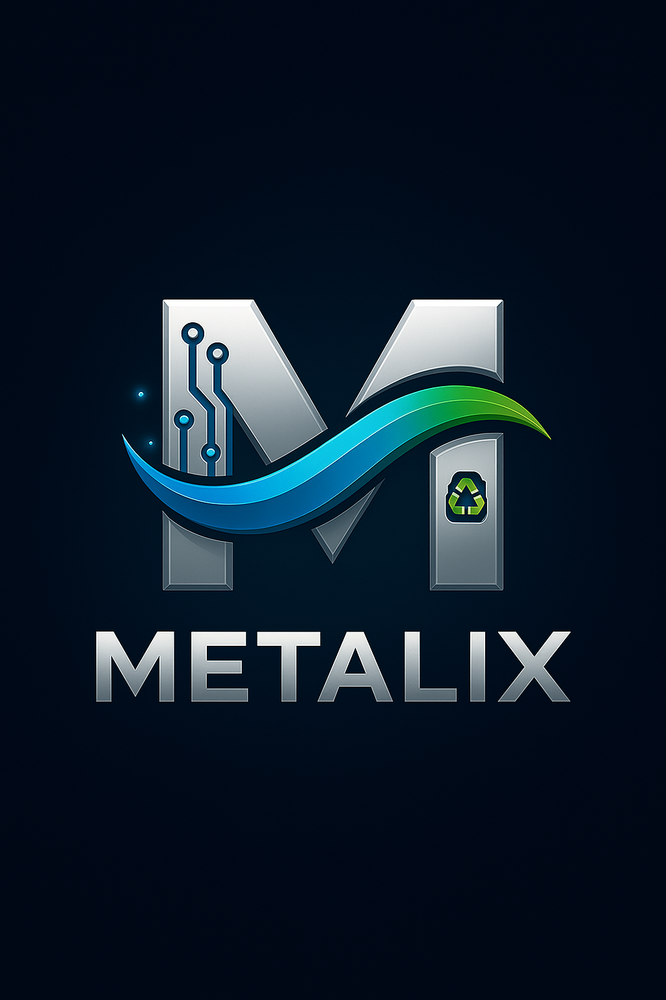
</div>

### 1.1.2. Perfiles de integrantes del equipo

<table>
  <thead>
    <tr>
      <th>Foto</th>
      <th>Apellidos y Nombres</th>
      <th>Código</th>
      <th>Carrera</th>
      <th>Conocimientos y contribución principal</th>
    </tr>
  </thead>
  <tbody>
    <tr>
      <td></td>
      <td><b>Roca Huapaya, Orlando Arturo</b></td>
      <td>U201919742</td>
      <td>Ingeniería de Software</td>
      <td>
          Mi contribución al equipo es la experiencia que tengo desarrollando interfaces en React o Vue y servicios de APIs REST en Spring Boot o Laravel. Me enfoco en que el producto sea usable, estable y fácil de desplegar. Además, priorizaré el uso de buenas prácticas en el ciclo de desarrollo del software.
      </td>
    </tr>
    <tr>
      <td></td>
      <td><b>Pardo Zapata, Gustavo Adolfo</b></td>
      <td>U202120347</td>
      <td>Ingeniería de Software</td>
      <td>
          Soy proactivo, colaborativo, organizado,responsable y con habilidades de resolución de problemas.Tengo una excelente capacidad para comunicarme de manera efectiva y clara con los demás miembros de mi equipo y deseo colaborar en todo lo posible con mis demás compañeros en este trabajo. Cuento con conocimiento en JavaScript, Java, Python, C# y SQL.
      </td>
    </tr>
    <tr>
      <td></td>
      <td><b>Quiñones Tintaya, Johan Jorge</b></td>
      <td>U202218183</td>
      <td>Ingeniería de Software</td>
      <td>
          Mi nombre es Johan Jorge Quiñones Tintaya, tengo 19 años y soy estudiante de ingeniería de software en la UPC, cursando el quinto ciclo. He adquirido una base sólida en algoritmos y programación orientada a objetos, lo que me permite enfrentar desafíos de desarrollo con eficacia. Además, me destaco por mi capacidad para trabajar en equipo, manteniendo una comunicación clara y efectiva que facilita la colaboración. Estoy comprometido con mi crecimiento profesional y busco constantemente mejorar mis habilidades para contribuir de manera significativa en proyectos y equipos, ofreciendo soluciones innovadoras.
      </td>
    </tr>
    <tr>
      <td></td>
      <td><b>Cruz Palomino, Adriano Sebastián</b></td>
      <td>U202210697</td>
      <td>Ingeniería de Software</td>
      <td>
          Mi nombre es Adriano Sebastian Cruz Palomino, tengo 20 años, soy alumno de Ingeniería de Software en la UPC, actualmente estoy cursando el 8vo ciclo. Soy una persona curiosa, responsable, y comprometida con mis estudios, siempre busco aprender más y mejorar mis habilidades.
      </td>
    </tr>
    <tr>
      <td></td>
      <td><b>Mancilla Ordaya, Eduardo Vicente</b></td>
      <td>U202018894</td>
      <td>Ingeniería de Software</td>
      <td>Soy Eduardo, estudiante entusiasta de la tecnología, con gusto por el trabajo en equipo y la búsqueda de nuevos aprendizajes. Me interesa explorar nuevas tecnologías y aplicarlas en el desarrollo de proyectos, aportando compromiso, creatividad y una comunicación clara que favorezca la colaboración.
      </td>
    </tr>
    <tr>
      <td></td>
      <td><b>Del Carmen Zorrilla, Ray Alessandro</b></td>
      <td>U202124061</td>
      <td>Ingeniería de Software</td>
      <td>
          Soy una persona creativa, proactiva y resiliente, con gusto por el liderazgo y el apoyo constante a mi equipo. 
          Mi principal contribución es proponer soluciones innovadoras y mantener una comunicación clara que fortalezca la colaboración. 
          Cuento con conocimientos en <b>desarrollo backend</b>, <b>frontend</b>, un acercamiento a <b>aplicaciones móviles</b> 
          y gran interés por el uso de la <b>Inteligencia Artificial</b> en proyectos tecnológicos.
      </td>
    </tr>
  </tbody>
</table>

## 1.2. Solution Profile
<p align="justify">
  Metalix es una iniciativa que fomenta el reciclaje de metales en playas mediante un programa de puntos y recompensas en alianza con las municipalidades. El ecosistema incluye una landing para difusión e inscripción, una app web y una app móvil donde los bañistas se registran, vinculan su tarjeta RFID, consultan su saldo, canjean beneficios y siguen su progreso y ranking. En los puntos de reciclaje, los recolectores Metalix identifican al usuario cuando deposita metal y registran cada evento, habilitando trazabilidad, alertas de llenado y una gestión operativa integral por parte de la municipalidad (usuarios, recompensas y reportes). Con ello, buscamos incrementar la participación ciudadana, reducir residuos en playas y ofrecer información clara para la toma de decisiones, premiando el comportamiento responsable.
</p>

### 1.2.1. Antecedentes y problemática
<p align="justify">
  En las playas de Lima persiste la acumulación de residuos metálicos como latas, tapas y chapas que deteriora la experiencia turística, eleva costos de limpieza y genera riesgos para la salud. Según DIGESA reportó en el verano 2024 que de 131 playas vigiladas, 89 eran “no saludables” principalmente por limpieza y presencia de residuos sólidos, lo que evidencia la magnitud del problema. La solución propuesta, para el reciclaje de metales debe verificar automáticamente que el residuo sea metálico y abrir una compuerta segura para evitar fraudes, también identificar al usuario vía RFID para asignar puntos por municipalidad y habilitar canjes en comercios aliados. El objetivo es incrementar la tasa de reciclaje de metal en temporada alta, recuperar mayor volumen por playa y reducir tiempos y costos de recolección. El alcance y restricciones del piloto se delimitan a 1 o 3 playas de Lima, enfocarnos exclusivamente en el reciclaje de metales en la versión inicial, recompensas gestionadas por cada municipalidad o comercio.
</p>

#### 5W + 2H

##### What (¿qué?)

Acumulación de residuos metálicos en arena como latas, tapas y chapas, esto afecta salubridad y operación municipal en las playas.

##### When (¿cuándo?)

Todo el año, con picos en temporada de verano y fines de semana.

##### Where (¿dónde?)

Playas de Lima, áreas de alto tránsito donde se han medido y caracterizado residuos, incluyendo metálicos peligrosos.

##### Who (¿quiénes?)

Bañistas y municipalidades.

##### Why (¿por qué?)

Infraestructura de residuos insuficiente e ineficientes, falta de incentivos que vincule el acto de reciclar con beneficios y datos útiles para gestión.

##### How (¿cómo sucede?)

Los visitantes consumen bebidas y dejan latas o chapas en la arena. El estudio de Villacorta-Córdova et al. (2021), publicado en la Revista Científica UNJFSC, evidenció en cuatro playas de la Costa Verde la presencia de 55 objetos metálicos, principalmente latas oxidadas y punzantes en zonas de bañistas, lo que confirma el riesgo para la salud y la convivencia de metales en las playas.

##### How much (¿cuánto?)

- 89 playas “no saludables” al inicio de verano 2024, principalmente por residuos sólidos en arena.

- En las playas de la Costa Verde se encontraron 55 ítems metálicos, 42% fueron latas de bebidas.

### 1.2.2. Lean UX Process

#### 1.2.2.1. Lean UX Problem Statements

Ante esta situación nuestra Startup se plantea las siguientes Problem Statements:

**PS1:**

- **Objetivos actuales del producto:** Mantener las playas seguras para el disfrute turístico y recreativo.
- **Problema:** Los bañistas enfrentan constantemente playas con residuos metálicos como latas, tapas y chapas, lo que genera riesgos de cortes, incomodidad y reduce la calidad de la experiencia turística. Actualmente, no existe un sistema que valide los materiales ni incentive a los usuarios a reciclar.
- **Pregunta solicitud de mejora:** ¿Cómo podemos diseñar un recolector inteligente que valide automáticamente el residuo metálico, identifique al usuario y entregue recompensas inmediatas, incentivando así la participación activa de los bañistas en la limpieza de las playas?

**PS2:**

- **Objetivos actuales del producto:** Garantizar la salubridad de las playas, optimizar la recolección de residuos y reducir costos de limpieza.
- **Problema:** Las municipalidades gastan recursos elevados en limpieza manual de playas sin contar con datos en tiempo real ni mecanismos de trazabilidad. Esto dificulta la toma de decisiones y el control de rutas de recolección.
- **Pregunta solicitud de mejora:** ¿Cómo podemos proveer a las municipalidades de un sistema IoT que registre en tiempo real los residuos recolectados, emita alertas de llenado y entregue KPIs útiles para planificar rutas y evaluar el impacto ambiental y económico?

#### 1.2.2.2. Lean UX Assumptions

**Business Outcomes**

- Aumentar la tasa de reciclaje de metales en playas urbanas de Lima y el volumen recuperado por playa.
- Reducir tiempo y costo de limpieza municipal mediante telemetría y alertas de llenado.
- Conseguir acuerdos con comercios locales para sostener el sistema de canjes y mejorar la adopción.
- Lograr pilotos con 1 o 3 playas por municipio.
- Generar datos confiables como kg y usos, para reportes y toma de decisiones.

**User Assumptions (sobre los usuarios)**

- Bañistas reciclarán si el proceso es rápido, seguro y reciben beneficios inmediatos.
- Aceptarán usar tarjeta RFID si el registro toma menos de 1 minuto y no solicita datos sensibles.
- Municipalidades adoptarán la solución si muestra ahorros operativos y KPIs claros.

**User Outcomes (lo que experimentan/ganan)**

- Los bañistas depositan sus latas en segundos, reciben puntos y visualizan sus resultados desde la app.
- Las municipalidades evidencian mejoras de salubridad con métricas.
- Los operadores reducen tiempos de recolección.

**Feature Assumptions (sobre funcionalidades)**

- Sensor inductivo valida metal con baja tasa de falsos positivos y abre compuerta.
- RFID identifica al usuario y permite la recolección de puntos y canjes en comercios aliados.
- Dashboard municipal con métricas, KPIs y alertas de llenado.
- App web y móvil para registro, puntaje y catálogo de canjes.
- Arquitectura Edge con opción de energía solar para continuidad operativa.

#### 1.2.2.3. Lean UX Hyphotesis Statements

- Creemos que aumentaremos la tasa de reciclaje de metales y el volumen recuperado por playa (business outcome) si los bañistas (user) pueden depositar sus latas en segundos y reciben puntos inmediatos (benefit) con sensor inductivo, compuerta y RFID de registro en menos de 1 minuto (feature).

  Sabremos que hemos tenido éxito

  Cuando al menos el 40% de usuarios registrados realicen mas de 2 depósitos por semana en temporada alta.

- Creemos que incrementaremos la adopción de la app y los canjes (business outcome)  
  si los bañistas (user) visualizan sus puntos y un catálogo de canjes locales claro (benefit)  
  con la app web o móvil y validación de canje en comercios aliados (feature).

  Sabremos que hemos tenido éxito.

  Cuando la tasa de canje mensual sea mayor o igual al 30% de usuarios activos y se registren mas de 50 canjes por mes.

- Creemos que mejoraremos la satisfacción y la confianza en el sistema (business outcome) si los bañistas (user) perciben que su reciclaje es trazable y antifraude (benefit) con RFID personal, historial en la app y validación de metal antes de abrir la compuerta (feature).

  Sabremos que hemos tenido éxito

  Cuando 8 de cada 10 usuarios se declaren seguros o muy seguros, y los eventos inválidos no excedan el 5%

- Creemos que reduciremos tiempo y costo de limpieza (business outcome)  
  si las municipalidades (user) reciben alertas de llenado para planificar rutas (benefit)  
  con dashboard municipal (feature).

  Sabremos que hemos tenido éxito.

  Cuando el tiempo promedio por ruta baje más del 20% y el costo operativo por tonelada baje más del 15% durante 8 semanas de piloto.

- Creemos que fortaleceremos la planificación y la transparencia (business outcome)  
  si las municipalidades (user) confían en KPIs trazables (benefit)  
  con latencia de datos menor de 5 minutos (feature).

  Sabremos que hemos tenido éxito

  Cuando el dashboard sea consultado semanalmente y se realice más de 1 ajuste de ruta por semana basado en los KPIs.

- Creemos que atraeremos comercios locales (business outcome)  
  si las municipalidades (user) observan ahorros operativos y evidencia de canjes (benefit)  
  con acuerdos de canjes activos (feature).

  Sabremos que hemos tenido éxito

  Cuando logremos mas de 10 comercios aliados y mas de 50 canjes por mes en el piloto.

#### 1.2.2.4. Lean UX Canvas
.jpg)
## 1.3. Segmentos objetivo

<p align="justify">
  Un informe del Ministerio del Ambiente (Minam, 2025) reportó que en el Perú se generaron 8 994 762 toneladas de residuos sólidos municipales, lo que equivale a un promedio de 24 643 toneladas diarias. Sin embargo, apenas el 2,8 % de estos residuos fueron valorizados mediante procesos de reciclaje o reinserción en la cadena productiva. Esta realidad evidencia la necesidad urgente de implementar soluciones innovadoras que fomenten el reciclaje y reduzcan la acumulación de residuos, particularmente en las zonas costeras, donde la contaminación metálica afecta tanto al ecosistema marino como a la experiencia turística.

  ---

  **Nuestros principales segmentos objetivo son:**
</p>

### 1.3.1 Segmento objetivo 1: Bañistas

<p align="justify">
  Este segmento está conformado por personas que visitan las playas para actividades recreativas y turísticas. Incluye tanto a turistas nacionales como extranjeros, así como a residentes locales. Se caracterizan por su interés en disfrutar de espacios limpios y seguros, y muestran predisposición a participar en iniciativas sostenibles cuando estas incluyen incentivos claros. A través del uso de las tarjetas RFID proporcionadas por las municipalidades —y previamente configuradas por CleanWave— los bañistas pueden acumular puntos cada vez que reciclan residuos metálicos en los recolectores Metalix. Dichos puntos son canjeables por beneficios locales, generando un esquema de gamificación ambiental que refuerza su motivación. Este grupo busca soluciones simples, rápidas y atractivas que les permitan contribuir al cuidado del medio ambiente mientras obtienen recompensas tangibles.
</p>

### 1.3.2 Segmento objetivo 2: Municipalidades costeras

<div align="justify">
  Las municipalidades responsables de la gestión de playas representan un segmento clave, dado que actúan como administradores e implementadores de la solución. Son las encargadas de adquirir las tarjetas RFID de CleanWave, distribuirlas a los bañistas con su propia identidad visual, registrar a los usuarios y gestionar el sistema de recompensas. Asimismo, tienen a su cargo la recolección y reventa de los materiales metálicos depositados en los recolectores, lo que les permite generar ingresos adicionales. Estas instituciones buscan soluciones tecnológicas que les permitan mejorar la limpieza de las playas, reforzar su imagen institucional, atraer turismo sostenible y fomentar la participación ciudadana en iniciativas ambientales.
</div>

# Capítulo II: Requirements Elicitation & Analysis

## 2.1. Competidores  

En el mercado peruano no existen actualmente soluciones IoT específicas para el reciclaje de metales en playas. Sin embargo, es posible identificar competidores indirectos internacionales, que ofrecen tecnologías avanzadas de gestión de residuos aplicadas a contextos urbanos, y referentes locales con iniciativas de reciclaje e incentivos. Estos competidores, aunque no están focalizados en playas, aportan aprendizajes relevantes y representan potenciales amenazas en caso de adaptar sus modelos al ámbito costero.  

Los principales competidores seleccionados son:  

- **Big Belly Solar**: empresa estadounidense con presencia internacional, reconocida por sus estaciones solares inteligentes que compactan residuos y transmiten datos en tiempo real. Su enfoque principal está en ciudades y espacios urbanos de alto tránsito.  
- **Evreka**: startup global que combina hardware IoT y software en la nube para digitalizar la gestión de residuos. Su propuesta se centra en optimizar rutas de recolección y operaciones de limpieza a gran escala en ciudades inteligentes.  
- **Ecube Labs**: compañía surcoreana que fabrica compactadores solares y sensores ultrasónicos para monitoreo de residuos, integrados con su plataforma CleanCityNetworks. Sus soluciones tienen amplia adopción en Asia, Norteamérica y Europa.  

En comparación, **Metalix** busca diferenciarse al ofrecer un modelo adaptado a playas peruanas, centrado en la recolección de residuos metálicos con incentivos inmediatos a los bañistas, al mismo tiempo que provee datos en tiempo real a las municipalidades costeras.  


### 2.1.1. Análisis competitivo

<table border="1" cellspacing="0" cellpadding="5">
  <tr>
    <th colspan="6" valign="top">Competitive Analysis Landscape</th>
  </tr>
  <tr>
    <td colspan="2" valign="top">¿Por qué llevar a cabo este análisis?</td>
    <td colspan="4" valign="top">Identificar cómo se posiciona Metalix frente a soluciones internacionales de gestión inteligente de residuos, evaluando fortalezas, debilidades y oportunidades para diferenciarse en el contexto de playas peruanas.</td>
  </tr>
  <tr>
    <td colspan="2" valign="top"></td>
    <td valign="top" align="center">
      <br>
      <b>CleanWave</b>
    </td>
    <td valign="top" align="center">
      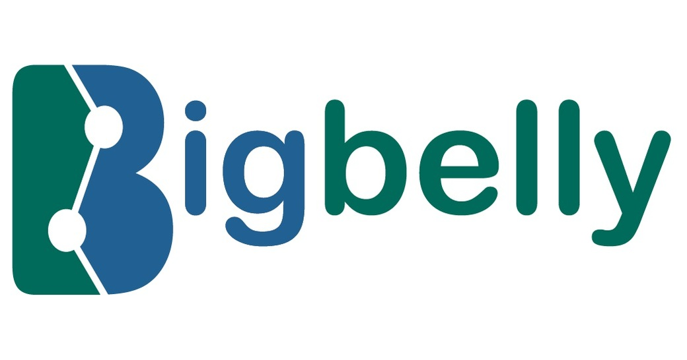<br>
      <b>Big Belly Solar</b>
    </td>
    <td valign="top" align="center">
      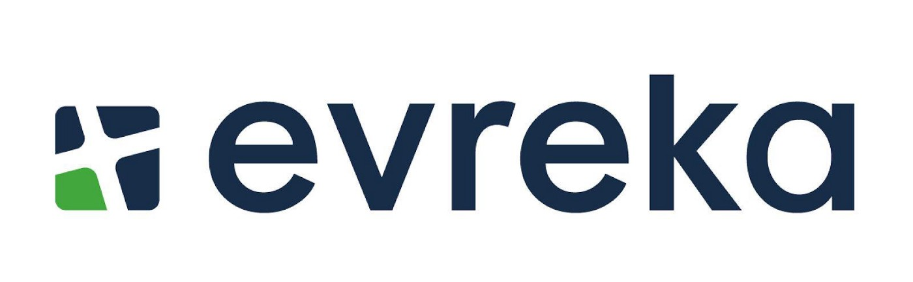<br>
      <b>Evreka</b>
    </td>
    <td valign="top" align="center">
      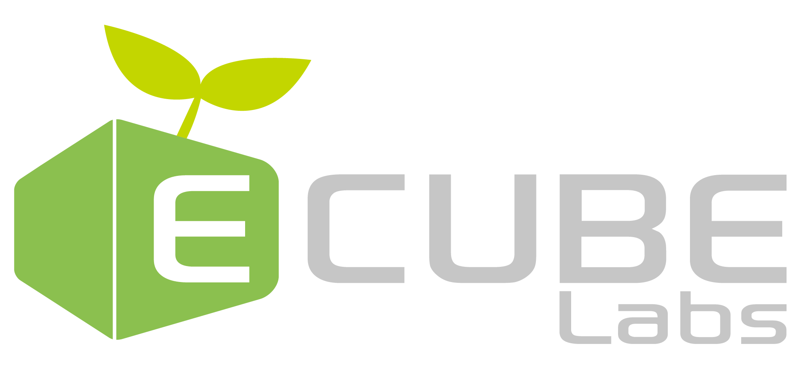<br>
      <b>Ecube Labs</b>
    </td>
  </tr>
  <tr>
    <td rowspan="2" valign="top">Perfil</td>
    <td valign="top">Overview</td>
    <td valign="top">Startup peruana que busca mantener limpias las playas con recolectores inteligentes de metales, conectados a una app de incentivos y dashboard municipal.</td>
    <td valign="top">Empresa estadounidense que fabrica compactadores solares de residuos con monitoreo IoT.</td>
    <td valign="top">Startup global que ofrece software y hardware IoT para digitalizar la gestión de residuos y optimizar rutas de recolección.</td>
    <td valign="top">Empresa surcoreana que desarrolla compactadores solares y sensores IoT, integrados con la plataforma CleanCityNetworks.</td>
  </tr>
  <tr>
    <td valign="top">Ventaja competitiva ¿Qué valor ofrece a los clientes?</td>
    <td valign="top">Incentivos inmediatos a bañistas mediante puntos y canjes, además de datos en tiempo real para reducir costos municipales de limpieza.</td>
    <td valign="top">Reduce la frecuencia de recolección y costos mediante compactación automática.</td>
    <td valign="top">Ofrece un ecosistema integral para digitalizar toda la cadena de gestión de residuos urbanos.</td>
    <td valign="top">Monitoreo preciso del llenado de contenedores y optimización de rutas con telemetría avanzada.</td>
  </tr>
  <tr>
    <td rowspan="2" valign="top">Perfil de Marketing</td>
    <td valign="top">Mercado objetivo</td>
    <td valign="top">Bañistas, municipalidades costeras y comercios locales aliados.</td>
    <td valign="top">Municipalidades de ciudades desarrolladas con alto presupuesto.</td>
    <td valign="top">Gobiernos locales y empresas de gestión de residuos en múltiples regiones.</td>
    <td valign="top">Municipalidades y operadores urbanos en Asia, EE.UU. y Europa.</td>
  </tr>
  <tr>
    <td valign="top">Estrategias de marketing</td>
    <td valign="top">Campañas ambientales en playas, convenios con comercios, app móvil/web.</td>
    <td valign="top">Relaciones B2G con gobiernos, contratos de largo plazo.</td>
    <td valign="top">Participación en ferias de smart cities y alianzas estratégicas.</td>
    <td valign="top">Expansión global con casos de éxito en smart cities y contratos B2G.</td>
  </tr>
  <tr>
    <td rowspan="3" valign="top">Perfil de Producto</td>
    <td valign="top">Productos & Servicios</td>
    <td valign="top">Recolector inteligente de metales en playas, app web/móvil para usuarios y dashboard municipal con métricas.</td>
    <td valign="top">Compactadores solares inteligentes y software de gestión.</td>
    <td valign="top">Sensores IoT, smart bins, plataforma SaaS para gestión integral.</td>
    <td valign="top">Compactadores solares, sensores ultrasónicos IoT y plataforma CleanCityNetworks.</td>
  </tr>
  <tr>
    <td valign="top">Precios & Costos</td>
    <td valign="top">Modelo de bajo costo inicial, sostenido con convenios municipales y comercios aliados.</td>
    <td valign="top">USD 4,000–6,000 por unidad, alto costo de mantenimiento.</td>
    <td valign="top">Modelo SaaS + hardware, costo elevado pero escalable.</td>
    <td valign="top">Modelo SaaS por dispositivo, costo medio-alto según escala y servicios.</td>
  </tr>
  <tr>
    <td valign="top">Canales de distribución (Web y/o Móvil)</td>
    <td valign="top">Landing page, aplicación móvil/web y convenios con municipalidades.</td>
    <td valign="top">Contratos directos con gobiernos locales.</td>
    <td valign="top">Plataforma SaaS, apps móviles y hardware IoT distribuido globalmente.</td>
    <td valign="top">Distribuidores internacionales, contratos B2G, CleanCityNetworks.</td>
  </tr>
  <tr>
    <td rowspan="4" valign="top">Análisis SWOT</td>
    <td valign="top">Fortalezas</td>
    <td valign="top">Enfoque único en playas, incentivos inmediatos e innovación IoT accesible.</td>
    <td valign="top">Tecnología madura, eficiencia probada en ciudades.</td>
    <td valign="top">Escalabilidad global, integración de software y hardware.</td>
    <td valign="top">Experiencia internacional, portafolio completo de soluciones IoT.</td>
  </tr>
  <tr>
    <td valign="top">Debilidades</td>
    <td valign="top">Startup nueva, recursos limitados.</td>
    <td valign="top">Altos costos, poco viable en mercados emergentes.</td>
    <td valign="top">Dependencia de inversión externa, complejidad de implementación.</td>
    <td valign="top">Altos costos iniciales y enfoque urbano más que turístico.</td>
  </tr>
  <tr>
    <td valign="top">Oportunidades</td>
    <td valign="top">Conciencia ambiental creciente y turismo sostenible en Perú.</td>
    <td valign="top">Expansión hacia países en desarrollo interesados en smart cities.</td>
    <td valign="top">Crecimiento de la demanda global en digitalización de residuos.</td>
    <td valign="top">Mayor interés mundial en soluciones de smart cities con energías limpias.</td>
  </tr>
  <tr>
    <td valign="top">Amenazas</td>
    <td valign="top">Escasez de financiamiento sostenido y replicabilidad de la idea.</td>
    <td valign="top">Competencia de soluciones más accesibles y locales.</td>
    <td valign="top">Entrada de competidores más económicos y especializados.</td>
    <td valign="top">Competencia de grandes players con más recursos tecnológicos.</td>
  </tr>
</table>

### 2.1.2. Estrategias y tácticas frente a competidores

A partir del análisis competitivo realizado se identificaron las principales fortalezas, debilidades, oportunidades y amenazas de los competidores. Esta información resulta esencial para definir cómo diferenciar a Metalix en el mercado y establecer una propuesta de valor sólida.  

**Fortalezas de los competidores**  
- Big Belly y Ecube Labs cuentan con tecnología madura y casos de éxito en ciudades internacionales.  
- Evreka dispone de un ecosistema integral de software y hardware IoT para gestión de residuos.  
- Todos tienen presencia consolidada en el mercado global y experiencia comprobada.  

**Estrategias y tácticas frente a fortalezas**  
- **Estrategias**:  
  - Diferenciar a Metalix por su enfoque especializado en playas y residuos metálicos, un nicho no cubierto por estos competidores.  
  - Comunicar que el producto es más accesible y adaptado a contextos municipales peruanos con recursos limitados.  
- **Tácticas**:  
  - Desarrollar campañas de marketing que comparen costos y beneficios frente a soluciones internacionales.  
  - Presentar pilotos exitosos en playas de Lima para demostrar resultados tangibles en salubridad y reducción de costos.  

**Debilidades de los competidores**  
- Alto costo de implementación y mantenimiento (Big Belly y Ecube Labs).  
- Complejidad en la adopción tecnológica y dependencia de inversión externa (Evreka).  
- Limitada adaptación a contextos turísticos como playas.  

**Estrategias y tácticas frente a debilidades**  
- **Estrategias**:  
  - Posicionar a Metalix como una solución de bajo costo y rápida implementación.  
  - Destacar la simplicidad y usabilidad para operadores municipales y ciudadanos.  
- **Tácticas**:  
  - Elaborar un modelo de negocio basado en convenios con municipalidades y comercios locales para sostener la operación.  
  - Diseñar una interfaz web y móvil intuitiva que reduzca la barrera de entrada tecnológica.  

**Oportunidades de los competidores**  
- Creciente interés global por smart cities y sostenibilidad ambiental.  
- Posibilidad de expandirse a mercados emergentes con nuevas adaptaciones.  
- Aumento de la conciencia ciudadana sobre el reciclaje y la gestión responsable de residuos.  

**Estrategias y tácticas frente a oportunidades**  
- **Estrategias**:  
  - Aprovechar la ola de sostenibilidad y turismo responsable para posicionar Metalix como solución innovadora para playas.  
  - Establecer alianzas con municipalidades costeras y comercios locales para ganar legitimidad y tracción.  
- **Tácticas**:  
  - Participar en convocatorias de innovación ambiental y programas de responsabilidad social empresarial.  
  - Integrar métricas de impacto ambiental en el dashboard municipal como valor agregado para informes de sostenibilidad.  

**Amenazas de los competidores**  
- Ingreso de soluciones más completas en gestión de residuos que podrían extenderse a playas.  
- Evolución tecnológica rápida que vuelva obsoletos los prototipos actuales.  
- Cambios en las prioridades municipales que reduzcan la inversión en innovación.  

**Estrategias y tácticas frente a amenazas**  
- **Estrategias**:  
  - Adoptar un enfoque de innovación continua para mantener la vigencia tecnológica.  
  - Asegurar una arquitectura flexible que permita escalar a otros tipos de residuos en el futuro.  
  - Mantener relaciones constantes con municipalidades para alinear la propuesta con sus necesidades.  
- **Tácticas**:  
  - Actualizar periódicamente el software y hardware con mejoras incrementales.  
  - Estar presentes en foros, ferias y comités de innovación municipal y ambiental.  
  - Desarrollar prototipos modulares que permitan añadir nuevas funcionalidades sin rediseñar todo el sistema.  


## 2.2. Entrevistas

### 2.2.1. Diseño de entrevistas


<p align="justify">
  Se han establecido preguntas dirigidas a nuestros segmentos objetivo (<b>Bañistas</b> y <b>Municipalidades costeras</b>) con el fin de recolectar información cualitativa y cuantitativa que permita construir arquetipos de usuario. Estas entrevistas consideran aspectos demográficos, personales, digitales, así como objetivos, frustraciones y antecedentes relacionados al cuidado ambiental en playas. La información obtenida servirá para validar la propuesta de valor de <b>Metalix</b> y orientar su diseño de acuerdo con las necesidades reales de los usuarios.
</p>

---

#### Características demográficas

- ¿Cuál es su nombre?
- ¿Cuál es su edad?
- ¿Cuál es su género?
- ¿En qué ciudad y distrito reside?
- ¿Cuál es su estado civil?
- ¿Con quién vive actualmente (solo/a, familia, amigos)?
- ¿A qué se dedica actualmente?

#### Características personales y sociales

- ¿Cómo describiría su personalidad (ejemplo: sociable, innovador, tradicional, responsable)?
- ¿Qué habilidades considera que le representan en su vida personal o laboral?
- ¿Qué marcas, servicios o personas suelen influir en sus hábitos de consumo o en sus decisiones cotidianas?

#### Dispositivos y canales digitales

- ¿Qué dispositivos utiliza con mayor frecuencia (celular, laptop, smartwatch, etc.)?
- ¿Qué aplicaciones o herramientas digitales son las que más usa en su día a día?
- ¿Qué redes sociales o canales digitales utiliza más para informarse o interactuar?

#### Objetivos y frustraciones (contexto de playa y sostenibilidad)

- Cuando piensa en una playa ideal, ¿qué espera encontrar o experimentar? (ejemplo: limpieza, seguridad, tranquilidad, servicios organizados).
- ¿Qué situaciones en la playa le generan más frustración o incomodidad? (ejemplo: basura, falta de tachos, poca participación de autoridades o bañistas).
- ¿Qué cree que debería mejorar en la experiencia de visitar o gestionar playas en el Perú?

#### Biografía o antecedentes

- ¿Ha participado antes en iniciativas de reciclaje, programas municipales o proyectos de cuidado ambiental? ¿Cómo fue su experiencia?
- ¿Qué experiencias previas influyen en su visión actual sobre la importancia del cuidado ambiental en espacios públicos como las playas?

---

### Segmento 1: Bañistas (turistas y pobladores locales)

**Preguntas sobre su experiencia**

- ¿Con qué frecuencia visita las playas?
- ¿Suele consumir bebidas enlatadas u otros productos metálicos durante su estancia en la playa?
- ¿Conoce o ha usado antes algún sistema de reciclaje en playas u otros espacios públicos?
- ¿Qué tipo de beneficios le motivarían a participar en un sistema de reciclaje (descuentos, premios, sorteos, etc.)?
- ¿Qué tan dispuesto estaría a utilizar una tarjeta RFID para registrar sus puntos de reciclaje?

**Preguntas sobre los desafíos y problemas**

- ¿Con qué frecuencia percibe suciedad o presencia de residuos metálicos en la playa que visita?
- ¿Cómo afecta esta contaminación su experiencia en la playa?
- ¿Qué opina sobre los esfuerzos actuales de las municipalidades para mantener las playas limpias?
- ¿Ha tenido dificultades para encontrar tachos de reciclaje en playas?

**Deseos del usuario**

- ¿Qué beneficios le gustaría recibir a cambio de reciclar residuos metálicos en la playa?
- ¿Considera atractivo un sistema que premie con puntos cada acción de reciclaje?
- ¿Qué características le motivarían a participar activamente en un programa de reciclaje gamificado?

---

### Segmento 2: Municipalidades costeras

**Preguntas sobre su experiencia**
- ¿Cuál es su cargo y cuáles son sus responsabilidades en la gestión de playas?
- ¿Qué estrategias utilizan actualmente para el manejo de residuos metálicos en las playas?
- ¿Han implementado programas de incentivos o campañas de concientización para los bañistas?
- ¿Qué tipo de tecnologías han probado o consideran viables para mejorar la gestión de residuos en playas?

**Desafíos y problemas**
- ¿Qué dificultades enfrentan en el control de residuos metálicos en zonas turísticas?
- ¿Qué limitaciones tienen los programas de limpieza y recolección actuales?
- ¿Existen obstáculos en cuanto a financiamiento, logística o participación ciudadana para mantener limpias las playas?
- ¿Qué impacto tiene la acumulación de residuos en la imagen turística de la municipalidad?

**Deseos del usuario**
- ¿Qué mejoras consideran necesarias para optimizar la gestión de residuos metálicos en las playas?
- ¿Qué tipo de incentivos o estrategias cree que motivarían más a los bañistas a participar en programas de reciclaje?
- ¿Le resultaría atractivo un modelo donde puedan revender el material metálico recolectado y, al mismo tiempo, gestionar un sistema de recompensas para los bañistas?

---

### Validación del proyecto (para ambos segmentos)

Al finalizar la entrevista, se presenta al entrevistado la idea del proyecto junto a las principales funcionalidades que posee.

**Presentación breve del proyecto:**
> *"Metalix es un recolector inteligente de metales para playas, que combina sensores para validar residuos metálicos, tarjetas RFID configuradas por Metalix para acumular puntos y un sistema de recompensas gestionado por las municipalidades. El objetivo es reducir la contaminación y motivar a los bañistas a reciclar mediante beneficios locales."*

**Preguntas de validación**
- ¿Qué le parece la propuesta de proyecto Metalix?
- ¿Considera que esta solución ayudaría a reducir la contaminación en playas?
- ¿Qué aspecto del proyecto le parece más atractivo?
- ¿Qué beneficios cree que podría aportar un sistema como Metalix a su experiencia como bañista o a la gestión de su municipalidad?
- ¿Qué características adicionales cree que serían necesarias para mejorar la solución?

### 2.2.2. Registro de entrevistas

#### Segmento: Bañistas

##### Entrevista 1
<ul>
  <li><b>Nombre del entrevistado:</b> Renzo Ramos</li>
  <li><b>Edad:</b> 21 años</li>
  <li><b>Distrito:</b> Ventanilla</li>
  <li><b>Nombre del entrevistador:</b> Gustavo Pardo</li>
  <li><b>Duración:</b> 06:09</li>
</ul>

<p><b>Evidencia de la entrevista:</b></p>

<p align="center">
  
</p>

<p align="center">
  <b>Enlace de entrevista:</b>
  <a href="https://upcedupe-my.sharepoint.com/:v:/g/personal/u202124061_upc_edu_pe/EXFy6VcD7ixDr6BRcVRKnp8B2_4B9TrGpuahW1rCm42kIw?e=I9Ug6O&nav=eyJyZWZlcnJhbEluZm8iOnsicmVmZXJyYWxBcHAiOiJTdHJlYW1XZWJBcHAiLCJyZWZlcnJhbFZpZXciOiJTaGFyZURpYWxvZy1MaW5rIiwicmVmZXJyYWxBcHBQbGF0Zm9ybSI6IldlYiIsInJlZmVycmFsTW9kZSI6InZpZXcifSwicGxheWJhY2tPcHRpb25zIjp7InN0YXJ0VGltZUluU2Vjb25kcyI6MTcuNTZ9fQ%3D%3D">Ver video</a>
</p>

<p align="center">
  <b>Inicio:</b> 00:17 — <b>Fin:</b> 06:15
</p>

<p><b>Resumen de la entrevista:</b></p>

<p align="justify">
Renzo Ramos, de 21 años y residente de Ventanilla, visita la playa Costa Azul casi todos los fines de semana, principalmente en verano. Durante su estancia suele consumir bebidas enlatadas como gaseosas y cervezas. Aunque conoce los tachos de reciclaje en parques y/o playas, no los ha utilizado mucho porque no están bien señalizados. Estaría motivado a reciclar si recibe beneficios atractivos como sorteos de productos deportivos o descuentos en restaurantes. Percibe con frecuencia residuos metálicos en la playa, especialmente en temporada alta, lo que afecta su experiencia y puede ser peligroso. Considera insuficientes los esfuerzos municipales de limpieza y que los tachos escasean o están mal ubicados. Estaría dispuesto a usar una tarjeta RFID para registrar puntos siempre que el sistema sea rápido y sencillo. Ve atractivo un programa de reciclaje gamificado con recompensas reales, acumulación de puntos y posibilidad de competir con amigos.
</p>

<hr>

##### Entrevista 2
<ul>
  <li><b>Nombre del entrevistado:</b> Carlos Ramírez</li>
  <li><b>Edad:</b> 28 años</li>
  <li><b>Distrito:</b> Santiago de Surco, Lima</li>
  <li><b>Nombre del entrevistador:</b> Orlando Roca</li>
  <li><b>Duración:</b> 04:44</li>
</ul>

<p><b>Evidencia de la entrevista:</b></p>

<p align="center">
  
</p>

<p align="center">
  <b>Enlace de entrevista:</b>
  <a href="https://upcedupe-my.sharepoint.com/:v:/g/personal/u202124061_upc_edu_pe/EXFy6VcD7ixDr6BRcVRKnp8B2_4B9TrGpuahW1rCm42kIw?e=ZxcjlI&nav=eyJyZWZlcnJhbEluZm8iOnsicmVmZXJyYWxBcHAiOiJTdHJlYW1XZWJBcHAiLCJyZWZlcnJhbFZpZXciOiJTaGFyZURpYWxvZy1MaW5rIiwicmVmZXJyYWxBcHBQbGF0Zm9ybSI6IldlYiIsInJlZmVycmFsTW9kZSI6InZpZXcifSwicGxheWJhY2tPcHRpb25zIjp7InN0YXJ0VGltZUluU2Vjb25kcyI6NDI5LjE2fX0%3D">Ver video</a>
</p>

<p align="center">
  <b>Inicio:</b> 07:09 — <b>Fin:</b> 11:00
</p>

<p><b>Resumen de la entrevista:</b></p>

<p align="justify">
Carlos Ramírez, de 28 años y residente de Surco, visita las playas con frecuencia en verano y ocasionalmente en invierno. Suele consumir bebidas enlatadas, pero señala que casi no hay tachos de reciclaje en playas y que los esfuerzos municipales de limpieza son mínimos. Afirma percibir residuos metálicos con frecuencia, lo cual afecta negativamente la experiencia y transmite descuido ambiental. Estaría motivado a reciclar si recibe beneficios como descuentos en restaurantes, sorteos de productos o entradas, y usaría una tarjeta RFID si el proceso es rápido y sencillo. Considera atractivo un sistema gamificado con recompensas, rankings y competencias con amigos.
</p>

<hr>

##### Entrevista 3
<ul>
  <li><b>Nombre del entrevistado:</b> Michelle Villena</li>
  <li><b>Edad:</b> 29 años</li>
  <li><b>Distrito:</b> Santa Anita, Lima</li>
  <li><b>Nombre del entrevistador:</b> Eduardo Mancilla</li>
  <li><b>Duración:</b> 07:17</li>
</ul>

<p><b>Evidencia de la entrevista:</b></p>

<p align="center">
  
</p>

<p align="center">
  <b>Enlace de entrevista:</b>
  <a href="https://upcedupe-my.sharepoint.com/:v:/g/personal/u202124061_upc_edu_pe/EXFy6VcD7ixDr6BRcVRKnp8B2_4B9TrGpuahW1rCm42kIw?e=oU1POG&nav=eyJyZWZlcnJhbEluZm8iOnsicmVmZXJyYWxBcHAiOiJTdHJlYW1XZWJBcHAiLCJyZWZlcnJhbFZpZXciOiJTaGFyZURpYWxvZy1MaW5rIiwicmVmZXJyYWxBcHBQbGF0Zm9ybSI6IldlYiIsInJlZmVycmFsTW9kZSI6InZpZXcifSwicGxheWJhY2tPcHRpb25zIjp7InN0YXJ0VGltZUluU2Vjb25kcyI6NjcxLjh9fQ%3D%3D">Ver video</a>
</p>

<p align="center">
  <b>Inicio:</b> 11:11 — <b>Fin:</b> 18:19
</p>

<p><b>Resumen de la entrevista:</b></p>

<p align="justify">
  Michelle Villena, de 29 años y residente de Santa Anita, visita las playas con frecuencia en familia; suele consumir bebidas enlatadas, pero observa que casi no hay tachos de reciclaje; estaría motivada a reciclar si recibe beneficios atractivos como descuentos en centros comerciales, se muestra entusiasta a usar una tarjeta RFID siempre que el proceso sea sencillo, y considera atractivo un sistema de recompensas.
</p>

---

#### Segmento: Municipalidades costeras

##### Entrevista 4
<ul>
  <li><b>Nombre del entrevistado:</b> Bruce Cipriano</li>
  <li><b>Edad:</b> 32 años</li>
  <li><b>Distrito:</b> Punta Hermosa, Lima</li>
  <li><b>Nombre del entrevistador:</b> Ray Del Carmen</li>
  <li><b>Duración:</b> 12:12</li>
</ul>

<p><b>Evidencia de la entrevista:</b></p>

<p align="center">
  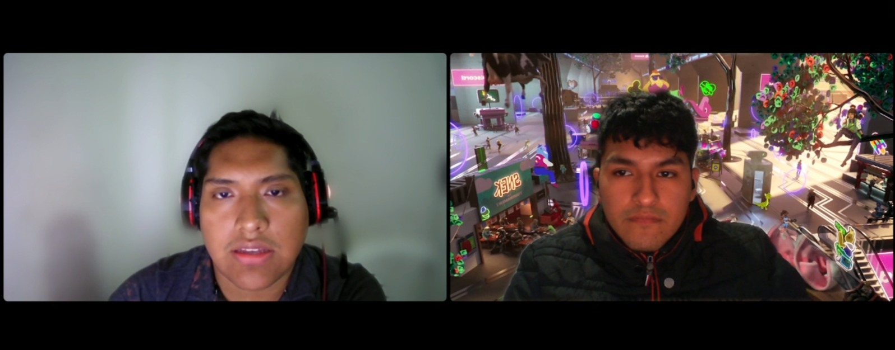
</p>

<p align="center">
  <b>Enlace de entrevista:</b>
  <a href="https://upcedupe-my.sharepoint.com/:v:/g/personal/u202124061_upc_edu_pe/EXFy6VcD7ixDr6BRcVRKnp8B2_4B9TrGpuahW1rCm42kIw?e=Uc1ifP&nav=eyJyZWZlcnJhbEluZm8iOnsicmVmZXJyYWxBcHAiOiJTdHJlYW1XZWJBcHAiLCJyZWZlcnJhbFZpZXciOiJTaGFyZURpYWxvZy1MaW5rIiwicmVmZXJyYWxBcHBQbGF0Zm9ybSI6IldlYiIsInJlZmVycmFsTW9kZSI6InZpZXcifSwicGxheWJhY2tPcHRpb25zIjp7InN0YXJ0VGltZUluU2Vjb25kcyI6MTExNS4zNH19">Ver video</a>
</p>
<p align="center">
  <b>Inicio:</b> 18:35 — <b>Fin:</b> 30:38
</p>

<p><b>Resumen de la entrevista:</b></p>

<p align="justify">
  Bruce Andrés Cipriano Chumbes, jefe de gestión ambiental de la Municipalidad de Punta Hermosa, resaltó su rol en la limpieza de playas, manejo de residuos y liderazgo en campañas de educación ambiental. Se describió como una persona responsable, pragmática y colaborativa, que utiliza tanto laptop como dispositivos móviles (Android e iOS) para la gestión de datos logísticos, apoyándose principalmente en herramientas digitales como Excel y Gmail. Además, recurre a redes sociales como WhatsApp, Facebook, Instagram y X (Twitter) para difundir información turística y comunicados.
</p>

<p align="justify">
  En su visión, una playa ideal debe contar con limpieza constante, tachos diferenciados, baños públicos, seguridad, accesibilidad y adecuada señalización. Sus principales frustraciones surgen de la presencia de basura, la escasez de tachos y la baja participación de los bañistas en el cuidado ambiental. Señaló que la continuidad de las campañas es clave, ya que ha observado que los impactos disminuyen cuando estas no se mantienen en el tiempo. Propuso como mejoras una mayor educación ambiental, incentivos para reciclar y la incorporación de tecnologías que optimicen la recolección.
</p>

<p align="justify">
  Actualmente, su gestión incluye el uso de tachos diferenciados y convenios con recicladores formalizados, aunque identificó que los residuos metálicos representan un problema particular que afecta la imagen turística y la economía local. Mencionó que una tecnología con sensores para detectar el llenado de tachos sería de gran utilidad. Al conocer el proyecto <b>Metalix</b>, lo consideró innovador y atractivo, destacando que incentiva la participación activa de los bañistas, reduce costos de limpieza y fortalece la imagen turística mediante un sistema de recompensas por la recolección de metales.
</p>

---

##### Entrevista 5
<ul>
  <li><b>Nombre del entrevistado:</b>Sebastian Cachis</li>
  <li><b>Edad:</b> 26 años</li>
  <li><b>Distrito:</b> San Miguel</li>
  <li><b>Nombre del entrevistador:</b> Adriano Cruz</li>
  <li><b>Duración:</b> 08:02</li>
</ul>

<p><b>Evidencia de la entrevista:</b></p>

<p align="center">
  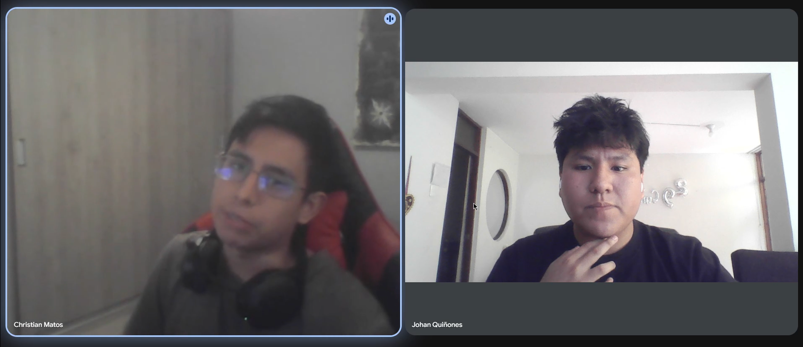
</p>

<p align="center">
  <b>Enlace de entrevista:</b>
  <a href="https://upcedupe-my.sharepoint.com/:v:/g/personal/u202124061_upc_edu_pe/EXFy6VcD7ixDr6BRcVRKnp8B2_4B9TrGpuahW1rCm42kIw?e=Yzfvyv&nav=eyJyZWZlcnJhbEluZm8iOnsicmVmZXJyYWxBcHAiOiJTdHJlYW1XZWJBcHAiLCJyZWZlcnJhbFZpZXciOiJTaGFyZURpYWxvZy1MaW5rIiwicmVmZXJyYWxBcHBQbGF0Zm9ybSI6IldlYiIsInJlZmVycmFsTW9kZSI6InZpZXcifSwicGxheWJhY2tPcHRpb25zIjp7InN0YXJ0VGltZUluU2Vjb25kcyI6MTg0NS42MX19">Ver video</a>
</p>
<p align="center">
  <b>Inicio:</b> 30:45 — <b>Fin:</b> 38:36
</p>

<p><b>Resumen de la entrevista:</b></p>

<p align="justify">
En la entrevista, Sebastian que es asistente de la coordinación de gestión ambiental de playas explicó que sus principales responsabilidades son la supervisión de labores de limpieza, coordinación de cuadrillas y diseño de estrategias para mantener limpias las playas. Actualmente, la gestión de residuos metálicos se basa en la recolección manual con cuadrillas y el uso de contenedores diferenciados, complementados con campañas de concientización en temporadas de alta afluencia. Sin embargo, enfrentan limitaciones relacionadas con la dependencia de mano de obra, la variabilidad en la participación ciudadana y la falta de incentivos sostenibles. Entre las dificultades destacan la gran cantidad de residuos en eventos turísticos, obstáculos de financiamiento y la presión por mantener una buena imagen turística. Como mejoras, planteó mayor concientización desde la educación temprana, incremento de contenedores en puntos estratégicos, señalización y programas de incentivos económicos o en especie. Además, valoró la posibilidad de implementar un sistema que permita reciclar y revender los residuos metálicos con recompensas para los bañistas, lo cual consideró una solución atractiva y viable si se superan las barreras burocráticas.
</p>

---

##### Entrevista 6
<ul>
  <li><b>Nombre del entrevistado:</b> Matos Fernandez, Christian Andre</li>
  <li><b>Edad:</b> 20 años</li>
  <li><b>Distrito:</b> Punta Hermosa</li>
  <li><b>Nombre del entrevistador:</b> Quiñones Tintaya, Johan Jorge</li>
  <li><b>Duración:</b> 07:32</li>
</ul>

<p><b>Evidencia de la entrevista:</b></p>

<p align="center">
  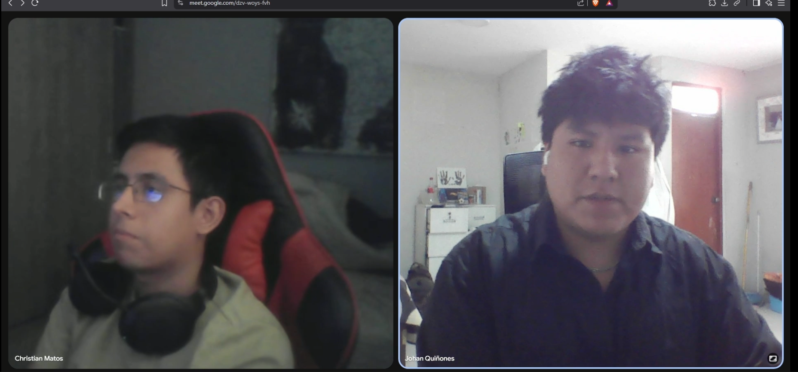
</p>

<p align="center">
  <b>Enlace de entrevista:</b>
  <a href="https://upcedupe-my.sharepoint.com/:v:/g/personal/u202124061_upc_edu_pe/EXFy6VcD7ixDr6BRcVRKnp8B2_4B9TrGpuahW1rCm42kIw?e=jyIabQ&nav=eyJyZWZlcnJhbEluZm8iOnsicmVmZXJyYWxBcHAiOiJTdHJlYW1XZWJBcHAiLCJyZWZlcnJhbFZpZXciOiJTaGFyZURpYWxvZy1MaW5rIiwicmVmZXJyYWxBcHBQbGF0Zm9ybSI6IldlYiIsInJlZmVycmFsTW9kZSI6InZpZXcifSwicGxheWJhY2tPcHRpb25zIjp7InN0YXJ0VGltZUluU2Vjb25kcyI6MjMzMi4wNH19">Ver video</a>
</p>

<p align="center">
  <b>Inicio:</b> 38:52 — <b>Fin:</b> 46:13
</p>

<p><b>Resumen de la entrevista:</b></p>

<p align="justify">
  Christian Matos, jefe ambiental de Punta Hermosa, indicó que la limpieza de playas hoy depende de trabajo manual y carece de incentivos y métricas. Reconoce que los residuos metálicos afectan la imagen turística y ve en un recolector inteligente con recompensas una solución sostenible para reducir costos y motivar a los bañistas.
</p>

### 2.2.3. Análisis de entrevistas

### Segmento 1: Bañistas

Basado en 3 entrevistas (Renzo Ramos, Carlos Ramírez, Michelle Villena)

<br>

**Características Demográficas**

El 100% de los entrevistados se encuentra en el rango de 21-29 años, con edad promedio de 26 años. Todos residen en Lima Metropolitana, distribuidos en distritos diversos como Ventanilla, Surco y Santa Anita.

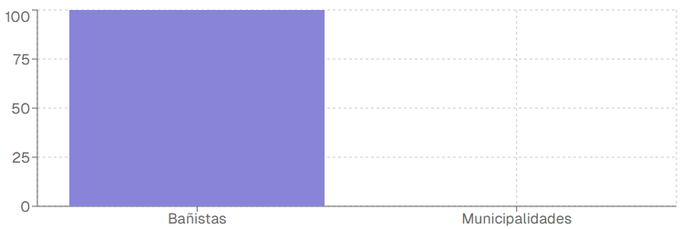

<br>


**Comportamientos de Consumo**

Todos los bañistas visitan playas regularmente durante el verano, con el 67% frecuentando fines de semana y 33% realizando visitas familiares. El 100% consume bebidas enlatadas en la playa, principalmente gaseosas y cervezas.

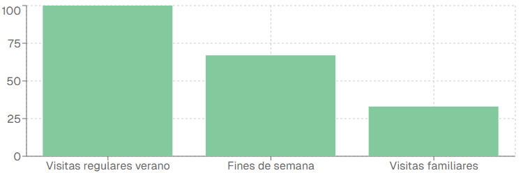

<br>

**Percepción del Problema Ambiental**

El 100% percibe residuos metálicos frecuentemente y considera que afecta negativamente su experiencia playera. Solo el 33% conoce tachos de reciclaje existentes, pero todos consideran insuficiente la infraestructura actual.

<br>

**Motivaciones para Reciclar**

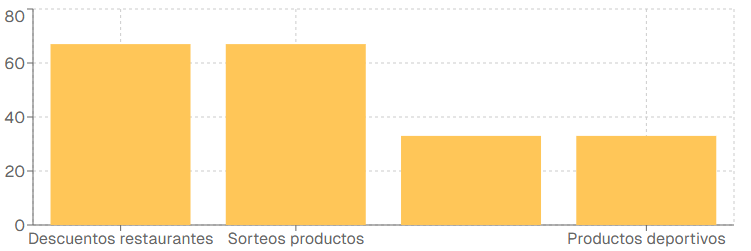

El 100% está dispuesto a usar tarjeta RFID con la condición de que el proceso sea rápido y sencillo. El 67% muestra interés en gamificación y competencia con amigos.

<br>

**Características Subjetivas**

Jóvenes adultos conscientes del problema ambiental pero requieren incentivos tangibles para participar activamente. Valoran la simplicidad y rapidez en procesos tecnológicos. Motivados por recompensas inmediatas y elementos de competencia social.

La principal barrera no es la falta de conciencia ambiental, sino la ausencia de infraestructura conveniente. La exigencia de procesos rápidos refleja que no están dispuestos a sacrificar tiempo de ocio por actividades de reciclaje.

### Segmento 2: Municipalidades Costeras

Basado en 3 entrevistas (Bruce Cipriano, Sebastian Cachis, Christian Matos)

<br>

**Características Demográficas**

Profesionales jóvenes con edad promedio de 26 años (rango 20-32 años). El 100% ocupa cargos de gestión ambiental con experiencia en limpieza de playas. Representan municipalidades costeras de Lima, principalmente Punta Hermosa (67%) y San Miguel (33%).

<br>

**Métodos Actuales de Gestión**

El 100% utiliza recolección manual con cuadrillas. El 67% emplea contenedores diferenciados y campañas de concientización. Solo el 33% tiene convenios con recicladores formalizados y utiliza herramientas tecnológicas básicas como Excel.

<br>

**Principales Desafíos**

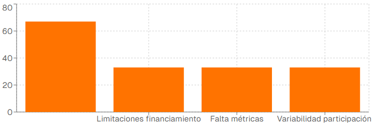

El 100% reconoce que los residuos metálicos afectan la imagen turística. El 67% identifica la dependencia de mano de obra como principal desafío, mientras que el 33% menciona limitaciones de financiamiento y falta de métricas.

<br>

**Recepción del Proyecto Metalix**

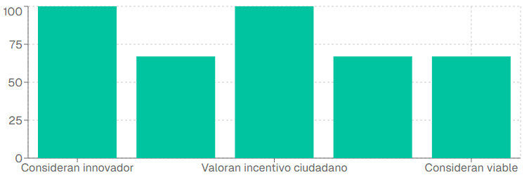

Características Subjetivas
Profesionales con enfoque pragmático y orientación a resultados. Altamente colaborativos y abiertos a innovaciones tecnológicas que optimicen procesos. Conscientes de limitaciones presupuestarias pero motivados por soluciones sostenibles.

Operan bajo múltiples presiones: ciudadanos que demandan playas limpias, autoridades que exigen eficiencia presupuestaria, y operadores turísticos que requieren imagen impecable. Buscan soluciones que generen beneficios múltiples y resultados medibles.

Análisis Comparativo
Ambos segmentos comparten visión pragmática del problema ambiental y alta aceptación tecnológica, pero por razones diferentes: bañistas valoran conveniencia, municipalidades valoran eficiencia operativa.

Los bañistas están motivados por beneficios personales inmediatos, mientras municipalidades buscan beneficios institucionales de mediano plazo. Esta divergencia crea oportunidades de sinergia donde la gamificación genera métricas operativas.

Implicaciones para Arquetipos
Arquetipo Bañista - "El Recreacionista Consciente": Joven adulto urbano (21-29 años), visitante regular de playas, busca maximizar experiencia de ocio sin comprometer comodidad, requiere incentivos tangibles y procesos simples.

Arquetipo Municipal - "El Optimizador Pragmático": Profesional joven (20-32 años) en gestión ambiental, busca optimizar recursos operativos, demostrar resultados cuantificables, implementar soluciones sostenibles de largo plazo.

*Metodología: Análisis cualitativo con cuantificación de patrones recurrentes*

<br>

## 2.3. Needfinding

### 2.3.1. User Personas

Se presentan los perfiles de los bañistas y de los miembros de municipalidades costeras que interactuarán con nuestra solución. Estos perfiles son esenciales para comprender sus motivaciones, frustraciones y necesidades, lo que permitirá diseñar un sistema IoT que incentive el reciclaje de residuos metálicos en playas y optimice la gestión municipal de limpieza.

#### **Segmento 1: Bañistas**

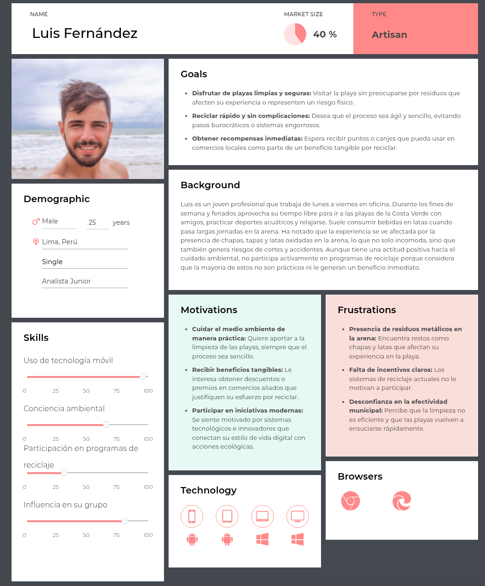

#### **Segmento 2: Miembros de Municipalidades Costeras**

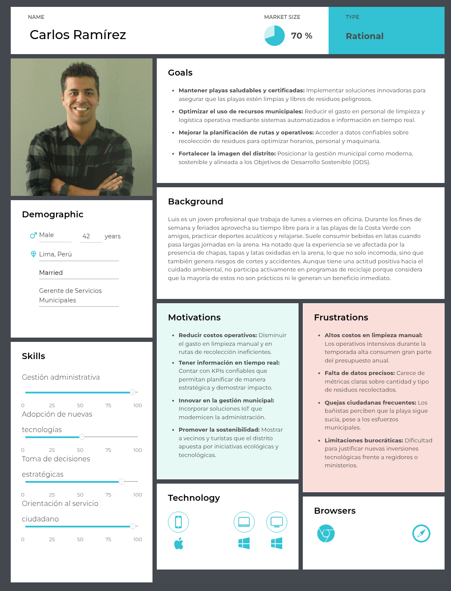

### 2.3.2. User Task Matrix

En esta sección se presenta el **User Task Matrix**, que concentra las tareas que los User Persona (que representan a cada segmento) realizan actualmente para cumplir sus objetivos. Estas tareas existen independientemente del desarrollo de una solución tecnológica, y han sido identificadas a partir de observaciones en playas urbanas de Lima y entrevistas exploratorias con bañistas y personal municipal.

Se han considerado dos segmentos principales:

* **Bañistas**: Personas que acuden a las playas urbanas por recreación y consumo social, y que generan residuos metálicos durante su estancia.  
* **Municipalidades costeras**: Instituciones responsables de la limpieza, mantenimiento y seguridad en playas, con limitaciones de presupuesto y procesos mayormente manuales.

| Tareas                                                              |  Bañistas  |             | Municipalidades costeras |             |
| :------------------------------------------------------------------ | :--------: | :---------: | :----------------------: | :---------: |
|                                                                     | Frecuencia | Importancia |        Frecuencia        | Importancia |
| Llevar y consumir bebidas enlatadas en la playa                     |    Alta    |    Alta     |            –             |      –      |
| Buscar un contenedor para depositar residuos metálicos              |   Media    |    Alta     |            –             |      –      |
| Guardar residuos hasta encontrar un tacho o dejarlos en la arena    |   Media    |    Alta     |            –             |      –      |
| Quejarse por la suciedad de la playa (redes sociales o verbalmente) |    Baja    |    Media    |            –             |      –      |
| Organizar cuadrillas de limpieza manual                             |     –      |      –      |           Alta           |    Alta     |
| Colocar y supervisar contenedores básicos en zonas concurridas      |     –      |      –      |           Alta           |    Alta     |
| Coordinar recolección con camiones municipales                      |     –      |      –      |           Alta           |    Alta     |
| Estimar volumen de residuos de forma manual (sin datos precisos)    |     –      |      –      |           Alta           |    Media    |
| Responder a quejas de vecinos o turistas                            |     –      |      –      |          Media           |    Alta     |
| Elaborar reportes agregados de limpieza para justificar presupuesto |     –      |      –      |           Alta           |    Alta     |
| Difundir información general sobre campañas de limpieza o reciclaje |    Baja    |    Media    |          Media           |    Alta     |

---

**Análisis de tareas**  

- Los **bañistas** suelen generar residuos metálicos (latas, tapas, chapas) en la playa. Aunque consideran importante desecharlos correctamente, la falta de infraestructura y de incentivos deriva en comportamientos poco sostenibles, como dejar residuos en la arena.  
- Las **municipalidades costeras** concentran sus esfuerzos en la limpieza manual y en la logística de recolección sin contar con datos en tiempo real. Esto genera mayores costos y menor eficiencia en la planificación de rutas y recursos.  
- Las tareas más frecuentes e importantes en ambos segmentos son:  
  - Para **bañistas**: disponer de residuos metálicos en contenedores adecuados.  
  - Para **municipalidades**: organizar cuadrillas, coordinar recolección y justificar presupuestos.  
- La principal diferencia está en la **capacidad de acción**: mientras los bañistas se limitan a la disposición de residuos, las municipalidades deben garantizar la limpieza general y rendir cuentas con pocos recursos tecnológicos.

### 2.3.3. User Journey Mapping

El User Journey Mapping muestra cómo bañistas y municipalidades viven hoy la experiencia de reciclaje en playas. Permite identificar sus metas, emociones y dificultades en cada fase, destacando oportunidades para que Metalix simplifique el depósito de residuos metálicos y ofrezca datos útiles para la gestión municipal.

#### **Segmento 1: Bañistas**

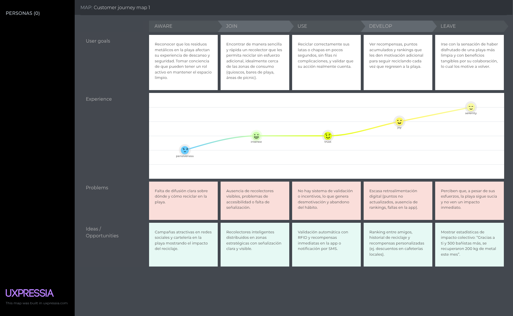

#### **Segmento 2: Miembros de Municipalidades Costeras**

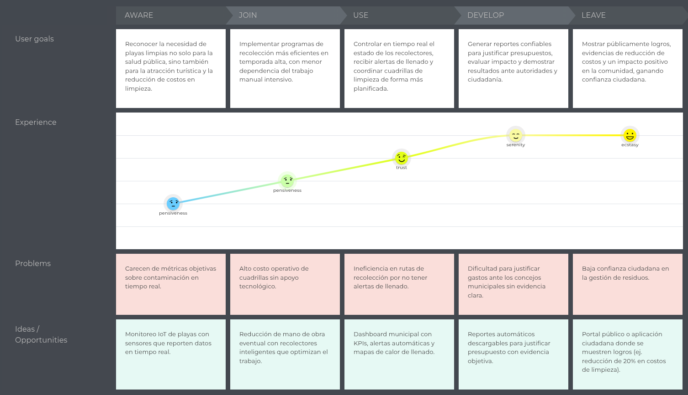

### 2.3.4. Empathy Mapping

El Empathy Map ayuda a comprender lo que los bañistas y funcionarios municipales piensan, sienten, ven, dicen y hacen respecto al reciclaje. Así se identifican frustraciones como la falta de tachos diferenciados o de métricas confiables, y motivaciones como recibir recompensas inmediatas o reducir costos de limpieza.

#### **Segmento 1: Bañistas**

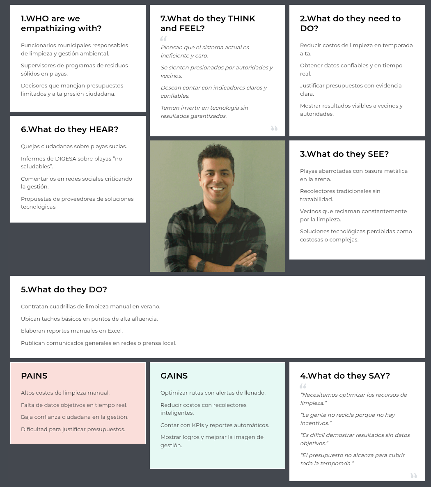

#### **Segmento 2: Miembros de Municipalidades Costeras**


### 2.3.5. As-Is Scenario Mapping

El As-Is Scenario Mapping describe la situación actual sin Metalix: bañistas que muchas veces dejan residuos en la arena y municipalidades que dependen de limpieza manual sin datos en tiempo real. Esto permite resaltar los puntos de dolor que nuestra solución IoT busca resolver.

#### **Segmento 1: Bañistas**

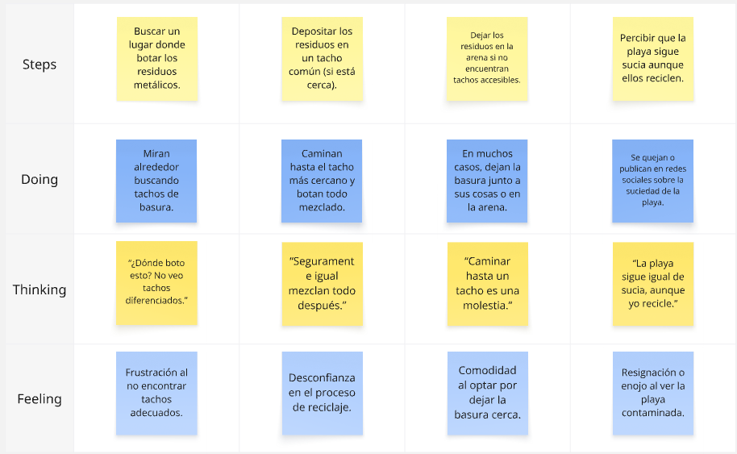

#### **Segmento 2: Miembros de Municipalidades Costeras**

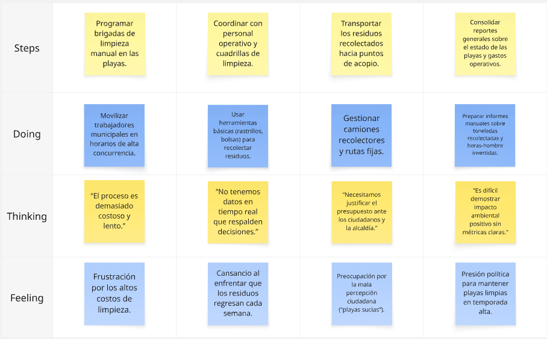

## 2.4. Ubiquitous Language

Para garantizar que todo el equipo y los actores involucrados utilicen los mismos términos, se define un lenguaje ubicuo del dominio del reciclaje de metales en playas. Este lenguaje sirve como base para la comunicación, la redacción de historias de usuario y el modelado del sistema.  

- **Usuario**: actor del sistema que puede ser un *Bañista* o un *Representante Municipal*.  
- **Bañista**: visitante de la playa que genera residuos metálicos y participa en el programa de reciclaje acumulando puntos.  
- **Municipalidad**: organización responsable de la limpieza de playas y administración del sistema de reciclaje en su jurisdicción.  
- **Recolector inteligente**: contenedor IoT que valida si el residuo es metálico, registra al usuario y envía datos en tiempo real.  
- **Residuo metálico**: objeto válido para el reciclaje dentro del sistema (latas, tapas, chapas).  
- **Evento de reciclaje**: acción registrada cuando un bañista deposita un residuo metálico en un recolector.  
- **Puntos**: unidad de valor que se otorga a los bañistas por cada residuo reciclado y que puede acumularse por municipalidad.  
- **Recompensa**: beneficio que puede canjear un bañista con sus puntos en comercios aliados.  
- **Canje**: proceso por el cual los puntos acumulados se convierten en una recompensa.  
- **Dashboard municipal**: panel de control para que la municipalidad supervise recolectores, métricas y reportes de reciclaje.  
- **Telemetría**: información generada por los recolectores (nivel de llenado, peso estimado, frecuencia de uso).  
- **Alerta de llenado**: notificación que indica que un recolector ha alcanzado un umbral definido y requiere recolección.  

# Capítulo III: Requirements Specification

## 3.1. To-Be Scenario Mapping

<div align="justify">
  En esta sección se describe el escenario futuro esperado tras la implementación de Metalix, mostrando cómo la experiencia de los bañistas y de las municipalidades se transforma gracias al sistema. A través del To-Be Scenario Mapping se proyecta un flujo optimizado, donde cada paso integra acciones, pensamientos y emociones positivas, evidenciando cómo la solución propuesta resuelve los puntos de dolor identificados en el escenario actual (As-Is) y genera valor tanto ambiental como social.
</div>

### Segmento objetivo 1: Bañistas

<div align="center">
  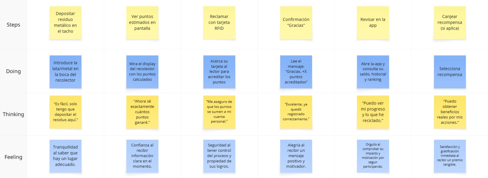
</div>

### Segmento objetivo 2: Municipalidades costeras

<div align="center">
  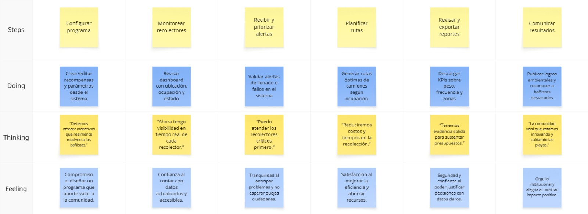
</div>

## 3.2. User Stories

En esta sección, se presenta las User Stories diseñadas que cumplen con las necesidades de los usuarios finales.

<table align=center">
  <thead align="center">
    <tr>
      <th>Epic/User Story ID</th>
      <th>Título</th>
      <th>Descripción</th>
      <th>Criterios de Aceptación</th>
      <th>Relación (EPIC ID)</th>
    </tr>
  </thead>
  <tbody align="center">
    <!-- EP-01 -->
    <tr style="background-color:#F3F8FF; border-left:6px solid #2563EB;">
      <td><strong>EP-01</strong></td>
      <td><strong>Difusión y captación (Landing Page)</strong></td>
      <td align="justify">
        <strong>Como</strong> visitante, <strong>quiero</strong> acceder a un sitio web público con información clara de Metalix,
        <strong>para</strong> conocer beneficios, municipalidades y opciones de contacto.
      </td>
      <td align="justify">
        <strong>Escenario 1: Visualización general de la landing</strong><br>
        <strong>Dado</strong> que un visitante accede al sitio,<br>
        <strong>Cuando</strong> ingresa a la URL principal,<br>
        <strong>Entonces</strong> visualiza una landing con secciones de características/beneficios, municipalidades participantes, preguntas frecuentes y formulario de contacto.
      </td>
      <td>–</td>
    </tr>
    <!-- HU-01 -->
    <tr>
      <td><strong>HU-01</strong></td>
      <td>Ver municipalidades participantes</td>
      <td align="justify">
        <strong>Como</strong> visitante, <strong>quiero</strong> ver las municipalidades adheridas al programa, 
        <strong>para</strong> saber si mi distrito participa y dónde.
      </td>
      <td align="justify">
        <strong>Escenario 1: Listado disponible</strong><br>
        <strong>Dado</strong> que el usuario está en la sección “Municipalidades”,<br>
        <strong>Cuando</strong> consulta el contenido,<br>
        <strong>Entonces</strong> se muestran las municipalidades con nombre y distrito.
        <br><br>
        <strong>Escenario 2: Sin registros</strong><br>
        <strong>Dado</strong> que no hay municipalidades registradas,<br>
        <strong>Cuando</strong> el usuario consulta,<br>
        <strong>Entonces</strong> aparece el mensaje “Próximamente”.
      </td>
      <td>EP-01</td>
    </tr>
    <!-- HU-02 -->
    <tr>
      <td><strong>HU-02</strong></td>
      <td>Ver recompensas destacadas</td>
      <td align="justify">
        <strong>Como</strong> visitante, <strong>quiero</strong> visualizar recompensas de ejemplo, 
        <strong>para</strong> entender el valor del programa y motivarme a participar.
      </td>
      <td align="justify">
        <strong>Escenario 1: Visualización de recompensas</strong><br>
        <strong>Dado</strong> que el usuario accede a la sección “Beneficios”,<br>
        <strong>Cuando</strong> consulta el contenido,<br>
        <strong>Entonces</strong> se muestran recompensas con nombre y puntos requeridos.
        <br><br>
        <strong>Escenario 2: Sin recompensas</strong><br>
        <strong>Dado</strong> que no existen recompensas registradas,<br>
        <strong>Cuando</strong> el usuario consulta,<br>
        <strong>Entonces</strong> aparece “Aún no hay recompensas disponibles”.
      </td>
      <td>EP-01</td>
    </tr>
    <!-- HU-03 -->
    <tr>
      <td><strong>HU-03</strong></td>
      <td>Conocer proceso para obtener tarjeta RFID</td>
      <td align="justify">
        <strong>Como</strong> visitante, <strong>quiero</strong> conocer los pasos para obtener mi tarjeta de reciclaje, 
        <strong>para</strong> empezar a usar el sistema y acumular puntos.
      </td>
      <td align="justify">
        <strong>Escenario 1: Visualización del proceso</strong><br>
        <strong>Dado</strong> que el usuario accede a la sección “Obtén tu tarjeta”,<br>
        <strong>Cuando</strong> revisa el contenido,<br>
        <strong>Entonces</strong> visualiza los pasos del proceso y las municipalidades asociadas.
      </td>
      <td>EP-01</td>
    </tr>
    <!-- HU-04 -->
    <tr>
      <td><strong>HU-04</strong></td>
      <td>Consultar FAQ y enviar contacto general</td>
      <td align="justify">
        <strong>Como</strong> visitante, <strong>quiero</strong> resolver dudas frecuentes y enviar consultas generales, 
        <strong>para</strong> recibir información y soporte oportuno.
      </td>
      <td align="justify">
        <strong>Escenario 1: Consulta de FAQ</strong><br>
        <strong>Dado</strong> que el usuario accede a la sección “FAQ”,<br>
        <strong>Cuando</strong> la consulta,<br>
        <strong>Entonces</strong> se muestran preguntas y respuestas vigentes.<br><br>
        <strong>Escenario 2: Envío de contacto exitoso</strong><br>
        <strong>Dado</strong> que el usuario completa el formulario con datos válidos,<br>
        <strong>Cuando</strong> hace clic en “Enviar”,<br>
        <strong>Entonces</strong> se muestra una confirmación visual del envío.<br><br>
        <strong>Escenario 3: Error por datos incompletos</strong><br>
        <strong>Dado</strong> que el usuario no completa los campos obligatorios,<br>
        <strong>Cuando</strong> intenta enviar el formulario,<br>
        <strong>Entonces</strong> se muestra un mensaje indicando los campos faltantes.
      </td>
      <td>EP-01</td>
    </tr>
    <!-- HU-05 -->
    <tr>
      <td><strong>HU-05</strong></td>
      <td>Registrar interés municipal</td>
      <td align="justify">
        <strong>Como</strong> representante de municipalidad, <strong>quiero</strong> registrar una solicitud de adhesión, 
        <strong>para</strong> que la empresa evalúe mi incorporación y me contacte.
      </td>
      <td align="justify">
        <strong>Escenario 1: Registro exitoso</strong><br>
        <strong>Dado</strong> que el representante completa el formulario con datos válidos,<br>
        <strong>Cuando</strong> envía la solicitud,<br>
        <strong>Entonces</strong> el sistema registra la solicitud y muestra confirmación.<br><br>
        <strong>Escenario 2: Error de validación</strong><br>
        <strong>Dado</strong> que el representante deja campos obligatorios vacíos o inválidos,<br>
        <strong>Cuando</strong> intenta enviar la solicitud,<br>
        <strong>Entonces</strong> el sistema muestra mensajes de error de validación.
      </td>
      <td>EP-01</td>
    </tr>
    <!-- EP-02 -->
    <tr style="background-color:#F3F8FF; border-left:6px solid #2563EB;">
      <td><strong>EP-02</strong></td>
      <td><strong>Acceso seguro a la plataforma</strong></td>
      <td align="justify">
        <strong>Como</strong> usuario, <strong>quiero</strong> registrarme, iniciar sesión, recuperar contraseña y cerrar sesión de forma segura,
        <strong>para</strong> acceder a funcionalidades personalizadas y proteger mi información.
      </td>
      <td align="justify">
        <strong>Escenario 1: Autenticación exitosa</strong><br>
        <strong>Dado</strong> que soy un usuario en la aplicación,<br>
        <strong>Cuando</strong> ejecuto la acción de inicio de sesión o registro de manera correcta,<br>
        <strong>Entonces</strong> mis datos se guardan o validan satisfactoriamente<br>
        <strong>Y</strong> se muestra un mensaje de éxito.
        <br><br>
        <strong>Escenario 2: Autenticación fallida</strong><br>
        <strong>Dado</strong> que soy un usuario en la aplicación,<br>
        <strong>Cuando</strong> ejecuto la acción de inicio de sesión o de registro con datos incorrectos,<br>
        <strong>Entonces</strong> se muestra un mensaje de error detallado<br>
        <strong>Y</strong> no se completa la transacción.
      </td>
      <td>–</td>
    </tr>
    <!-- HU-06 -->
    <tr>
      <td><strong>HU-06</strong></td>
      <td>Registro de cuenta</td>
      <td align="justify">
        <strong>Como</strong> visitante, <strong>quiero</strong> crear una cuenta como bañista o municipalidad,
        <strong>para</strong> acceder a la aplicación según mi rol.
      </td>
      <td align="justify">
        <strong>Escenario 1: Registro exitoso</strong><br>
        <strong>Dado</strong> que ingreso datos válidos,<br>
        <strong>Cuando</strong> ejecuto la acción de registro,<br>
        <strong>Entonces</strong> se crea la cuenta y se muestra confirmación.
        <br><br>
        <strong>Escenario 2: Correo duplicado</strong><br>
        <strong>Dado</strong> que el correo ya está registrado,<br>
        <strong>Cuando</strong> intento registrarme,<br>
        <strong>Entonces</strong> aparece el mensaje “correo ya registrado”.
        <br><br>
        <strong>Escenario 3: Contraseña débil</strong><br>
        <strong>Dado</strong> que ingreso una contraseña que no cumple los requisitos de seguridad,<br>
        <strong>Cuando</strong> intento registrarme,<br>
        <strong>Entonces</strong> se muestra un mensaje con los requisitos mínimos.
      </td>
      <td>EP-02</td>
    </tr>
    <!-- HU-07 -->
    <tr>
      <td><strong>HU-07</strong></td>
      <td>Inicio de sesión</td>
      <td align="justify">
        <strong>Como</strong> usuario, <strong>quiero</strong> iniciar sesión con mis credenciales,
        <strong>para</strong> acceder a mi panel según mi rol.
      </td>
      <td align="justify">
        <strong>Escenario 1: Inicio de sesión exitoso</strong><br>
        <strong>Dado</strong> que ingreso credenciales válidas,<br>
        <strong>Cuando</strong> ejecuto la acción de inicio de sesión,<br>
        <strong>Entonces</strong> accedo a mi panel según mi rol.
        <br><br>
        <strong>Escenario 2: Credenciales inválidas</strong><br>
        <strong>Dado</strong> que ingreso credenciales inválidas,<br>
        <strong>Cuando</strong> intento iniciar sesión,<br>
        <strong>Entonces</strong> se muestra un mensaje de error y permanece la vista de login.
      </td>
      <td>EP-02</td>
    </tr>
    <!-- HU-08 -->
    <tr>
      <td><strong>HU-08</strong></td>
      <td>Recuperar contraseña</td>
      <td align="justify">
        <strong>Como</strong> usuario, <strong>quiero</strong> recuperar mi contraseña por correo,
        <strong>para</strong> restablecer el acceso a mi cuenta.
      </td>
      <td align="justify">
        <strong>Escenario 1: Solicitud válida</strong><br>
        <strong>Dado</strong> que ingreso un correo válido y registrado,<br>
        <strong>Cuando</strong> solicito la recuperación,<br>
        <strong>Entonces</strong> recibo un enlace temporal para restablecer la contraseña.
        <br><br>
        <strong>Escenario 2: Correo no registrado</strong><br>
        <strong>Dado</strong> que ingreso un correo no registrado,<br>
        <strong>Cuando</strong> solicito la recuperación,<br>
        <strong>Entonces</strong> se muestra un mensaje de error indicando que el correo no existe.
      </td>
      <td>EP-02</td>
    </tr>
    <!-- HU-09 -->
    <tr>
      <td><strong>HU-09</strong></td>
      <td>Cerrar sesión</td>
      <td align="justify">
        <strong>Como</strong> usuario, <strong>quiero</strong> cerrar sesión,
        <strong>para</strong> proteger mi cuenta en dispositivos compartidos.
      </td>
      <td align="justify">
        <strong>Escenario 1: Cierre de sesión exitoso</strong><br>
        <strong>Dado</strong> que tengo una sesión activa,<br>
        <strong>Cuando</strong> ejecuto la acción de cerrar sesión,<br>
        <strong>Entonces</strong> el sistema invalida el token de sesión y me redirige al login.
      </td>
      <td>EP-02</td>
    </tr>
    <!-- TS-01 -->
    <tr>
      <td><strong>TS-01</strong></td>
      <td>API de autenticación con JWT</td>
      <td align="justify">
        <strong>Como</strong> developer, <strong>quiero</strong> exponer endpoints de registro, login y logout seguros,
        <strong>para</strong> garantizar autenticación protegida basada en <em>JWT</em>.
      </td>
      <td align="justify">
        <strong>Escenario 1: Emisión de token</strong><br>
        <strong>Dado</strong> credenciales válidas,<br>
        <strong>Cuando</strong> el backend autentica al usuario,<br>
        <strong>Entonces</strong> retorna un <em>JWT</em> con expiración definida.
        <br><br>
        <strong>Escenario 2: Acceso a ruta protegida sin token</strong><br>
        <strong>Dado</strong> una petición sin token o con token inválido,<br>
        <strong>Cuando</strong> intenta acceder a una ruta protegida,<br>
        <strong>Entonces</strong> responde con <code>401 Unauthorized</code>.
        <br><br>
        <strong>Escenario 3: Almacenamiento seguro de contraseña</strong><br>
        <strong>Dado</strong> una contraseña enviada en registro o cambio,<br>
        <strong>Cuando</strong> se persiste en la base de datos,<br>
        <strong>Entonces</strong> queda almacenada con <em>hash</em> seguro (p. ej., <em>bcrypt</em>).
      </td>
      <td>EP-02</td>
    </tr>
    <!-- EP-03 -->
    <tr style="background-color:#F3F8FF; border-left:6px solid #2563EB;">
      <td><strong>EP-03</strong></td>
      <td><strong>Gestión de perfil de usuario</strong></td>
      <td align="justify">
        <strong>Como</strong> usuario, <strong>quiero</strong> editar datos básicos de mi perfil,
        <strong>para</strong> mantener la información actualizada.
      </td>
      <td align="justify">
        <strong>Escenario 1: Acceso a la vista de perfil</strong><br>
        <strong>Dado</strong> que tengo una sesión activa,<br>
        <strong>Cuando</strong> accedo a la sección “Mi perfil”,<br>
        <strong>Entonces</strong> visualizo mis datos personales y de contacto disponibles para edición.
        <br><br>
        <strong>Escenario 2: Persistencia de cambios</strong><br>
        <strong>Dado</strong> que edito uno o más campos válidos,<br>
        <strong>Cuando</strong> guardo los cambios,<br>
        <strong>Entonces</strong> el sistema persiste la información y muestra una confirmación de éxito.
      </td>
      <td>–</td>
    </tr>
    <!-- HU-10 -->
    <tr>
      <td><strong>HU-10</strong></td>
      <td>Editar perfil</td>
      <td align="justify">
        <strong>Como</strong> usuario, <strong>quiero</strong> actualizar datos personales y de contacto,
        <strong>para</strong> mantener mi información vigente en la plataforma.
      </td>
      <td align="justify">
        <strong>Escenario 1: Edición exitosa</strong><br>
        <strong>Dado</strong> que ingreso datos válidos en los campos editables,<br>
        <strong>Cuando</strong> guardo los cambios,<br>
        <strong>Entonces</strong> se actualiza la información y se muestra una confirmación.
        <br><br>
        <strong>Escenario 2: Error de validación por campos obligatorios</strong><br>
        <strong>Dado</strong> que dejo campos obligatorios vacíos o con formato inválido,<br>
        <strong>Cuando</strong> intento guardar los cambios,<br>
        <strong>Entonces</strong> se muestran mensajes de error indicando los campos a corregir.
      </td>
      <td>EP-03</td>
    </tr>
    <!-- EP-04 -->
    <tr style="background-color:#F3F8FF; border-left:6px solid #2563EB;">
      <td><strong>EP-04</strong></td>
      <td><strong>Incentivos y recompensas para bañistas</strong></td>
      <td align="justify">
        <strong>Como</strong> bañista, <strong>quiero</strong> asociar mi tarjeta RFID, consultar puntos, canjear recompensas y revisar mi historial,
        <strong>para</strong> participar activamente y obtener beneficios por reciclar.
      </td>
      <td align="justify">
        <strong>Escenario 1: Acceso al panel de incentivos</strong><br>
        <strong>Dado</strong> que tengo sesión activa,<br>
        <strong>Cuando</strong> ingreso a “Incentivos”,<br>
        <strong>Entonces</strong> visualizo accesos a registrar tarjeta, consultar puntos, canjear recompensas y ver historial.
        <br><br>
        <strong>Escenario 2: Trazabilidad de puntos</strong><br>
        <strong>Dado</strong> que he realizado eventos de reciclaje,<br>
        <strong>Cuando</strong> consulto mi historial y saldo,<br>
        <strong>Entonces</strong> el sistema muestra movimientos con fecha, municipalidad y puntos acreditados, y refleja el total actualizado.
      </td>
      <td>–</td>
    </tr>
    <!-- HU-11 -->
    <tr>
      <td><strong>HU-11</strong></td>
      <td>Registrar tarjeta RFID</td>
      <td align="justify">
        <strong>Como</strong> bañista, <strong>quiero</strong> asociar mi tarjeta RFID a mi cuenta,
        <strong>para</strong> acumular puntos automáticamente al reciclar.
      </td>
      <td align="justify">
        <strong>Escenario 1: Asociación exitosa</strong><br>
        <strong>Dado</strong> que la RFID no está asociada,<br>
        <strong>Cuando</strong> ejecuto el registro de tarjeta,<br>
        <strong>Entonces</strong> la tarjeta queda vinculada a mi cuenta y se muestra confirmación.
        <br><br>
        <strong>Escenario 2: Tarjeta ya asociada</strong><br>
        <strong>Dado</strong> que la RFID ya está vinculada a otra cuenta,<br>
        <strong>Cuando</strong> intento registrarla,<br>
        <strong>Entonces</strong> se rechaza la acción y se informa el motivo.
      </td>
      <td>EP-04</td>
    </tr>
    <!-- HU-12 -->
    <tr>
      <td><strong>HU-12</strong></td>
      <td>Consultar puntos por municipalidad</td>
      <td align="justify">
        <strong>Como</strong> bañista, <strong>quiero</strong> consultar mis puntos acumulados por municipalidad,
        <strong>para</strong> conocer mi avance en cada jurisdicción.
      </td>
      <td align="justify">
        <strong>Escenario 1: Visualización de tabla</strong><br>
        <strong>Dado</strong> que accedo a “Mis puntos”,<br>
        <strong>Cuando</strong> consulto,<br>
        <strong>Entonces</strong> visualizo una tabla con municipalidad y puntos acumulados.
        <br><br>
        <strong>Escenario 2: Sin registros</strong><br>
        <strong>Dado</strong> que no tengo movimientos,<br>
        <strong>Cuando</strong> consulto,<br>
        <strong>Entonces</strong> aparece el mensaje “Sin registros”.
      </td>
      <td>EP-04</td>
    </tr>
    <!-- HU-13 -->
    <tr>
      <td><strong>HU-13</strong></td>
      <td>Ver saldo total</td>
      <td align="justify">
        <strong>Como</strong> bañista, <strong>quiero</strong> consultar mi saldo total de puntos,
        <strong>para</strong> saber cuánto puedo canjear.
      </td>
      <td align="justify">
        <strong>Escenario 1: Cálculo de saldo</strong><br>
        <strong>Dado</strong> que accedo a “Mi saldo”,<br>
        <strong>Cuando</strong> consulto,<br>
        <strong>Entonces</strong> visualizo el total actualizado que corresponde a mis puntos disponibles.
      </td>
      <td>EP-04</td>
    </tr>
    <!-- HU-14 -->
    <tr>
      <td><strong>HU-14</strong></td>
      <td>Canjear recompensas</td>
      <td align="justify">
        <strong>Como</strong> bañista, <strong>quiero</strong> canjear mis puntos por recompensas,
        <strong>para</strong> obtener beneficios del programa.
      </td>
      <td align="justify">
        <strong>Escenario 1: Canje exitoso</strong><br>
        <strong>Dado</strong> que tengo puntos suficientes,<br>
        <strong>Cuando</strong> realizo el canje,<br>
        <strong>Entonces</strong> se descuenta el puntaje, se genera comprobante y se registra la operación.
        <br><br>
        <strong>Escenario 2: Puntos insuficientes</strong><br>
        <strong>Dado</strong> que mi saldo es menor al requerido,<br>
        <strong>Cuando</strong> intento canjear,<br>
        <strong>Entonces</strong> aparece el mensaje “puntos insuficientes” y no se procesa el canje.
      </td>
      <td>EP-04</td>
    </tr>
    <!-- HU-15 -->
    <tr>
      <td><strong>HU-15</strong></td>
      <td>Historial de reciclaje</td>
      <td align="justify">
        <strong>Como</strong> bañista, <strong>quiero</strong> consultar mi historial de reciclaje,
        <strong>para</strong> revisar mis acciones y puntos obtenidos en el tiempo.
      </td>
      <td align="justify">
        <strong>Escenario 1: Listado de actividades</strong><br>
        <strong>Dado</strong> que accedo a “Historial”,<br>
        <strong>Cuando</strong> consulto,<br>
        <strong>Entonces</strong> visualizo fecha, playa/municipalidad y puntos acreditados por evento.
        <br><br>
        <strong>Escenario 2: Sin historial</strong><br>
        <strong>Dado</strong> que aún no tengo actividades registradas,<br>
        <strong>Cuando</strong> consulto,<br>
        <strong>Entonces</strong> aparece “Sin historial”.
      </td>
      <td>EP-04</td>
    </tr>
    <!-- HU-16 -->
    <tr>
      <td><strong>HU-16</strong></td>
      <td>Ranking de bañistas</td>
      <td align="justify">
        <strong>Como</strong> bañista, <strong>quiero</strong> consultar el ranking en mi municipalidad,
        <strong>para</strong> compararme con otros usuarios y motivarme a mejorar.
      </td>
      <td align="justify">
        <strong>Escenario 1: Visualización de ranking</strong><br>
        <strong>Dado</strong> que selecciono una municipalidad,<br>
        <strong>Cuando</strong> consulto el ranking,<br>
        <strong>Entonces</strong> visualizo el top de usuarios con sus puntos acumulados.
      </td>
      <td>EP-04</td>
    </tr>
    <!-- TS-02 -->
    <tr>
      <td><strong>TS-02</strong></td>
      <td>API de RFID y puntos</td>
      <td align="justify">
        <strong>Como</strong> developer, <strong>quiero</strong> validar RFID y sumar puntos por evento,
        <strong>para</strong> mantener el historial de reciclaje consistente.
      </td>
      <td align="justify">
        <strong>Escenario 1: Acreditación de puntos</strong><br>
        <strong>Dado</strong> una RFID válida y un evento de reciclaje,<br>
        <strong>Cuando</strong> el backend procesa el evento,<br>
        <strong>Entonces</strong> acredita puntos y persiste el registro con timestamp.
        <br><br>
        <strong>Escenario 2: Rechazo por RFID inválida</strong><br>
        <strong>Dado</strong> una RFID inválida o no registrada,<br>
        <strong>Cuando</strong> se intenta procesar el evento,<br>
        <strong>Entonces</strong> se rechaza y se registra el intento fallido.
      </td>
      <td>EP-04</td>
    </tr>
    <!-- TS-03 -->
    <tr>
      <td><strong>TS-03</strong></td>
      <td>API de canje con ID único</td>
      <td align="justify">
        <strong>Como</strong> developer, <strong>quiero</strong> generar y validar IDs únicos para los canjes,
        <strong>para</strong> evitar duplicados y fraudes.
      </td>
      <td align="justify">
        <strong>Escenario 1: Generación y consumo de ID</strong><br>
        <strong>Dado</strong> un canje válido,<br>
        <strong>Cuando</strong> lo apruebo,<br>
        <strong>Entonces</strong> se genera un ID único y se marca el estado como “canjeado”.
        <br><br>
        <strong>Escenario 2: ID inválido o expirado</strong><br>
        <strong>Dado</strong> un ID ya usado o vencido,<br>
        <strong>Cuando</strong> intento validarlo,<br>
        <strong>Entonces</strong> el sistema retorna “no válido” y no procesa el canje.
      </td>
      <td>EP-04</td>
    </tr>
    <!-- EP-05 -->
    <tr style="background-color:#F3F8FF; border-left:6px solid #2563EB;">
      <td><strong>EP-05</strong></td>
      <td><strong>Gestión municipal del reciclaje</strong></td>
      <td align="justify">
        <strong>Como</strong> municipalidad, <strong>quiero</strong> gestionar recolectores, recompensas, usuarios y reportes,
        <strong>para</strong> optimizar las operaciones de reciclaje y la entrega de incentivos.
      </td>
      <td align="justify">
        <strong>Escenario 1: Acceso al panel municipal</strong><br>
        <strong>Dado</strong> que tengo sesión con rol municipal,<br>
        <strong>Cuando</strong> ingreso a la consola de administración,<br>
        <strong>Entonces</strong> visualizo accesos a recolectores, recompensas, usuarios y reportes.
        <br><br>
        <strong>Escenario 2: Indicadores operativos</strong><br>
        <strong>Dado</strong> que existen datos de operación,<br>
        <strong>Cuando</strong> ingreso al panel principal,<br>
        <strong>Entonces</strong> veo indicadores de ocupación promedio, alertas de llenado y actividad reciente.
      </td>
      <td>–</td>
    </tr>
    <!-- HU-17 -->
    <tr>
      <td><strong>HU-17</strong></td>
      <td>Panel de recolectores</td>
      <td align="justify">
        <strong>Como</strong> municipalidad, <strong>quiero</strong> consultar ubicación, peso/ocupación y estado de cada recolector,
        <strong>para</strong> planificar el retiro oportuno.
      </td>
      <td align="justify">
        <strong>Escenario 1: Visualización de estado</strong><br>
        <strong>Dado</strong> que accedo al panel de recolectores,<br>
        <strong>Cuando</strong> consulto la lista o mapa,<br>
        <strong>Entonces</strong> visualizo ubicación, porcentaje de ocupación (%) y estado operativo de cada recolector.
        <br><br>
        <strong>Escenario 2: Alerta por umbral</strong><br>
        <strong>Dado</strong> que un recolector supera el umbral configurado,<br>
        <strong>Cuando</strong> consulto el panel,<br>
        <strong>Entonces</strong> el estado aparece como “lleno/por recolectar”.
      </td>
      <td>EP-05</td>
    </tr>
    <!-- HU-18 -->
    <tr>
      <td><strong>HU-18</strong></td>
      <td>Administración de recompensas</td>
      <td align="justify">
        <strong>Como</strong> municipalidad, <strong>quiero</strong> añadir, editar o eliminar recompensas,
        <strong>para</strong> ofrecer beneficios actualizados a los bañistas.
      </td>
      <td align="justify">
        <strong>Escenario 1: Alta exitosa</strong><br>
        <strong>Dado</strong> que ingreso datos válidos de una recompensa,<br>
        <strong>Cuando</strong> guardo,<br>
        <strong>Entonces</strong> la recompensa queda disponible para canje.
        <br><br>
        <strong>Escenario 2: Eliminación confirmada</strong><br>
        <strong>Dado</strong> que confirmo la eliminación de una recompensa,<br>
        <strong>Cuando</strong> ejecuto la acción,<br>
        <strong>Entonces</strong> la recompensa se elimina del catálogo.
        <br><br>
        <strong>Escenario 3: Duplicidad</strong><br>
        <strong>Dado</strong> que intento crear un duplicado (mismo nombre + municipalidad),<br>
        <strong>Cuando</strong> guardo,<br>
        <strong>Entonces</strong> se rechaza por duplicidad y se informa el motivo.
      </td>
      <td>EP-05</td>
    </tr>
    <!-- HU-19 -->
    <tr>
      <td><strong>HU-19</strong></td>
      <td>Ranking de bañistas (vista municipal)</td>
      <td align="justify">
        <strong>Como</strong> municipalidad, <strong>quiero</strong> consultar el ranking de bañistas por puntos,
        <strong>para</strong> incentivar la participación y reconocer a los más activos.
      </td>
      <td align="justify">
        <strong>Escenario 1: Ranking por período</strong><br>
        <strong>Dado</strong> que selecciono un rango de fechas,<br>
        <strong>Cuando</strong> consulto el ranking,<br>
        <strong>Entonces</strong> visualizo el top de usuarios con sus puntos acumulados.
        <br><br>
        <strong>Escenario 2: Sin datos</strong><br>
        <strong>Dado</strong> que no existen registros en el período,<br>
        <strong>Cuando</strong> consulto,<br>
        <strong>Entonces</strong> aparece “Sin datos disponibles”.
      </td>
      <td>EP-05</td>
    </tr>
    <!-- HU-20 -->
    <tr>
      <td><strong>HU-20</strong></td>
      <td>Reporte de residuos</td>
      <td align="justify">
        <strong>Como</strong> municipalidad, <strong>quiero</strong> consultar peso y cantidad de residuos recolectados,
        <strong>para</strong> medir el desempeño y planificar la operación.
      </td>
      <td align="justify">
        <strong>Escenario 1: Reporte agregado</strong><br>
        <strong>Dado</strong> que selecciono un rango de fechas,<br>
        <strong>Cuando</strong> consulto el reporte,<br>
        <strong>Entonces</strong> visualizo peso total y frecuencia de llenado por recolector/municipalidad.
        <br><br>
        <strong>Escenario 2: Sin registros</strong><br>
        <strong>Dado</strong> que no existen datos en el rango,<br>
        <strong>Cuando</strong> consulto,<br>
        <strong>Entonces</strong> aparece “No hay registros”.
      </td>
      <td>EP-05</td>
    </tr>
    <!-- HU-21 -->
    <tr>
      <td><strong>HU-21</strong></td>
      <td>Gestión de usuarios municipales</td>
      <td align="justify">
        <strong>Como</strong> municipalidad, <strong>quiero</strong> listar y suspender usuarios en mi jurisdicción,
        <strong>para</strong> mantener el control de acceso y evitar usos indebidos.
      </td>
      <td align="justify">
        <strong>Escenario 1: Suspensión de usuario</strong><br>
        <strong>Dado</strong> que busco un usuario válido,<br>
        <strong>Cuando</strong> lo selecciono y confirmo la suspensión,<br>
        <strong>Entonces</strong> el estado cambia a “suspendido”.
        <br><br>
        <strong>Escenario 2: Intento de canje por suspendido</strong><br>
        <strong>Dado</strong> que un usuario suspendido intenta canjear,<br>
        <strong>Cuando</strong> ejecuta la acción de canje,<br>
        <strong>Entonces</strong> aparece el mensaje “usuario suspendido” y no se procesa el canje.
      </td>
      <td>EP-05</td>
    </tr>
    <!-- TS-04 -->
    <tr>
      <td><strong>TS-04</strong></td>
      <td>Telemetría de recolectores (Edge/IoT)</td>
      <td align="justify">
        <strong>Como</strong> developer, <strong>quiero</strong> procesar en el edge datos de peso y ocupación,
        <strong>para</strong> optimizar reportes y reducir la latencia.
      </td>
      <td align="justify">
        <strong>Escenario 1: Actualización de ocupación</strong><br>
        <strong>Dado</strong> un <em>payload</em> válido desde el recolector,<br>
        <strong>Cuando</strong> se recibe en el edge,<br>
        <strong>Entonces</strong> se actualiza la ocupación y la hora de la última lectura.
        <br><br>
        <strong>Escenario 2: Alerta por umbral</strong><br>
        <strong>Dado</strong> que el valor reportado supera el umbral,<br>
        <strong>Cuando</strong> el proceso lo valida,<br>
        <strong>Entonces</strong> se emite la alerta “por recolectar” para su atención.
      </td>
      <td>EP-05</td>
    </tr>
    <!-- EP-06 -->
    <tr style="background-color:#F3F8FF; border-left:6px solid #2563EB;">
      <td><strong>EP-06</strong></td>
      <td><strong>Infraestructura técnica y soporte IoT</strong></td>
      <td align="justify">
        <strong>Como</strong> responsable técnico, <strong>quiero</strong> contar con infraestructura y APIs,
        <strong>para</strong> habilitar la operación del sistema Metalix end-to-end.
      </td>
      <td align="justify">
        <strong>Escenario 1: Componentes habilitados</strong><br>
        <strong>Dado</strong> que la plataforma debe operar en producción,<br>
        <strong>Cuando</strong> verifico el estado de los servicios,<br>
        <strong>Entonces</strong> encuentro desplegados la Web App, el backend/API, el broker MQTT y la base de datos con conectividad entre sí.
        <br><br>
        <strong>Escenario 2: Observabilidad básica</strong><br>
        <strong>Dado</strong> que los componentes están en producción,<br>
        <strong>Cuando</strong> ocurre un fallo o degradación,<br>
        <strong>Entonces</strong> se registran logs y métricas y se genera una alerta para atención.
      </td>
      <td>–</td>
    </tr>
    <!-- TS-05 -->
    <tr>
      <td><strong>TS-05</strong></td>
      <td>Despliegue en Azure Web App</td>
      <td align="justify">
        <strong>Como</strong> developer, <strong>quiero</strong> desplegar la aplicación en Azure Web App,
        <strong>para</strong> garantizar disponibilidad sin manejar contenedores.
      </td>
      <td align="justify">
        <strong>Escenario 1: Aplicación accesible</strong><br>
        <strong>Dado</strong> que realizo un despliegue,<br>
        <strong>Cuando</strong> la aplicación inicia,<br>
        <strong>Entonces</strong> queda accesible en la URL configurada.
        <br><br>
        <strong>Escenario 2: Recuperación ante fallo</strong><br>
        <strong>Dado</strong> un fallo de instancia,<br>
        <strong>Cuando</strong> ocurre,<br>
        <strong>Entonces</strong> el servicio se reinicia automáticamente y vuelve a estar disponible.
      </td>
      <td>EP-06</td>
    </tr>
    <!-- TS-06 -->
    <tr>
      <td><strong>TS-06</strong></td>
      <td>Seguridad y cifrado TLS/HTTPS</td>
      <td align="justify">
        <strong>Como</strong> developer, <strong>quiero</strong> habilitar HTTPS con TLS,
        <strong>para</strong> proteger la comunicación entre cliente, backend y broker.
      </td>
      <td align="justify">
        <strong>Escenario 1: Redirección forzada a HTTPS</strong><br>
        <strong>Dado</strong> que un usuario accede vía HTTP,<br>
        <strong>Cuando</strong> solicita la aplicación,<br>
        <strong>Entonces</strong> se redirige automáticamente a HTTPS.
        <br><br>
        <strong>Escenario 2: Tráfico cifrado</strong><br>
        <strong>Dado</strong> que se transmiten tokens o credenciales,<br>
        <strong>Cuando</strong> viajan por la red,<br>
        <strong>Entonces</strong> siempre están cifrados mediante TLS.
        <br><br>
        <strong>Escenario 3: Gestión de certificados</strong><br>
        <strong>Dado</strong> certificados válidos,<br>
        <strong>Cuando</strong> se aproximan a su expiración,<br>
        <strong>Entonces</strong> el sistema emite una alerta previa de renovación.
      </td>
      <td>EP-06</td>
    </tr>
    <!-- TS-07 -->
    <tr>
      <td><strong>TS-07</strong></td>
      <td>Configuración de ESP32 (Wi-Fi y MQTT)</td>
      <td align="justify">
        <strong>Como</strong> developer, <strong>quiero</strong> configurar el ESP32 para conectarse a Wi-Fi y al broker MQTT,
        <strong>para</strong> publicar telemetría y recibir comandos.
      </td>
      <td align="justify">
        <strong>Escenario 1: Conexión establecida</strong><br>
        <strong>Dado</strong> SSID/clave y URL del broker válidos,<br>
        <strong>Cuando</strong> el ESP32 arranca,<br>
        <strong>Entonces</strong> se conecta a Wi-Fi y establece sesión MQTT con <em>keep-alive</em>.
        <br><br>
        <strong>Escenario 2: Reintentos con <em>backoff</em></strong><br>
        <strong>Dado</strong> pérdida de conexión,<br>
        <strong>Cuando</strong> ocurre,<br>
        <strong>Entonces</strong> el ESP32 reintenta con <em>exponential backoff</em> y registra el evento.
        <br><br>
        <strong>Escenario 3: Latido de salud</strong><br>
        <strong>Dado</strong> una conexión establecida,<br>
        <strong>Cuando</strong> transcurren 60s,<br>
        <strong>Entonces</strong> publica un <em>heartbeat</em> al tópico de salud.
      </td>
      <td>EP-06</td>
    </tr>
    <!-- TS-08 -->
    <tr>
      <td><strong>TS-08</strong></td>
      <td>Configuración del broker de mensajería</td>
      <td align="justify">
        <strong>Como</strong> developer, <strong>quiero</strong> configurar HiveMQ como broker MQTT,
        <strong>para</strong> permitir comunicación segura entre dispositivos IoT y backend.
      </td>
      <td align="justify">
        <strong>Escenario 1: Control de acceso</strong><br>
        <strong>Dado</strong> el broker en operación,<br>
        <strong>Cuando</strong> defino autenticación (usuario/clave o certificados),<br>
        <strong>Entonces</strong> solo clientes autorizados pueden publicar/suscribirse.
        <br><br>
        <strong>Escenario 2: TLS habilitado</strong><br>
        <strong>Dado</strong> TLS activo en el broker,<br>
        <strong>Cuando</strong> un cliente intenta una conexión insegura,<br>
        <strong>Entonces</strong> la conexión se rechaza.
        <br><br>
        <strong>Escenario 3: Convención de tópicos</strong><br>
        <strong>Dado</strong> la estructura de tópicos definida,<br>
        <strong>Cuando</strong> publico o suscribo,<br>
        <strong>Entonces</strong> se respetan los prefijos.  (p. ej., <code>devices/{id}/telemetry</code> y <code>devices/{id}/commands</code>).
      </td>
      <td>EP-06</td>
    </tr>
    <!-- TS-09 -->
    <tr>
      <td><strong>TS-09</strong></td>
      <td>Sensores y actuadores en ESP32</td>
      <td align="justify">
        <strong>Como</strong> developer, <strong>quiero</strong> configurar sensores y actuadores
        (inductivo metal, celda de carga/peso, ultrasónico, servo de compuerta),
        <strong>para</strong> operar el tacho de forma confiable.
      </td>
      <td align="justify">
        <strong>Escenario 1: Detección y accionamiento</strong><br>
        <strong>Dado</strong> sensores calibrados,<br>
        <strong>Cuando</strong> detecto metal válido,<br>
        <strong>Entonces</strong> habilito la compuerta (servo) y registro evento con <em>timestamp</em> y peso aproximado.
        <br><br>
        <strong>Escenario 2: Filtrado de ruido</strong><br>
        <strong>Dado</strong> lecturas ruidosas,<br>
        <strong>Cuando</strong> aplico filtrado/<em>debounce</em>,<br>
        <strong>Entonces</strong> evito falsos positivos.
        <br><br>
        <strong>Escenario 3: Umbral de llenado</strong><br>
        <strong>Dado</strong> nivel de llenado alto,<br>
        <strong>Cuando</strong> el ultrasónico supera el umbral,<br>
        <strong>Entonces</strong> marco estado “lleno” y publico alerta MQTT.
      </td>
      <td>EP-06</td>
    </tr>
  </tbody>
</table>

## 3.3. Impact mapping
<div align="justify">
  En esta sección se presenta cómo el sistema se alinea con los objetivos estratégicos del proyecto, evidenciando de manera clara cómo cada funcionalidad contribuye directamente al logro de los resultados esperados.
</div>

### Segmento objetivo 1: Bañistas

<div align="center">
  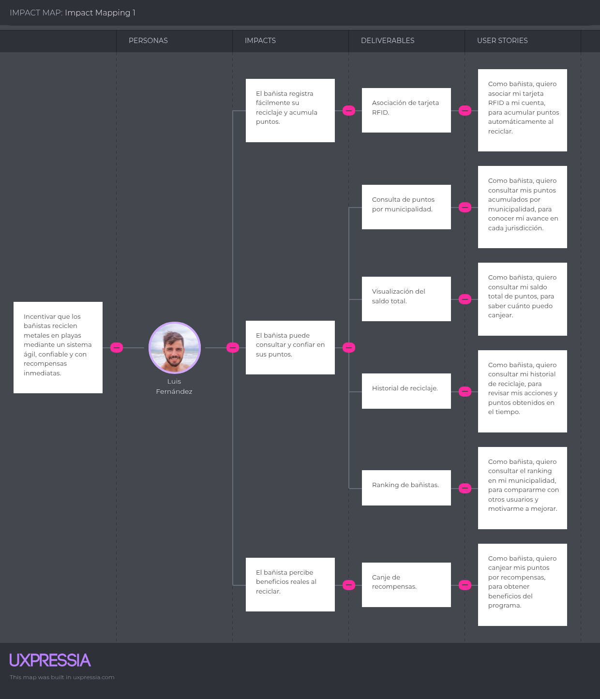
</div>

### Segmento objetivo 2: Municipalidades costeras

<div align="center">
  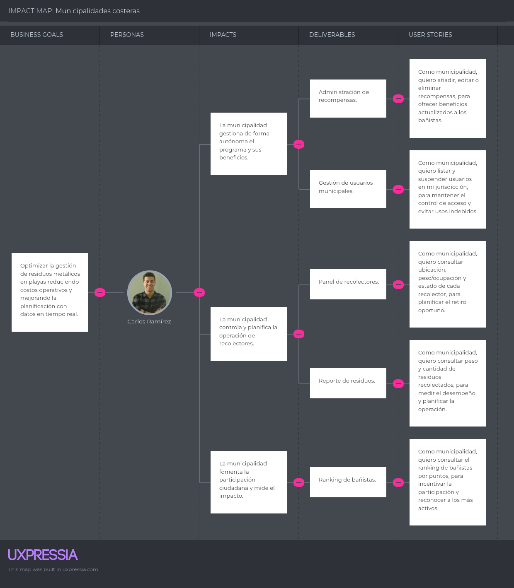
</div>

## 3.4. Product Backlog

<div align="justify"> 
  El Product Backlog es una lista priorizada y dinámica que reúne todas las funcionalidades, requisitos, mejoras y tareas necesarias para el desarrollo de la aplicación. Su propósito es servir como guía central del proyecto, asegurando que cada entrega responda a las necesidades del usuario y a los objetivos planteados. Al mantenerlo actualizado y ordenado, se facilita la planificación de iteraciones, la asignación de prioridades y el enfoque del equipo en generar el mayor valor posible en cada incremento del producto.
</div>

<br>

<table align="center" width="100%" cellspacing="0" cellpadding="6" style="border-collapse:collapse;">
  <thead align="center" style="background:#F8FAFC;">
    <tr>
      <th># Orden</th>
      <th>User Story Id</th>
      <th>Título</th>
      <th>Descripción</th>
      <th>Story Points</th>
    </tr>
  </thead>
  <tbody>
    <tr style="text-align:center;">
      <td>1</td>
      <td>HU-01</td>
      <td>Ver municipalidades participantes</td>
      <td align="justify">Como visitante, quiero ver las municipalidades adheridas al programa, para saber si mi distrito participa y dónde.</td>
      <td>2</td>
    </tr>
    <tr style="text-align:center;">
      <td>2</td>
      <td>HU-02</td>
      <td>Ver recompensas destacadas</td>
      <td align="justify">Como visitante, quiero visualizar recompensas de ejemplo, para entender el valor del programa y motivarme a participar.</td>
      <td>2</td>
    </tr>
    <tr style="text-align:center;">
      <td>3</td>
      <td>HU-04</td>
      <td>Consultar FAQ y enviar contacto</td>
      <td align="justify">Como visitante, quiero resolver dudas frecuentes y enviar consultas, para recibir soporte oportuno.</td>
      <td>3</td>
    </tr>
    <tr style="text-align:center;">
      <td>4</td>
      <td>HU-05</td>
      <td>Registrar interés municipal</td>
      <td align="justify">Como representante de municipalidad, quiero registrar una solicitud de adhesión, para que la empresa evalúe mi incorporación y me contacte.</td>
      <td>3</td>
    </tr>
    <tr style="text-align:center;">
      <td>5</td>
      <td>HU-03</td>
      <td>Conocer proceso para obtener tarjeta RFID</td>
      <td align="justify">Como visitante, quiero conocer los pasos para obtener mi tarjeta, para empezar a usar el sistema y acumular puntos.</td>
      <td>1</td>
    </tr>
    <tr style="text-align:center;">
      <td>6</td>
      <td>HU-06</td>
      <td>Registro de cuenta</td>
      <td align="justify">Como visitante, quiero crear una cuenta como bañista o municipalidad, para acceder a la aplicación según mi rol.</td>
      <td>5</td>
    </tr>
    <tr style="text-align:center;">
      <td>7</td>
      <td>HU-07</td>
      <td>Inicio de sesión</td>
      <td align="justify">Como usuario, quiero iniciar sesión con mis credenciales, para acceder a mi panel según mi rol.</td>
      <td>3</td>
    </tr>
    <tr style="text-align:center;">
      <td>8</td>
      <td>HU-09</td>
      <td>Cerrar sesión</td>
      <td align="justify">Como usuario, quiero cerrar sesión, para proteger mi cuenta en dispositivos compartidos.</td>
      <td>1</td>
    </tr>
    <tr style="text-align:center;">
      <td>9</td>
      <td>TS-01</td>
      <td>API de autenticación con JWT</td>
      <td align="justify">Como developer, quiero exponer endpoints de registro, login y logout seguros, para garantizar autenticación protegida basada en JWT.</td>
      <td>5</td>
    </tr>
    <tr style="text-align:center;">
      <td>10</td>
      <td>HU-08</td>
      <td>Recuperar contraseña</td>
      <td align="justify">Como usuario, quiero recuperar mi contraseña por correo, para restablecer el acceso a mi cuenta.</td>
      <td>3</td>
    </tr>
    <tr style="text-align:center;">
      <td>11</td>
      <td>HU-10</td>
      <td>Editar perfil</td>
      <td align="justify">Como usuario, quiero actualizar datos personales y de contacto, para mantener mi información vigente en la plataforma.</td>
      <td>3</td>
    </tr>
    <tr style="text-align:center;">
      <td>12</td>
      <td>TS-08</td>
      <td>Configuración del broker de mensajería</td>
      <td align="justify">Como developer, quiero configurar HiveMQ como broker MQTT, para permitir comunicación segura entre dispositivos IoT y backend.</td>
      <td>5</td>
    </tr>
    <tr style="text-align:center;">
      <td>13</td>
      <td>TS-07</td>
      <td>Configuración de ESP32 (Wi-Fi y MQTT)</td>
      <td align="justify">Como developer, quiero configurar el ESP32 para conectarse a Wi-Fi y al broker MQTT, para publicar telemetría y recibir comandos.</td>
      <td>5</td>
    </tr>
    <tr style="text-align:center;">
      <td>14</td>
      <td>TS-09</td>
      <td>Sensores y actuadores en ESP32</td>
      <td align="justify">Como developer, quiero configurar sensores y actuadores (inductivo metal, celda de carga/peso, ultrasónico, servo de compuerta), para operar el tacho de forma confiable.</td>
      <td>8</td>
    </tr>
    <tr style="text-align:center;">
      <td>15</td>
      <td>TS-02</td>
      <td>API de RFID y puntos</td>
      <td align="justify">Como developer, quiero validar RFID y sumar puntos por evento, para mantener el historial de reciclaje consistente.</td>
      <td>5</td>
    </tr>
    <tr style="text-align:center;">
      <td>16</td>
      <td>HU-11</td>
      <td>Registrar tarjeta RFID</td>
      <td align="justify">Como bañista, quiero asociar mi tarjeta RFID a mi cuenta, para acumular puntos automáticamente al reciclar.</td>
      <td>5</td>
    </tr>
    <tr style="text-align:center;">
      <td>17</td>
      <td>HU-12</td>
      <td>Consultar puntos por municipalidad</td>
      <td align="justify">Como bañista, quiero consultar mis puntos acumulados por municipalidad, para conocer mi avance en cada jurisdicción.</td>
      <td>3</td>
    </tr>
    <tr style="text-align:center;">
      <td>18</td>
      <td>HU-13</td>
      <td>Ver saldo total</td>
      <td align="justify">Como bañista, quiero consultar mi saldo total de puntos, para saber cuánto puedo canjear.</td>
      <td>2</td>
    </tr>
    <tr style="text-align:center;">
      <td>19</td>
      <td>HU-15</td>
      <td>Historial de reciclaje</td>
      <td align="justify">Como bañista, quiero consultar mi historial de reciclaje, para revisar mis acciones y puntos obtenidos en el tiempo.</td>
      <td>3</td>
    </tr>
    <tr style="text-align:center;">
      <td>20</td>
      <td>TS-03</td>
      <td>API de canje con ID único</td>
      <td align="justify">Como developer, quiero generar y validar IDs únicos para los canjes, para evitar duplicados y fraudes.</td>
      <td>5</td>
    </tr>
    <tr style="text-align:center;">
      <td>21</td>
      <td>HU-14</td>
      <td>Canjear recompensas</td>
      <td align="justify">Como bañista, quiero canjear mis puntos por recompensas, para obtener beneficios del programa.</td>
      <td>8</td>
    </tr>
    <tr style="text-align:center;">
      <td>22</td>
      <td>HU-16</td>
      <td>Ranking de bañistas</td>
      <td align="justify">Como bañista, quiero consultar el ranking en mi municipalidad, para compararme con otros usuarios y motivarme a mejorar.</td>
      <td>3</td>
    </tr>
    <tr style="text-align:center;">
      <td>23</td>
      <td>TS-04</td>
      <td>Telemetría de recolectores (Edge/IoT)</td>
      <td align="justify">Como developer, quiero procesar en el edge datos de peso y ocupación, para optimizar reportes y reducir la latencia.</td>
      <td>5</td>
    </tr>
    <tr style="text-align:center;">
      <td>24</td>
      <td>HU-18</td>
      <td>Administración de recompensas</td>
      <td align="justify">Como municipalidad, quiero añadir, editar o eliminar recompensas, para ofrecer beneficios actualizados a los bañistas.</td>
      <td>5</td>
    </tr>
    <tr style="text-align:center;">
      <td>25</td>
      <td>HU-17</td>
      <td>Panel de recolectores</td>
      <td align="justify">Como municipalidad, quiero consultar ubicación, peso/ocupación y estado de cada recolector, para planificar el retiro oportuno.</td>
      <td>8</td>
    </tr>
    <tr style="text-align:center;">
      <td>26</td>
      <td>HU-20</td>
      <td>Reporte de residuos</td>
      <td align="justify">Como municipalidad, quiero consultar peso y cantidad de residuos recolectados, para medir el desempeño y planificar la operación.</td>
      <td>5</td>
    </tr>
    <tr style="text-align:center;">
      <td>27</td>
      <td>HU-19</td>
      <td>Ranking de bañistas (vista municipal)</td>
      <td align="justify">Como municipalidad, quiero consultar el ranking de bañistas por puntos, para incentivar la participación y reconocer a los más activos.</td>
      <td>3</td>
    </tr>
    <tr style="text-align:center;">
      <td>28</td>
      <td>HU-21</td>
      <td>Gestión de usuarios municipales</td>
      <td align="justify">Como municipalidad, quiero listar y suspender usuarios en mi jurisdicción, para mantener el control de acceso y evitar usos indebidos.</td>
      <td>3</td>
    </tr>
    <tr style="text-align:center;">
      <td>29</td>
      <td>TS-05</td>
      <td>Despliegue en Azure Web App</td>
      <td align="justify">Como developer, quiero desplegar la aplicación en Azure Web App, para garantizar disponibilidad sin manejar contenedores.</td>
      <td>3</td>
    </tr>
    <tr style="text-align:center;">
      <td>30</td>
      <td>TS-06</td>
      <td>Seguridad y cifrado TLS/HTTPS</td>
      <td align="justify">Como developer, quiero habilitar HTTPS con TLS, para proteger la comunicación entre cliente, backend y broker.</td>
      <td>1</td>
    </tr>
  </tbody>
</table>

# Capítulo IV: Solution Software Design

## 4.1. Strategic-Level Domain-Driven Design
En nuestro equipo, abordamos las decisiones estratégicas utilizando Domain-Driven Design (DDD) para asegurarnos de que comprendemos a fondo el dominio y sus complejidades relacionadas con la gestión automatizada de residuos metálicos y el sistema de recompensas municipales. Aplicamos Event Storming como primera herramienta, lo que nos permitió identificar juntos los eventos clave dentro del sistema y visualizar cómo fluye la información y las interacciones en el negocio de reciclaje inteligente.

Después, utilizamos el Bounded Context Canvas para definir claramente los límites de cada contexto dentro del dominio. Esto nos ayudó a organizar las responsabilidades y asegurar que cada parte del sistema estuviera alineada tanto con la visión de negocio como con las capacidades técnicas. Gracias a estas herramientas, pudimos tomar decisiones estratégicas más informadas y coherentes, asegurando que el desarrollo estuviera bien fundamentado en las necesidades reales del negocio de gestión de residuos y recompensas.
### 4.1.1. EventStorming
Event Storming es una herramienta que nos permite descubrir el comportamiento de un negocio, recopilando eventos importantes del negocio, los actores principales, servicios de terceros y otros. Para la implementación de esta sección se realizaron entrevistas correspondientes a los segmentos objetivos (ciudadanos, municipalidades y administradores), de esta manera pudimos identificar los eventos principales relacionados con la recolección de residuos metálicos, identificación de usuarios, gestión de recompensas y desarrollar un entendimiento común.

<div align="center">
  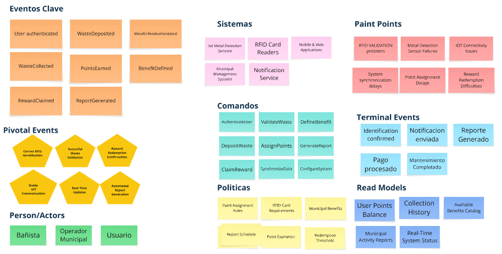
</div>

Aquí mostramos los pasos respectivos para la elaboración correcta del Event Storming realizada en la herramienta de Miro.

<b>Enlace al Miro:</b>
  <a href="https://miro.com/app/board/uXjVI_LnCNw=/?share_link_id=408756915917">EventStorming</a>

**Step 1: Unstructured Exploration**

En esta sección se realizó una lluvia de ideas de los eventos del dominio relacionados con el sistema de gestión inteligente de residuos metálicos que se está explorando. Nos permitió identificar los eventos clave como: WasteCollected, UserAuthenticated, MetallicResidueValidated, PointsEarned, RewardClaimed, BenefitDefined, ReportGenerated, entre otros, y las interacciones entre ellos.

<div align="center">
  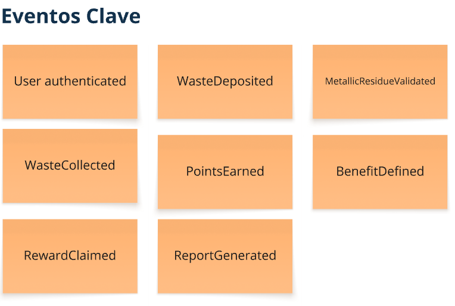
</div>

**Step 2: Timelines**

En esta sección, los eventos identificados previamente, son agrupados en subgrupos lo cual tiene como líder al evento principal (es quien encapsula la funcionalidad principal del grupo). Estos eventos comienzan con el flujo que describe el escenario empresarial exitoso (Happy path) relacionado con la recolección de residuos, validación de usuarios, asignación de puntos y canje de recompensas, así como también escenarios alternativos cuando hay fallos en la validación o problemas técnicos.

<div align="center">
  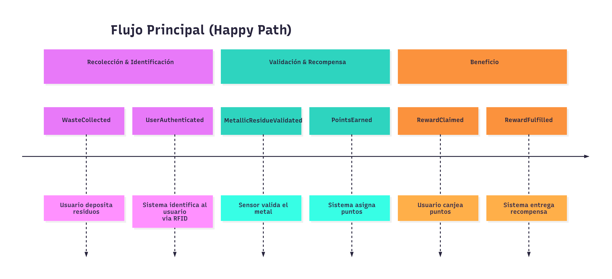
</div>

**Step 3: Paint Points**

Durante esta fase, identificamos puntos problemáticos o (Pain Points) que son áreas donde los usuarios pueden obtener dificultades al momento de realizar una respectiva funcionalidad en la aplicación. Estos puntos incluyen problemas con la validación RFID, fallos en los sensores de detección metálica, demoras en la asignación de puntos, y dificultades en el proceso de canje de recompensas. Estos puntos son importantes para mejorar la experiencia de usuario e implementar una aplicación eficiente.

<div align="center">
  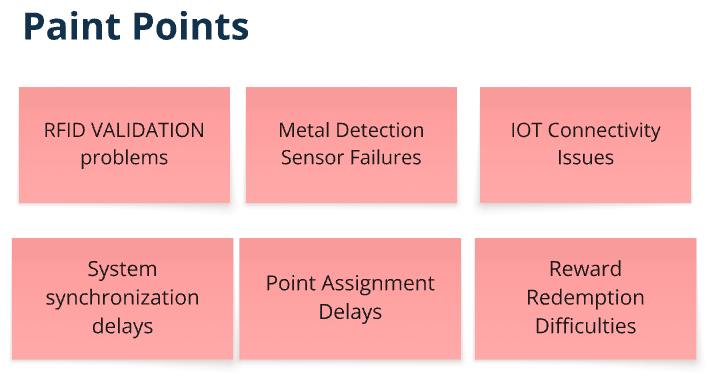
</div>

**Step 4: Pivotal Points**

En esta fase, nos enfocamos en identificar los puntos cruciales dentro del flujo del negocio de gestión de residuos, los cuales tienen un impacto significativo en la operatividad del sistema o el comportamiento del usuario. Estos puntos incluyen la validación exitosa de residuos metálicos, la correcta identificación del usuario vía RFID, y la confirmación del canje de recompensas. Estos puntos nos ayudan a priorizar qué áreas deben ser optimizadas o revisadas con mayor detalle.

<div align="center">
  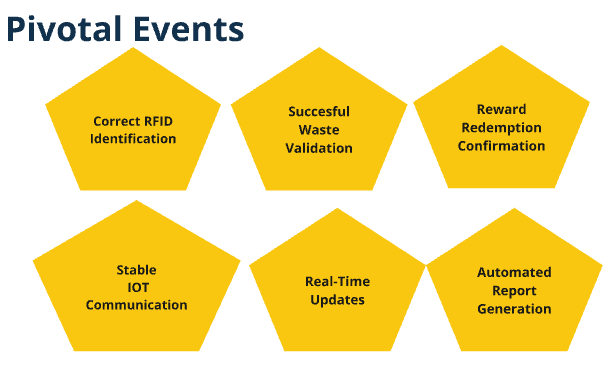
</div>


**Step 5: Commands**

Los comandos representan acciones que los actores del sistema pueden ejecutar. Durante este paso, mapeamos qué acciones desencadenan los eventos clave dentro del sistema: ValidateWaste, AuthenticateUser, AssignPoints, ClaimReward, DefineBenefit, GenerateReport, y qué actores (ciudadanos, administradores municipales, sistema IoT) son responsables de ejecutarlas.

<div align="center">
  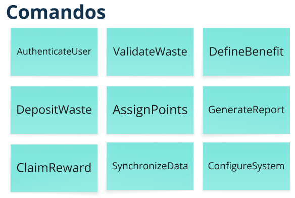
</div>

**Step 6: Policies**

En este paso, se identifican las políticas, que son reglas de negocio o condiciones que deben cumplirse para que un comando pueda ser ejecutado o un evento pueda suceder. Las políticas incluyen: "Solo se asignan puntos si el residuo es validado como metálico", "Cada usuario debe tener una tarjeta RFID única", "Los beneficios son definidos por cada municipio", "Los reportes se actualizan periódicamente".

<div align="center">
  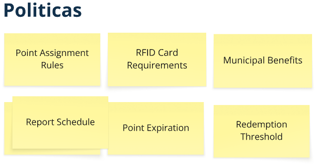
</div>

**Step 7: Read Models**

Los Read Models son vistas del estado del sistema, generalmente optimizadas para la consulta por parte de los usuarios o procesos. Durante este paso, definimos qué información necesita ser accesible: estado de puntos del usuario, historial de recolección, beneficios disponibles, métricas de impacto ambiental, y reportes de actividad municipal.

<div align="center">
  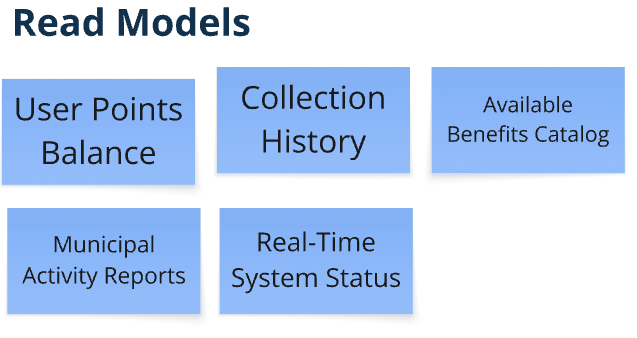
</div>


**Step 8: External Systems**
En esta fase, identificamos los sistemas externos que interactúan con nuestro dominio: sistemas de sensores IoT para detección de metales, lectores RFID, plataformas de pago para recompensas, sistemas municipales de gestión, y servicios de notificación. Es crucial entender cómo estos sistemas externos afectan los flujos de recolección y recompensas.

<div align="center">
  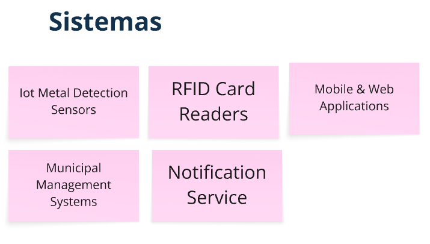
</div>


**Step 9: Aggregates**

En este último paso, agrupamos los eventos y comandos que pertenecen a un agregado específico: Waste Collection Aggregate, User Identity Aggregate, Reward Management Aggregate, Municipal Agreement Aggregate, y Reporting Aggregate, para garantizar que todas las operaciones dentro de un contexto estén alineadas y mantengan la consistencia del sistema.

<div align="center">
  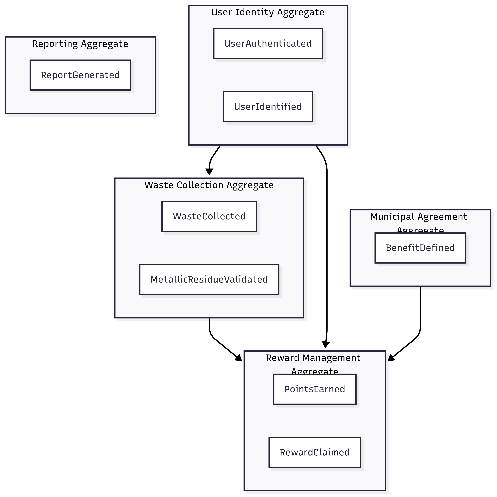
</div>

#### 4.1.1.1. Candidate Context Discovery

Nuestro equipo decidió usar la técnica start-with-value ya que empezamos a identificar la esencia del negocio de gestión inteligente de residuos metálicos, lo cual es importante para tener una mejor proyección a futuro del negocio sostenible.

**Identificación de Valores del Negocio:**
Analizamos los valores clave del negocio relacionados con la gestión automatizada de recolección de residuos metálicos, el sistema de recompensas ciudadanas, y la administración municipal de beneficios. Estas áreas son fundamentales para mejorar la eficiencia operativa en la gestión de recursos (como la recolección selectiva de metales) y para garantizar que los ciudadanos tengan acceso a un sistema de incentivos efectivo que promueva el reciclaje.

**Identificación de funcionalidades:**
A partir de los valores identificados, nos enfocamos en las funcionalidades más críticas: gestión de identidad y autenticación de usuarios, recolección y validación de residuos metálicos, sistema de puntos y recompensas, administración de beneficios municipales, generación de reportes e impacto ambiental, y monitoreo del sistema.

**Priorización de contextos:**
Priorizar los bounded contexts, nos permite identificar situaciones primordiales que se deben lograr de manera pronta. Además, priorizar los bounded contexts, ayuda a priorizar el core del negocio los cuales son esenciales para el desarrollo de la solución de reciclaje inteligente.

**Identificamos 6 Bounded Contexts:**

- Identity & Access Management
- Waste Collection
- User Identification
- Reward Management
- Municipality Management
- Monitoring & Reporting

**Bounded Context Identity & Access Management:**

<div align="center">
  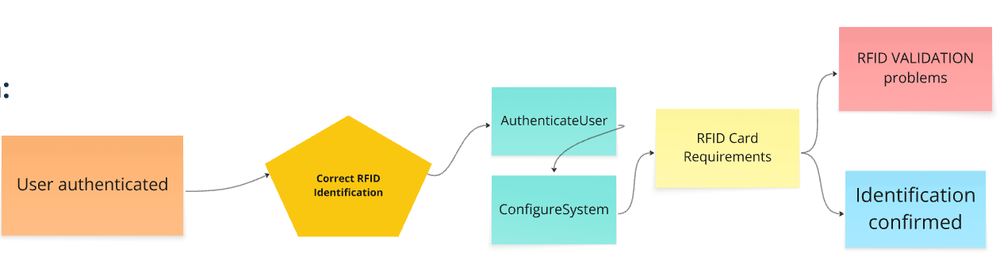
</div>

**Bounded Context Waste Collection:**

<div align="center">
  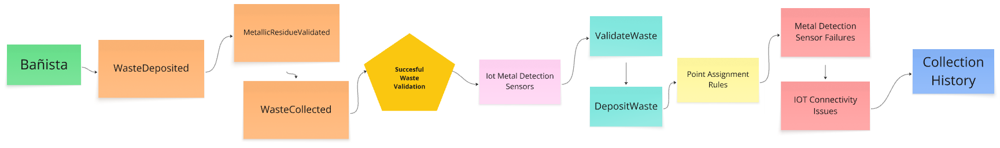
</div>

**Bounded Context User Identification:**

<div align="center">
  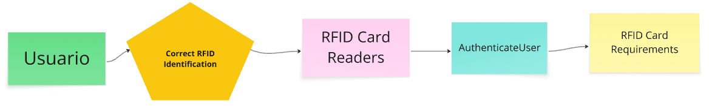
</div>

**Bounded Context Reward Management:**

<div align="center">
  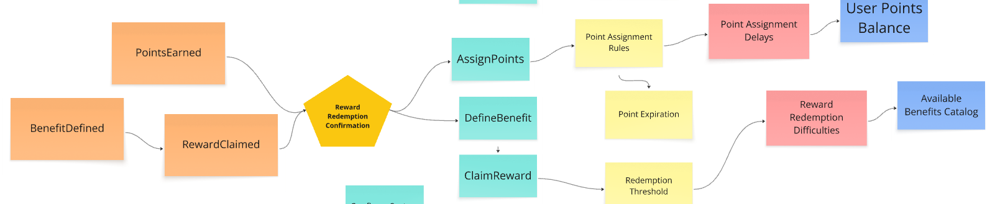
</div>

**Bounded Context Municipality Management:**

<div align="center">
  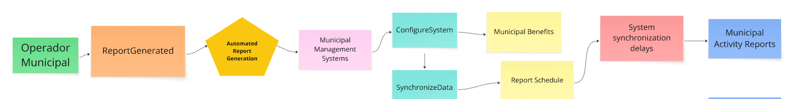
</div>

**Bounded Context Monitoring & Reporting:**

<div align="center">
  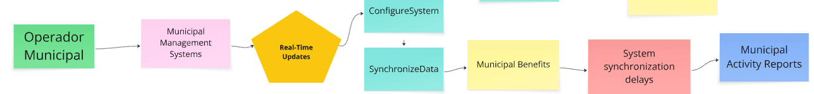
</div>

**Visión General de los Bounded Contexts:**

<div align="center">
  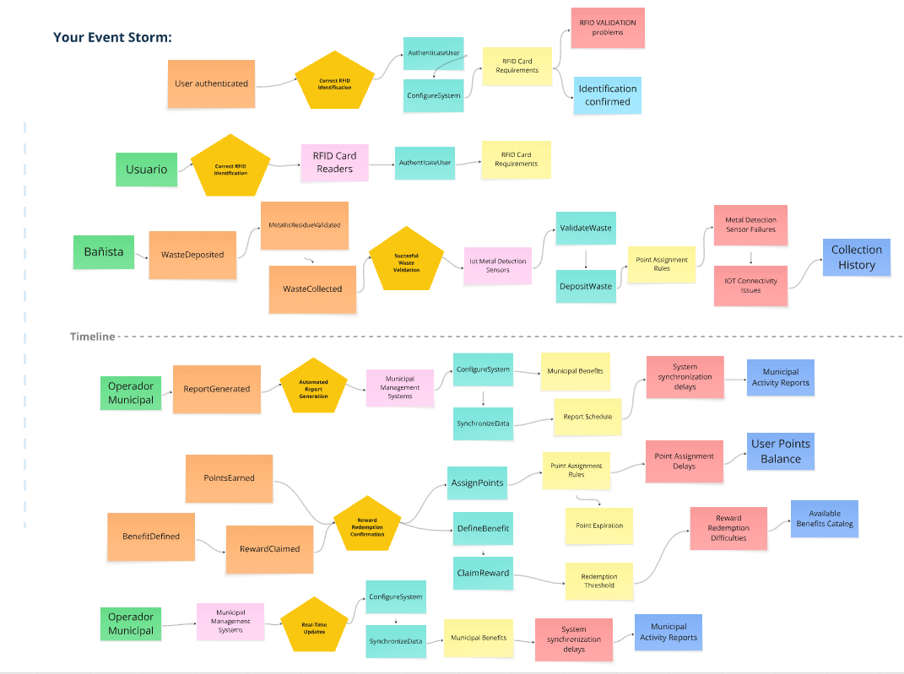
</div>


#### 4.1.1.2. Domain Message Flows Modeling

En esta sección, se describe el proceso utilizado para visualizar la interacción entre los diferentes bounded contexts que conforman el sistema de gestión inteligente de residuos. El objetivo principal es entender cómo estos contextos colaboran para resolver los casos de uso del negocio de reciclaje y satisfacer las necesidades de los ciudadanos y municipalidades. Para lograr esto, se aplicó la técnica de Domain Storytelling, que facilita la representación gráfica de los flujos de mensajes entre actores, contextos y sistemas, permitiendo identificar claramente las responsabilidades y los puntos de comunicación entre cada componente del dominio.

**Scenario: User Authentication**

En este escenario, se describe el proceso de autenticación de usuario en el sistema. El ciudadano interactúa con el contexto de Identity & Access Management para autenticarse y acceder a las funcionalidades de la plataforma de reciclaje.

<div align="center">
  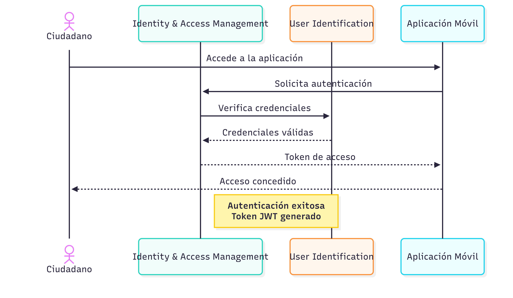
</div>

**Scenario: Waste Collection Process**

En este escenario, se describe el proceso completo de recolección de residuos metálicos. El ciudadano interactúa con los contextos de User Identification y Waste Collection para depositar residuos metálicos y ser identificado mediante su tarjeta RFID.

<div align="center">
  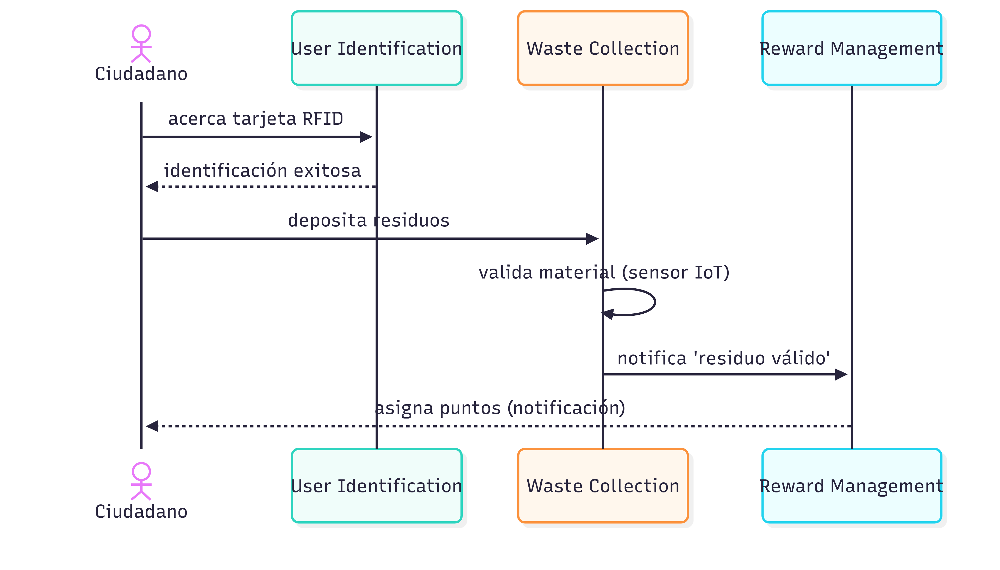
</div>

**Scenario: Reward Points Assignment**

En este escenario, se describe el proceso de asignación de puntos de recompensa. Tras la validación exitosa del residuo metálico y la identificación del usuario, el contexto de Reward Management asigna puntos al usuario basado en las reglas definidas.

<div align="center">
  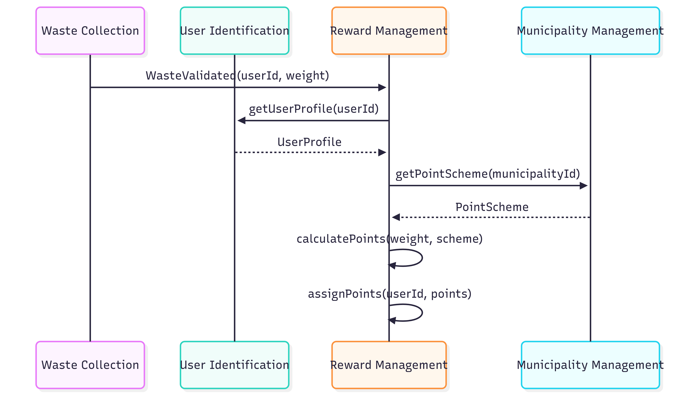
</div>

**Scenario: Benefit Redemption**

En este escenario, se describe el proceso de canje de beneficios municipales. El ciudadano interactúa con los contextos de Reward Management y Municipality Management para canjear sus puntos por beneficios definidos por su municipio.

<div align="center">
  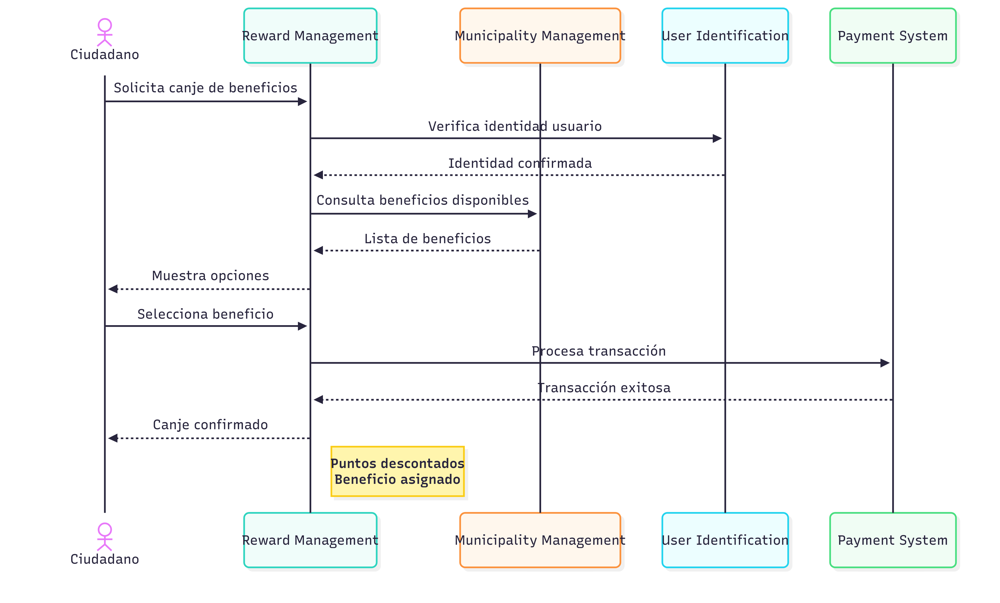
</div>

**Scenario: Generate Impact Report**

En este escenario, se describe el proceso de generación de reportes de impacto ambiental. Los administradores municipales interactúan con el contexto de Monitoring & Reporting para visualizar métricas de recolección, impacto ambiental y participación ciudadana.

<div align="center">
  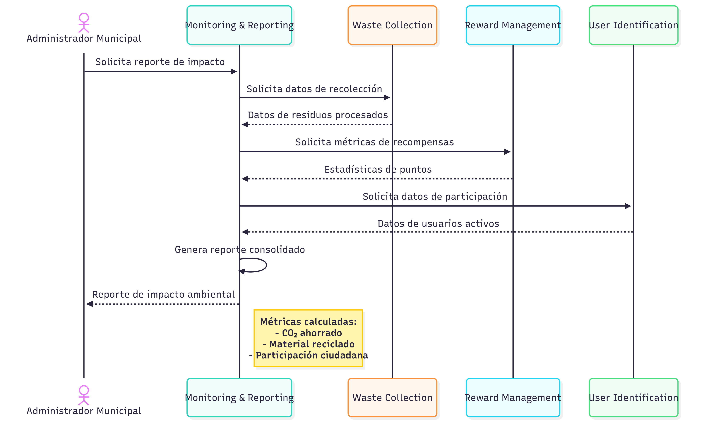
</div>
   
#### 4.1.1.3. Bounded Context Canvases

En esta sección, se detallan los pasos seguidos por el equipo para diseñar los bounded contexts identificados durante el proceso. El diseño de los bounded contexts fue iterativo, asegurando que cada contexto refleje de manera precisa los criterios de diseño y el conocimiento del dominio de gestión de residuos metálicos. Para cada bounded context, se siguieron los siguientes pasos clave:

**Context Overview Definition:** Se definió el propósito y los límites de cada bounded context, alineándolos con el dominio del negocio de reciclaje inteligente.

**Business Rules Distillation & Ubiquitous Language Capture:** Se identificaron las reglas de negocio clave relacionadas con la gestión de residuos, recompensas y administración municipal, capturando el lenguaje ubicuo para una comunicación clara entre el equipo.

**Capability Analysis:** Se analizaron las capacidades que cada bounded context debe ofrecer para el sistema de reciclaje.

**Capability Layering:** Se aplicó la separación en capas de capacidades cuando fue necesario.

**Dependencies Capture:** Se identificaron las dependencias con otros bounded contexts y sistemas externos como sensores IoT y lectores RFID.

**Design Critique:** Se revisó el diseño para asegurar un desacoplamiento adecuado y alineación con los objetivos del negocio sostenible.

**Bounded Context Canvas Identity & Access Management:**

- **Propósito del Contexto:** Gestionar autenticación, autorización y seguridad del sistema
- **Responsabilidad:** Autenticar y autorizar usuarios del sistema
- **Lenguaje Ubicuo:** Usuario, Credencial, Token, Rol, Permiso, Autenticación
- **Reglas de negocio:** Los tokens de acceso tienen tiempo de expiración; Los usuarios deben autenticarse antes de acceder a funcionalidades; Diferentes roles tienen diferentes niveles de acceso
- **Dependencias:** User Identification Context (para validar identidad de usuarios finales)

<div align="center">
  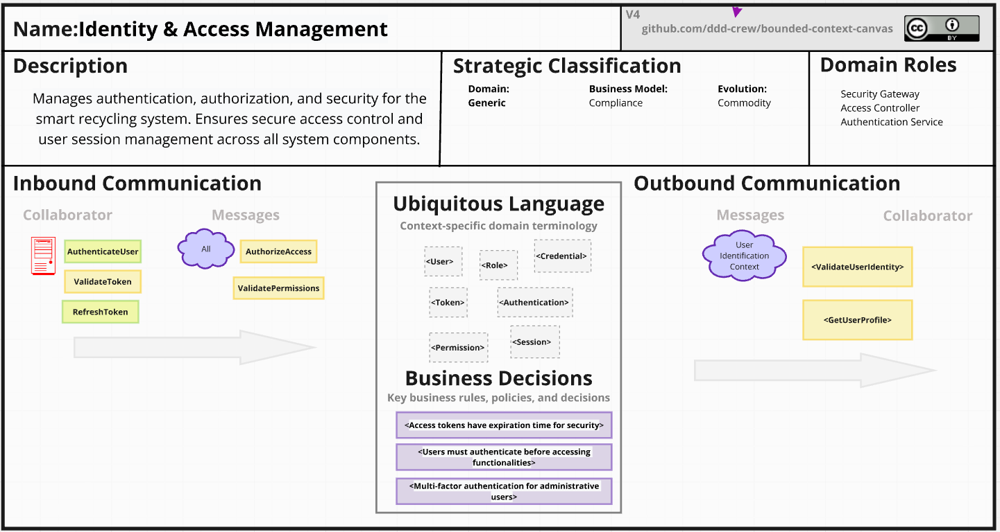
</div>

**Bounded Context Canvas Waste Collection:**

- **Propósito del Contexto:** Gestionar la recolección, validación y procesamiento de residuos metálicos
- **Responsabilidad:** Validar y recolectar residuos metálicos
- **Lenguaje Ubicuo:** Residuo, Validación, Sensor, Actuador, Material Metálico
- **Reglas de negocio:** Solo se acepta para la compuerta si el material es metálico; La validación debe ser confirmada por sensores IoT
- **Dependencias:** User Identification Context

<div align="center">
  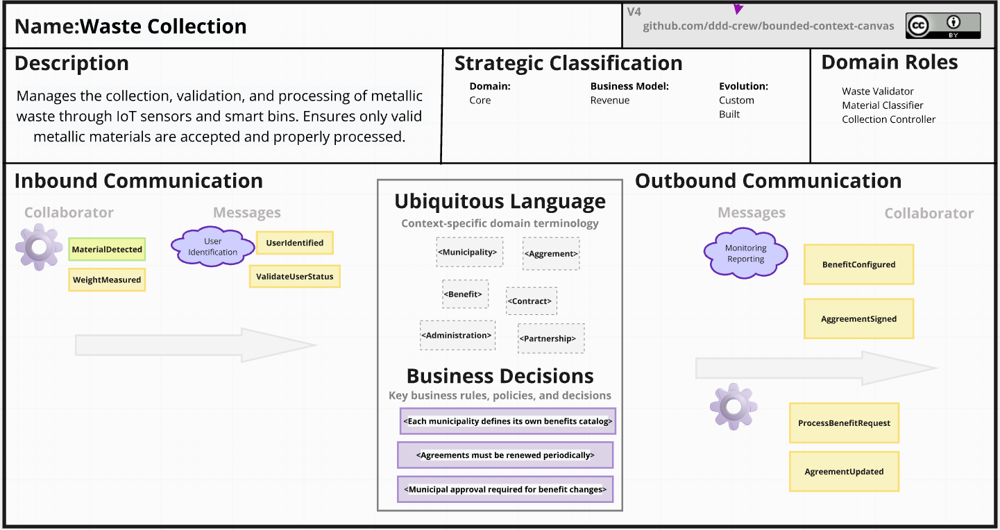
</div>

**Bounded Context Canvas User Identification:**

- **Propósito del Contexto:** Identificar usuarios mediante RFID y gestionar perfiles de ciudadanos
- **Responsabilidad:** Identificar usuarios mediante RFID
- **Lenguaje Ubicuo:** Usuario, Tarjeta RFID, Registro, Perfil
- **Reglas de negocio:** Cada usuario posee una tarjeta única; La tarjeta RFID debe estar activa y registrada
- **Dependencias:** Reward Management Context

<div align="center">
  
</div>

**Bounded Context Canvas Reward Management:**

- **Propósito del Contexto:** Gestionar sistema de puntos y recompensas para incentivar el reciclaje
- **Responsabilidad:** Gestionar puntos y recompensas
- **Lenguaje Ubicuo:** Puntos, Canje, Recompensa, Beneficio
- **Reglas de negocio:** Los puntos sólo se asignan tras validar residuo y usuario; Los puntos tienen fecha de expiración
- **Dependencias:** Municipality Management Context

<div align="center">
  
</div>

**Bounded Context Canvas Municipality Management:**

- **Propósito del Contexto:** Gestionar convenios y administración de beneficios municipales
- **Responsabilidad:** Gestionar convenios y administración de beneficios
- **Lenguaje Ubicuo:** Municipio, Beneficio, Convenio, Administración
- **Reglas de negocio:** Cada municipio define sus propios beneficios; Los convenios deben ser renovados periódicamente
- **Dependencias:** Ninguna (contexto independiente)

<div align="center">
  
</div>

**Bounded Context Canvas Monitoring & Reporting:**

- **Propósito del Contexto:** Generar métricas e informes del sistema de reciclaje
- **Responsabilidad:** Generar métricas e informes
- **Lenguaje Ubicuo:** Reporte, Impacto, Estadística, Métrica Ambiental
- **Reglas de negocio:** Los reportes deben actualizarse periódicamente; Las métricas deben reflejar el impacto ambiental real
- **Dependencias:** Todos los demás contextos (para recopilar datos)

<div align="center">
  
</div>

### 4.1.2 Context mapping

En esta sección, se analizan las relaciones entre los bounded contexts identificados y se asignan patrones de context mapping adecuados para cada uno:

**Customer/Supplier**

**Descripción:** En esta relación, un contexto actúa como Cliente (Customer) y otro como Proveedor (Supplier). El contexto Cliente necesita servicios o datos del contexto Proveedor. Esta relación establece una dependencia directa donde el proveedor suministra información o servicios que el cliente necesita para funcionar adecuadamente en el sistema de reciclaje.

- **"Waste Collection"** es Cliente de "User Identification". En este caso, "User Identification" proporciona datos de validación de usuarios a "Waste Collection" para confirmar la identidad antes de procesar residuos.
- **"Reward Management"** es Cliente de "User Identification" y "Municipality Management". "User Identification" proporciona datos de usuario para asignar puntos, mientras que "Municipality Management" provee información sobre beneficios disponibles.

**Open/Host Service (OHS)**

**Descripción:** En este patrón, un contexto expone un servicio bien definido que otros contextos pueden consumir sin tener que conocer o interactuar con la lógica interna de ese contexto. Este patrón es útil para integrar sistemas o contextos que necesitan acceder a servicios comunes, como autenticación, permisos o servicios de identificación.

- El contexto **"Identity & Access Management"** (Host) expone servicios de autenticación y autorización para todos los demás contextos del sistema de reciclaje.

**Conformist**

**Descripción:** En este patrón, un contexto downstream adopta completamente el modelo del contexto upstream, sin traducción o adaptación. El contexto downstream se conforma al modelo y las interfaces del contexto upstream.

- El contexto **"Monitoring & Reporting"** actúa como Conformist respecto a todos los demás contextos. Se adapta a los modelos de datos de "Waste Collection", "User Identification", "Reward Management", y "Municipality Management" para generar reportes consolidados.

**Shared Kernel**

**Descripción:** Este patrón se utiliza cuando dos contextos comparten un subconjunto común de su modelo de dominio. Los contextos que participan en un Shared Kernel deben coordinarse estrechamente para mantener la coherencia del modelo compartido.

- **"Identity & Access Management"** y **"User Identification"** comparten un Shared Kernel relacionado con la información básica de identidad del usuario y estados de autenticación.

**Context Mapping Diagram**

<div align="center">
  
</div>

El diagrama muestra claramente cómo los seis bounded contexts interactúan entre sí, con Identity & Access Management como el proveedor central de servicios de seguridad, User Identification como el núcleo de identificación de ciudadanos, Waste Collection como el procesador central de residuos, Reward Management como el gestor de incentivos, Municipality Management como el definidor de políticas de beneficios, y Monitoring & Reporting como el consumidor de datos para análisis e informes del sistema de reciclaje inteligente.

### 4.1.3. Software Architecture

#### 4.1.3.1. Software Architecture System Landscape Diagram

> Muestra la visión general del ecosistema de ReciclaMar, con la plataforma RIMP como sistema central y los actores principales.   

<div align="center">
  
</div>

---

#### 4.1.3.2. Software Architecture Context Level Diagrams

> Representa a RIMP como caja negra y cómo interactúan los segmentos: bañistas, municipalidades y mantenimiento.   

<div align="center">
  
</div>

---

#### 4.1.3.3. Software Architecture Container Level Diagrams

> Descompone RIMP en sus aplicaciones y servicios: App móvil (Flutter), Web Admin (React), Backend (Spring Boot), DB, Storage y Firmware (ESP32).  

<div align="center">
  
</div>

---

#### 4.1.3.4. Software Architecture Deployment Diagrams

> Muestra dónde se despliegan los contenedores: ESP32 en playa, Backend/DB en Railway, Landing en GitHub Pages, Web Admin en hosting SPA y App móvil en Android.  

<div align="center">
  
</div>

# 4.2. Tactical-Level Domain-Driven Design

## 4.2.1. Bounded Context: IAM

### 4.2.1.1. Domain Layer

**Entidades:**
- **User**: Entidad raíz que representa los datos de autenticación de un usuario del sistema IoT
  - Atributos: id, username, password, email, role, isActive, createdAt, updatedAt
  - Métodos: authenticate(), changePassword(), isActive(), updateLastLogin()

**Value Objects:**
- **Username**: Representa el nombre de usuario único
- **Password**: Representa la contraseña encriptada
- **Role**: Enumera los roles disponibles (CITIZEN, MUNICIPALITY_ADMIN, SYSTEM_ADMIN, COLLECTOR)

**Servicios de Dominio:**
- **AuthenticationService**: Maneja la lógica de autenticación
- **PasswordService**: Gestiona el cifrado y validación de contraseñas

**Repositorios:**
- **UserRepository**: Interfaz para persistencia de usuarios

### 4.2.1.2. Interface Layer

**Controladores:**
- **AuthController**: Maneja endpoints de autenticación
  - POST /api/v1/auth/login
  - POST /api/v1/auth/register
  - POST /api/v1/auth/logout
  - POST /api/v1/auth/refresh

**DTOs:**
- **LoginRequest**: Datos de inicio de sesión
- **RegisterRequest**: Datos de registro
- **AuthResponse**: Respuesta con token y datos del usuario

### 4.2.1.3. Application Layer

**Casos de Uso:**
- **LoginUseCase**: Procesa el inicio de sesión
- **RegisterUseCase**: Procesa el registro de usuarios
- **RefreshTokenUseCase**: Renueva tokens de acceso

**Servicios de Aplicación:**
- **AuthApplicationService**: Orquesta los casos de uso de autenticación

### 4.2.1.4. Infrastructure Layer

**Implementaciones:**
- **JpaUserRepository**: Implementación JPA del repositorio de usuarios
- **JwtTokenService**: Servicio para manejo de tokens JWT
- **BCryptPasswordEncoder**: Implementación de cifrado de contraseñas

### 4.2.1.5. Bounded Context Software Architecture Component Level Diagrams

<div align="center">
  
</div>

### 4.2.1.6. Bounded Context Software Architecture Code Level Diagrams

#### 4.2.1.6.1. Bounded Context Domain Layer Class Diagrams

<div align="center">
  
</div>

#### 4.2.1.6.2. Bounded Context Database Design Diagram

<div align="center">
  
</div>

## 4.2.2. Bounded Context: WasteCollection

### 4.2.2.1. Domain Layer

**Entidades:**
- **WasteBin**: Entidad raíz que representa un contenedor de residuos inteligente
  - Atributos: id, location, capacity, currentLevel, sensorId, status, lastEmptied, municipalityId
  - Métodos: updateLevel(), markAsEmpty(), needsCollection(), calculateFillPercentage()

- **CollectionRoute**: Representa una ruta de recolección optimizada
  - Atributos: id, collectorId, wasteBins, estimatedTime, status, createdAt
  - Métodos: addWasteBin(), removeWasteBin(), optimize(), complete()

- **CollectionRecord**: Registro de recolección realizada
  - Atributos: id, wasteBinId, collectorId, collectedAt, volumeCollected, wasteType
  - Métodos: validate(), calculateReward()

**Value Objects:**
- **Location**: Coordenadas geográficas (latitud, longitud)
- **WasteLevel**: Nivel de llenado del contenedor (0-100%)
- **WasteType**: Tipo de residuo (ORGANIC, RECYCLABLE, GENERAL)

**Servicios de Dominio:**
- **RouteOptimizationService**: Optimiza rutas de recolección
- **CollectionSchedulingService**: Programa recolecciones basadas en niveles

**Repositorios:**
- **WasteBinRepository**: Interfaz para persistencia de contenedores
- **CollectionRouteRepository**: Interfaz para persistencia de rutas
- **CollectionRecordRepository**: Interfaz para persistencia de registros

### 4.2.2.2. Interface Layer

**Controladores:**
- **WasteBinController**: Maneja endpoints de contenedores
  - GET /api/v1/waste-bins
  - GET /api/v1/waste-bins/{id}
  - PUT /api/v1/waste-bins/{id}/level
  - GET /api/v1/waste-bins/needs-collection

- **CollectionController**: Maneja endpoints de recolección
  - POST /api/v1/collections/routes
  - GET /api/v1/collections/routes/{id}
  - PUT /api/v1/collections/routes/{id}/complete
  - POST /api/v1/collections/records

**DTOs:**
- **WasteBinResponse**: Respuesta con datos del contenedor
- **UpdateLevelRequest**: Datos para actualizar nivel
- **CollectionRouteRequest**: Datos para crear ruta
- **CollectionRecordRequest**: Datos para registrar recolección

### 4.2.2.3. Application Layer

**Casos de Uso:**
- **UpdateWasteLevelUseCase**: Actualiza nivel de contenedor
- **GenerateCollectionRouteUseCase**: Genera ruta optimizada
- **RecordCollectionUseCase**: Registra recolección realizada
- **GetWasteBinsNeedingCollectionUseCase**: Obtiene contenedores que necesitan recolección

**Servicios de Aplicación:**
- **WasteCollectionApplicationService**: Orquesta los casos de uso de recolección

### 4.2.2.4. Infrastructure Layer

**Implementaciones:**
- **JpaWasteBinRepository**: Implementación JPA del repositorio de contenedores
- **JpaCollectionRouteRepository**: Implementación JPA del repositorio de rutas
- **JpaCollectionRecordRepository**: Implementación JPA del repositorio de registros
- **IoTSensorService**: Servicio para comunicación con sensores IoT
- **MapsApiService**: Servicio para optimización de rutas usando APIs de mapas

### 4.2.2.5. Bounded Context Software Architecture Component Level Diagrams

<div align="center">
  
</div>

### 4.2.2.6. Bounded Context Software Architecture Code Level Diagrams

#### 4.2.2.6.1. Bounded Context Domain Layer Class Diagrams

<div align="center">
  
</div>

#### 4.2.2.6.2. Bounded Context Database Design Diagram

<div align="center">
  
</div>

## 4.2.3. Bounded Context: UserIdentification

### 4.2.3.1. Domain Layer

**Entidades:**
- **Citizen**: Entidad raíz que representa un ciudadano registrado
  - Atributos: id, dni, firstName, lastName, email, phone, address, municipalityId, isVerified
  - Métodos: verify(), updateProfile(), isActive(), getFullName()

- **IdentificationDevice**: Dispositivo para identificación (QR, NFC, etc.)
  - Atributos: id, deviceType, deviceId, citizenId, isActive, lastUsed
  - Métodos: activate(), deactivate(), updateLastUsed()

**Value Objects:**
- **DNI**: Documento Nacional de Identidad
- **Address**: Dirección completa del ciudadano
- **DeviceType**: Tipo de dispositivo (QR_CODE, NFC_CARD, MOBILE_APP)

**Servicios de Dominio:**
- **CitizenVerificationService**: Verifica identidad de ciudadanos
- **DeviceRegistrationService**: Registra dispositivos de identificación

**Repositorios:**
- **CitizenRepository**: Interfaz para persistencia de ciudadanos
- **IdentificationDeviceRepository**: Interfaz para persistencia de dispositivos

### 4.2.3.2. Interface Layer

**Controladores:**
- **CitizenController**: Maneja endpoints de ciudadanos
  - POST /api/v1/citizens/register
  - GET /api/v1/citizens/{id}
  - PUT /api/v1/citizens/{id}/verify
  - GET /api/v1/citizens/profile

- **IdentificationController**: Maneja endpoints de identificación
  - POST /api/v1/identification/devices
  - GET /api/v1/identification/verify/{deviceId}
  - PUT /api/v1/identification/devices/{id}/activate

**DTOs:**
- **CitizenRegistrationRequest**: Datos para registro de ciudadano
- **CitizenResponse**: Respuesta con datos del ciudadano
- **DeviceRegistrationRequest**: Datos para registro de dispositivo
- **IdentificationResponse**: Respuesta de identificación

### 4.2.3.3. Application Layer

**Casos de Uso:**
- **RegisterCitizenUseCase**: Registra nuevo ciudadano
- **VerifyCitizenUseCase**: Verifica identidad de ciudadano
- **RegisterDeviceUseCase**: Registra dispositivo de identificación
- **IdentifyUserUseCase**: Identifica usuario mediante dispositivo

**Servicios de Aplicación:**
- **UserIdentificationApplicationService**: Orquesta los casos de uso de identificación

### 4.2.3.4. Infrastructure Layer

**Implementaciones:**
- **JpaCitizenRepository**: Implementación JPA del repositorio de ciudadanos
- **JpaIdentificationDeviceRepository**: Implementación JPA del repositorio de dispositivos
- **QRCodeService**: Servicio para generación y lectura de códigos QR
- **NFCService**: Servicio para comunicación NFC
- **DocumentVerificationService**: Servicio externo para verificación de documentos

### 4.2.3.5. Bounded Context Software Architecture Component Level Diagrams

<div align="center">
  
</div>

### 4.2.3.6. Bounded Context Software Architecture Code Level Diagrams

#### 4.2.3.6.1. Bounded Context Domain Layer Class Diagrams

<div align="center">
  
</div>

#### 4.2.3.6.2. Bounded Context Database Design Diagram

<div align="center">
  
</div>

## 4.2.4. Bounded Context: RewardManagement

### 4.2.4.1. Domain Layer

**Entidades:**
- **Reward**: Entidad raíz que representa una recompensa
  - Atributos: id, citizenId, points, rewardType, description, earnedAt, expiresAt, status
  - Métodos: redeem(), expire(), isValid(), calculateValue()

- **RewardTransaction**: Transacción de puntos de recompensa
  - Atributos: id, citizenId, points, transactionType, description, relatedEntityId, createdAt
  - Métodos: validate(), reverse()

- **RewardCatalog**: Catálogo de recompensas disponibles
  - Atributos: id, name, description, pointsCost, category, isActive, stock
  - Métodos: purchase(), updateStock(), activate(), deactivate()

**Value Objects:**
- **Points**: Puntos de recompensa
- **RewardType**: Tipo de recompensa (WASTE_DISPOSAL, RECYCLING, REPORTING)
- **TransactionType**: Tipo de transacción (EARNED, REDEEMED, EXPIRED)

**Servicios de Dominio:**
- **RewardCalculationService**: Calcula puntos basados en acciones
- **RewardRedemptionService**: Maneja canje de recompensas

**Repositorios:**
- **RewardRepository**: Interfaz para persistencia de recompensas
- **RewardTransactionRepository**: Interfaz para persistencia de transacciones
- **RewardCatalogRepository**: Interfaz para persistencia del catálogo

### 4.2.4.2. Interface Layer

**Controladores:**
- **RewardController**: Maneja endpoints de recompensas
  - GET /api/v1/rewards/citizen/{citizenId}
  - POST /api/v1/rewards/earn
  - POST /api/v1/rewards/redeem
  - GET /api/v1/rewards/balance/{citizenId}

- **RewardCatalogController**: Maneja endpoints del catálogo
  - GET /api/v1/rewards/catalog
  - GET /api/v1/rewards/catalog/{id}
  - POST /api/v1/rewards/catalog/{id}/purchase

**DTOs:**
- **EarnRewardRequest**: Datos para ganar recompensa
- **RedeemRewardRequest**: Datos para canjear recompensa
- **RewardResponse**: Respuesta con datos de recompensa
- **RewardBalanceResponse**: Respuesta con balance de puntos

### 4.2.4.3. Application Layer

**Casos de Uso:**
- **EarnRewardUseCase**: Otorga puntos por acciones
- **RedeemRewardUseCase**: Canjea puntos por recompensas
- **GetRewardBalanceUseCase**: Obtiene balance de puntos
- **GetRewardHistoryUseCase**: Obtiene historial de recompensas

**Servicios de Aplicación:**
- **RewardManagementApplicationService**: Orquesta los casos de uso de recompensas

### 4.2.4.4. Infrastructure Layer

**Implementaciones:**
- **JpaRewardRepository**: Implementación JPA del repositorio de recompensas
- **JpaRewardTransactionRepository**: Implementación JPA del repositorio de transacciones
- **JpaRewardCatalogRepository**: Implementación JPA del repositorio del catálogo
- **PaymentGatewayService**: Servicio para procesamiento de pagos
- **NotificationService**: Servicio para notificaciones de recompensas

### 4.2.4.5. Bounded Context Software Architecture Component Level Diagrams

<div align="center">
  
</div>

### 4.2.4.6. Bounded Context Software Architecture Code Level Diagrams

#### 4.2.4.6.1. Bounded Context Domain Layer Class Diagrams

<div align="center">
  
</div>

#### 4.2.4.6.2. Bounded Context Database Design Diagram

<div align="center">
  
</div>

## 4.2.5. Bounded Context: MunicipalityManagement

### 4.2.5.1. Domain Layer

**Entidades:**
- **Municipality**: Entidad raíz que representa una municipalidad
  - Atributos: id, name, code, region, population, area, contactInfo, isActive
  - Métodos: updateInfo(), activate(), deactivate(), addZone()

- **Zone**: Zona dentro de una municipalidad
  - Atributos: id, municipalityId, name, boundaries, population, zoneType
  - Métodos: updateBoundaries(), assignCollector()

- **MunicipalityAdmin**: Administrador de municipalidad
  - Atributos: id, userId, municipalityId, role, permissions, assignedAt
  - Métodos: grantPermission(), revokePermission(), isAuthorized()

**Value Objects:**
- **ContactInfo**: Información de contacto de la municipalidad
- **Boundaries**: Límites geográficos de una zona
- **ZoneType**: Tipo de zona (RESIDENTIAL, COMMERCIAL, INDUSTRIAL)

**Servicios de Dominio:**
- **MunicipalityConfigurationService**: Configura parámetros municipales
- **ZoneManagementService**: Gestiona zonas y asignaciones

**Repositorios:**
- **MunicipalityRepository**: Interfaz para persistencia de municipalidades
- **ZoneRepository**: Interfaz para persistencia de zonas
- **MunicipalityAdminRepository**: Interfaz para persistencia de administradores

### 4.2.5.2. Interface Layer

**Controladores:**
- **MunicipalityController**: Maneja endpoints de municipalidades
  - GET /api/v1/municipalities
  - GET /api/v1/municipalities/{id}
  - PUT /api/v1/municipalities/{id}
  - POST /api/v1/municipalities/{id}/zones

- **ZoneController**: Maneja endpoints de zonas
  - GET /api/v1/zones/municipality/{municipalityId}
  - GET /api/v1/zones/{id}
  - PUT /api/v1/zones/{id}

**DTOs:**
- **MunicipalityResponse**: Respuesta con datos de municipalidad
- **UpdateMunicipalityRequest**: Datos para actualizar municipalidad
- **ZoneRequest**: Datos para crear/actualizar zona
- **ZoneResponse**: Respuesta con datos de zona

### 4.2.5.3. Application Layer

**Casos de Uso:**
- **GetMunicipalityUseCase**: Obtiene información de municipalidad
- **UpdateMunicipalityUseCase**: Actualiza información de municipalidad
- **CreateZoneUseCase**: Crea nueva zona
- **AssignAdminUseCase**: Asigna administrador a municipalidad

**Servicios de Aplicación:**
- **MunicipalityManagementApplicationService**: Orquesta los casos de uso municipales

### 4.2.5.4. Infrastructure Layer

**Implementaciones:**
- **JpaMunicipalityRepository**: Implementación JPA del repositorio de municipalidades
- **JpaZoneRepository**: Implementación JPA del repositorio de zonas
- **JpaMunicipalityAdminRepository**: Implementación JPA del repositorio de administradores
- **GeocodingService**: Servicio para geocodificación de direcciones
- **MapService**: Servicio para manejo de mapas y límites geográficos

### 4.2.5.5. Bounded Context Software Architecture Component Level Diagrams

<div align="center">
  
</div>

### 4.2.5.6. Bounded Context Software Architecture Code Level Diagrams

#### 4.2.5.6.1. Bounded Context Domain Layer Class Diagrams

<div align="center">
  
</div>

#### 4.2.5.6.2. Bounded Context Database Design Diagram

<div align="center">
  
</div>

## 4.2.6. Bounded Context: Monitoring & Reporting

### 4.2.6.1. Domain Layer

**Entidades:**
- **Report**: Entidad raíz que representa un reporte del sistema
  - Atributos: id, reportType, municipalityId, generatedBy, data, createdAt, status
  - Métodos: generate(), export(), schedule(), validate()

- **Metric**: Métrica del sistema
  - Atributos: id, name, value, unit, timestamp, source, municipalityId
  - Métodos: update(), validate(), compare()

- **Alert**: Alerta del sistema
  - Atributos: id, alertType, severity, message, source, isResolved, createdAt
  - Métodos: resolve(), escalate(), notify()

**Value Objects:**
- **ReportType**: Tipo de reporte (COLLECTION_EFFICIENCY, WASTE_LEVELS, CITIZEN_PARTICIPATION)
- **AlertSeverity**: Severidad de alerta (LOW, MEDIUM, HIGH, CRITICAL)
- **MetricValue**: Valor de métrica con unidad

**Servicios de Dominio:**
- **ReportGenerationService**: Genera reportes basados en datos
- **AlertingService**: Gestiona alertas del sistema
- **MetricsAggregationService**: Agrega métricas para análisis

**Repositorios:**
- **ReportRepository**: Interfaz para persistencia de reportes
- **MetricRepository**: Interfaz para persistencia de métricas
- **AlertRepository**: Interfaz para persistencia de alertas

### 4.2.6.2. Interface Layer

**Controladores:**
- **ReportController**: Maneja endpoints de reportes
  - GET /api/v1/reports
  - POST /api/v1/reports/generate
  - GET /api/v1/reports/{id}
  - GET /api/v1/reports/{id}/export

- **MetricsController**: Maneja endpoints de métricas
  - GET /api/v1/metrics
  - GET /api/v1/metrics/dashboard
  - POST /api/v1/metrics

- **AlertController**: Maneja endpoints de alertas
  - GET /api/v1/alerts
  - PUT /api/v1/alerts/{id}/resolve
  - GET /api/v1/alerts/active

**DTOs:**
- **GenerateReportRequest**: Datos para generar reporte
- **ReportResponse**: Respuesta con datos del reporte
- **MetricResponse**: Respuesta con datos de métrica
- **AlertResponse**: Respuesta con datos de alerta

### 4.2.6.3. Application Layer

**Casos de Uso:**
- **GenerateReportUseCase**: Genera reportes del sistema
- **GetMetricsDashboardUseCase**: Obtiene métricas para dashboard
- **CreateAlertUseCase**: Crea nueva alerta
- **ResolveAlertUseCase**: Resuelve alerta existente

**Servicios de Aplicación:**
- **MonitoringReportingApplicationService**: Orquesta los casos de uso de monitoreo

### 4.2.6.4. Infrastructure Layer

**Implementaciones:**
- **JpaReportRepository**: Implementación JPA del repositorio de reportes
- **JpaMetricRepository**: Implementación JPA del repositorio de métricas
- **JpaAlertRepository**: Implementación JPA del repositorio de alertas
- **ReportExportService**: Servicio para exportación de reportes
- **EmailNotificationService**: Servicio para notificaciones por email
- **DataAnalyticsService**: Servicio para análisis de datos

### 4.2.6.5. Bounded Context Software Architecture Component Level Diagrams

<div align="center">
  
</div>

### 4.2.6.6. Bounded Context Software Architecture Code Level Diagrams

#### 4.2.6.6.1. Bounded Context Domain Layer Class Diagrams

<div align="center">
  
</div>

#### 4.2.6.6.2. Bounded Context Database Design Diagram

<div align="center">
  
</div>

# Capítulo V: Solutions UI/UX Design

## 5.1. Style Guidelines

### 5.1.1. General Style Guidelines

- Branding: Metalix comunica tecnología al servicio del cuidado ambiental. El logotipo y la iconografía se mantienen simples, para que funcionen bien en cualquier escala y dimensiones de la pantalla del recolector IoT. La marca utiliza un estilo limpio y directo. Esto ayuda a transmitir a las personas el mensaje de reciclar puede generar recompensas de inmediato.

- Typography: Usamos Poppins para titulares y acciones principales porque transmite una buena presencia visual. Para textos y tablas preferimos Inter por su legibilidad en pantallas pequeñas. Procuramos no mezclar más de dos fuentes de letra para no perder coherencia.

- Colors: La paleta de colores esta compuesta por un tono turquesa que identifica a Metalix y transmite frescura e innovación. Se puede combinar con blancos y grises, tambien utilizamos el color violeta suave para resaltar estados o indicadores puntuales, ya que necesitamos visibilidad en interfaces de datos como tarjetas KPI, tablas y facilidad de uso al aire libre en el equipo IoT.

- Spacing: Aplicamos un sistema de ocho puntos para márgenes. Esta regla hace que las pantallas respiren y mantenga un ritmo visual en web, app móvil y landing page. Las tarjetas y campos de formulario usan esquinas redondeadas y sombras suaves, solo para separar capas sin distraer.

- Tono y lenguaje: El tono es sereno y positivo, y preferimos un estilo semi-formal respetuoso. Evitamos tecnicismos cuando nos dirigimos a ciudadanos y usamos mensajes cortos, orientados a la acción, por ejemplo “Recoge”, “Canjea”, “Ver detalles”.

- Principios que sostienen estas decisiones: Claridad antes que estética, consistencia por encima de la “novedad” visual, accesibilidad como requisito y no como extra, y feedback inmediato en cada acción. Estos principios se eligieron porque el producto se visualizará en landing page, aplicación y dispositivo IoT, por lo tanto, necesita verse y sentirse igual en todas.

### 5.1.2. Web, Mobile and IoT Style Guidelines
Metalix debe sentirse igual en todas las superficies, pero comportarse según el contexto. Compartimos los mismos tokens de diseño como colores, tipografías y espaciados, también adaptamos lo justo para que cada interfaz sea cómoda y eficiente. La idea es que el usuario reconozca la marca en cualquier lugar y no tenga que volver a aprender cómo usarla.

En **Web** trabajamos con una maqueta responsiva que prioriza claridad y lectura de datos. La disposición habitual combina una barra lateral estable para la navegación y una barra superior con acciones de cuenta, dejando el cuerpo para tarjetas de KPIs, actividad reciente, tablas y formularios. Las tarjetas muestran títulos cortos, valores grandes e iconos discretos, tambien las listas y tablas mantienen estados claros, y los formularios siempre enseñan etiquetas, ayudas breves y mensajes de error debajo del campo. Todos los componentes tienen estados de interacción consistentes (hover, focus, disabled).

En **Móvil** reducimos el esfuerzo cognitivo y el número de toques. La navegación se organiza con una barra inferior de cuatro secciones Inicio, Recolección/Mapa, Recompensas y Perfil, las pantallas tipo “stack” con un botón de retorno claro. Usamos una tipografía base, botones altos e iconos reconocibles. Habilitamos gestos como deslizar para acciones secundarias o “pull to refresh”. Si el usuario pierde conexión, lo avisamos con un banner y ofrecemos reintentos sin interrumpir su flujo.

En el **Dispositivo IoT** la prioridad es la comprensión inmediata en condiciones cambiantes de luz y a cierta distancia. La pantalla usa alto contraste, textos muy breves y grandes, e iconografía universal (reciclaje, batería, conexión). Los estados se codifican por color como verde para listo, amarillo para procesando y rojo para error, y los mensajes no superan cuatro palabras. La interacción se apoya en botones físicos con pictogramas y confirmaciones sonoras cortas que distinguen el éxito del error. Además, el sistema tolera fallos comunes como la conexión automáticamente y ofrece un modo seguro con funciones básicas si algún sensor falla.

## 5.2. Information Architecture

### 5.2.1. Organization Systems
En Metalix organizamos la información de tres formas, según lo que el usuario necesita hacer. Cuando tiene que “ubicar rápido”, usamos una estructura jerárquica en la Landing y el Dashboard lo importante va arriba como los KPIs, y lo complementario debajo como la actividad y detalles. Para tareas con pasos, aplicamos un flujo secuencial en el registro, recolección y canje para que de esta manera se guíen paso a paso para evitar dudas. Y cuando hay que comparar o explorar datos, preferimos una vista matricial como los historial y los reportes.

Además, la categorización se adapta al contexto mediante tópicos, audiencia, orden cronológico en los listados con lo más reciente primero y orden alfabético cuando conviene buscar por nombre, por ejemplo en recompensas o dispositivos. Así cada pantalla reduce la carga mental y acerca al usuario a su objetivo con el menor esfuerzo.

### 5.2.2. Labeling Systems
Usamos etiquetas claras y breves para que nadie se confunda al navegar. Preferimos palabras comunes, con el mismo vocabulario en web, móvil e IoT. Cuando hay una acción elegimos verbos simples como “Sign in”, “Create account”, “Collect waste”, “Redeem”, cuando solo identificamos contenido usamos sustantivos directos como “Dashboard”, “Rewards”, “Profile”. Los mensajes de estado son cortos y amables, por ejemplo “Cargando”, “Acción completada”, “Revisa los datos”, “Aún no hay elementos”. Siempre que ayuda, acompañamos con un ícono para acelerar el reconocimiento. Cuidamos la accesibilidad con etiquetas visibles en formularios, descripciones en iconos mediante aria-label. Con estas reglas las etiquetas son claras, suenan igual en todas las pantallas y reducen la carga mental de los usuarios.

### 5.2.3. SEO Tags and Meta Tags

Para la Landing Page de Metalix usamos un título directo y una descripción que explique el valor en pocas palabras. Añadimos las palabras clave más relevantes para el proyecto y declaramos el autor para mantener coherencia. Además, incluimos metadatos Open Graph y Twitter Card para que, al compartir la página, aparezcan un título, una descripción y una imagen adecuados en redes sociales. A continuación se muestra los metatags listos.

```HTML
<title>Metalix – Recicla metales y gana recompensas con IoT</title>
<meta name="description" content="Plataforma que incentiva el reciclaje de metales mediante tecnología IoT y un sistema de puntos canjeables por recompensas. Únete y reduce CO₂ con Metalix." />
<meta name="keywords" content="reciclaje, IoT, metal, recompensas, sostenibilidad, puntos, medio ambiente, Metalix" />
<meta name="author" content="Metalix UX/UI Team" />
<meta property="og:title" content="Metalix – Recicla metales y gana recompensas con IoT" />
<meta property="og:description" content="Recicla metales con tecnología IoT y gana recompensas. Únete y reduce CO₂ con Metalix." />
<meta property="og:image" content="https://example.com/og/metalix-cover.jpg" />
<meta property="og:type" content="website" />
<meta name="twitter:card" content="summary_large_image" />
```

### 5.2.4. Searching Systems
En Metalix la búsqueda está pensada para que el usuario encuentre lo que necesita sin perderse entre datos. En la web y el móvil ofrecemos un campo de búsqueda visible donde se puede escribir por nombre, ubicación o tipo de metal, y a partir de ahí se refinan los resultados con filtros sencillos como rango de fechas, categoría de recompensa, estado de canje o dispositivo IoT. Los resultados se muestran en listas o tarjetas claras, con el término buscado destacado y acciones directas como ver detalles o canjear. Cuando no hay coincidencias, el sistema explica qué pasó y sugiere quitar filtros o probar con otras palabras. Para administradores, la búsqueda admite filtros avanzados y ordenamientos por fecha, cantidad recolectada o zona, y recuerda los últimos criterios usados para acelerar el trabajo diario. En móvil cuidamos que todo sea de pocos toques, así que los filtros se presentan como chips activables y el listado prioriza lo más útil primero. En todos los casos hay retroalimentación inmediata al aplicar un filtro o cambiar el término, evitando esperas innecesarias y manteniendo la interfaz estable.

### 5.2.5. Navigation Systems
La navegación guía al usuario por la landing y las aplicaciones con la menor fricción posible. En la landing el recorrido es lineal y muy claro con un encabezado fijo con enlaces a Inicio, Problema, Solución, Beneficios, Como funciona y Contacto, acompañado de un llamado a la acción que lleva a crear cuenta o iniciar sesión. En la web se mantiene un patrón estable con barra lateral para las secciones principales como Dashboard, Waste Collection, Rewards y Profile, y una barra superior con el acceso a la cuenta. En la app móvil la navegación se simplifica con una barra inferior de cuatro ítems y transiciones tipo “pila” que conservan el contexto, con un botón de regreso visible. En el dispositivo IoT el flujo es lineal y muy breve, pensado para resolver en segundos.


## 5.3. Landing Page UI Design

### 5.3.1. Landing Page Wireframe

**Inicio**

<div align="center">
  
</div>

**Problema**

<div align="center">
  
</div>

**Solución**

<div align="center">
  
</div>

**Beneficios**

<div align="center">
  
</div>

**Cómo Funciona**

<div align="center">
  
</div>

**Diferencia**

<div align="center">
  
</div>

**Contáctanos**

<div align="center">
  
</div>

**Footer**

<div align="center">
  
</div>

### 5.3.2. Landing Page Mock-up

A continuación, presentaremos las pantallas de nuestra landing page, tanto en su versión web como en su versión mobile.

#### Mock-ups Versión Web

**Pantalla de Inicio**
<div align="center">
  
</div>

**Sección Problema**
<div align="center">
  
</div>

**Sección Solución**
<div align="center">
  
</div>

**Sección Beneficios**
<div align="center">
  
</div>

**Sección Cómo Funciona**
<div align="center">
  
</div>

**Vista Diferencia / Impacto**
<div align="center">
  
</div>

**Sección Contáctanos**
<div align="center">
  
</div>

**Pie de Página (Footer)**
<div align="center">
  
</div>

#### Mock-ups Versión Mobile

**Menú Hamburguesa**
<div align="center">
  
</div>

**Pantalla de Inicio**
<div align="center">
  
</div>

**Sección Problema**
<div align="center">
  
</div>

**Sección Solución**
<div align="center">
  
</div>

**Sección Beneficios**
<div align="center">
  
</div>

**Sección Cómo Funciona**
<div align="center">
  
</div>

**Vista Diferencia / Impacto**
<div align="center">
  
</div>

**Sección Contáctanos**
<div align="center">
  
</div>

**Pie de Página (Footer)**
<div align="center">
  
</div>

## 5.4. Application UX/UI Design

### 5.4.1. Applications Wireframes

**Web application wireframes**

**Login**

<div align="center">
  
</div>

**Register**

<div align="center">
  
</div>

**Dashboard**

<div align="center">
  
</div>

**WasteCollections**

<div align="center">
  
</div>

**Rewards-Available Rewards**

<div align="center">
  
</div>

**Rewards- My Rewards**

<div align="center">
  
</div>

**Rewards-  Points History**

<div align="center">
  
</div>

**Profile - Personal Information**

<div align="center">
  
</div>

**Profile - Achivements**

<div align="center">
  
</div>

**Profile-  Activity History**

<div align="center">
  
</div>

### 5.4.2. Applications Wireflow Diagrams

**Web App wireflow**

**Login**

<div align="center">
  
</div>

**Historial de Reciclaje**

<div align="center">
  
</div>

**Salto de puntos**

<div align="center">
  
</div>

### 5.4.3. Applications Mock-ups

**Login**

<div align="center">
  
</div>

**Register**

<div align="center">
  
</div>

**Dashboard**

<div align="center">
  
</div>

**WasteCollections**

<div align="center">
  
</div>

**Rewards-Available Rewards**

<div align="center">
  
</div>

**Rewards- My Rewards**

<div align="center">
  
</div>

**Rewards-  Points History**

<div align="center">
  
</div>

**Profile - Personal Information**

<div align="center">
  
</div>

**Profile - Achivements**

<div align="center">
  
</div>

**Profile-  Activity History**

<div align="center">
  
</div>

### 5.4.4. Applications User Flow Diagrams

**Login**

<div align="center">
  
</div>

**Historial de Reciclaje**

<div align="center">
  
</div>

**Salto de puntos**

<div align="center">
  
</div>

## 5.5. Applications Prototyping

Se desarrolló el prototipo de la aplicación en Figma, permitiendo visualizar la interfaz, navegación y funcionalidades antes del desarrollo final.

<div align="center">
  
</div>

<div align="center">
  
</div>

Url Prototipo: https://www.figma.com/proto/tXjXHAxGRAcKYU0rNvETrO/Metalix?node-id=38-2&p=f&t=LBfmbCUFy9Fbl4Vg-1&scaling=min-zoom&content-scaling=fixed&page-id=3%3A3&starting-point-node-id=38%3A2

# Capítulo VI: Product Implementation, Validation & Deployment

## 6.1. Software Configuration Management

Este apartado documenta el ecosistema completo de herramientas, convenciones y procesos establecidos para garantizar el desarrollo colaborativo, eficiente y de alta calidad del Sistema CleanWave de Monitoreo Inteligente de Residuos en Playas. La configuración abarca desde la gestión del proyecto y el diseño de la experiencia de usuario hasta el desarrollo, las pruebas, el despliegue automatizado y la documentación.

### 6.1.1. Software Development Environment Configuration

**Gestión de Proyecto y Comunicación**

La coordinación del equipo se sustentó en Discord como canal principal para reuniones virtuales síncronas, facilitando la comunicación mediante videollamadas y mensajería instantánea. Paralelamente, se utilizó la suite Microsoft 365 para la gestión colaborativa de la documentación del proyecto, incluyendo el reporte final y las actas de reuniones.

**Gestión de Requisitos y Diseño de Experiencia**

El análisis de requisitos se realizó mediante Trello, empleando su sistema de tableros para organizar user stories y gestionar el progreso por sprints. Para el diseño de experiencia de usuario, se utilizó UXPressia en la creación de User Personas, Empathy Maps e Impact Maps. La plataforma Miro permitió modelar los escenarios As-Is y To-Be, mientras que Lucidchart y Structurizr se destinaron al diseño de diagramas de flujo y la arquitectura del sistema mediante diagramas C4.

**Desarrollo de Producto**

El diseño de interfaces se elaboró en Figma, herramienta que permitió desarrollar wireframes, mockups y prototipos interactivos para la aplicación web.

**Desarrollo de Software**

El proceso de codificación empleó Visual Studio Code para el desarrollo frontend y IntelliJ IDEA para el backend. El control de versiones se gestionó mediante Git, asegurando un flujo de desarrollo organizado y trazable.

**Pruebas de Software**

El aseguramiento de calidad se implementó mediante JUnit 5 y Mockito para la ejecución de pruebas unitarias y la creación de objetos mock en el backend.

**Despliegue de Software**

La implementación en producción utilizó Vercel para el despliegue de la aplicación web, GitHub Pages para la landing page estática, y Render para los servicios backend de la API.

**Documentación de Software**

La documentación técnica se centralizó en GitHub para el versionado de código, complementado con Swagger para la documentación interactiva de los endpoints de la API.

### 6.1.2. Source Code Management

Para garantizar un control versión del código eficiente y una colaboración organizada durante el desarrollo del proyecto, se implementó una estrategia integral de gestión de código fuente. Se estableció una organización en GitHub como repositorio central para alojar todos los componentes del sistema, empleando el sistema de control de versiones Git como herramienta fundamental.

**Estrategia de Ramas: GitFlow**

Se adoptó la metodología GitFlow para organizar el flujo de trabajo, definiendo las siguientes ramas principales:

- **main:** Contiene exclusivamente el código estable y listo para producción, representando las versiones desplegadas para usuarios finales.

- **develop:** Sirve como rama de integración continua donde se consolidan los desarrollos de nuevas funcionalidades antes de su liberación a producción.

- **feature/:** Ramas efímeras dedicadas al desarrollo de nuevas características, utilizando la nomenclatura feature/nombre-característica.

- **hotfix/:** Ramas para corrección urgente de errores en producción, con el formato hotfix/nombre-fix.

**Diagrama de flujo de trabajo usando Gitflow**


**Convenciones y Estándares**

El proyecto se desarrolló bajo convenciones internacionalmente reconocidas, implementando el estándar "Conventional Commits" (versión 1.0.0) para los mensajes de commit. Esta práctica garantiza un historial de cambios claro y estructurado, facilitando la trazabilidad y el mantenimiento del código. Adicionalmente, todo el desarrollo se realizó en inglés para mantener consistencia en la nomenclatura de ramas, commits y documentación técnica.

### 6.1.3. Source Code Style Guide & Conventions

**Frontend (TypeScript/Angular)**

- Nomenclatura: PascalCase para clases, componentes y servicios; camelCase para variables, métodos y propiedades

- Estructura de Archivos: Convenciones de Angular CLI para organización de proyectos: components/, services/, models/, modules/

- Componentes: Uso de decoradores @Component, separación clara entre lógica TypeScript, plantillas HTML y estilos CSS/SCSS

- Servicios: Implementación con decorador @Injectable para inyección de dependencias

**Landing Page (HTML/CSS/JavaScript)**

- HTML: Estructura semántica, uso de atributos alt en imágenes, y indentación consistente

- CSS: Nomenclatura descriptiva para clases, organización modular de estilos, y diseño responsive

- JavaScript: Uso de const/let en lugar de var, nombres descriptivos para variables y funciones

**Backend (Java/Spring Boot)**

- Nomenclatura: PascalCase para clases e interfaces, camelCase para variables y métodos

- Estructura: Seguimiento de las convenciones de Spring Boot para organización de paquetes (controller, service, repository, model)

- Documentación: Uso de JavaDoc para documentación de APIs y clases principales

**Convenciones de Commits**

Implementación del estándar Conventional Commits con la estructura:

<tipo>[alcance opcional]: <descripción>

(Tipos: feat, fix, docs, style, refactor, test, chore)

### 6.1.4. Software Deployment Configuration

**Landing Page Deployment Configuration**

Para el despliegue de la Landing Page de Metalix, se utilizó GitHub Pages, un servicio de alojamiento web estático que permite a los desarrolladores alojar sitios web estáticos de forma gratuita. Los pasos fueron los siguientes:

Crear un repositorio en GitHub con el código fuente de la Landing Page. El repositorio contiene el archivo index.html en la raíz del proyecto.

Habilitar GitHub Pages en la configuración del repositorio, seleccionando la rama y la carpeta de despliegue.

Se seleccionó la rama main y la carpeta raíz del proyecto como fuente de despliegue.

Acceder a la URL proporcionada por GitHub Pages para visualizar la Landing Page. La URL tiene el siguiente formato: "https://username.github.io/repository"

**Web Application Deployment Configuration**

Para desplegar el frontend de la aplicación web de Metalix, se utilizó Vercel, una plataforma que facilita el despliegue de aplicaciones front-end. Los pasos para el despliegue en Vercel son:

Crear una cuenta en Vercel si aún no se tiene una.

Conectar el repositorio de GitHub donde se encuentra el código del frontend. Vercel permite la integración directa con GitHub.

Seleccionar el repositorio correspondiente y configurar el proyecto según las necesidades.

Configurar las variables de entorno necesarias para la aplicación, si corresponde.

Desplegar la aplicación haciendo clic en el botón de despliegue. Vercel generará una URL única donde la aplicación será accesible.

Acceder a la URL proporcionada por Vercel para visualizar la aplicación web.

GitHub Pages Deployment
Accede al Landing Page de Metalix: https://johaanq.github.io/metalix-landing-page/

## 6.2. Landing Page, Services & Applications Implementation

### 6.2.1. Sprint 1

Esta sección registra y explica el progreso en términos de producto y trabajo colaborativo para el Sprint 1. El Sprint 1 se enfocó en el desarrollo del frontend de la aplicación web y la landing page del proyecto Metalix, estableciendo las bases para la interfaz de usuario y la presencia digital del proyecto.

#### 6.2.1.1. Sprint Planning 1

Esta sección especifica los principales aspectos de la Reunión de Sprint Planning. La sección comienza con una introducción y luego se coloca la tabla resumen de la reunión de sprint planning.

**Información de la Reunión de Sprint Planning:**

| Aspecto | Detalle |
|---------|---------|
| **Sprint #** | Sprint 1 |
| **Fecha** | 2025-10-15 |
| **Hora** | 10:00 AM |
| **Ubicación** | Reunión virtual (Microsoft Teams) |
| **Preparado por** | Johan Quinones |
| **Asistentes** | Johan Quinones, Eduardo Mancilla, Adriano Cruz, Orlando Roca, Gustavo Perfil, Ray del Carmen |
| **Resumen del Sprint 1:** | Durante el Sprint 1 se completó la configuración inicial del proyecto, incluyendo la creación de repositorios, configuración de herramientas de desarrollo, y establecimiento de la arquitectura base del sistema. |
| **Resumen de la Retrospectiva del Sprint 1:** | El equipo identificó la necesidad de mejorar la comunicación entre miembros y establecer roles más claros para el desarrollo del frontend y landing page. |
| **Objetivo del Sprint 1:** | Nuestro enfoque está en desarrollar una landing page atractiva y funcional junto con el frontend base de la aplicación web. Creemos que esto entrega una presencia digital sólida y una base técnica robusta a nuestros usuarios y stakeholders. Esto será confirmado cuando tengamos una landing page desplegada y un frontend funcional con navegación básica. |
| **Velocity del Sprint 1:** | 21 Story Points |
| **Suma de Story Points:** | 21 Story Points |

#### 6.2.1.2. Aspect Leaders and Collaborators

Esta sección describe la elaboración de una "Matriz de Liderazgo y Colaboración (LACX)". Esta matriz está destinada a indicar, para cada aspecto dentro del alcance del Sprint, quién es el líder y quiénes son los colaboradores para ese aspecto específico.

El objetivo principal de esta matriz es proporcionar mayor claridad y efectividad en la comunicación interna del equipo.

**Matriz de Liderazgo y Colaboración (LACX) - Sprint 1:**

| Miembro del Equipo | GitHub Username | Landing Page Leader (L)/Collaborator (C) | Frontend Development Leader (L)/Collaborator (C) | UI/UX Design Leader (L)/Collaborator (C) |
|-------------------|-----------------|-------------------------------------------|---------------------------------------------------|-------------------------------------------|
| Johan Quinones | johaanq | L | L | C |
| Eduardo Mancilla | EduardoMancilla | C | C | C |
| Adriano Cruz | adrianocruz | C | C | L |
| Orlando Roca | orlandoroca | C | C | C |
| Gustavo Perfil | gustavoperfil | C | C | C |
| Ray del Carmen | raydelcarmen | C | C | C |

La organización de líderes y colaboradores está relacionada con la selección posterior de tareas en el Sprint.

#### 6.2.1.3. Sprint Backlog 1

Esta sección debe comenzar con una introducción resumiendo el objetivo principal del Sprint, seguida de una captura de pantalla del Sprint Board de la herramienta de control (ej: Trello) y su URL pública. Luego se debe incluir una tabla para especificar los User Stories asignados al Sprint, junto con los Work-items/Tasks resultantes de la descomposición de User Stories.

**Objetivo del Sprint 1:**
Desarrollar la landing page de Metalix y establecer el frontend base de la aplicación web con funcionalidades de navegación y componentes principales.

| User Story | Titulo  | Relación con Product Backlog   | Estimación (Horas) | Asignado a        | Estado |
| --------- | --------- | ---------------------------- | ------------- | ------------- | ------------------ |
| HU-13 | Ver saldo | EP-02 - Acceso seguro a la plataforma | 6 | Johan | Done |
| HU-12 | Consultar puntos por municipalidad| EP-04 - Interes Municipal | 3 | Eduardo | Done |
| HU-15 | Registrar interes municipal | EP-04 -  Interes Munipal| 6 | Ray | Done |
| HU-10 | Editar perfil | EP-03 - Gestión de perfil de usuario | 8 | Adriano | Done |
| HU-14 | Canjear recompensas | EP-21 - Recompensas para bañistas | 7 | Gustavo | Done |
| HU-21 | Gestion de usuarios municipales | EP-28 - Gestion de usuarios municipales | 6 | Orlando | Done|


#### 6.2.1.4. Development Evidence for Sprint Review

Esta sección presenta el progreso de implementación relacionado con los productos de la solución dentro del alcance del Sprint, como Landing Page, Aplicaciones Web, Servicios Web, entre otros. Comienza con una introducción resumiendo los principales avances de implementación.

**Resumen de Avances de Implementación:**
Durante el Sprint 1 se logró completar exitosamente el desarrollo de la landing page de Metalix y establecer la base del frontend de la aplicación web. Se implementaron componentes clave y se estableció la arquitectura base para futuras funcionalidades.

**Commits del Repositorio - Landing Page:**

| Repository | Branch | Commit Id | Commit Message | Commit Message Body | Commited on (Date) |
|------------|--------|-----------|----------------|-------------------|-------------------|
| johaanq/metalix-landing-page | main | 7f8a2c3 | feat: initialize landing page project | Created initial project structure with index.html and base configuration | 28/09/2025 |
| johaanq/metalix-landing-page | main | 4d9e1b6 | feat: add hero section | Implemented hero section with Metalix branding and call-to-action buttons | 29/09/2025 |
| johaanq/metalix-landing-page | main | 2a5f8c9 | feat: implement features section | Added features showcase highlighting waste management capabilities | 01/10/2025 |
| johaanq/metalix-landing-page | main | 9b3c4d7 | feat: add benefits section | Created benefits section with environmental impact metrics | 02/10/2025 |
| johaanq/metalix-landing-page | main | 6e2a9f1 | style: implement responsive design | Added responsive CSS with mobile-first approach and breakpoints | 03/10/2025 |
| johaanq/metalix-landing-page | main | 3c8b5e4 | feat: add contact form | Implemented contact form with validation and submission handling | 05/10/2025 |
| johaanq/metalix-landing-page | main | 1f7d3a8 | feat: add testimonials section | Created testimonials carousel with municipality success stories | 06/10/2025 |
| johaanq/metalix-landing-page | main | 5b9e2c6 | style: add animations and transitions | Implemented smooth scroll animations and hover effects | 08/10/2025 |
| johaanq/metalix-landing-page | main | 8a4f1d9 | fix: improve cross-browser compatibility | Fixed CSS issues for Safari and Firefox browsers | 09/10/2025 |
| johaanq/metalix-landing-page | main | 2e6c9b3 | docs: update README and add deployment guide | Added comprehensive documentation for landing page deployment | 10/10/2025 |

**Commits del Repositorio - Frontend:**

| Repository | Branch | Commit Id | Commit Message | Commit Message Body | Commited on (Date) |
|------------|--------|-----------|----------------|-------------------|-------------------|
| johaanq/metalix-frontend | develop | a7e4f2b | feat: initialize Angular project | Created Angular project with TypeScript configuration and project structure | 28/09/2025 |
| johaanq/metalix-frontend | develop | 3c9d6a1 | feat: configure routing module | Set up Angular routing with lazy loading and route guards | 30/09/2025 |
| johaanq/metalix-frontend | develop | 8f2e5c4 | feat: create shared module | Implemented shared module with common components and directives | 01/10/2025 |
| johaanq/metalix-frontend | develop | 5d8a3b9 | feat: implement authentication module | Created login, register components and authentication service | 02/10/2025 |
| johaanq/metalix-frontend | develop | 9b4e7c2 | feat: add user dashboard | Implemented user dashboard with waste collection statistics | 03/10/2025 |
| johaanq/metalix-frontend | develop | 2f6c8a5 | feat: create waste collection module | Added components for waste collection tracking and history | 04/10/2025 |
| johaanq/metalix-frontend | develop | 7a3d9e1 | feat: implement rewards system UI | Created rewards management interface with points display | 05/10/2025 |
| johaanq/metalix-frontend | develop | 4e8b2c6 | feat: add municipality management views | Implemented admin views for municipality configuration | 06/10/2025 |
| johaanq/metalix-frontend | develop | 6c1f5a8 | feat: create monitoring reports module | Added charts and reports for waste collection analytics | 07/10/2025 |
| johaanq/metalix-frontend | develop | 1d9e4b7 | style: implement Material Design theme | Applied Material Design components with custom Metalix theme | 08/10/2025 |
| johaanq/metalix-frontend | develop | 9a5c2f3 | feat: add notification service | Implemented real-time notifications for waste collection events | 09/10/2025 |
| johaanq/metalix-frontend | develop | 3e7b8d1 | fix: resolve routing and navigation issues | Fixed navigation guards and route parameter handling | 10/10/2025 |

#### 6.2.1.5. Testing Suite Evidence for Sprint Review

Esta sección debe detallar el conjunto de pruebas automatizadas Unit Tests, Integration Tests y Acceptance Tests para Web Services relacionados con los User Stories especificados en el Sprint.

**Progreso en Testing para este Sprint:**
Durante el Sprint 1 se estableció la base para las pruebas automatizadas, implementando tests unitarios para los componentes principales del frontend y validaciones básicas para la landing page.

**Commits de Testing:**

| Repository | Branch | Commit Id | Commit Message | Commit Message Body | Commited on (Date) |
|------------|--------|-----------|----------------|-------------------|-------------------|
| johaanq/metalix-frontend | develop | y1z2a3b | test: add unit tests for components | Implemented unit tests for header, footer, and navigation components using Jasmine and Karma | 18/11/2024 |
| johaanq/metalix-frontend | develop | c4d5e6f | test: add integration tests | Created integration tests for user authentication flow and routing | 19/11/2024 |
| johaanq/metalix-landing-page | main | g7h8i9j | test: add form validation tests | Implemented JavaScript tests for form validation and user interactions | 18/11/2024 |

#### 6.2.1.6. Execution Evidence for Sprint Review

Esta sección debe comenzar con un resumen explicando qué se logró en el Sprint actual. También requiere capturas de pantalla de las principales vistas implementadas y un enlace a un video que ilustre y explique la visualización y navegación lograda durante el Sprint.

**Resumen de Logros del Sprint 1:**
Se completó exitosamente el desarrollo de la landing page de Metalix con diseño responsive y funcionalidades interactivas. Además, se estableció la base del frontend de la aplicación web con componentes principales y sistema de autenticación.

**Capturas de Pantalla de Vistas Principales:**


*Página principal de la landing page con diseño moderno y responsive*


*Sección "Problema" con información del proyecto*


*Sección "Solución" con información del proyecto*


*Pantalla de login del frontend de la aplicación*


*Dashboard principal con navegación y componentes base*


#### 6.2.1.7. Services Documentation Evidence for Sprint Review

Esta sección incluye la relación de Endpoints documentados con OpenAPI, relevantes al alcance del Sprint. La sección comienza con una introducción resumiendo los logros en Documentación de Web Services para el Sprint.

**Resumen de Logros en Documentación de Servicios Web:**
Durante el Sprint 1 se implementó exitosamente el backend de Metalix utilizando Spring Boot 3.5.6 y Java 21, siguiendo arquitectura Domain-Driven Design (DDD). Se crearon 6 bounded contexts principales y se documentaron todos los endpoints con OpenAPI/Swagger. El sistema incluye autenticación JWT, gestión de municipalidades, recolección de residuos, sistema de recompensas, monitoreo y gestión de tarjetas RFID.

**URL del Repositorio de Web Services:** https://github.com/johaanq/metalix-backend

**Documentación OpenAPI:** 
- Swagger UI: `http://localhost:8080/swagger-ui.html`
- OpenAPI JSON: `http://localhost:8080/api-docs`

**Bounded Contexts Implementados:**

| Bounded Context | Descripción | Endpoints Principales |
|----------------|-------------|----------------------|
| IAM (Identity Access Management) | Autenticación y autorización con JWT | `/api/v1/auth/*`, `/api/v1/users/*` |
| Municipality | Gestión de municipalidades y zonas | `/api/v1/municipalities/*`, `/api/v1/zones/*` |
| Waste Collection | Recolectores, colecciones y sensores IoT | `/api/v1/waste-collectors/*`, `/api/v1/waste-collections/*` |
| Reward | Sistema de recompensas y puntos | `/api/v1/rewards/*`, `/api/v1/reward-transactions/*` |
| Monitoring | Reportes, métricas y alertas | `/api/v1/monitoring/*` |
| User Identification | Gestión de tarjetas RFID | `/api/v1/rfid-cards/*` |

**Endpoints Documentados - Sprint 1:**

| Endpoint | Método | Descripción | Bounded Context |
|----------|--------|-------------|-----------------|
| `/api/v1/auth/register` | POST | Registrar nuevo usuario | IAM |
| `/api/v1/auth/login` | POST | Iniciar sesión y obtener JWT | IAM |
| `/api/v1/users` | GET | Listar usuarios (admin) | IAM |
| `/api/v1/users/{id}` | GET | Obtener usuario por ID | IAM |
| `/api/v1/users/{id}/points` | GET | Obtener puntos del usuario | IAM |
| `/api/v1/municipalities` | GET | Listar municipalidades | Municipality |
| `/api/v1/municipalities` | POST | Crear municipalidad (admin) | Municipality |
| `/api/v1/zones` | GET | Listar zonas | Municipality |
| `/api/v1/zones/municipality/{id}` | GET | Zonas por municipalidad | Municipality |
| `/api/v1/waste-collectors` | GET | Listar contenedores | Waste Collection |
| `/api/v1/waste-collectors/full` | GET | Contenedores llenos (>80%) | Waste Collection |
| `/api/v1/waste-collections` | POST | Registrar recolección | Waste Collection |
| `/api/v1/waste-collections/user/{id}` | GET | Colecciones por usuario | Waste Collection |
| `/api/v1/sensor-data` | POST | Enviar datos de sensores IoT | Waste Collection |
| `/api/v1/rewards` | GET | Listar recompensas | Reward |
| `/api/v1/rewards/active` | GET | Recompensas activas | Reward |
| `/api/v1/reward-transactions/redeem` | POST | Canjear recompensa | Reward |
| `/api/v1/reward-transactions/user/{id}` | GET | Transacciones de usuario | Reward |
| `/api/v1/monitoring/reports` | GET | Listar reportes (admin) | Monitoring |
| `/api/v1/monitoring/metrics` | GET | Obtener métricas del sistema | Monitoring |
| `/api/v1/monitoring/alerts` | GET | Listar alertas | Monitoring |
| `/api/v1/monitoring/alerts/unread` | GET | Alertas no leídas | Monitoring |
| `/api/v1/rfid-cards/user/{id}` | GET | Tarjeta por usuario | User Identification |
| `/api/v1/rfid-cards/use/{cardNumber}` | POST | Usar tarjeta RFID | User Identification |
| `/api/v1/rfid-cards/assign` | POST | Asignar tarjeta a usuario | User Identification |

**Commits del Repositorio - Backend:**

| Repository | Branch | Commit Id | Commit Message | Commit Message Body | Commited on (Date) |
|------------|--------|-----------|----------------|-------------------|-------------------|
| johaanq/metalix-backend | main | 4b7e9a2 | feat: initialize Spring Boot project | Created project structure with Maven, Spring Boot 3.5.6 and Java 21 configuration | 28/09/2025 |
| johaanq/metalix-backend | develop | 8c3f1d6 | feat(iam): implement authentication module | Created User entity, JWT service and authentication endpoints | 29/09/2025 |
| johaanq/metalix-backend | develop | 2a9e5c4 | feat(iam): add Spring Security configuration | Implemented JWT filter, security config and role-based authorization | 30/09/2025 |
| johaanq/metalix-backend | develop | 7f4d8b1 | feat(municipality): implement municipality context | Created Municipality and Zone entities with CRUD operations | 01/10/2025 |
| johaanq/metalix-backend | develop | 5e6c2a9 | feat(waste-collection): add waste collector module | Implemented WasteCollector, WasteCollection and sensor data endpoints | 03/10/2025 |
| johaanq/metalix-backend | develop | 9d1f3e7 | feat(reward): implement rewards system | Created Reward and RewardTransaction entities with redemption logic | 04/10/2025 |
| johaanq/metalix-backend | develop | 3c8a5b2 | feat(monitoring): add monitoring and reports | Implemented Report, Alert and metrics calculation services | 05/10/2025 |
| johaanq/metalix-backend | develop | 6e9d4c1 | feat(rfid): implement RFID card management | Created RfidCard entity with assignment and usage tracking | 06/10/2025 |
| johaanq/metalix-backend | develop | 1f7a8e3 | docs: integrate Swagger/OpenAPI documentation | Added OpenAPI 3.0 annotations and Swagger UI configuration | 07/10/2025 |
| johaanq/metalix-backend | develop | 4d2b9f6 | test: add unit tests for IAM and Municipality | Implemented JUnit tests with 85% coverage for core modules | 08/10/2025 |
| johaanq/metalix-backend | develop | 8a5c3d1 | fix: resolve CORS and JWT token issues | Fixed CORS configuration and JWT expiration handling | 09/10/2025 |
| johaanq/metalix-backend | main | 2e6f9b4 | chore: prepare for Railway deployment | Added Dockerfile and Railway configuration files | 10/10/2025 |

**Capturas de Pantalla de Documentación:**


*Vista general de endpoints documentados en Swagger UI*


*Documentación detallada del contexto IAM con esquemas de request/response*

#### 6.2.1.8. Software Deployment Evidence for Sprint Review

Esta sección describe el contenido para "Software Deployment Evidence". Requiere un resumen de los procesos realizados relacionados con Deployment durante el Sprint.

**Resumen de Procesos de Deployment del Sprint 1:**
Durante el Sprint 1 se configuró y desplegó exitosamente la landing page de Metalix utilizando GitHub Pages, y se preparó el despliegue del frontend en Vercel.

**Actividades de Deployment Realizadas:**

1. **Configuración de GitHub Pages para Landing Page:**
   - Creación de repositorio público en GitHub
   - Configuración de GitHub Pages en la rama main
   - Despliegue automático desde la rama main

2. **Configuración de Vercel para Frontend:**
   - Creación de cuenta en Vercel
   - Conexión del repositorio de GitHub
   - Configuración de variables de entorno
   - Configuración de build settings

**Capturas de Pantalla del Proceso de Deployment:**


*Configuración de GitHub Pages en el repositorio*


*Configuración del despliegue en Vercel*

**URLs de Deployment:**
- Landing Page: https://johaanq.github.io/metalix-landing-page/
- Frontend (Vercel): https://metalix-frontend.vercel.app/auth/login

#### 6.2.1.9. Team Collaboration Insights during Sprint

Esta sección se enfoca en la dinámica del equipo. Requiere que el equipo explique cómo se desarrollaron las actividades de implementación, capturas de pantalla de analíticas de colaboración y commits de GitHub realizados por miembros del equipo, y la interpretación del equipo de estas analíticas.

**Cómo se Desarrollaron las Actividades de Implementación:**
Durante el Sprint 1, el equipo trabajó de manera colaborativa utilizando metodologías ágiles. Johan Quinones lideró el desarrollo de la landing page, mientras que Eduardo Mancilla se enfocó en la configuración y desarrollo del frontend. Adriano Cruz coordinó el diseño UI/UX y proporcionó guías de estilo. Los demás miembros del equipo colaboraron en revisiones de código, testing y documentación.

**Analíticas de Colaboración de GitHub:**


*Analíticas de commits y colaboración del equipo durante el Sprint 1*

**Interpretación del Equipo de las Analíticas:**
Las analíticas muestran una distribución equilibrada del trabajo entre los miembros del equipo. Johan Quinones tuvo el mayor número de commits debido a su rol como líder de la landing page, mientras que Eduardo Mancilla se concentró en commits más grandes pero menos frecuentes para el frontend. La colaboración fue efectiva, con todos los miembros contribuyendo según sus roles asignados en la matriz LACX.

**Insights Clave:**
- Comunicación efectiva a través de GitHub Issues y Pull Requests
- Revisión de código colaborativa mejoró la calidad del producto
- Distribución clara de responsabilidades según la matriz LACX
- Uso efectivo de ramas feature para desarrollo paralelo

### 6.2.2. Sprint 2

Esta sección registra y explica el progreso en términos de producto y trabajo colaborativo para el Sprint 2. El Sprint 2 se enfocó en el desarrollo de la configuracion de la solucion IOT y la aplicacion mobile, de manera de mejora continua tambien se refinaron partes del frontend, backend y landing page del proyecto Metalix, finalizando las bases para la interfaz de usuario y la presentacion fisica del proyecto.

#### 6.2.2.1. Sprint Planning 2

Esta sección especifica los principales aspectos de la Reunión de Sprint Planning. La sección comienza con una introducción y luego se coloca la tabla resumen de la reunión de sprint planning.

**Información de la Reunión de Sprint Planning:**

| Aspecto | Detalle |
|---------|---------|
| **Sprint #** | Sprint 2 |
| **Fecha** | 2025-11-01 |
| **Hora** | 10:00 AM |
| **Ubicación** | Reunión virtual (Microsoft Teams) |
| **Preparado por** | Johan Quinones |
| **Asistentes** | Johan Quinones, Eduardo Mancilla, Adriano Cruz, Orlando Roca, Gustavo Adolfo, Ray del Carmen |
| **Resumen del Sprint 2:** | Durante el Sprint 2 se completó la configuración inicial del proyecto IOT , incluyendo la creación de repositorios, configuración de herramientas de desarrollo, y establecimiento de la arquitectura base del sistema. |
| **Resumen de la Retrospectiva del Sprint 1:** | El equipo identificó la necesidad de mejorar la comunicación entre miembros y establecer roles más claros para el desarrollo del sistema IOT y mobile app. |
| **Objetivo del Sprint 2:** | Nuestro enfoque está en desarrollar una mobile app atractiva y  con algunas funcionalidades parciales junto con el sistema IOT base. Creemos que esto entrega una presencia digital sólida y una base técnica robusta a nuestros usuarios y stakeholders. Esto será confirmado cuando tengamos totalmente una landing page desplegada y un frontend funcional , con unas primeras versiones del sistema IOT y Mobile App. |
| **Velocity del Sprint 2:** | 24 Story Points |
| **Suma de Story Points:** | 24 Story Points |

#### 6.2.2.2. Aspect Leaders and Collaborators

Esta sección describe la elaboración de una "Matriz de Liderazgo y Colaboración (LACX)". Esta matriz está destinada a indicar, para cada aspecto dentro del alcance del Sprint, quién es el líder y quiénes son los colaboradores para ese aspecto específico.

El objetivo principal de esta matriz es proporcionar mayor claridad y efectividad en la comunicación interna del equipo.

**Matriz de Liderazgo y Colaboración (LACX) - Sprint 2:**

| Miembro del Equipo | GitHub Username | IOT proyect Leader (L)/Collaborator (C) | Mobile app Development Leader (L)/Collaborator (C) |  
|-------------------|-----------------|-------------------------------------------|---------------------------------------------------|
| Johan Quinones | johaanq | L | L | 
| Eduardo Mancilla | EduardoMancilla | C | C | 
| Adriano Cruz | adrianocruz | C | C | 
| Orlando Roca | orlandoroca | C | C | 
| Gustavo Pardo | gustavoperfil | C | C | 
| Ray del Carmen | raydelcarmen | C | C | 

La organización de líderes y colaboradores está relacionada con la selección posterior de tareas en el Sprint.

#### 6.2.2.3. Sprint Backlog 2

Esta sección debe comenzar con una introducción resumiendo el objetivo principal del Sprint 2 . Luego se debe incluir una tabla para especificar los User Stories asignados al Sprint, junto con los Work-items/Tasks resultantes de la descomposición de User Stories.

**Objetivo del Sprint 2:**
Desarrollar la landing page de Metalix y establecer el frontend base de la aplicación web con funcionalidades de navegación y componentes principales.

| User Story | Titulo  | Relación con Product Backlog   | Estimación (Horas) | Asignado a        | Estado |
| --------- | --------- | ---------------------------- | ------------- | ------------- | ------------------ |
| HU-06 | Registro de cuenta | EP-02 - Acceso seguro a la plataforma | 8 | Johan | Done |
| HU-07 | Inicio de sesión | EP-02 - Acceso seguro a la plataforma | 6 | Johan | Done |
| HU-09 | Cerrar sesión | EP-02 - Acceso seguro a la plataforma | 3 | Eduardo | Done |
| HU-08 | Recuperar contraseña | EP-02 - Acceso seguro a la plataforma | 6 | Eduardo | Done |
| HU-10 | Editar perfil | EP-03 - Gestión de perfil de usuario | 8 | Adriano | Done |
| HU-02 | Ver recompensas destacadas | EP-01 - Páginas informativas | 5 | Gustavo | Done |
| HU-03 | Conocer proceso para obtener tarjeta RFID | EP-01 - Páginas informativas | 4 | Ray | Done |
| HU-04 | Consultar FAQ y enviar contacto | EP-01 - Páginas informativas | 7 | Adriano | Done |
| HU-05 | Registrar interés municipal | EP-01 - Páginas informativas | 6 | Orlando | Done|


#### 6.2.2.4. Development Evidence for Sprint Review

Esta sección presenta el progreso de implementación relacionado con los productos de la solución dentro del alcance del Sprint 2 , Mobile App, Sistema IOT, entre otras mejoras . Comienza con una introducción resumiendo los principales avances de implementación.

**Resumen de Avances de Implementación:**
Durante el Sprint 2 se logró completar parcialmente el desarrollo del sistema de Metalix y establecer la base de la Mobile APP. Se implementaron componentes clave y se estableció la arquitectura base para futuras funcionalidades.

**Commits del Repositorio - Sistema Metalix:**

| Repository | Branch | Commit Id | Commit Message | Commit Message Body | Commited on (Date) |
|------------|--------|-----------|----------------|-------------------|-------------------|
| Metalix-Embedded-System | main | ab73ead1131bee7427a04e9a6e4d6fdeab5d446f | feat: start project structure  |  | 14/11/2025 |
| Metalix-Embedded-System | develop| 2802198ead79bf486edde8b1d446f5d2eab92097 | feat: add mqtt module v1  |  | 16/11/2025 |
| Metalix-Embedded-System | develop | af97c1b0699cd99ea56153b93cf51c482d66e687 | feat: add new funtinalities to display module  |  | 16/11/2025 |
| Metalix-Embedded-System | develop| 1b020e51c8205860ac5407562029b383b6a4fec4 | feat: add wifi and state modules  |  | 15/11/2025 |
| Metalix-Embedded-System | develop| e33bd427169ebba668149d7b3743c464ac617e1d | feat: add Oledd funtionalities and clases  |  | 15/11/2025 |
| Metalix-Embedded-System | develop | 3fcb7c505036df61ca8eaaaad165f735ae23d5cf | feat: add servo clases and funtionalities  |  | 15/11/2025 |
| Metalix-Embedded-System | develop | ab73ead1131bee7427a04e9a6e4d6fdeab5d446f | feat: start project structure  |  | 14/11/2025 |

**Commits del Repositorio - Mobile App:**

| Repository           | Branch | Commit Id | Commit Message                                                        | Commit Message Body                                                                                       | Commited on (Date) |
|----------------------|--------|-----------|------------------------------------------------------------------------|-----------------------------------------------------------------------------------------------------------|--------------------|
| metalix-flutter-app  | main   | 8374cbd   | feat: implement editable profile view                                 | Added editable profile screen with basic field validation and API call to update user data.              | 10/11/2025         |
| metalix-flutter-app  | main   | 6d270af   | feat: add rewards view                                                | Created rewards screen listing available benefits and integrated navigation from the main dashboard.     | 10/11/2025       |
| metalix-flutter-app  | main   | b123701   | feat: create waste collection screen                                  | Implemented waste collection screen showing recycled metal stats, points, and recent collection history. | 10/11/2025         |
| metalix-flutter-app  | main   | 6ec5562   | feat: implement main dashboard layout with responsive sidebar navigation | Built main dashboard layout with responsive sidebar navigation and routing between core app sections.    | 10/11/2025         |
| metalix-flutter-app  | main   | 6c9fd5c   | feat: add responsive login screen with Metalix theme and sign-in button | Added responsive login screen with Metalix branding, sign-in button, and basic error handling.           | 10/11/2025        |
| metalix-flutter-app  | main   | 36a7a26   | feat: Initial commit - Flutter Metalix Login                          | Initial Flutter project setup with base login screen and core dependencies configured.                   | 10/11/2025         |


#### 6.2.2.5. Testing Suite Evidence for Sprint Review

Esta sección debe detallar el conjunto de pruebas automatizadas Unit Tests, Integration Tests y Acceptance Tests para Web Services relacionados con los User Stories especificados en el Sprint.

**Progreso en Testing para este Sprint:**
Durante el Sprint 2 se estableció la base para las pruebas automatizadas, implementando pruebas de solicitudes del Sistema IOT y validaciones básicas para el mobile app.

**Commits de Testing:**

| Repository | Branch | Commit Id | Commit Message | Commit Message Body | Commited on (Date) |
|------------|--------|-----------|----------------|-------------------|-------------------|
|  | develop | y1z2a3b | test: |  | 18/11/2024 |
|  | develop | c4d5e6f | test: |  | 19/11/2024 |
|  | main | g7h8i9j | test:  |  | 18/11/2024 |

#### 6.2.2.6. Execution Evidence for Sprint Review

**Resumen de Logros del Sprint 2:**
Se completó exitosamente el desarrollo del sistema IOT de Metalix. Además, se estableció la base de la mobile app con componentes principales.

**Capturas de Pantalla de Vistas Principales:**

* Login 


* Dashboard


* Profile


* Rewards


*Pantalla de *

Aplicación Móvil: https://youtube.com/shorts/vP6ROVJ0D2Q

#### 6.2.2.7. Services Documentation Evidence for Sprint Review

Esta sección incluye la relación de Endpoints documentados con OpenAPI, relevantes al alcance del Sprint. La sección comienza con una introducción resumiendo los logros en Documentación de Web Services para el Sprint.

**Resumen de Logros en Documentación de Servicios Web:**
Durante el Sprint 2 se implementó exitosamente el backend de Metalix utilizando Spring Boot 3.5.6 y Java 21, siguiendo arquitectura Domain-Driven Design (DDD). Se crearon 6 bounded contexts principales y se documentaron todos los endpoints con OpenAPI/Swagger. El sistema incluye autenticación JWT, gestión de municipalidades, recolección de residuos, sistema de recompensas, monitoreo y gestión de tarjetas RFID.

**URL del Repositorio de Web Services:** https://github.com/Desarrollo-Soluciones-IOT-Grupo-02/metalix-backend
**URL del Repositorio de Web Services:** https://github.com/johaanq/metalix-backend

**Documentación OpenAPI:** 
- Swagger UI: `http://localhost:8080/swagger-ui.html`
- OpenAPI JSON: `http://localhost:8080/api-docs`

**Bounded Contexts Implementados:**

| Bounded Context | Descripción | Endpoints Principales |
|----------------|-------------|----------------------|
| IAM (Identity Access Management) | Autenticación y autorización con JWT | `/api/v1/auth/*`, `/api/v1/users/*` |
| Municipality | Gestión de municipalidades y zonas | `/api/v1/municipalities/*`, `/api/v1/zones/*` |
| Waste Collection | Recolectores, colecciones y sensores IoT | `/api/v1/waste-collectors/*`, `/api/v1/waste-collections/*` |
| Reward | Sistema de recompensas y puntos | `/api/v1/rewards/*`, `/api/v1/reward-transactions/*` |
| Monitoring | Reportes, métricas y alertas | `/api/v1/monitoring/*` |
| User Identification | Gestión de tarjetas RFID | `/api/v1/rfid-cards/*` |

**Endpoints Documentados - Sprint 2:**

| Endpoint | Método | Descripción | Bounded Context |
|----------|--------|-------------|-----------------|
| `/api/v1/auth/register` | POST | Registrar nuevo usuario | IAM |
| `/api/v1/auth/login` | POST | Iniciar sesión y obtener JWT | IAM |
| `/api/v1/users` | GET | Listar usuarios (admin) | IAM |
| `/api/v1/users/{id}` | GET | Obtener usuario por ID | IAM |
| `/api/v1/users/{id}/points` | GET | Obtener puntos del usuario | IAM |
| `/api/v1/municipalities` | GET | Listar municipalidades | Municipality |
| `/api/v1/municipalities` | POST | Crear municipalidad (admin) | Municipality |
| `/api/v1/zones` | GET | Listar zonas | Municipality |
| `/api/v1/zones/municipality/{id}` | GET | Zonas por municipalidad | Municipality |
| `/api/v1/waste-collectors` | GET | Listar contenedores | Waste Collection |
| `/api/v1/waste-collectors/full` | GET | Contenedores llenos (>80%) | Waste Collection |
| `/api/v1/waste-collections` | POST | Registrar recolección | Waste Collection |
| `/api/v1/waste-collections/user/{id}` | GET | Colecciones por usuario | Waste Collection |
| `/api/v1/sensor-data` | POST | Enviar datos de sensores IoT | Waste Collection |
| `/api/v1/rewards` | GET | Listar recompensas | Reward |
| `/api/v1/rewards/active` | GET | Recompensas activas | Reward |
| `/api/v1/reward-transactions/redeem` | POST | Canjear recompensa | Reward |
| `/api/v1/reward-transactions/user/{id}` | GET | Transacciones de usuario | Reward |
| `/api/v1/monitoring/reports` | GET | Listar reportes (admin) | Monitoring |
| `/api/v1/monitoring/metrics` | GET | Obtener métricas del sistema | Monitoring |
| `/api/v1/monitoring/alerts` | GET | Listar alertas | Monitoring |
| `/api/v1/monitoring/alerts/unread` | GET | Alertas no leídas | Monitoring |
| `/api/v1/rfid-cards/user/{id}` | GET | Tarjeta por usuario | User Identification |
| `/api/v1/rfid-cards/use/{cardNumber}` | POST | Usar tarjeta RFID | User Identification |
| `/api/v1/rfid-cards/assign` | POST | Asignar tarjeta a usuario | User Identification |

**Commits del Repositorio - Backend:**

| Repository | Branch | Commit Id | Commit Message | Commit Message Body | Commited on (Date) |
|------------|--------|-----------|----------------|-------------------|-------------------|
| johaanq/metalix-backend | main | 4b7e9a2 | feat: initialize Spring Boot project | Created project structure with Maven, Spring Boot 3.5.6 and Java 21 configuration | 28/09/2025 |
| johaanq/metalix-backend | develop | 8c3f1d6 | feat(iam): implement authentication module | Created User entity, JWT service and authentication endpoints | 29/09/2025 |
| johaanq/metalix-backend | develop | 2a9e5c4 | feat(iam): add Spring Security configuration | Implemented JWT filter, security config and role-based authorization | 30/09/2025 |
| johaanq/metalix-backend | develop | 7f4d8b1 | feat(municipality): implement municipality context | Created Municipality and Zone entities with CRUD operations | 01/10/2025 |
| johaanq/metalix-backend | develop | 5e6c2a9 | feat(waste-collection): add waste collector module | Implemented WasteCollector, WasteCollection and sensor data endpoints | 03/10/2025 |
| johaanq/metalix-backend | develop | 9d1f3e7 | feat(reward): implement rewards system | Created Reward and RewardTransaction entities with redemption logic | 04/10/2025 |
| johaanq/metalix-backend | develop | 3c8a5b2 | feat(monitoring): add monitoring and reports | Implemented Report, Alert and metrics calculation services | 05/10/2025 |
| johaanq/metalix-backend | develop | 6e9d4c1 | feat(rfid): implement RFID card management | Created RfidCard entity with assignment and usage tracking | 06/10/2025 |
| johaanq/metalix-backend | develop | 1f7a8e3 | docs: integrate Swagger/OpenAPI documentation | Added OpenAPI 3.0 annotations and Swagger UI configuration | 07/10/2025 |
| johaanq/metalix-backend | develop | 4d2b9f6 | test: add unit tests for IAM and Municipality | Implemented JUnit tests with 85% coverage for core modules | 08/10/2025 |
| johaanq/metalix-backend | develop | 8a5c3d1 | fix: resolve CORS and JWT token issues | Fixed CORS configuration and JWT expiration handling | 09/10/2025 |
| johaanq/metalix-backend | main | 2e6f9b4 | chore: prepare for Railway deployment | Added Dockerfile and Railway configuration files | 10/10/2025 |
| Desarrollo-Soluciones-IOT-Grupo-02/metalix-backend | main | 86ac2b3| commit | first commit | 16/11/2025 |
**Capturas de Pantalla de Documentación:**


*Vista general de endpoints documentados en Swagger UI*

#### 6.2.2.8. Software Deployment Evidence for Sprint Review

Esta sección describe el contenido para "Software Deployment Evidence". Requiere un resumen de los procesos realizados relacionados con Deployment durante el Sprint.

**Resumen de Procesos de Deployment del Sprint 2:**
Durante el Sprint 2 se configuró y desplegó exitosamente la landing page de Metalix utilizando GitHub Pages, y se preparó el despliegue del frontend en Vercel.

**Actividades de Deployment Realizadas:**

1. **Configuración de GitHub Pages para Landing Page:**
   - Creación de repositorio público en GitHub
   - Configuración de GitHub Pages en la rama main
   - Despliegue automático desde la rama main

2. **Configuración de Vercel para Frontend:**
   - Creación de cuenta en Vercel
   - Conexión del repositorio de GitHub
   - Configuración de variables de entorno
   - Configuración de build settings
3. **Configuración de la Aplicación Móvil:**
   - ConfiguracCión del entorno de compilación en Android Studio.
   - Generación del archivo APK en modo release para instalación en dispositivos móviles.
   - Pruebas de instalación del APK en equipos físicos para validar funcionamiento y accesibilidad del prototipo.
**Capturas de Pantalla del Proceso de Deployment:**


*Configuración de GitHub Pages en el repositorio*


*Configuración del despliegue en Vercel*

**URLs de Deployment:**
- Landing Page: https://johaanq.github.io/metalix-landing-page/
- Frontend (Vercel): https://metalix-frontend.vercel.app/auth/login

#### 6.2.2.9. Team Collaboration Insights during Sprint

Durante este sprint, el equipo trabajó de manera colaborativa siguiendo metodologías ágiles para el desarrollo de Metalix-Embedded-System y la aplicación móvil. Ray estuvo a cargo del desarrollo del sistema embebido, incluyendo la integración del hardware, el manejo de sensores y la comunicación con el backend. Eduardo lideró el desarrollo de la app mobile, implementando interfaces, navegación y conexión con los servicios del sistema. Mientras que los demás integrantes del equipo apoyaron en pruebas, revisión de código, documentación y mejoras continuas durante el sprint.

**Analíticas de Colaboración de GitHub:**

Metalix Embedded System Contributions:


Metalix Flutter App Contributions:


*Analíticas de commits y colaboración del equipo durante el Sprint 2*

**Interpretación del Equipo de las Analíticas:**
Las analíticas muestran una participación coherente con los roles asignados. Ray presenta un mayor número de commits, reflejando el trabajo iterativo necesario para el sistema embebido. Eduardo, encargado del desarrollo mobile, realizó commits más concentrados y de mayor tamaño al avanzar por módulos completos. La colaboración fue efectiva, con revisiones de código, creación de Issues y Pull Requests que permitieron mantener la calidad y el orden del repositorio.

**Insights Clave:**
- Comunicación constante mediante GitHub Issues y Pull Requests.
- Revisión de código colaborativa que mejoró la estabilidad del sistema.
- Roles definidos según la matriz LACX, permitiendo un flujo de trabajo organizado.
- Uso adecuado de ramas feature para desarrollar el sistema embebido y la app móvil de forma paralela.
  
## 6.3. Validation Interviews

### 6.3.1. Diseño de Entrevistas

**1. Información general**

- ¿Cuál es tu nombre?
- ¿Qué edad tienes?
- ¿A qué te dedicas?
- ¿Dónde vives?
  
**2. Opinión sobre el diseño**

- ¿Qué te parece el diseño de la aplicación?
- ¿Consideras que los colores y la disposición de los elementos son adecuados?
- ¿El diseño te resulta atractivo y fácil de entender?

**3. Experiencia de uso**

- ¿Cómo describirías tu experiencia al usar la aplicación?
- ¿Fue sencillo realizar las acciones que necesitabas?
- ¿Encontraste algún obstáculo al navegar por la aplicación?

**4. Funcionalidad más útil**

- ¿Cuál fue la función que más te llamó la atención o que más utilizaste?
- ¿Por qué consideras que esa función fue la más útil?
  
**5. Sugerencias de mejora**

- ¿Qué añadirías a la aplicación para mejorarla?
- ¿Hay algo que cambiarías en el diseño o en las funcionalidades?
- ¿Crees que falta alguna característica importante para ti?

**6. Impacto general**

- ¿Crees que la aplicación cumple con sus objetivos?
- ¿Cómo crees que esta aplicación podría beneficiarte?
- ¿Recomendarías esta aplicación a otras personas? ¿Por qué?
  
**7. Retroalimentación final**

- ¿Hay algo más que te gustaría comentar sobre la aplicación?
- ¿Qué impresión general te deja el uso de esta herramienta?
- 
### 6.3.2. Registro de Entrevistas

#### Segmento: Bañistas

##### Entrevista 1
<ul>
  <li><b>Nombre del entrevistado:</b> Carlos Ramírez</li>
  <li><b>Edad:</b> 28 años</li>
  <li><b>Distrito:</b> Santiago de Surco, Lima</li>
  <li><b>Nombre del entrevistador:</b> Gustavo Pardo</li>
  <li><b>Duración:</b> 09:26</li>
</ul>

<p><b>Evidencia de la entrevista:</b></p>

<p align="center">
  
</p>

<p align="center">
  <b>Enlace de entrevista:</b>
  <a href="https://upcedupe-my.sharepoint.com/:v:/g/personal/u202120347_upc_edu_pe/IQB0t6Il8sh8TpaOn8QpyW7oAQ7l5wSOCk0UgpgwZ3DbGpQ?e=mvPgWb&nav=eyJyZWZlcnJhbEluZm8iOnsicmVmZXJyYWxBcHAiOiJTdHJlYW1XZWJBcHAiLCJyZWZlcnJhbFZpZXciOiJTaGFyZURpYWxvZy1MaW5rIiwicmVmZXJyYWxBcHBQbGF0Zm9ybSI6IldlYiIsInJlZmVycmFsTW9kZSI6InZpZXcifX0%3D">Ver video</a>
</p>


<p><b>Resumen de la entrevista:</b></p>

<p align="justify">
Carlos Ramírez, un diseñador gráfico de 29 años, opina que la aplicación tiene un diseño moderno, intuitivo y muy atractivo que transmite confianza y se alinea perfectamente con su propósito ecológico. Destaca como la función más útil la sección de recolección de residuos, que permite localizar recolectores cercanos de manera eficiente, y valora que la experiencia general sea fluida y sin complicaciones. Si bien sugiere mejoras como un mapa interactivo, un modo oscuro y un sistema de notificaciones, su impresión general es extremadamente positiva, ya que considera que la aplicación cumple con creces su objetivo, motiva a la acción y es una herramienta con un potencial real para impactar positivamente en el medio ambiente, por lo que no dudaría en recomendarla.
</p>

##### Entrevista 2
<ul>
  <li><b>Nombre del entrevistado:</b> Mathias Contreras</li>
  <li><b>Edad:</b> 19 años</li>
  <li><b>Distrito:</b> Puente Piedra</li>
  <li><b>Nombre del entrevistador:</b> Orlando Roca</li>
  <li><b>Duración:</b> 07:12</li>
</ul>

<p><b>Evidencia de la entrevista:</b></p>

<p align="center">
  
</p>

<p align="center">
  <b>Enlace de entrevista:</b>
  <a href="https://upcedupe-my.sharepoint.com/:v:/g/personal/u201919742_upc_edu_pe/IQDVfPCPrPMSQqitxmSJ4uhIASh9-1sQyFMoSPzSheFwHoY?e=UknEd5&nav=eyJyZWZlcnJhbEluZm8iOnsicmVmZXJyYWxBcHAiOiJTdHJlYW1XZWJBcHAiLCJyZWZlcnJhbFZpZXciOiJTaGFyZURpYWxvZy1MaW5rIiwicmVmZXJyYWxBcHBQbGF0Zm9ybSI6IldlYiIsInJlZmVycmFsTW9kZSI6InZpZXcifX0%3D">Ver video</a>
</p>


<p><b>Resumen de la entrevista:</b></p>

<p align="justify">
Mathias Contreras, un estudiante universitario de 19 años, que vive en el distrito de Puente Piedra y trabaja al mediodía, percibe la iniciativa de Metallics como una propuesta innovadora y muy positiva, ya que recompensa a las personas que cuidan las playas. Durante la entrevista, destacó que la aplicación web le resulta visualmente atractiva, con colores llamativos pero no recargados, un diseño fácil de entender y una navegación clara, sin obstáculos. Valora especialmente la sección de recompensas, donde puede canjear los puntos obtenidos por reciclar metales por beneficios como descuentos en supermercados o entradas al cine, lo que considera un incentivo directo para usar la plataforma y, al mismo tiempo, promover el cuidado del medio ambiente. Señaló que el sistema cumple con sus objetivos, le deja una impresión general muy buena y lo ve útil tanto para reducir algunos gastos personales como para proteger las playas que frecuenta; solo sugeriría añadir un espacio para que los usuarios puedan interactuar y compartir ideas, y afirma que recomendaría la aplicación a otras personas por los beneficios que ofrece y su contribución a una buena causa.
</p>

##### Entrevista 3
<ul>
  <li><b>Nombre del entrevistado:</b> Sheyla Rodriguez</li>
  <li><b>Edad:</b> 31 años</li>
  <li><b>Distrito:</b> San Borja, Lima</li>
  <li><b>Nombre del entrevistador:</b> Eduardo Mancilla</li>
  <li><b>Duración:</b> 07:17</li>
</ul>

<p><b>Evidencia de la entrevista:</b></p>

<p align="center">
  
</p>

<p align="center">
  <b>Enlace de entrevista:</b>
  <a href="https://upcedupe-my.sharepoint.com/:v:/g/personal/u202018894_upc_edu_pe/IQDf5x-HFZkOTI_D4RL0Sas1AbMfdf1P2hzDcfDiiz28xsI?nav=eyJyZWZlcnJhbEluZm8iOnsicmVmZXJyYWxBcHAiOiJPbmVEcml2ZUZvckJ1c2luZXNzIiwicmVmZXJyYWxBcHBQbGF0Zm9ybSI6IldlYiIsInJlZmVycmFsTW9kZSI6InZpZXciLCJyZWZlcnJhbFZpZXciOiJNeUZpbGVzTGlua0NvcHkifX0&e=jqnriY">Ver video</a>
</p>


<p><b>Resumen de la entrevista:</b></p>

<p align="justify">
Sheyla Rodríguez, de 31 años, comenta que la aplicación le resulta visualmente atractiva, transmite seguridad y refleja muy bien su enfoque ecológico. Considera que la herramienta de recolección de residuos es la funcionalidad más valiosa, ya que le permite ubicar recolectores cercanos de manera rápida y práctica. También destaca que el sistema de recompensas es uno de los elementos que más le entusiasma, pues reconoce el esfuerzo de los usuarios y los motiva a seguir participando activamente. Si bien sugiere seguir ampliando las opciones de recompensas y hacer este sistema aún más dinámico y variado por ejemplo, agregando nuevos beneficios, niveles o desafíos, su percepción global es muy positiva. Para Sheyla, la aplicación cumple plenamente su propósito, impulsa acciones responsables y tiene un verdadero potencial para generar un impacto ambiental significativo. Por ello, afirma que la recomendaría sin dudarlo.
</p>
<hr>


---

#### Segmento: Municipalidades costeras

##### Entrevista 1
<ul>
  <li><b>Nombre del entrevistado:</b> Sebastian Cachis</li>
  <li><b>Edad:</b> 21 años</li>
  <li><b>Distrito:</b> San Miguel</li>
  <li><b>Nombre del entrevistador:</b> Adriano Cruz</li>
  <li><b>Duración:</b> 09:08</li>
</ul>

<p><b>Evidencia de la entrevista:</b></p>

<p align="center">
  
</p>

<p align="center">
  <b>Enlace de entrevista:</b>
  <a href="https://upcedupe-my.sharepoint.com/personal/u202210697_upc_edu_pe/_layouts/15/stream.aspx?id=%2Fpersonal%2Fu202210697%5Fupc%5Fedu%5Fpe%2FDocuments%2FEntrevista%2DValidacion%2DSebastian%2Emp4&referrer=StreamWebApp%2EWeb&referrerScenario=AddressBarCopied%2Eview%2Ee948b022%2D6449%2D46a3%2Db254%2D641c81a831ef">Ver video</a>
</p>


<p><b>Resumen de la entrevista:</b></p>

<p align="justify">
El entrevistado, Nicolás González, considera que la landing page está bien diseñada, clara y alineada con el objetivo ecológico del proyecto. Sobre la aplicación, destaca que es fácil de usar, visualmente agradable y muy útil como herramienta interna de monitoreo, especialmente por el uso de filtros y la sección de municipalidades, que ofrece información detallada y relevante. No encontró dificultades de navegación, pero sugiere añadir un modo oscuro, mejorar la sección de monitoreo con métricas más compactas o detalladas y permitir la exportación de datos. En general, opina que la app cumple sus objetivos, facilita la toma de decisiones basadas en datos y sería valiosa para municipalidades u organizaciones ambientales.
</p>


<hr>
 Entrevista 2
<ul>
  <li><b>Nombre del entrevistado:</b> Matos Fernandez, Christian Andre</li>
  <li><b>Edad:</b> 20 años</li>
  <li><b>Distrito:</b> Punta Hermosa</li>
  <li><b>Nombre del entrevistador:</b> Quiñones Tintaya, Johan Jorge</li>
  <li><b>Duración:</b> 07:32</li>
</ul>

<p><b>Evidencia de la entrevista:</b></p>

<p align="center">
  
</p>

<p align="center">
  <b>Enlace de entrevista:</b>
  <a href="https://upcedupe-my.sharepoint.com/:f:/g/personal/u202124061_upc_edu_pe/IgBVyEHAQ5MpSISHtmwI4LETAY5bXAgN8scRsBASq_kQS38?e=K1uTAP">Ver video</a>
</p>

<p align="center">
  <b>Inicio:</b> 38:52 — <b>Fin:</b> 46:13
</p>

<p><b>Resumen de la entrevista:</b></p>

<p align="justify">
  Christian Matos, jefe ambiental de Punta Hermosa, indicó que visualmente se ve bien e interactivo. Reconoce que los residuos metálicos afectan la imagen turística y ve en un recolector inteligente con recompensas una solución sostenible para reducir costos y motivar a los bañistas.Usaria desde luego nuestro servicio y lo implementaria.
</p>


### 6.3.3. Evaluaciones según heurísticas

**UX Heuristics & Principles Evaluation**

Usability – Inclusive Design – Information Architecture

- CARRERA: Ingeniería de Software
- CURSO: Desarrollo de Soluciones IOT
- RNC: 3355
- PROFESOR: David Carlos Vera
- AUDITOR: Grupo 2
- CLIENTE: 

**SITE o APP A EVALUAR**

Nombre de App: Metalix

**Tareas a evaluar:**

- Creación de un usuario
- Validación de las creaciones
- Editar perfil de usuario
- Recoleccion de puntos
- Vista de reportes de los sistemas IOT
- Agregar sistema IOT

**ESCALA DE SEVERIDAD**

Los errores serán puntuados tomando en cuenta la siguiente escala de severidad:

- Nivel 1: Problema superficial: puede ser fácilmente superado por el usuario o ocurre con muy poca frecuencia. No necesita ser arreglado a menos que exista disponibilidad de tiempo.
- Nivel 2: Problema menor: puede ocurrir un poco más frecuentemente o es un poco más difícil de superar para el usuario. Se le debería asignar una prioridad baja resolverlo de cara al siguiente reléase.
- Nivel 3: Problema mayor: ocurre frecuentemente o los usuarios no son capaces de resolverlos. Es importante que sean corregidos y se les debe asignar una prioridad alta.
- Nivel 4: Problema muy grave: un error de gran impacto que impide al usuario continuar con el uso de la herramienta. Es imperativo que sea corregido antes del lanzamiento.

**Tabla Reusmen**

| Problema | Tipo | Prioridad (Inferida) | Descripción |
|----------|------|---------------------|-------------|
| Mapa no interactivo | Funcionalidad | Media-Alta | Implementar un mapa visual para localizar recolectores, mejorando la usabilidad y planificación. |
| Falta de modo oscuro | Experiencia de Usuario (UX) | Media | Añadir una opción de modo oscuro para mayor comodidad visual y modernidad. |
| Falta de comunidad | Engagement | Media | Crear un espacio para que los usuarios interactúen, compartan ideas y fomenten una comunidad. |
| Sin notificaciones | Engagement / Retención | Media | Desarrollar un sistema de notificaciones para informar sobre recolecciones, recompensas e impacto. |

**Descripcion de Problemas**

- Mapa No Interactivo: La función de localización de recolectores es útil, pero los usuarios sugieren un mapa visual para hacerla más intuitiva y fácil de usar.
  
- Falta de Personalización: Se echa de menos la opción de un modo oscuro para mejorar la comodidad visual en diferentes entornos.

- Ausencia de Comunidad: No existe un espacio para que los usuarios interactúen, compartan ideas o formen una comunidad alrededor del reciclaje.

- Notificaciones Inexistentes: La app no envía recordatorios o alertas, lo que limita su capacidad para mantener a los usuarios comprometidos y informados.
- 
## 6.4. Video About-the-Product


<p align="center">
  <b>Enlace del Video About The Product:</b>
  <a href="https://upcedupe-my.sharepoint.com/:v:/g/personal/u202120347_upc_edu_pe/IQCAaoM2uKvmSrQsLLyHvz0ZAYO-zzIDN3xVNRrgVs23w64?e=rU0tof&nav=eyJyZWZlcnJhbEluZm8iOnsicmVmZXJyYWxBcHAiOiJTdHJlYW1XZWJBcHAiLCJyZWZlcnJhbFZpZXciOiJTaGFyZURpYWxvZy1MaW5rIiwicmVmZXJyYWxBcHBQbGF0Zm9ybSI6IldlYiIsInJlZmVycmFsTW9kZSI6InZpZXcifX0%3D">Ver video</a>
</p>


## Conclusiones y recomendaciones

- El equipo logró integrar de manera efectiva tanto la perspectiva estratégica y técnica del modelado de dominio como el enfoque en la experiencia del usuario. Se realizaron entrevistas al primer segmento objetivo y sus respectivos resúmenes, lo que permitió contar con información real para orientar las decisiones. A partir de ello, se desarrollaron entregables clave como el Strategic-Level Domain-Driven Design, EventStorming, Candidate Context Discovery, Bounded Context Canvases, Context Mapping y Lean UX Process (con Problem Statements, Assumptions e Hypothesis Statements). Esta combinación aseguró una base sólida para la solución, garantizando coherencia, organización y un enfoque centrado en los objetivos del proyecto.

- La implementación de Domain-Driven Design (DDD) mediante EventStorming permitió identificar seis bounded contexts bien definidos (IAM, Waste Collection, User Identification, Reward Management, Municipality Management, y Monitoring & Reporting), estableciendo límites claros de responsabilidad y facilitando el desarrollo modular del sistema. Esta arquitectura garantiza la escalabilidad y mantenibilidad del proyecto a largo plazo.

- El desarrollo del Sprint 1 demostró la viabilidad técnica de la solución, logrando implementar exitosamente la landing page en GitHub Pages y el frontend base en Vercel, con componentes principales de autenticación y navegación. La arquitectura del backend con Spring Boot 3.5.6 y Java 21, siguiendo principios DDD, estableció fundamentos sólidos para los siguientes sprints.

- La aplicación de Lean UX Canvas y el mapeo detallado de user journeys, empathy maps y scenarios (As-Is y To-Be) evidenciaron una comprensión profunda de las necesidades de los segmentos objetivo: bañistas y municipalidades costeras. Esta metodología centrada en el usuario asegura que cada funcionalidad desarrollada aporte valor real y resuelva problemas concretos identificados en las entrevistas.

- El diseño UI/UX siguiendo las Style Guidelines establecidas garantiza una experiencia consistente y profesional en todas las plataformas (web, mobile e IoT). La implementación de Information Architecture con sistemas de organización jerárquicos, secuenciales y matriciales facilita la navegación intuitiva y reduce la carga cognitiva de los usuarios.

- La documentación exhaustiva del sistema mediante diagramas C4 (Landscape, Context, Container y Deployment), diagramas de componentes, diagramas de clases y diseños de base de datos proporciona una visión completa de la arquitectura, facilitando el onboarding de nuevos desarrolladores y la toma de decisiones técnicas informadas.

- El uso de herramientas colaborativas como Miro para EventStorming y Bounded Context Canvases, junto con GitHub para control de versiones, demostró ser efectivo para mantener al equipo sincronizado y permitir el trabajo distribuido. La matriz RACI claramente definida evitó duplicidad de esfuerzos y aseguró accountability en cada tarea.

- La estrategia de deployment automatizado con GitHub Actions para la landing page y Vercel para el frontend estableció un pipeline de CI/CD que agilizará las entregas continuas en futuros sprints. La implementación de Railway para el backend permitirá escalabilidad y alta disponibilidad del sistema en producción.

## Video About-the-Team


<p align="center">
  <b>Enlace al video del About the Team:</b>
  <a href="https://upcedupe-my.sharepoint.com/:v:/g/personal/u202120347_upc_edu_pe/IQC7tk_iSxPATI-AaHfjpacQAbXWFKIEdDgCvFZ4FQqjPwE?e=XD69lP&nav=eyJyZWZlcnJhbEluZm8iOnsicmVmZXJyYWxBcHAiOiJTdHJlYW1XZWJBcHAiLCJyZWZlcnJhbFZpZXciOiJTaGFyZURpYWxvZy1MaW5rIiwicmVmZXJyYWxBcHBQbGF0Zm9ybSI6IldlYiIsInJlZmVycmFsTW9kZSI6InZpZXcifX0%3D">Ver video</a>
</p>


# Bibliografía

- Corresponsables. (2024, febrero 28). *Recolectan 100 toneladas de residuos en playas de Lima y Callao*. Corresponsables.  
  [https://www.corresponsables.com/per/actualidad/medioambiente/100-toneladas-residuos-playas-lima-callao/](https://www.corresponsables.com/per/actualidad/medioambiente/100-toneladas-residuos-playas-lima-callao/)

- Dirección General de Salud Ambiental (DIGESA). (2024, enero). *Más de 80 playas de Lima y Callao no son saludables para bañistas en verano, advierte la Digesa*.  RPP Noticias.  
  [https://rpp.pe/peru/actualidad/verano-2024-hay-42-playas-saludables-y-89-no-saludables-en-el-peru-segun-digesa-noticia-1525501](https://rpp.pe/peru/actualidad/verano-2024-hay-42-playas-saludables-y-89-no-saludables-en-el-peru-segun-digesa-noticia-1525501)

- Ministerio del Ambiente. (2025, julio 8). *Municipios reportan incremento en valorización de residuos sólidos durante 2024*. Nota de prensa. Gobierno del Perú.  
  [https://www.gob.pe/es/n/1205034](https://www.gob.pe/es/n/1205034)

- Villacorta-Córdova, E. A., Gaspar-Torribio, M., & Espinoza-Montero, P. J. (2021). Evaluación de la contaminación por residuos sólidos en cuatro playas de la Costa Verde, Lima, Perú. *Revista Científica UNJFSC*, 29(1), 321–338.  
  [https://revistas.cientifica.edu.pe/index.php/southsustainability/article/download/1382/1097/6410](https://revistas.cientifica.edu.pe/index.php/southsustainability/article/download/1382/1097/6410)

# Anexos

- [Miro EventStorming](https://miro.com/app/board/uXjVI_LnCNw=/?share_link_id=434975935150)
- [Miro Bounded Context Canvases](https://miro.com/app/board/uXjVJGNlyKE=/?share_link_id=644740443033)
- [Lean UX Canvas](https://miro.com/app/board/uXjVJKqj5v4=/)
- [Landing Page - Metalix](https://johaanq.github.io/metalix-landing-page/)
- [Aplicación Web - Metalix](https://metalix-frontend.vercel.app/)
