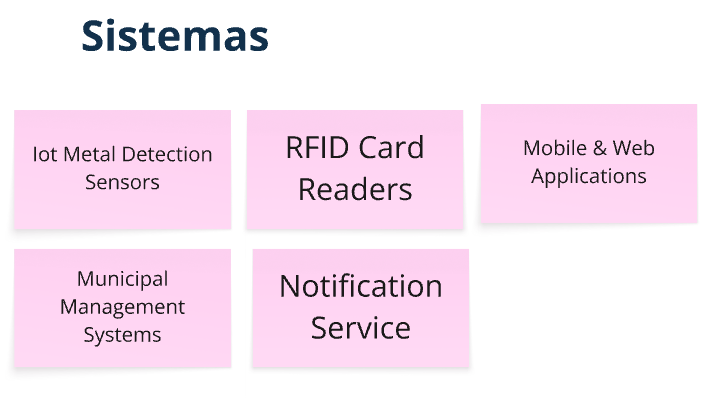
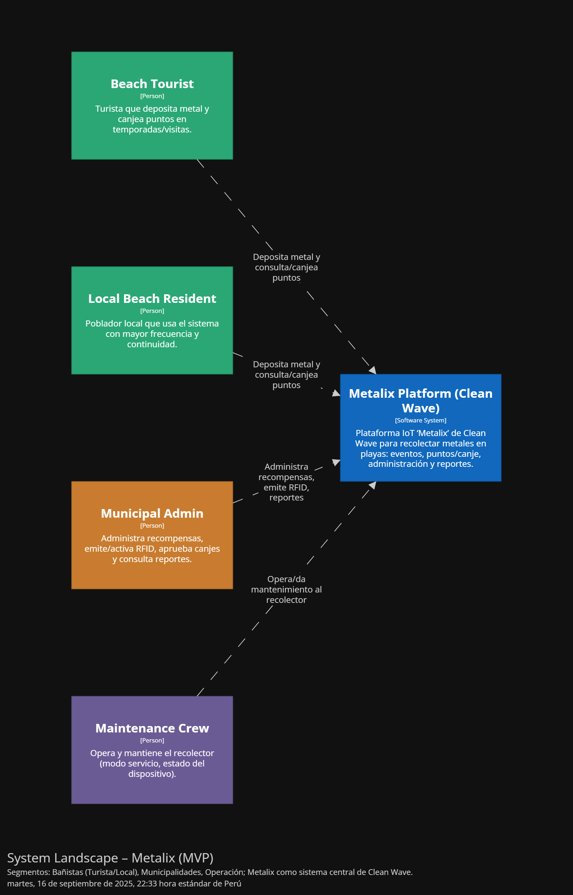
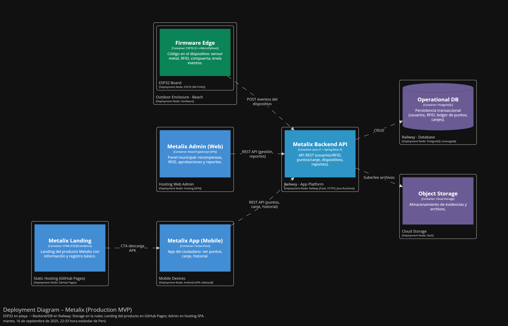

<h1 align="center"> Informe de Trabajo Final </h1>

<h3 align="center"> Universidad Peruana de Ciencias Aplicadas </h3>

<h3 align="center"> Ingeniería de Software </h3>

<h3 align="center">Ciclo 2025 - 2</h3>

  

<h1 align="center"> TB1 Report </h1>

<h3 align="center"> Docente: Vera Olivera, David Carlos </h3>

<h3 align="center"> 1ASI0572 - Desarrollo de Soluciones IoT </h3>

<h4 align="center"> NRC: 3355 </h4>

<h3> Startup: ------ </h3>

<h3> Product: ------ </h3>

<h3> Team Members: </h3>

| Member                              |    Code    |
| :---------------------------------- | :--------: |
| Roca Huapaya, Orlando Arturo        | U201919742 |
| Del Carmen Zorrilla, Ray Alessandro | U202124061 |
| Pardo Zapata, Gustavo Adolfo        | u202120347 |
| ##                                  |     ##     |
| ##                                  |     ##     |
| ##                                  |     ##     |

<h3 align="center">Agosto, 2025</h3>

  

# Registro de Versiones del Informe

  

# Project Report Collaboration Insights

  

# Contenido

## Tabla de Contenidos

### [Registro de versiones del informe](#registro-de-versiones-del-informe)

### [Project Report Collaboration Insights](#project-report-collaboration-insights)

### [Contenido](#contenido)

### [Student Outcome](#student-outcome-1)

### [Capítulo I: Introducción](#capítulo-i-introducción-1)

- [1.1. Startup Profile](#11-startup-profile)
  - [1.1.1. Descripción de la Startup](#111-descripción-de-la-startup)
  - [1.1.2. Perfiles de integrantes del equipo](#112-perfiles-de-integrantes-del-equipo)
- [1.2. Solution Profile](#12-solution-profile)
  - [1.2.1 Antecedentes y problemática](#121-antecedentes-y-problemática)
  - [1.2.2 Lean UX Process](#122-lean-ux-process)
    - [1.2.2.1. Lean UX Problem Statements](#1221-lean-ux-problem-statements)
    - [1.2.2.2. Lean UX Assumptions](#1222-lean-ux-assumptions)
    - [1.2.2.3. Lean UX Hypothesis Statements](#1223-lean-ux-hyphotesis-statements)
    - [1.2.2.4. Lean UX Canvas](#1224-lean-ux-canvas)
- [1.3. Segmentos objetivo](#13-segmentos-objetivo)

### [Capítulo II: Requirements Elicitation & Analysis](#capítulo-ii-requirements-elicitation--analysis-1)

- [2.1. Competidores](#21-competidores)
  - [2.1.1. Análisis competitivo](#211-análisis-competitivo)
  - [2.1.2. Estrategias y tácticas frente a competidores](#212-estrategias-y-tácticas-frente-a-competidores)
- [2.2. Entrevistas](#22-entrevistas)
  - [2.2.1. Diseño de entrevistas](#221-diseño-de-entrevistas)
  - [2.2.2. Registro de entrevistas](#222-registro-de-entrevistas)
  - [2.2.3. Análisis de entrevistas](#223-análisis-de-entrevistas)
- [2.3. Needfinding](#23-needfinding)
  - [2.3.1. User Personas](#231-user-personas)
  - [2.3.2. User Task Matrix](#232-user-task-matrix)
  - [2.3.3. User Journey Mapping](#233-user-journey-mapping)
  - [2.3.4. Empathy Mapping](#234-empathy-mapping)
  - [2.3.5. As-is Scenario Mapping](#235-as-is-scenario-mapping)
- [2.4. Ubiquitous Language](#24-ubiquitous-language)

### [Capítulo III: Requirements Specification](#capítulo-iii-requirements-specification-1)

- [3.1. To-Be Scenario Mapping](#31-to-be-scenario-mapping)
- [3.2. User Stories](#32-user-stories)
- [3.3. Impact mapping](#33-impact-mapping)
- [3.4. Product Backlog](#34-product-backlog)

### [Capítulo IV: Solutions Software Design](#capítulo-iv-solution-software-design)

- [4.1. Strategic-Level Domain-Driven Design](#41-strategic-level-domain-driven-design)
  - [4.1.1. EventStorming](#411-eventstorming)
    - [4.1.1.1. Candidate Context Discovery](#4111-candidate-context-discovery)
    - [4.1.1.2. Domain Message Flows Modeling](#4112-domain-message-flows-modeling)
    - [4.1.1.3. Bounded COntext Canvases](#4113-bounded-context-canvases)
  - [4.1.2. Context Mapping](#412-context-mapping)
  - [4.1.3. Software Architecture](#413-software-architecture)
    - [4.1.3.1. Software Architecture System Landscape Diagram](#4131-software-architecture-system-landscape-diagram)
    - [4.1.3.2. Software Architecture Context Level Diagrams](#4132-software-architecture-context-level-diagrams)
    - [4.1.3.3. Software Architecture Container Level Diagrams](#4133-software-architecture-container-level-diagrams)
    - [4.1.3.4. Software Architecture Deployment Diagrams](#4134-software-architecture-deployment-diagrams)
- [4.2. Tactical-Level Domain-Driven Design](#42-tactical-level-domain-driven-design)
  - [4.2.X. Bounded Context: <Bounded Context name>](#42x-bounded-context)
    - [4.2.X.1. Domain Layer](#42x1-domain-layer)
    - [4.2.X.2. Interface Layer](#42x2-interface-context)
    - [4.2.X.3. Application Layer](#42x3-application-context)
    - [4.2.X.4. Infrastructure Layer](#42x4-infrastructure-context)
    - [4.2.X.5. Bounded Context Software Architecture Component Level Diagrams](#42x5-bounded-context-software-architecture-component-level-diagrams)
    - [4.2.X.6. Bounded Context Software Architecture Code Level Diagrams](#42x6-bounded-context-software-architecture-code-level-diagrams)
      - [4.2.X.6.1. Bounded Context Domain Layer Class Diagrams](#42x61-bounded-context-domain-layer-class-diagrams)
      - [4.2.X.6.2. Bounded Context Database Design Diagram](#42x62-bounded-context-database-design-diagram)

### [Capítulo V: Solution UI/UX Design](#capítulo-v-solutions-uiux-design)

- [5.1. Style Guidelines](#51-style-guidelines)
  - [5.1.1. General Style Guidelines](#511-general-style-guidelines)
  - [5.1.2. Web, Mobile and IoT Style Guidelines](#512-web-mobile-and-iot-style-guidelines)
- [5.2. Information Architecture](#52-information-architecture)
  - [5.2.1. Organization Systems](#521-organization-systems)
  - [5.2.2. Labeling Systems](#522-labeling-systems)
  - [5.2.3. SEO Tags and Meta Tags](#523-seo-tags-and-meta-tags)
  - [5.2.4. Searching Systems](#524-searching-systems)
  - [5.2.5. Navigation Systems](#525-navigation-systems)
- [5.3. Landing Page UI Design](#53-landing-page-ui-design)
  - [5.3.1. Landing Page Wireframe](#531-landing-page-wireframe)
  - [5.3.2. Landing Page Mock-up](#532-landing-page-mock-up)
- [5.4. Applications UX/UI Design](#54-web-applications-uxui-design)
  - [5.4.1. Applications Wireframes](#541-web-applications-wireframes)
  - [5.4.2. Applications Wireflow Diagrams](#542-web-applications-wireflow-diagrams)
  - [5.4.3. Applications Mock-ups](#543-web-applications-mock-ups)
  - [5.4.4. Applications User Flow Diagrams](#544-web-applications-user-flow-diagrams)
- [5.5. Aplications Prototyping](#55-applications-prototyping)

### [Capítulo VI: Product Implementation, Validation \& Deployment](#capítulo-vi-product-implementation-validation--deployment)

- [6.1. Software Configuration Management](#61-software-configuration-management)
  - [6.1.1. Software Development Environment Configuration](#611-software-development-environment-configuration)
  - [6.1.2. Source Code Management](#612-source-code-management)
  - [6.1.3. Source Code Style Guide \& Conventions](#613-source-code-style-guide--conventions)
  - [6.1.4. Software Deployment Configuration](#614-software-deployment-configuration)
- [6.2. Landing Page, Services \& Applications Implementation](#62-landing-page-services--applications-implementation)
  - [6.2.X. Sprint X](#62x-sprint-n)
    - [6.2.X.1. Sprint Planning 1](#62x1-sprint-planning-n)
    - [6.2.X.2. Sprint Backlog 1](#62x2-sprint-backlog-n)
    - [6.2.X.3. Development Evidence for Sprint Review](#62x3-development-evidence-for-sprint-review)
    - [6.2.X.4. Testing Suite Evidence for Sprint Review](#62x4-testing-suite-evidence-for-sprint-review)
    - [6.2.X.5. Execution Evidence for Sprint Review](#62x5-execution-evidence-for-sprint-review)
    - [6.2.X.6. Services Documentation Evidence for Sprint Review](#62x6-services-documentation-evidence-for-sprint-review)
    - [6.2.X.7. Software Deployment Evidence for Sprint Review](#62x7-software-deployment-evidence-for-sprint-review)
    - [6.2.X.8. Team Collaboration Insights during Sprint](#62x8-team-collaboration-insights-during-sprint)
- [6.3. Validation Interviews](#63-validation-interviews)
  - [6.3.1. Diseño de Entrevistas](#631-diseño-de-entrevistas)
  - [6.3.2. Registro de Entrevistas](#632-registro-de-entrevistas)
  - [6.3.3. Evaluaciones según heurísticas](#633-evaluaciones-según-heurísticas)
- [6.4. Video About-the-Product](#64-video-about-the-product)

### [Conclusiones](#conclusiones-1)

- [Conclusiones y recomendaciones](#conclusiones-y-recomendaciones)
- [Video About-the-Team](#video-about-the-team)

### [Bibliografía](#bibliografía-1)

### [Anexos](#anexos-1)

  

# Student Outcome

<b>ABET – EAC - Student Outcome 5:</b> La capacidad de funcionar efectivamente en un equipo cuyos miembros juntos proporcionan liderazgo, crean un entorno de colaboración e inclusivo, establecen objetivos, planifican tareas y cumplen objetivos.

  

# Capítulo I: Introducción

## 1.1. StartUp Profile

### 1.1.1. Descripción de la StartUp

ReciclaMar surge como una solución ante la creciente preocupación por la contaminación en playas urbanas del Perú. La presencia de residuos metálicos como latas y chapas deteriora la experiencia turística, eleva los costos de limpieza y pone en riesgo la seguridad de los visitantes. Al mismo tiempo, la falta de incentivos claros, la ausencia de trazabilidad y el uso de contenedores no inteligentes dificultan una gestión eficiente por parte de las municipalidades y limitan la participación ciudadana en el reciclaje.

ReciclaMar propone RIMP (Recolector Inteligente de Metales para Playas), un sistema IoT que valida automáticamente que el residuo sea metálico mediante un sensor, identifica al usuario con RFID y habilita la apertura de una compuerta para el depósito.desarrollamos una plataforma web y móvil que permite a las personas reciclar y acumular puntos por municipalidad para canjear en comercios aliados.

### 1.1.2. Perfiles de integrantes del equipo

| Foto | Apellidos y Nombres | Código | Carrera | Conocimientos y contribución principal |
|---|---|---:|---|---|
|  | **Roca Huapaya, Orlando Arturo** | u201919742 | Ingeniería de Software | Mi contribución al equipo es la experiencia que tengo desarrollando interfaces en React o Vue y servicios de APIs REST en Spring Boot o Laravel. Me enfoco en que el producto sea usable, estable y fácil de desplegar. Además, priorizaré el uso de buenas prácticas en el ciclo de desarrollo del software. |
|  | **Pardo Zapata, Gustavo Adolfo** | u202120347 | Ingeniería de Software  | Soy proactivo, colaborativo, organizado,responsable y con habilidades de resolución de problemas.Tengo una excelente capacidad para comunicarme de manera efectiva y clara con los demás miembros de mi equipo y deseo colaborar en todo lo posible con mis demás compañeros en este trabajo. Cuento con conocimiento en JavaScript, Java, Python, C# y SQL.  |
| *(colocar foto)* | **Integrante 3** | [por completar] | [carrera] |  |
| *(colocar foto)* | **Integrante 4** | [por completar] | [carrera] |  |
| *(colocar foto)* | **Integrante 5** | [por completar] | [carrera] |  |
| *(colocar foto)* | **Integrante 6** | [por completar] | [carrera] |  |

## 1.2. Solution Profile

### 1.2.1. Antecedentes y problemática
En las playas de Lima persiste la acumulación de residuos metálicos como latas, tapas y chapas que deteriora la experiencia turística, eleva costos de limpieza y genera riesgos para la salud. Según DIGESA reportó en el verano 2024 que de 131 playas vigiladas, 89 eran “no saludables” principalmente por limpieza y presencia de residuos sólidos, lo que evidencia la magnitud del problema. La solución propuesta, para el reciclaje de metales debe verificar automáticamente que el residuo sea metálico y abrir una compuerta segura para evitar fraudes, también identificar al usuario vía RFID para asignar puntos por municipalidad y habilitar canjes en comercios aliados. El objetivo es incrementar la tasa de reciclaje de metal en temporada alta, recuperar mayor volumen por playa y reducir tiempos y costos de recolección. El alcance y restricciones del piloto se delimitan a 1 o 3 playas de Lima, enfocarnos exclusivamente en el reciclaje de metales en la versión inicial, recompensas gestionadas por cada municipalidad o comercio.

#### 5W + 2H

##### What (¿qué?)
Acumulación de residuos metálicos en arena como latas, tapas y chapas, esto afecta salubridad y operación municipal en las playas.

##### When (¿cuándo?)
Todo el año, con picos en temporada de verano y fines de semana.

##### Where (¿dónde?)
Playas de Lima, áreas de alto tránsito donde se han medido y caracterizado residuos, incluyendo metálicos peligrosos.

##### Who (¿quiénes?)
Bañistas y municipalidades.

##### Why (¿por qué?)
Infraestructura de residuos insuficiente e ineficientes, falta de incentivos que vincule el acto de reciclar con beneficios y datos útiles para gestión.

##### How (¿cómo sucede?)
Los visitantes consumen bebidas y dejan latas o chapas en la arena. El estudio de Villacorta-Córdova et al. (2021), publicado en la Revista Científica UNJFSC, evidenció en cuatro playas de la Costa Verde la presencia de 55 objetos metálicos, principalmente latas oxidadas y punzantes en zonas de bañistas, lo que confirma el riesgo para la salud y la convivencia de metales en las playas.
##### How much (¿cuánto?)

- 89 playas “no saludables” al inicio de verano 2024, principalmente por residuos sólidos en arena.

- En las playas de la Costa Verde se encontraron 55 ítems metálicos, 42% fueron latas de bebidas.

### 1.2.2. Lean UX Process

#### 1.2.2.1. Lean UX Problem Statements

Ante esta situación nuestra Startup se plantea las siguientes Problem Statements:

**PS1:**  
- **Objetivos actuales del producto:** Mantener las playas seguras para el disfrute turístico y recreativo.  
- **Problema:** Los bañistas enfrentan constantemente playas con residuos metálicos como latas, tapas y chapas, lo que genera riesgos de cortes, incomodidad y reduce la calidad de la experiencia turística. Actualmente, no existe un sistema que valide los materiales ni incentive a los usuarios a reciclar.  
- **Pregunta solicitud de mejora:** ¿Cómo podemos diseñar un recolector inteligente que valide automáticamente el residuo metálico, identifique al usuario y entregue recompensas inmediatas, incentivando así la participación activa de los bañistas en la limpieza de las playas?  

**PS2:**  
- **Objetivos actuales del producto:** Garantizar la salubridad de las playas, optimizar la recolección de residuos y reducir costos de limpieza.  
- **Problema:** Las municipalidades gastan recursos elevados en limpieza manual de playas sin contar con datos en tiempo real ni mecanismos de trazabilidad. Esto dificulta la toma de decisiones y el control de rutas de recolección.  
- **Pregunta solicitud de mejora:** ¿Cómo podemos proveer a las municipalidades de un sistema IoT que registre en tiempo real los residuos recolectados, emita alertas de llenado y entregue KPIs útiles para planificar rutas y evaluar el impacto ambiental y económico?

#### 1.2.2.2. Lean UX Assumptions

**Business Outcomes**
- Aumentar la tasa de reciclaje de metales en playas urbanas de Lima y el volumen recuperado por playa.
- Reducir tiempo y costo de limpieza municipal mediante telemetría y alertas de llenado.
- Conseguir acuerdos con comercios locales para sostener el sistema de canjes y mejorar la adopción.
- Lograr pilotos con 1 o 3 playas por municipio.
- Generar datos confiables como kg y usos, para reportes y toma de decisiones.

**User Assumptions (sobre los usuarios)**
- Bañistas reciclarán si el proceso es rápido, seguro y reciben beneficios inmediatos.
- Aceptarán usar tarjeta RFID si el registro toma menos de 1 minuto y no solicita datos sensibles.
- Municipalidades adoptarán la solución si muestra ahorros operativos y KPIs claros.

**User Outcomes (lo que experimentan/ganan)**
- Los bañistas depositan sus latas en segundos, reciben puntos y visualizan sus resultados desde la app.
- Las municipalidades evidencian mejoras de salubridad con métricas.
- Los operadores reducen tiempos de recolección.

**Feature Assumptions (sobre funcionalidades)**
- Sensor inductivo valida metal con baja tasa de falsos positivos y abre compuerta.
- RFID identifica al usuario y permite la recolección de puntos y canjes en comercios aliados.
- Dashboard municipal con métricas, KPIs y alertas de llenado.
- App web y móvil para registro, puntaje y catálogo de canjes.
- Arquitectura Edge con opción de energía solar para continuidad operativa.

#### 1.2.2.3. Lean UX Hyphotesis Statements

- Creemos que aumentaremos la tasa de reciclaje de metales y el volumen recuperado por playa (business outcome) si los bañistas (user) pueden depositar sus latas en segundos y reciben puntos inmediatos (benefit) con sensor inductivo, compuerta y RFID de registro en menos de 1 minuto (feature).

  Sabremos que hemos tenido éxito 
  
  Cuando al menos el 40% de usuarios registrados realicen mas de 2 depósitos por semana en temporada alta.

- Creemos que incrementaremos la adopción de la app y los canjes (business outcome)  
si los bañistas (user) visualizan sus puntos y un catálogo de canjes locales claro (benefit)  
con la app web o móvil y validación de canje en comercios aliados (feature).  

  Sabremos que hemos tenido éxito.

  Cuando la tasa de canje mensual sea mayor o igual al 30% de usuarios activos y se registren mas de 50 canjes por mes.

- Creemos que mejoraremos la satisfacción y la confianza en el sistema (business outcome) si los bañistas (user) perciben que su reciclaje es trazable y antifraude (benefit) con RFID personal, historial en la app y validación de metal antes de abrir la compuerta (feature).

  Sabremos que hemos tenido éxito 

  Cuando 8 de cada 10 usuarios se declaren seguros o muy seguros, y los eventos inválidos no excedan el 5%

- Creemos que reduciremos tiempo y costo de limpieza (business outcome)  
si las municipalidades (user) reciben alertas de llenado para planificar rutas (benefit)  
con dashboard municipal (feature).

  Sabremos que hemos tenido éxito. 

  Cuando el tiempo promedio por ruta baje más del 20% y el costo operativo por tonelada baje más del 15% durante 8 semanas de piloto.

- Creemos que fortaleceremos la planificación y la transparencia (business outcome)  
si las municipalidades (user) confían en KPIs trazables (benefit)  
con latencia de datos menor de 5 minutos (feature).  

  Sabremos que hemos tenido éxito

  Cuando el dashboard sea consultado semanalmente y se realice más de 1 ajuste de ruta por semana basado en los KPIs.

- Creemos que atraeremos comercios locales (business outcome)  
si las municipalidades (user) observan ahorros operativos y evidencia de canjes (benefit)  
con acuerdos de canjes activos (feature).  

  Sabremos que hemos tenido éxito 

  cuando logremos mas de 10 comercios aliados y mas de 50 canjes por mes en el piloto.

#### 1.2.2.4. Lean UX Canvas

## 1.3. Segmentos objetivo

# Capítulo II: Requirements Elicitation & Analysis

## 2.1. Competidores

### 2.1.1. Análisis competitivo

### 2.1.2. Estrategias y tácticas frente a competidores

## 2.2. Entrevistas

### 2.2.1. Diseño de entrevistas

### 2.2.2. Registro de entrevistas

### 2.2.3. Análisis de entrevistas

## 2.3. Needfinding

### 2.3.1. User Personas

### 2.3.2. User Task Matrix

### 2.3.3. User Journey Mapping

### 2.3.4. Empathy Mapping

### 2.3.5. As-Is Scenario Mapping

## 2.4. Ubiquitous Language

# Capítulo III: Requirements Specification

## 3.1. To-Be Scenario Mapping

## 3.2. User Stories

## 3.3. Impact mapping

## 3.4. Product Backlog

# Capítulo IV: Solution Software Design

# Capítulo IV: Solution Software Design

## 4.1. Strategic-Level Domain-Driven Design
En nuestro equipo, abordamos las decisiones estratégicas utilizando Domain-Driven Design (DDD) para asegurarnos de que comprendemos a fondo el dominio y sus complejidades relacionadas con la gestión automatizada de residuos metálicos y el sistema de recompensas municipales. Aplicamos Event Storming como primera herramienta, lo que nos permitió identificar juntos los eventos clave dentro del sistema y visualizar cómo fluye la información y las interacciones en el negocio de reciclaje inteligente.

Después, utilizamos el Bounded Context Canvas para definir claramente los límites de cada contexto dentro del dominio. Esto nos ayudó a organizar las responsabilidades y asegurar que cada parte del sistema estuviera alineada tanto con la visión de negocio como con las capacidades técnicas. Gracias a estas herramientas, pudimos tomar decisiones estratégicas más informadas y coherentes, asegurando que el desarrollo estuviera bien fundamentado en las necesidades reales del negocio de gestión de residuos y recompensas.
### 4.1.1. EventStorming
Event Storming es una herramienta que nos permite descubrir el comportamiento de un negocio, recopilando eventos importantes del negocio, los actores principales, servicios de terceros y otros. Para la implementación de esta sección se realizaron entrevistas correspondientes a los segmentos objetivos (ciudadanos, municipalidades y administradores), de esta manera pudimos identificar los eventos principales relacionados con la recolección de residuos metálicos, identificación de usuarios, gestión de recompensas y desarrollar un entendimiento común.

Aquí mostramos los pasos respectivos para la elaboración correcta del Event Storming realizada en la herramienta de Miro.

<b>Enlace al Miro:</b>
  <a href="https://miro.com/app/board/uXjVI_LnCNw=/?share_link_id=408756915917">EventStorming</a>

**Step 1: Unstructured Exploration**

En esta sección se realizó una lluvia de ideas de los eventos del dominio relacionados con el sistema de gestión inteligente de residuos metálicos que se está explorando. Nos permitió identificar los eventos clave como: WasteCollected, UserAuthenticated, MetallicResidueValidated, PointsEarned, RewardClaimed, BenefitDefined, ReportGenerated, entre otros, y las interacciones entre ellos.

**Step 2: Timelines**

En esta sección, los eventos identificados previamente, son agrupados en subgrupos lo cual tiene como líder al evento principal (es quien encapsula la funcionalidad principal del grupo). Estos eventos comienzan con el flujo que describe el escenario empresarial exitoso (Happy path) relacionado con la recolección de residuos, validación de usuarios, asignación de puntos y canje de recompensas, así como también escenarios alternativos cuando hay fallos en la validación o problemas técnicos.

**Step 3: Paint Points**

Durante esta fase, identificamos puntos problemáticos o (Pain Points) que son áreas donde los usuarios pueden obtener dificultades al momento de realizar una respectiva funcionalidad en la aplicación. Estos puntos incluyen problemas con la validación RFID, fallos en los sensores de detección metálica, demoras en la asignación de puntos, y dificultades en el proceso de canje de recompensas. Estos puntos son importantes para mejorar la experiencia de usuario e implementar una aplicación eficiente.

**Step 4: Pivotal Points**

En esta fase, nos enfocamos en identificar los puntos cruciales dentro del flujo del negocio de gestión de residuos, los cuales tienen un impacto significativo en la operatividad del sistema o el comportamiento del usuario. Estos puntos incluyen la validación exitosa de residuos metálicos, la correcta identificación del usuario vía RFID, y la confirmación del canje de recompensas. Estos puntos nos ayudan a priorizar qué áreas deben ser optimizadas o revisadas con mayor detalle.

**Step 5: Commands**

Los comandos representan acciones que los actores del sistema pueden ejecutar. Durante este paso, mapeamos qué acciones desencadenan los eventos clave dentro del sistema: ValidateWaste, AuthenticateUser, AssignPoints, ClaimReward, DefineBenefit, GenerateReport, y qué actores (ciudadanos, administradores municipales, sistema IoT) son responsables de ejecutarlas.

**Step 6: Policies**

En este paso, se identifican las políticas, que son reglas de negocio o condiciones que deben cumplirse para que un comando pueda ser ejecutado o un evento pueda suceder. Las políticas incluyen: "Solo se asignan puntos si el residuo es validado como metálico", "Cada usuario debe tener una tarjeta RFID única", "Los beneficios son definidos por cada municipio", "Los reportes se actualizan periódicamente".

**Step 7: Read Models**

Los Read Models son vistas del estado del sistema, generalmente optimizadas para la consulta por parte de los usuarios o procesos. Durante este paso, definimos qué información necesita ser accesible: estado de puntos del usuario, historial de recolección, beneficios disponibles, métricas de impacto ambiental, y reportes de actividad municipal.

**Step 8: External Systems**
En esta fase, identificamos los sistemas externos que interactúan con nuestro dominio: sistemas de sensores IoT para detección de metales, lectores RFID, plataformas de pago para recompensas, sistemas municipales de gestión, y servicios de notificación. Es crucial entender cómo estos sistemas externos afectan los flujos de recolección y recompensas.

**Step 9: Aggregates**

En este último paso, agrupamos los eventos y comandos que pertenecen a un agregado específico: Waste Collection Aggregate, User Identity Aggregate, Reward Management Aggregate, Municipal Agreement Aggregate, y Reporting Aggregate, para garantizar que todas las operaciones dentro de un contexto estén alineadas y mantengan la consistencia del sistema.

#### 4.1.1.1. Candidate Context Discovery

Nuestro equipo decidió usar la técnica start-with-value ya que empezamos a identificar la esencia del negocio de gestión inteligente de residuos metálicos, lo cual es importante para tener una mejor proyección a futuro del negocio sostenible.

**Identificación de Valores del Negocio:**
Analizamos los valores clave del negocio relacionados con la gestión automatizada de recolección de residuos metálicos, el sistema de recompensas ciudadanas, y la administración municipal de beneficios. Estas áreas son fundamentales para mejorar la eficiencia operativa en la gestión de recursos (como la recolección selectiva de metales) y para garantizar que los ciudadanos tengan acceso a un sistema de incentivos efectivo que promueva el reciclaje.

**Identificación de funcionalidades:**
A partir de los valores identificados, nos enfocamos en las funcionalidades más críticas: gestión de identidad y autenticación de usuarios, recolección y validación de residuos metálicos, sistema de puntos y recompensas, administración de beneficios municipales, generación de reportes e impacto ambiental, y monitoreo del sistema.

**Priorización de contextos:**
Priorizar los bounded contexts, nos permite identificar situaciones primordiales que se deben lograr de manera pronta. Además, priorizar los bounded contexts, ayuda a priorizar el core del negocio los cuales son esenciales para el desarrollo de la solución de reciclaje inteligente.

**Identificamos 6 Bounded Contexts:**

- Identity & Access Management
- Waste Collection
- User Identification
- Reward Management
- Municipality Management
- Monitoring & Reporting

**Bounded Context Identity & Access Management:**

**Bounded Context Waste Collection:**

**Bounded Context User Identification:**

**Bounded Context Reward Management:**

**Bounded Context Municipality Management:**

**Bounded Context Monitoring & Reporting:**

**Visión General de los Bounded Contexts:**

#### 4.1.1.2. Domain Message Flows Modeling

En esta sección, se describe el proceso utilizado para visualizar la interacción entre los diferentes bounded contexts que conforman el sistema de gestión inteligente de residuos. El objetivo principal es entender cómo estos contextos colaboran para resolver los casos de uso del negocio de reciclaje y satisfacer las necesidades de los ciudadanos y municipalidades. Para lograr esto, se aplicó la técnica de Domain Storytelling, que facilita la representación gráfica de los flujos de mensajes entre actores, contextos y sistemas, permitiendo identificar claramente las responsabilidades y los puntos de comunicación entre cada componente del dominio.

**Scenario: User Authentication**

En este escenario, se describe el proceso de autenticación de usuario en el sistema. El ciudadano interactúa con el contexto de Identity & Access Management para autenticarse y acceder a las funcionalidades de la plataforma de reciclaje.

**Scenario: Waste Collection Process**

En este escenario, se describe el proceso completo de recolección de residuos metálicos. El ciudadano interactúa con los contextos de User Identification y Waste Collection para depositar residuos metálicos y ser identificado mediante su tarjeta RFID.

**Scenario: Reward Points Assignment**

En este escenario, se describe el proceso de asignación de puntos de recompensa. Tras la validación exitosa del residuo metálico y la identificación del usuario, el contexto de Reward Management asigna puntos al usuario basado en las reglas definidas.

**Scenario: Benefit Redemption**

En este escenario, se describe el proceso de canje de beneficios municipales. El ciudadano interactúa con los contextos de Reward Management y Municipality Management para canjear sus puntos por beneficios definidos por su municipio.

**Scenario: Generate Impact Report**

En este escenario, se describe el proceso de generación de reportes de impacto ambiental. Los administradores municipales interactúan con el contexto de Monitoring & Reporting para visualizar métricas de recolección, impacto ambiental y participación ciudadana.

   
#### 4.1.1.3. Bounded Context Canvases

En esta sección, se detallan los pasos seguidos por el equipo para diseñar los bounded contexts identificados durante el proceso. El diseño de los bounded contexts fue iterativo, asegurando que cada contexto refleje de manera precisa los criterios de diseño y el conocimiento del dominio de gestión de residuos metálicos. Para cada bounded context, se siguieron los siguientes pasos clave:

**Context Overview Definition:** Se definió el propósito y los límites de cada bounded context, alineándolos con el dominio del negocio de reciclaje inteligente.

**Business Rules Distillation & Ubiquitous Language Capture:** Se identificaron las reglas de negocio clave relacionadas con la gestión de residuos, recompensas y administración municipal, capturando el lenguaje ubicuo para una comunicación clara entre el equipo.

**Capability Analysis:** Se analizaron las capacidades que cada bounded context debe ofrecer para el sistema de reciclaje.

**Capability Layering:** Se aplicó la separación en capas de capacidades cuando fue necesario.

**Dependencies Capture:** Se identificaron las dependencias con otros bounded contexts y sistemas externos como sensores IoT y lectores RFID.

**Design Critique:** Se revisó el diseño para asegurar un desacoplamiento adecuado y alineación con los objetivos del negocio sostenible.

**Bounded Context Canvas Identity & Access Management:**

- **Propósito del Contexto:** Gestionar autenticación, autorización y seguridad del sistema
- **Responsabilidad:** Autenticar y autorizar usuarios del sistema
- **Lenguaje Ubicuo:** Usuario, Credencial, Token, Rol, Permiso, Autenticación
- **Reglas de negocio:** Los tokens de acceso tienen tiempo de expiración; Los usuarios deben autenticarse antes de acceder a funcionalidades; Diferentes roles tienen diferentes niveles de acceso
- **Dependencias:** User Identification Context (para validar identidad de usuarios finales)

**Bounded Context Canvas Waste Collection:**

- **Propósito del Contexto:** Gestionar la recolección, validación y procesamiento de residuos metálicos
- **Responsabilidad:** Validar y recolectar residuos metálicos
- **Lenguaje Ubicuo:** Residuo, Validación, Sensor, Actuador, Material Metálico
- **Reglas de negocio:** Solo se acepta para la compuerta si el material es metálico; La validación debe ser confirmada por sensores IoT
- **Dependencias:** User Identification Context

**Bounded Context Canvas User Identification:**

- **Propósito del Contexto:** Identificar usuarios mediante RFID y gestionar perfiles de ciudadanos
- **Responsabilidad:** Identificar usuarios mediante RFID
- **Lenguaje Ubicuo:** Usuario, Tarjeta RFID, Registro, Perfil
- **Reglas de negocio:** Cada usuario posee una tarjeta única; La tarjeta RFID debe estar activa y registrada
- **Dependencias:** Reward Management Context

**Bounded Context Canvas Reward Management:**

- **Propósito del Contexto:** Gestionar sistema de puntos y recompensas para incentivar el reciclaje
- **Responsabilidad:** Gestionar puntos y recompensas
- **Lenguaje Ubicuo:** Puntos, Canje, Recompensa, Beneficio
- **Reglas de negocio:** Los puntos sólo se asignan tras validar residuo y usuario; Los puntos tienen fecha de expiración
- **Dependencias:** Municipality Management Context

**Bounded Context Canvas Municipality Management:**

- **Propósito del Contexto:** Gestionar convenios y administración de beneficios municipales
- **Responsabilidad:** Gestionar convenios y administración de beneficios
- **Lenguaje Ubicuo:** Municipio, Beneficio, Convenio, Administración
- **Reglas de negocio:** Cada municipio define sus propios beneficios; Los convenios deben ser renovados periódicamente
- **Dependencias:** Ninguna (contexto independiente)

**Bounded Context Canvas Monitoring & Reporting:**

- **Propósito del Contexto:** Generar métricas e informes del sistema de reciclaje
- **Responsabilidad:** Generar métricas e informes
- **Lenguaje Ubicuo:** Reporte, Impacto, Estadística, Métrica Ambiental
- **Reglas de negocio:** Los reportes deben actualizarse periódicamente; Las métricas deben reflejar el impacto ambiental real
- **Dependencias:** Todos los demás contextos (para recopilar datos)

### 4.1.2 Context mapping

En esta sección, se analizan las relaciones entre los bounded contexts identificados y se asignan patrones de context mapping adecuados para cada uno:

**Customer/Supplier**

**Descripción:** En esta relación, un contexto actúa como Cliente (Customer) y otro como Proveedor (Supplier). El contexto Cliente necesita servicios o datos del contexto Proveedor. Esta relación establece una dependencia directa donde el proveedor suministra información o servicios que el cliente necesita para funcionar adecuadamente en el sistema de reciclaje.

- **"Waste Collection"** es Cliente de "User Identification". En este caso, "User Identification" proporciona datos de validación de usuarios a "Waste Collection" para confirmar la identidad antes de procesar residuos.
- **"Reward Management"** es Cliente de "User Identification" y "Municipality Management". "User Identification" proporciona datos de usuario para asignar puntos, mientras que "Municipality Management" provee información sobre beneficios disponibles.

**Open/Host Service (OHS)**

**Descripción:** En este patrón, un contexto expone un servicio bien definido que otros contextos pueden consumir sin tener que conocer o interactuar con la lógica interna de ese contexto. Este patrón es útil para integrar sistemas o contextos que necesitan acceder a servicios comunes, como autenticación, permisos o servicios de identificación.

- El contexto **"Identity & Access Management"** (Host) expone servicios de autenticación y autorización para todos los demás contextos del sistema de reciclaje.

**Conformist**

**Descripción:** En este patrón, un contexto downstream adopta completamente el modelo del contexto upstream, sin traducción o adaptación. El contexto downstream se conforma al modelo y las interfaces del contexto upstream.

- El contexto **"Monitoring & Reporting"** actúa como Conformist respecto a todos los demás contextos. Se adapta a los modelos de datos de "Waste Collection", "User Identification", "Reward Management", y "Municipality Management" para generar reportes consolidados.

**Shared Kernel**

**Descripción:** Este patrón se utiliza cuando dos contextos comparten un subconjunto común de su modelo de dominio. Los contextos que participan en un Shared Kernel deben coordinarse estrechamente para mantener la coherencia del modelo compartido.

- **"Identity & Access Management"** y **"User Identification"** comparten un Shared Kernel relacionado con la información básica de identidad del usuario y estados de autenticación.

**Context Mapping Diagram**

El diagrama muestra claramente cómo los seis bounded contexts interactúan entre sí, con Identity & Access Management como el proveedor central de servicios de seguridad, User Identification como el núcleo de identificación de ciudadanos, Waste Collection como el procesador central de residuos, Reward Management como el gestor de incentivos, Municipality Management como el definidor de políticas de beneficios, y Monitoring & Reporting como el consumidor de datos para análisis e informes del sistema de reciclaje inteligente.

### 4.1.3. Software Architecture

#### 4.1.3.1. Software Architecture System Landscape Diagram

> Muestra la visión general del ecosistema de ReciclaMar, con la plataforma RIMP como sistema central y los actores principales.   

---

#### 4.1.3.2. Software Architecture Context Level Diagrams

> Representa a RIMP como caja negra y cómo interactúan los segmentos: bañistas, municipalidades y mantenimiento.   

---

#### 4.1.3.3. Software Architecture Container Level Diagrams

> Descompone RIMP en sus aplicaciones y servicios: App móvil (Flutter), Web Admin (React), Backend (Spring Boot), DB, Storage y Firmware (ESP32).  

---

#### 4.1.3.4. Software Architecture Deployment Diagrams

> Muestra dónde se despliegan los contenedores: ESP32 en playa, Backend/DB en Railway, Landing en GitHub Pages, Web Admin en hosting SPA y App móvil en Android.  

## 4.2. Tactical-Level Domain-Driven Design

# 4.2. Tactical-Level Domain-Driven Design

## 4.2.1. Bounded Context: IAM

### 4.2.1.1. Domain Layer

**Entidades:**
- **User**: Entidad raíz que representa los datos de autenticación de un usuario del sistema IoT
  - Atributos: id, username, password, email, role, isActive, createdAt, updatedAt
  - Métodos: authenticate(), changePassword(), isActive(), updateLastLogin()

**Value Objects:**
- **Username**: Representa el nombre de usuario único
- **Password**: Representa la contraseña encriptada
- **Role**: Enumera los roles disponibles (CITIZEN, MUNICIPALITY_ADMIN, SYSTEM_ADMIN, COLLECTOR)

**Servicios de Dominio:**
- **AuthenticationService**: Maneja la lógica de autenticación
- **PasswordService**: Gestiona el cifrado y validación de contraseñas

**Repositorios:**
- **UserRepository**: Interfaz para persistencia de usuarios

### 4.2.1.2. Interface Layer

**Controladores:**
- **AuthController**: Maneja endpoints de autenticación
  - POST /api/v1/auth/login
  - POST /api/v1/auth/register
  - POST /api/v1/auth/logout
  - POST /api/v1/auth/refresh

**DTOs:**
- **LoginRequest**: Datos de inicio de sesión
- **RegisterRequest**: Datos de registro
- **AuthResponse**: Respuesta con token y datos del usuario

### 4.2.1.3. Application Layer

**Casos de Uso:**
- **LoginUseCase**: Procesa el inicio de sesión
- **RegisterUseCase**: Procesa el registro de usuarios
- **RefreshTokenUseCase**: Renueva tokens de acceso

**Servicios de Aplicación:**
- **AuthApplicationService**: Orquesta los casos de uso de autenticación

### 4.2.1.4. Infrastructure Layer

**Implementaciones:**
- **JpaUserRepository**: Implementación JPA del repositorio de usuarios
- **JwtTokenService**: Servicio para manejo de tokens JWT
- **BCryptPasswordEncoder**: Implementación de cifrado de contraseñas

### 4.2.1.5. Bounded Context Software Architecture Component Level Diagrams

### 4.2.1.6. Bounded Context Software Architecture Code Level Diagrams

#### 4.2.1.6.1. Bounded Context Domain Layer Class Diagrams

#### 4.2.1.6.2. Bounded Context Database Design Diagram

## 4.2.2. Bounded Context: WasteCollection

### 4.2.2.1. Domain Layer

**Entidades:**
- **WasteBin**: Entidad raíz que representa un contenedor de residuos inteligente
  - Atributos: id, location, capacity, currentLevel, sensorId, status, lastEmptied, municipalityId
  - Métodos: updateLevel(), markAsEmpty(), needsCollection(), calculateFillPercentage()

- **CollectionRoute**: Representa una ruta de recolección optimizada
  - Atributos: id, collectorId, wasteBins, estimatedTime, status, createdAt
  - Métodos: addWasteBin(), removeWasteBin(), optimize(), complete()

- **CollectionRecord**: Registro de recolección realizada
  - Atributos: id, wasteBinId, collectorId, collectedAt, volumeCollected, wasteType
  - Métodos: validate(), calculateReward()

**Value Objects:**
- **Location**: Coordenadas geográficas (latitud, longitud)
- **WasteLevel**: Nivel de llenado del contenedor (0-100%)
- **WasteType**: Tipo de residuo (ORGANIC, RECYCLABLE, GENERAL)

**Servicios de Dominio:**
- **RouteOptimizationService**: Optimiza rutas de recolección
- **CollectionSchedulingService**: Programa recolecciones basadas en niveles

**Repositorios:**
- **WasteBinRepository**: Interfaz para persistencia de contenedores
- **CollectionRouteRepository**: Interfaz para persistencia de rutas
- **CollectionRecordRepository**: Interfaz para persistencia de registros

### 4.2.2.2. Interface Layer

**Controladores:**
- **WasteBinController**: Maneja endpoints de contenedores
  - GET /api/v1/waste-bins
  - GET /api/v1/waste-bins/{id}
  - PUT /api/v1/waste-bins/{id}/level
  - GET /api/v1/waste-bins/needs-collection

- **CollectionController**: Maneja endpoints de recolección
  - POST /api/v1/collections/routes
  - GET /api/v1/collections/routes/{id}
  - PUT /api/v1/collections/routes/{id}/complete
  - POST /api/v1/collections/records

**DTOs:**
- **WasteBinResponse**: Respuesta con datos del contenedor
- **UpdateLevelRequest**: Datos para actualizar nivel
- **CollectionRouteRequest**: Datos para crear ruta
- **CollectionRecordRequest**: Datos para registrar recolección

### 4.2.2.3. Application Layer

**Casos de Uso:**
- **UpdateWasteLevelUseCase**: Actualiza nivel de contenedor
- **GenerateCollectionRouteUseCase**: Genera ruta optimizada
- **RecordCollectionUseCase**: Registra recolección realizada
- **GetWasteBinsNeedingCollectionUseCase**: Obtiene contenedores que necesitan recolección

**Servicios de Aplicación:**
- **WasteCollectionApplicationService**: Orquesta los casos de uso de recolección

### 4.2.2.4. Infrastructure Layer

**Implementaciones:**
- **JpaWasteBinRepository**: Implementación JPA del repositorio de contenedores
- **JpaCollectionRouteRepository**: Implementación JPA del repositorio de rutas
- **JpaCollectionRecordRepository**: Implementación JPA del repositorio de registros
- **IoTSensorService**: Servicio para comunicación con sensores IoT
- **MapsApiService**: Servicio para optimización de rutas usando APIs de mapas

### 4.2.2.5. Bounded Context Software Architecture Component Level Diagrams

### 4.2.2.6. Bounded Context Software Architecture Code Level Diagrams

#### 4.2.2.6.1. Bounded Context Domain Layer Class Diagrams

#### 4.2.2.6.2. Bounded Context Database Design Diagram

## 4.2.3. Bounded Context: UserIdentification

### 4.2.3.1. Domain Layer

**Entidades:**
- **Citizen**: Entidad raíz que representa un ciudadano registrado
  - Atributos: id, dni, firstName, lastName, email, phone, address, municipalityId, isVerified
  - Métodos: verify(), updateProfile(), isActive(), getFullName()

- **IdentificationDevice**: Dispositivo para identificación (QR, NFC, etc.)
  - Atributos: id, deviceType, deviceId, citizenId, isActive, lastUsed
  - Métodos: activate(), deactivate(), updateLastUsed()

**Value Objects:**
- **DNI**: Documento Nacional de Identidad
- **Address**: Dirección completa del ciudadano
- **DeviceType**: Tipo de dispositivo (QR_CODE, NFC_CARD, MOBILE_APP)

**Servicios de Dominio:**
- **CitizenVerificationService**: Verifica identidad de ciudadanos
- **DeviceRegistrationService**: Registra dispositivos de identificación

**Repositorios:**
- **CitizenRepository**: Interfaz para persistencia de ciudadanos
- **IdentificationDeviceRepository**: Interfaz para persistencia de dispositivos

### 4.2.3.2. Interface Layer

**Controladores:**
- **CitizenController**: Maneja endpoints de ciudadanos
  - POST /api/v1/citizens/register
  - GET /api/v1/citizens/{id}
  - PUT /api/v1/citizens/{id}/verify
  - GET /api/v1/citizens/profile

- **IdentificationController**: Maneja endpoints de identificación
  - POST /api/v1/identification/devices
  - GET /api/v1/identification/verify/{deviceId}
  - PUT /api/v1/identification/devices/{id}/activate

**DTOs:**
- **CitizenRegistrationRequest**: Datos para registro de ciudadano
- **CitizenResponse**: Respuesta con datos del ciudadano
- **DeviceRegistrationRequest**: Datos para registro de dispositivo
- **IdentificationResponse**: Respuesta de identificación

### 4.2.3.3. Application Layer

**Casos de Uso:**
- **RegisterCitizenUseCase**: Registra nuevo ciudadano
- **VerifyCitizenUseCase**: Verifica identidad de ciudadano
- **RegisterDeviceUseCase**: Registra dispositivo de identificación
- **IdentifyUserUseCase**: Identifica usuario mediante dispositivo

**Servicios de Aplicación:**
- **UserIdentificationApplicationService**: Orquesta los casos de uso de identificación

### 4.2.3.4. Infrastructure Layer

**Implementaciones:**
- **JpaCitizenRepository**: Implementación JPA del repositorio de ciudadanos
- **JpaIdentificationDeviceRepository**: Implementación JPA del repositorio de dispositivos
- **QRCodeService**: Servicio para generación y lectura de códigos QR
- **NFCService**: Servicio para comunicación NFC
- **DocumentVerificationService**: Servicio externo para verificación de documentos

### 4.2.3.5. Bounded Context Software Architecture Component Level Diagrams

### 4.2.3.6. Bounded Context Software Architecture Code Level Diagrams

#### 4.2.3.6.1. Bounded Context Domain Layer Class Diagrams

#### 4.2.3.6.2. Bounded Context Database Design Diagram

## 4.2.4. Bounded Context: RewardManagement

### 4.2.4.1. Domain Layer

**Entidades:**
- **Reward**: Entidad raíz que representa una recompensa
  - Atributos: id, citizenId, points, rewardType, description, earnedAt, expiresAt, status
  - Métodos: redeem(), expire(), isValid(), calculateValue()

- **RewardTransaction**: Transacción de puntos de recompensa
  - Atributos: id, citizenId, points, transactionType, description, relatedEntityId, createdAt
  - Métodos: validate(), reverse()

- **RewardCatalog**: Catálogo de recompensas disponibles
  - Atributos: id, name, description, pointsCost, category, isActive, stock
  - Métodos: purchase(), updateStock(), activate(), deactivate()

**Value Objects:**
- **Points**: Puntos de recompensa
- **RewardType**: Tipo de recompensa (WASTE_DISPOSAL, RECYCLING, REPORTING)
- **TransactionType**: Tipo de transacción (EARNED, REDEEMED, EXPIRED)

**Servicios de Dominio:**
- **RewardCalculationService**: Calcula puntos basados en acciones
- **RewardRedemptionService**: Maneja canje de recompensas

**Repositorios:**
- **RewardRepository**: Interfaz para persistencia de recompensas
- **RewardTransactionRepository**: Interfaz para persistencia de transacciones
- **RewardCatalogRepository**: Interfaz para persistencia del catálogo

### 4.2.4.2. Interface Layer

**Controladores:**
- **RewardController**: Maneja endpoints de recompensas
  - GET /api/v1/rewards/citizen/{citizenId}
  - POST /api/v1/rewards/earn
  - POST /api/v1/rewards/redeem
  - GET /api/v1/rewards/balance/{citizenId}

- **RewardCatalogController**: Maneja endpoints del catálogo
  - GET /api/v1/rewards/catalog
  - GET /api/v1/rewards/catalog/{id}
  - POST /api/v1/rewards/catalog/{id}/purchase

**DTOs:**
- **EarnRewardRequest**: Datos para ganar recompensa
- **RedeemRewardRequest**: Datos para canjear recompensa
- **RewardResponse**: Respuesta con datos de recompensa
- **RewardBalanceResponse**: Respuesta con balance de puntos

### 4.2.4.3. Application Layer

**Casos de Uso:**
- **EarnRewardUseCase**: Otorga puntos por acciones
- **RedeemRewardUseCase**: Canjea puntos por recompensas
- **GetRewardBalanceUseCase**: Obtiene balance de puntos
- **GetRewardHistoryUseCase**: Obtiene historial de recompensas

**Servicios de Aplicación:**
- **RewardManagementApplicationService**: Orquesta los casos de uso de recompensas

### 4.2.4.4. Infrastructure Layer

**Implementaciones:**
- **JpaRewardRepository**: Implementación JPA del repositorio de recompensas
- **JpaRewardTransactionRepository**: Implementación JPA del repositorio de transacciones
- **JpaRewardCatalogRepository**: Implementación JPA del repositorio del catálogo
- **PaymentGatewayService**: Servicio para procesamiento de pagos
- **NotificationService**: Servicio para notificaciones de recompensas

### 4.2.4.5. Bounded Context Software Architecture Component Level Diagrams

### 4.2.4.6. Bounded Context Software Architecture Code Level Diagrams

#### 4.2.4.6.1. Bounded Context Domain Layer Class Diagrams

#### 4.2.4.6.2. Bounded Context Database Design Diagram

## 4.2.5. Bounded Context: MunicipalityManagement

### 4.2.5.1. Domain Layer

**Entidades:**
- **Municipality**: Entidad raíz que representa una municipalidad
  - Atributos: id, name, code, region, population, area, contactInfo, isActive
  - Métodos: updateInfo(), activate(), deactivate(), addZone()

- **Zone**: Zona dentro de una municipalidad
  - Atributos: id, municipalityId, name, boundaries, population, zoneType
  - Métodos: updateBoundaries(), assignCollector()

- **MunicipalityAdmin**: Administrador de municipalidad
  - Atributos: id, userId, municipalityId, role, permissions, assignedAt
  - Métodos: grantPermission(), revokePermission(), isAuthorized()

**Value Objects:**
- **ContactInfo**: Información de contacto de la municipalidad
- **Boundaries**: Límites geográficos de una zona
- **ZoneType**: Tipo de zona (RESIDENTIAL, COMMERCIAL, INDUSTRIAL)

**Servicios de Dominio:**
- **MunicipalityConfigurationService**: Configura parámetros municipales
- **ZoneManagementService**: Gestiona zonas y asignaciones

**Repositorios:**
- **MunicipalityRepository**: Interfaz para persistencia de municipalidades
- **ZoneRepository**: Interfaz para persistencia de zonas
- **MunicipalityAdminRepository**: Interfaz para persistencia de administradores

### 4.2.5.2. Interface Layer

**Controladores:**
- **MunicipalityController**: Maneja endpoints de municipalidades
  - GET /api/v1/municipalities
  - GET /api/v1/municipalities/{id}
  - PUT /api/v1/municipalities/{id}
  - POST /api/v1/municipalities/{id}/zones

- **ZoneController**: Maneja endpoints de zonas
  - GET /api/v1/zones/municipality/{municipalityId}
  - GET /api/v1/zones/{id}
  - PUT /api/v1/zones/{id}

**DTOs:**
- **MunicipalityResponse**: Respuesta con datos de municipalidad
- **UpdateMunicipalityRequest**: Datos para actualizar municipalidad
- **ZoneRequest**: Datos para crear/actualizar zona
- **ZoneResponse**: Respuesta con datos de zona

### 4.2.5.3. Application Layer

**Casos de Uso:**
- **GetMunicipalityUseCase**: Obtiene información de municipalidad
- **UpdateMunicipalityUseCase**: Actualiza información de municipalidad
- **CreateZoneUseCase**: Crea nueva zona
- **AssignAdminUseCase**: Asigna administrador a municipalidad

**Servicios de Aplicación:**
- **MunicipalityManagementApplicationService**: Orquesta los casos de uso municipales

### 4.2.5.4. Infrastructure Layer

**Implementaciones:**
- **JpaMunicipalityRepository**: Implementación JPA del repositorio de municipalidades
- **JpaZoneRepository**: Implementación JPA del repositorio de zonas
- **JpaMunicipalityAdminRepository**: Implementación JPA del repositorio de administradores
- **GeocodingService**: Servicio para geocodificación de direcciones
- **MapService**: Servicio para manejo de mapas y límites geográficos

### 4.2.5.5. Bounded Context Software Architecture Component Level Diagrams

### 4.2.5.6. Bounded Context Software Architecture Code Level Diagrams

#### 4.2.5.6.1. Bounded Context Domain Layer Class Diagrams

#### 4.2.5.6.2. Bounded Context Database Design Diagram

## 4.2.6. Bounded Context: Monitoring & Reporting

### 4.2.6.1. Domain Layer

**Entidades:**
- **Report**: Entidad raíz que representa un reporte del sistema
  - Atributos: id, reportType, municipalityId, generatedBy, data, createdAt, status
  - Métodos: generate(), export(), schedule(), validate()

- **Metric**: Métrica del sistema
  - Atributos: id, name, value, unit, timestamp, source, municipalityId
  - Métodos: update(), validate(), compare()

- **Alert**: Alerta del sistema
  - Atributos: id, alertType, severity, message, source, isResolved, createdAt
  - Métodos: resolve(), escalate(), notify()

**Value Objects:**
- **ReportType**: Tipo de reporte (COLLECTION_EFFICIENCY, WASTE_LEVELS, CITIZEN_PARTICIPATION)
- **AlertSeverity**: Severidad de alerta (LOW, MEDIUM, HIGH, CRITICAL)
- **MetricValue**: Valor de métrica con unidad

**Servicios de Dominio:**
- **ReportGenerationService**: Genera reportes basados en datos
- **AlertingService**: Gestiona alertas del sistema
- **MetricsAggregationService**: Agrega métricas para análisis

**Repositorios:**
- **ReportRepository**: Interfaz para persistencia de reportes
- **MetricRepository**: Interfaz para persistencia de métricas
- **AlertRepository**: Interfaz para persistencia de alertas

### 4.2.6.2. Interface Layer

**Controladores:**
- **ReportController**: Maneja endpoints de reportes
  - GET /api/v1/reports
  - POST /api/v1/reports/generate
  - GET /api/v1/reports/{id}
  - GET /api/v1/reports/{id}/export

- **MetricsController**: Maneja endpoints de métricas
  - GET /api/v1/metrics
  - GET /api/v1/metrics/dashboard
  - POST /api/v1/metrics

- **AlertController**: Maneja endpoints de alertas
  - GET /api/v1/alerts
  - PUT /api/v1/alerts/{id}/resolve
  - GET /api/v1/alerts/active

**DTOs:**
- **GenerateReportRequest**: Datos para generar reporte
- **ReportResponse**: Respuesta con datos del reporte
- **MetricResponse**: Respuesta con datos de métrica
- **AlertResponse**: Respuesta con datos de alerta

### 4.2.6.3. Application Layer

**Casos de Uso:**
- **GenerateReportUseCase**: Genera reportes del sistema
- **GetMetricsDashboardUseCase**: Obtiene métricas para dashboard
- **CreateAlertUseCase**: Crea nueva alerta
- **ResolveAlertUseCase**: Resuelve alerta existente

**Servicios de Aplicación:**
- **MonitoringReportingApplicationService**: Orquesta los casos de uso de monitoreo

### 4.2.6.4. Infrastructure Layer

**Implementaciones:**
- **JpaReportRepository**: Implementación JPA del repositorio de reportes
- **JpaMetricRepository**: Implementación JPA del repositorio de métricas
- **JpaAlertRepository**: Implementación JPA del repositorio de alertas
- **ReportExportService**: Servicio para exportación de reportes
- **EmailNotificationService**: Servicio para notificaciones por email
- **DataAnalyticsService**: Servicio para análisis de datos

### 4.2.6.5. Bounded Context Software Architecture Component Level Diagrams

### 4.2.6.6. Bounded Context Software Architecture Code Level Diagrams

#### 4.2.6.6.1. Bounded Context Domain Layer Class Diagrams

#### 4.2.6.6.2. Bounded Context Database Design Diagram

# Capítulo V: Solutions UI/UX Design

## 5.1. Style Guidelines

### 5.1.1. General Style Guidelines

### 5.1.2. Web, Mobile and IoT Style Guidelines

## 5.2. Information Architecture

### 5.2.1. Organization Systems

### 5.2.2. Labeling Systems

### 5.2.3. SEO Tags and Meta Tags

### 5.2.4. Searching Systems

### 5.2.5. Navigation Systems

## 5.3. Landing Page UI Design

### 5.3.1. Landing Page Wireframe

### 5.3.2. Landing Page Mock-up

## 5.4. Application UX/UI Design

### 5.4.1. Applications Wireframes

### 5.4.2. Applications Wireflow Diagrams

### 5.4.3. Applications Mock-ups

### 5.4.4. Applications User Flow Diagrams

## 5.5. Applications Prototyping

# Capítulo VI: Product Implementation, Validation & Deployment

## 6.1. Software Configuration Management

### 6.1.1. Software Development Environment Configuration

### 6.1.2. Source Code Management

### 6.1.3. Source Code Style Guide & Conventions

### 6.1.4. Software Deployment Configuration

## 6.2. Landing Page, Services & Applications Implementation

### 6.2.X. Sprint n

#### 6.2.X.1. Sprint Planning n.

#### 6.2.X.2. Sprint Backlog n.

#### 6.2.X.3. Development Evidence for Sprint Review

#### 6.2.X.4. Testing Suite Evidence for Sprint Review.

#### 6.2.X.5. Execution Evidence for Sprint Review.

#### 6.2.X.6. Services Documentation Evidence for Sprint Review.

#### 6.2.X.7. Software Deployment Evidence for Sprint Review.

#### 6.2.X.8. Team Collaboration Insights during Sprint.

## 6.3. Validation Interviews.

### 6.3.1. Diseño de Entrevistas.

### 6.3.2. Registro de Entrevistas.

### 6.3.3. Evaluaciones según heurísticas.

## 6.4. Video About-the-Product.

# Conclusiones

## Conclusiones y recomendaciones

## Video About-the-Team

# Bibliografía

Dirección General de Salud Ambiental (DIGESA). (2024, enero). *Más de 80 playas de Lima y Callao no son saludables para bañistas en verano, advierte la Digesa*. RPP Noticias. https://rpp.pe/peru/actualidad/verano-2024-hay-42-playas-saludables-y-89-no-saludables-en-el-peru-segun-digesa-noticia-1525501

Villacorta-Córdova, E. A., Gaspar-Torribio, M., & Espinoza-Montero, P. J. (2021). Evaluación de la contaminación por residuos sólidos en cuatro playas de la Costa Verde, Lima, Perú. *Revista Científica UNJFSC*, 29(1), 321–338. https://revistas.cientifica.edu.pe/index.php/southsustainability/article/download/1382/1097/6410

# Anexos
