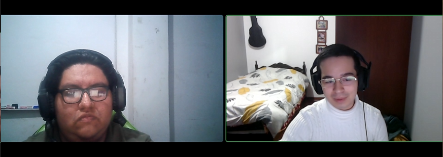
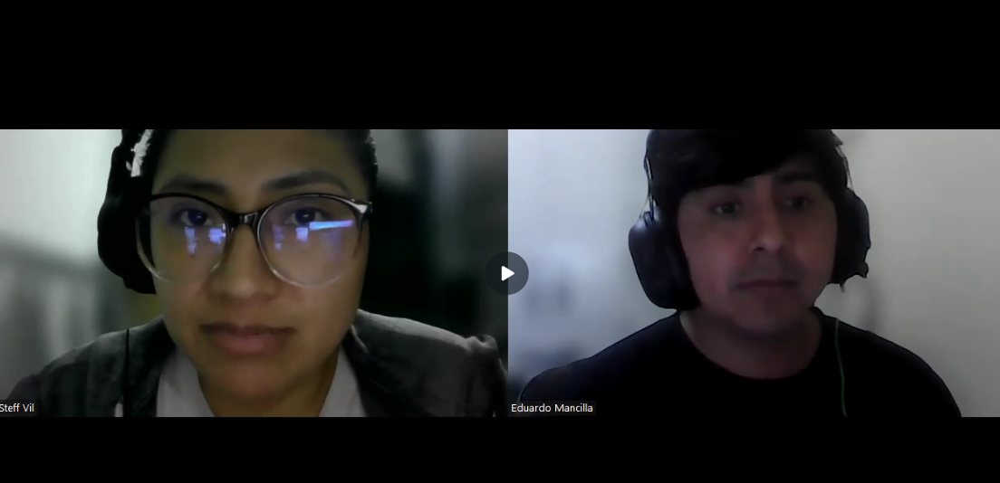
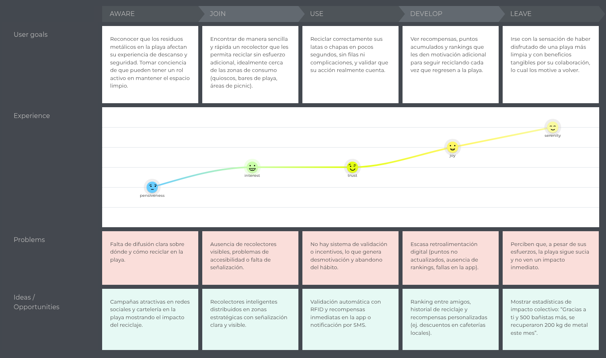

<h1 align="center"> Informe de Trabajo Final </h1>

<h3 align="center"> Universidad Peruana de Ciencias Aplicadas </h3>

<h3 align="center"> Ingeniería de Software </h3>

<h3 align="center">Ciclo 2025 - 2</h3>

  

<h1 align="center"> TB1 Report </h1>

<h3 align="center"> Docente: Vera Olivera, David Carlos </h3>

<h3 align="center"> 1ASI0572 - Desarrollo de Soluciones IoT </h3>

<h4 align="center"> NRC: 3355 </h4>

<h3> Startup: ------ </h3>

<h3> Product: ------ </h3>

<h3> Team Members: </h3>

| Member                              |    Code    |
| :---------------------------------- | :--------: |
| Roca Huapaya, Orlando Arturo        | U201919742 |
| Del Carmen Zorrilla, Ray Alessandro | U202124061 |
| Pardo Zapata, Gustavo Adolfo        | u202120347 |
| Cruz Palomino, Adriano Sebastian    | U202210697 |
| ##                                  |     ##     |
| ##                                  |     ##     |

<h3 align="center">Agosto, 2025</h3>

  

# Registro de Versiones del Informe

  

# Project Report Collaboration Insights

  

# Contenido

## Tabla de Contenidos

### [Registro de versiones del informe](#registro-de-versiones-del-informe)

### [Project Report Collaboration Insights](#project-report-collaboration-insights)

### [Contenido](#contenido)

### [Student Outcome](#student-outcome-1)

### [Capítulo I: Introducción](#capítulo-i-introducción-1)

- [1.1. Startup Profile](#11-startup-profile)
  - [1.1.1. Descripción de la Startup](#111-descripción-de-la-startup)
  - [1.1.2. Perfiles de integrantes del equipo](#112-perfiles-de-integrantes-del-equipo)
- [1.2. Solution Profile](#12-solution-profile)
  - [1.2.1 Antecedentes y problemática](#121-antecedentes-y-problemática)
  - [1.2.2 Lean UX Process](#122-lean-ux-process)
    - [1.2.2.1. Lean UX Problem Statements](#1221-lean-ux-problem-statements)
    - [1.2.2.2. Lean UX Assumptions](#1222-lean-ux-assumptions)
    - [1.2.2.3. Lean UX Hypothesis Statements](#1223-lean-ux-hyphotesis-statements)
    - [1.2.2.4. Lean UX Canvas](#1224-lean-ux-canvas)
- [1.3. Segmentos objetivo](#13-segmentos-objetivo)

### [Capítulo II: Requirements Elicitation & Analysis](#capítulo-ii-requirements-elicitation--analysis-1)

- [2.1. Competidores](#21-competidores)
  - [2.1.1. Análisis competitivo](#211-análisis-competitivo)
  - [2.1.2. Estrategias y tácticas frente a competidores](#212-estrategias-y-tácticas-frente-a-competidores)
- [2.2. Entrevistas](#22-entrevistas)
  - [2.2.1. Diseño de entrevistas](#221-diseño-de-entrevistas)
  - [2.2.2. Registro de entrevistas](#222-registro-de-entrevistas)
  - [2.2.3. Análisis de entrevistas](#223-análisis-de-entrevistas)
- [2.3. Needfinding](#23-needfinding)
  - [2.3.1. User Personas](#231-user-personas)
  - [2.3.2. User Task Matrix](#232-user-task-matrix)
  - [2.3.3. User Journey Mapping](#233-user-journey-mapping)
  - [2.3.4. Empathy Mapping](#234-empathy-mapping)
  - [2.3.5. As-is Scenario Mapping](#235-as-is-scenario-mapping)
- [2.4. Ubiquitous Language](#24-ubiquitous-language)

### [Capítulo III: Requirements Specification](#capítulo-iii-requirements-specification-1)

- [3.1. To-Be Scenario Mapping](#31-to-be-scenario-mapping)
- [3.2. User Stories](#32-user-stories)
- [3.3. Impact mapping](#33-impact-mapping)
- [3.4. Product Backlog](#34-product-backlog)

### [Capítulo IV: Solutions Software Design](#capítulo-iv-solution-software-design)

- [4.1. Strategic-Level Domain-Driven Design](#41-strategic-level-domain-driven-design)
  - [4.1.1. EventStorming](#411-eventstorming)
    - [4.1.1.1. Candidate Context Discovery](#4111-candidate-context-discovery)
    - [4.1.1.2. Domain Message Flows Modeling](#4112-domain-message-flows-modeling)
    - [4.1.1.3. Bounded COntext Canvases](#4113-bounded-context-canvases)
  - [4.1.2. Context Mapping](#412-context-mapping)
  - [4.1.3. Software Architecture](#413-software-architecture)
    - [4.1.3.1. Software Architecture System Landscape Diagram](#4131-software-architecture-system-landscape-diagram)
    - [4.1.3.2. Software Architecture Context Level Diagrams](#4132-software-architecture-context-level-diagrams)
    - [4.1.3.3. Software Architecture Container Level Diagrams](#4133-software-architecture-container-level-diagrams)
    - [4.1.3.4. Software Architecture Deployment Diagrams](#4134-software-architecture-deployment-diagrams)
- [4.2. Tactical-Level Domain-Driven Design](#42-tactical-level-domain-driven-design)
  - [4.2.X. Bounded Context: <Bounded Context name>](#42x-bounded-context)
    - [4.2.X.1. Domain Layer](#42x1-domain-layer)
    - [4.2.X.2. Interface Layer](#42x2-interface-context)
    - [4.2.X.3. Application Layer](#42x3-application-context)
    - [4.2.X.4. Infrastructure Layer](#42x4-infrastructure-context)
    - [4.2.X.5. Bounded Context Software Architecture Component Level Diagrams](#42x5-bounded-context-software-architecture-component-level-diagrams)
    - [4.2.X.6. Bounded Context Software Architecture Code Level Diagrams](#42x6-bounded-context-software-architecture-code-level-diagrams)
      - [4.2.X.6.1. Bounded Context Domain Layer Class Diagrams](#42x61-bounded-context-domain-layer-class-diagrams)
      - [4.2.X.6.2. Bounded Context Database Design Diagram](#42x62-bounded-context-database-design-diagram)

### [Capítulo V: Solution UI/UX Design](#capítulo-v-solutions-uiux-design)

- [5.1. Style Guidelines](#51-style-guidelines)
  - [5.1.1. General Style Guidelines](#511-general-style-guidelines)
  - [5.1.2. Web, Mobile and IoT Style Guidelines](#512-web-mobile-and-iot-style-guidelines)
- [5.2. Information Architecture](#52-information-architecture)
  - [5.2.1. Organization Systems](#521-organization-systems)
  - [5.2.2. Labeling Systems](#522-labeling-systems)
  - [5.2.3. SEO Tags and Meta Tags](#523-seo-tags-and-meta-tags)
  - [5.2.4. Searching Systems](#524-searching-systems)
  - [5.2.5. Navigation Systems](#525-navigation-systems)
- [5.3. Landing Page UI Design](#53-landing-page-ui-design)
  - [5.3.1. Landing Page Wireframe](#531-landing-page-wireframe)
  - [5.3.2. Landing Page Mock-up](#532-landing-page-mock-up)
- [5.4. Applications UX/UI Design](#54-web-applications-uxui-design)
  - [5.4.1. Applications Wireframes](#541-web-applications-wireframes)
  - [5.4.2. Applications Wireflow Diagrams](#542-web-applications-wireflow-diagrams)
  - [5.4.3. Applications Mock-ups](#543-web-applications-mock-ups)
  - [5.4.4. Applications User Flow Diagrams](#544-web-applications-user-flow-diagrams)
- [5.5. Aplications Prototyping](#55-applications-prototyping)

### [Capítulo VI: Product Implementation, Validation \& Deployment](#capítulo-vi-product-implementation-validation--deployment)

- [6.1. Software Configuration Management](#61-software-configuration-management)
  - [6.1.1. Software Development Environment Configuration](#611-software-development-environment-configuration)
  - [6.1.2. Source Code Management](#612-source-code-management)
  - [6.1.3. Source Code Style Guide \& Conventions](#613-source-code-style-guide--conventions)
  - [6.1.4. Software Deployment Configuration](#614-software-deployment-configuration)
- [6.2. Landing Page, Services \& Applications Implementation](#62-landing-page-services--applications-implementation)
  - [6.2.X. Sprint X](#62x-sprint-n)
    - [6.2.X.1. Sprint Planning 1](#62x1-sprint-planning-n)
    - [6.2.X.2. Sprint Backlog 1](#62x2-sprint-backlog-n)
    - [6.2.X.3. Development Evidence for Sprint Review](#62x3-development-evidence-for-sprint-review)
    - [6.2.X.4. Testing Suite Evidence for Sprint Review](#62x4-testing-suite-evidence-for-sprint-review)
    - [6.2.X.5. Execution Evidence for Sprint Review](#62x5-execution-evidence-for-sprint-review)
    - [6.2.X.6. Services Documentation Evidence for Sprint Review](#62x6-services-documentation-evidence-for-sprint-review)
    - [6.2.X.7. Software Deployment Evidence for Sprint Review](#62x7-software-deployment-evidence-for-sprint-review)
    - [6.2.X.8. Team Collaboration Insights during Sprint](#62x8-team-collaboration-insights-during-sprint)
- [6.3. Validation Interviews](#63-validation-interviews)
  - [6.3.1. Diseño de Entrevistas](#631-diseño-de-entrevistas)
  - [6.3.2. Registro de Entrevistas](#632-registro-de-entrevistas)
  - [6.3.3. Evaluaciones según heurísticas](#633-evaluaciones-según-heurísticas)
- [6.4. Video About-the-Product](#64-video-about-the-product)

### [Conclusiones](#conclusiones-1)

- [Conclusiones y recomendaciones](#conclusiones-y-recomendaciones)
- [Video About-the-Team](#video-about-the-team)

### [Bibliografía](#bibliografía-1)

### [Anexos](#anexos-1)

  

# Student Outcome

<b>ABET – EAC - Student Outcome 5:</b> La capacidad de funcionar efectivamente en un equipo cuyos miembros juntos proporcionan liderazgo, crean un entorno de colaboración e inclusivo, establecen objetivos, planifican tareas y cumplen objetivos.

  

# Capítulo I: Introducción

## 1.1. StartUp Profile

### 1.1.1. Descripción de la StartUp

ReciclaMar surge como una solución ante la creciente preocupación por la contaminación en playas urbanas del Perú. La presencia de residuos metálicos como latas y chapas deteriora la experiencia turística, eleva los costos de limpieza y pone en riesgo la seguridad de los visitantes. Al mismo tiempo, la falta de incentivos claros, la ausencia de trazabilidad y el uso de contenedores no inteligentes dificultan una gestión eficiente por parte de las municipalidades y limitan la participación ciudadana en el reciclaje.

ReciclaMar propone RIMP (Recolector Inteligente de Metales para Playas), un sistema IoT que valida automáticamente que el residuo sea metálico mediante un sensor, identifica al usuario con RFID y habilita la apertura de una compuerta para el depósito.desarrollamos una plataforma web y móvil que permite a las personas reciclar y acumular puntos por municipalidad para canjear en comercios aliados.

### 1.1.2. Perfiles de integrantes del equipo

| Foto                                                   | Apellidos y Nombres              |          Código | Carrera                | Conocimientos y contribución principal                                                                                                                                                                                                                                                                                                                       |
| ------------------------------------------------------ | -------------------------------- | --------------: | ---------------------- | ------------------------------------------------------------------------------------------------------------------------------------------------------------------------------------------------------------------------------------------------------------------------------------------------------------------------------------------------------------ |
|    | **Roca Huapaya, Orlando Arturo** |      u201919742 | Ingeniería de Software | Mi contribución al equipo es la experiencia que tengo desarrollando interfaces en React o Vue y servicios de APIs REST en Spring Boot o Laravel. Me enfoco en que el producto sea usable, estable y fácil de desplegar. Además, priorizaré el uso de buenas prácticas en el ciclo de desarrollo del software.                                                |
|  | **Pardo Zapata, Gustavo Adolfo** |      u202120347 | Ingeniería de Software | Soy proactivo, colaborativo, organizado,responsable y con habilidades de resolución de problemas.Tengo una excelente capacidad para comunicarme de manera efectiva y clara con los demás miembros de mi equipo y deseo colaborar en todo lo posible con mis demás compañeros en este trabajo. Cuento con conocimiento en JavaScript, Java, Python, C# y SQL. |
| *(colocar foto)*                                       | **Integrante 3**                 | [por completar] | [carrera]              |                                                                                                                                                                                                                                                                                                                                                              |
|     | **Cruz Palomino,**               |      U202210697 | Ingeniería de Software | Mi nombre es Adriano Sebastian Cruz Palomino, tengo 20 años, soy alumno de Ingeniería de Software en la UPC, actualmente estoy cursando el 8vo ciclo. Soy una persona curiosa, responsable, y comprometida con mis estudios, siempre busco aprender más y mejorar mis habilidades.                                                                           |
| *(colocar foto)*                                       | **Integrante 5**                 | [por completar] | [carrera]              |                                                                                                                                                                                                                                                                                                                                                              |
| *(colocar foto)*                                       | **Integrante 6**                 | [por completar] | [carrera]              |                                                                                                                                                                                                                                                                                                                                                              |

## 1.2. Solution Profile

### 1.2.1. Antecedentes y problemática
En las playas de Lima persiste la acumulación de residuos metálicos como latas, tapas y chapas que deteriora la experiencia turística, eleva costos de limpieza y genera riesgos para la salud. Según DIGESA reportó en el verano 2024 que de 131 playas vigiladas, 89 eran “no saludables” principalmente por limpieza y presencia de residuos sólidos, lo que evidencia la magnitud del problema. La solución propuesta, para el reciclaje de metales debe verificar automáticamente que el residuo sea metálico y abrir una compuerta segura para evitar fraudes, también identificar al usuario vía RFID para asignar puntos por municipalidad y habilitar canjes en comercios aliados. El objetivo es incrementar la tasa de reciclaje de metal en temporada alta, recuperar mayor volumen por playa y reducir tiempos y costos de recolección. El alcance y restricciones del piloto se delimitan a 1 o 3 playas de Lima, enfocarnos exclusivamente en el reciclaje de metales en la versión inicial, recompensas gestionadas por cada municipalidad o comercio.

#### 5W + 2H

##### What (¿qué?)
Acumulación de residuos metálicos en arena como latas, tapas y chapas, esto afecta salubridad y operación municipal en las playas.

##### When (¿cuándo?)
Todo el año, con picos en temporada de verano y fines de semana.

##### Where (¿dónde?)
Playas de Lima, áreas de alto tránsito donde se han medido y caracterizado residuos, incluyendo metálicos peligrosos.

##### Who (¿quiénes?)
Bañistas y municipalidades.

##### Why (¿por qué?)
Infraestructura de residuos insuficiente e ineficientes, falta de incentivos que vincule el acto de reciclar con beneficios y datos útiles para gestión.

##### How (¿cómo sucede?)
Los visitantes consumen bebidas y dejan latas o chapas en la arena. El estudio de Villacorta-Córdova et al. (2021), publicado en la Revista Científica UNJFSC, evidenció en cuatro playas de la Costa Verde la presencia de 55 objetos metálicos, principalmente latas oxidadas y punzantes en zonas de bañistas, lo que confirma el riesgo para la salud y la convivencia de metales en las playas.
##### How much (¿cuánto?)

- 89 playas “no saludables” al inicio de verano 2024, principalmente por residuos sólidos en arena.

- En las playas de la Costa Verde se encontraron 55 ítems metálicos, 42% fueron latas de bebidas.

### 1.2.2. Lean UX Process

#### 1.2.2.1. Lean UX Problem Statements

Ante esta situación nuestra Startup se plantea las siguientes Problem Statements:

**PS1:**  
- **Objetivos actuales del producto:** Mantener las playas seguras para el disfrute turístico y recreativo.  
- **Problema:** Los bañistas enfrentan constantemente playas con residuos metálicos como latas, tapas y chapas, lo que genera riesgos de cortes, incomodidad y reduce la calidad de la experiencia turística. Actualmente, no existe un sistema que valide los materiales ni incentive a los usuarios a reciclar.  
- **Pregunta solicitud de mejora:** ¿Cómo podemos diseñar un recolector inteligente que valide automáticamente el residuo metálico, identifique al usuario y entregue recompensas inmediatas, incentivando así la participación activa de los bañistas en la limpieza de las playas?  

**PS2:**  
- **Objetivos actuales del producto:** Garantizar la salubridad de las playas, optimizar la recolección de residuos y reducir costos de limpieza.  
- **Problema:** Las municipalidades gastan recursos elevados en limpieza manual de playas sin contar con datos en tiempo real ni mecanismos de trazabilidad. Esto dificulta la toma de decisiones y el control de rutas de recolección.  
- **Pregunta solicitud de mejora:** ¿Cómo podemos proveer a las municipalidades de un sistema IoT que registre en tiempo real los residuos recolectados, emita alertas de llenado y entregue KPIs útiles para planificar rutas y evaluar el impacto ambiental y económico?

#### 1.2.2.2. Lean UX Assumptions

**Business Outcomes**
- Aumentar la tasa de reciclaje de metales en playas urbanas de Lima y el volumen recuperado por playa.
- Reducir tiempo y costo de limpieza municipal mediante telemetría y alertas de llenado.
- Conseguir acuerdos con comercios locales para sostener el sistema de canjes y mejorar la adopción.
- Lograr pilotos con 1 o 3 playas por municipio.
- Generar datos confiables como kg y usos, para reportes y toma de decisiones.

**User Assumptions (sobre los usuarios)**
- Bañistas reciclarán si el proceso es rápido, seguro y reciben beneficios inmediatos.
- Aceptarán usar tarjeta RFID si el registro toma menos de 1 minuto y no solicita datos sensibles.
- Municipalidades adoptarán la solución si muestra ahorros operativos y KPIs claros.

**User Outcomes (lo que experimentan/ganan)**
- Los bañistas depositan sus latas en segundos, reciben puntos y visualizan sus resultados desde la app.
- Las municipalidades evidencian mejoras de salubridad con métricas.
- Los operadores reducen tiempos de recolección.

**Feature Assumptions (sobre funcionalidades)**
- Sensor inductivo valida metal con baja tasa de falsos positivos y abre compuerta.
- RFID identifica al usuario y permite la recolección de puntos y canjes en comercios aliados.
- Dashboard municipal con métricas, KPIs y alertas de llenado.
- App web y móvil para registro, puntaje y catálogo de canjes.
- Arquitectura Edge con opción de energía solar para continuidad operativa.

#### 1.2.2.3. Lean UX Hyphotesis Statements

- Creemos que aumentaremos la tasa de reciclaje de metales y el volumen recuperado por playa (business outcome) si los bañistas (user) pueden depositar sus latas en segundos y reciben puntos inmediatos (benefit) con sensor inductivo, compuerta y RFID de registro en menos de 1 minuto (feature).

  Sabremos que hemos tenido éxito 
  
  Cuando al menos el 40% de usuarios registrados realicen mas de 2 depósitos por semana en temporada alta.

- Creemos que incrementaremos la adopción de la app y los canjes (business outcome)  
si los bañistas (user) visualizan sus puntos y un catálogo de canjes locales claro (benefit)  
con la app web o móvil y validación de canje en comercios aliados (feature).  

  Sabremos que hemos tenido éxito.

  Cuando la tasa de canje mensual sea mayor o igual al 30% de usuarios activos y se registren mas de 50 canjes por mes.

- Creemos que mejoraremos la satisfacción y la confianza en el sistema (business outcome) si los bañistas (user) perciben que su reciclaje es trazable y antifraude (benefit) con RFID personal, historial en la app y validación de metal antes de abrir la compuerta (feature).

  Sabremos que hemos tenido éxito 

  Cuando 8 de cada 10 usuarios se declaren seguros o muy seguros, y los eventos inválidos no excedan el 5%

- Creemos que reduciremos tiempo y costo de limpieza (business outcome)  
si las municipalidades (user) reciben alertas de llenado para planificar rutas (benefit)  
con dashboard municipal (feature).

  Sabremos que hemos tenido éxito. 

  Cuando el tiempo promedio por ruta baje más del 20% y el costo operativo por tonelada baje más del 15% durante 8 semanas de piloto.

- Creemos que fortaleceremos la planificación y la transparencia (business outcome)  
si las municipalidades (user) confían en KPIs trazables (benefit)  
con latencia de datos menor de 5 minutos (feature).  

  Sabremos que hemos tenido éxito

  Cuando el dashboard sea consultado semanalmente y se realice más de 1 ajuste de ruta por semana basado en los KPIs.

- Creemos que atraeremos comercios locales (business outcome)  
si las municipalidades (user) observan ahorros operativos y evidencia de canjes (benefit)  
con acuerdos de canjes activos (feature).  

  Sabremos que hemos tenido éxito 

  cuando logremos mas de 10 comercios aliados y mas de 50 canjes por mes en el piloto.

#### 1.2.2.4. Lean UX Canvas

## 1.3. Segmentos objetivo

# Capítulo II: Requirements Elicitation & Analysis

## 2.1. Competidores

## 2.1. Competidores  

En el mercado peruano no existen actualmente soluciones IoT específicas para el reciclaje de metales en playas. Sin embargo, es posible identificar competidores indirectos internacionales, que ofrecen tecnologías avanzadas de gestión de residuos aplicadas a contextos urbanos, y referentes locales con iniciativas de reciclaje e incentivos. Estos competidores, aunque no están focalizados en playas, aportan aprendizajes relevantes y representan potenciales amenazas en caso de adaptar sus modelos al ámbito costero.  

Los principales competidores seleccionados son:  

- **Big Belly Solar**: empresa estadounidense con presencia internacional, reconocida por sus estaciones solares inteligentes que compactan residuos y transmiten datos en tiempo real. Su enfoque principal está en ciudades y espacios urbanos de alto tránsito.  
- **Evreka**: startup global que combina hardware IoT y software en la nube para digitalizar la gestión de residuos. Su propuesta se centra en optimizar rutas de recolección y operaciones de limpieza a gran escala en ciudades inteligentes.  
- **Ecube Labs**: compañía surcoreana que fabrica compactadores solares y sensores ultrasónicos para monitoreo de residuos, integrados con su plataforma CleanCityNetworks. Sus soluciones tienen amplia adopción en Asia, Norteamérica y Europa.  

En comparación, **CleanWave** busca diferenciarse al ofrecer un modelo adaptado a playas peruanas, centrado en la recolección de residuos metálicos con incentivos inmediatos a los bañistas, al mismo tiempo que provee datos en tiempo real a las municipalidades costeras.  

### 2.1.1. Análisis competitivo

<table border="1" cellspacing="0" cellpadding="5">
  <tr>
    <th colspan="6" valign="top">Competitive Analysis Landscape</th>
  </tr>
  <tr>
    <td colspan="2" valign="top">¿Por qué llevar a cabo este análisis?</td>
    <td colspan="4" valign="top">Identificar cómo se posiciona CleanWave frente a soluciones internacionales de gestión inteligente de residuos, evaluando fortalezas, debilidades y oportunidades para diferenciarse en el contexto de playas peruanas.</td>
  </tr>
  <tr>
    <td colspan="2" valign="top"></td>
    <td valign="top"><b>CleanWave</b></td>
    <td valign="top"><b>Big Belly Solar</b></td>
    <td valign="top"><b>Evreka</b></td>
    <td valign="top"><b>Ecube Labs</b></td>
  </tr>
  <tr>
    <td rowspan="2" valign="top">Perfil</td>
    <td valign="top">Overview</td>
    <td valign="top">Startup peruana que busca mantener limpias las playas con recolectores inteligentes de metales, conectados a una app de incentivos y dashboard municipal.</td>
    <td valign="top">Empresa estadounidense que fabrica compactadores solares de residuos con monitoreo IoT.</td>
    <td valign="top">Startup global que ofrece software y hardware IoT para digitalizar la gestión de residuos y optimizar rutas de recolección.</td>
    <td valign="top">Empresa surcoreana que desarrolla compactadores solares y sensores IoT, integrados con la plataforma CleanCityNetworks.</td>
  </tr>
  <tr>
    <td valign="top">Ventaja competitiva ¿Qué valor ofrece a los clientes?</td>
    <td valign="top">Incentivos inmediatos a bañistas mediante puntos y canjes, además de datos en tiempo real para reducir costos municipales de limpieza.</td>
    <td valign="top">Reduce la frecuencia de recolección y costos mediante compactación automática.</td>
    <td valign="top">Ofrece un ecosistema integral para digitalizar toda la cadena de gestión de residuos urbanos.</td>
    <td valign="top">Monitoreo preciso del llenado de contenedores y optimización de rutas con telemetría avanzada.</td>
  </tr>
  <tr>
    <td rowspan="2" valign="top">Perfil de Marketing</td>
    <td valign="top">Mercado objetivo</td>
    <td valign="top">Bañistas, municipalidades costeras y comercios locales aliados.</td>
    <td valign="top">Municipalidades de ciudades desarrolladas con alto presupuesto.</td>
    <td valign="top">Gobiernos locales y empresas de gestión de residuos en múltiples regiones.</td>
    <td valign="top">Municipalidades y operadores urbanos en Asia, EE.UU. y Europa.</td>
  </tr>
  <tr>
    <td valign="top">Estrategias de marketing</td>
    <td valign="top">Campañas ambientales en playas, convenios con comercios, app móvil/web.</td>
    <td valign="top">Relaciones B2G con gobiernos, contratos de largo plazo.</td>
    <td valign="top">Participación en ferias de smart cities y alianzas estratégicas.</td>
    <td valign="top">Expansión global con casos de éxito en smart cities y contratos B2G.</td>
  </tr>
  <tr>
    <td rowspan="3" valign="top">Perfil de Producto</td>
    <td valign="top">Productos & Servicios</td>
    <td valign="top">Recolector inteligente de metales en playas, app web/móvil para usuarios y dashboard municipal con métricas.</td>
    <td valign="top">Compactadores solares inteligentes y software de gestión.</td>
    <td valign="top">Sensores IoT, smart bins, plataforma SaaS para gestión integral.</td>
    <td valign="top">Compactadores solares, sensores ultrasónicos IoT y plataforma CleanCityNetworks.</td>
  </tr>
  <tr>
    <td valign="top">Precios & Costos</td>
    <td valign="top">Modelo de bajo costo inicial, sostenido con convenios municipales y comercios aliados.</td>
    <td valign="top">USD 4,000–6,000 por unidad, alto costo de mantenimiento.</td>
    <td valign="top">Modelo SaaS + hardware, costo elevado pero escalable.</td>
    <td valign="top">Modelo SaaS por dispositivo, costo medio-alto según escala y servicios.</td>
  </tr>
  <tr>
    <td valign="top">Canales de distribución (Web y/o Móvil)</td>
    <td valign="top">Landing page, aplicación móvil/web y convenios con municipalidades.</td>
    <td valign="top">Contratos directos con gobiernos locales.</td>
    <td valign="top">Plataforma SaaS, apps móviles y hardware IoT distribuido globalmente.</td>
    <td valign="top">Distribuidores internacionales, contratos B2G, CleanCityNetworks.</td>
  </tr>
  <tr>
    <td rowspan="4" valign="top">Análisis SWOT</td>
    <td valign="top">Fortalezas</td>
    <td valign="top">Enfoque único en playas, incentivos inmediatos e innovación IoT accesible.</td>
    <td valign="top">Tecnología madura, eficiencia probada en ciudades.</td>
    <td valign="top">Escalabilidad global, integración de software y hardware.</td>
    <td valign="top">Experiencia internacional, portafolio completo de soluciones IoT.</td>
  </tr>
  <tr>
    <td valign="top">Debilidades</td>
    <td valign="top">Startup nueva, recursos limitados.</td>
    <td valign="top">Altos costos, poco viable en mercados emergentes.</td>
    <td valign="top">Dependencia de inversión externa, complejidad de implementación.</td>
    <td valign="top">Altos costos iniciales y enfoque urbano más que turístico.</td>
  </tr>
  <tr>
    <td valign="top">Oportunidades</td>
    <td valign="top">Conciencia ambiental creciente y turismo sostenible en Perú.</td>
    <td valign="top">Expansión hacia países en desarrollo interesados en smart cities.</td>
    <td valign="top">Crecimiento de la demanda global en digitalización de residuos.</td>
    <td valign="top">Mayor interés mundial en soluciones de smart cities con energías limpias.</td>
  </tr>
  <tr>
    <td valign="top">Amenazas</td>
    <td valign="top">Escasez de financiamiento sostenido y replicabilidad de la idea.</td>
    <td valign="top">Competencia de soluciones más accesibles y locales.</td>
    <td valign="top">Entrada de competidores más económicos y especializados.</td>
    <td valign="top">Competencia de grandes players con más recursos tecnológicos.</td>
  </tr>
</table>

### 2.1.2. Estrategias y tácticas frente a competidores

A partir del análisis competitivo realizado se identificaron las principales fortalezas, debilidades, oportunidades y amenazas de los competidores. Esta información resulta esencial para definir cómo diferenciar a CleanWave en el mercado y establecer una propuesta de valor sólida.  

**Fortalezas de los competidores**  
- Big Belly y Ecube Labs cuentan con tecnología madura y casos de éxito en ciudades internacionales.  
- Evreka dispone de un ecosistema integral de software y hardware IoT para gestión de residuos.  
- Todos tienen presencia consolidada en el mercado global y experiencia comprobada.  

**Estrategias y tácticas frente a fortalezas**  
- **Estrategias**:  
  - Diferenciar a CleanWave por su enfoque especializado en playas y residuos metálicos, un nicho no cubierto por estos competidores.  
  - Comunicar que el producto es más accesible y adaptado a contextos municipales peruanos con recursos limitados.  
- **Tácticas**:  
  - Desarrollar campañas de marketing que comparen costos y beneficios frente a soluciones internacionales.  
  - Presentar pilotos exitosos en playas de Lima para demostrar resultados tangibles en salubridad y reducción de costos.  

**Debilidades de los competidores**  
- Alto costo de implementación y mantenimiento (Big Belly y Ecube Labs).  
- Complejidad en la adopción tecnológica y dependencia de inversión externa (Evreka).  
- Limitada adaptación a contextos turísticos como playas.  

**Estrategias y tácticas frente a debilidades**  
- **Estrategias**:  
  - Posicionar a CleanWave como una solución de bajo costo y rápida implementación.  
  - Destacar la simplicidad y usabilidad para operadores municipales y ciudadanos.  
- **Tácticas**:  
  - Elaborar un modelo de negocio basado en convenios con municipalidades y comercios locales para sostener la operación.  
  - Diseñar una interfaz web y móvil intuitiva que reduzca la barrera de entrada tecnológica.  

**Oportunidades de los competidores**  
- Creciente interés global por smart cities y sostenibilidad ambiental.  
- Posibilidad de expandirse a mercados emergentes con nuevas adaptaciones.  
- Aumento de la conciencia ciudadana sobre el reciclaje y la gestión responsable de residuos.  

**Estrategias y tácticas frente a oportunidades**  
- **Estrategias**:  
  - Aprovechar la ola de sostenibilidad y turismo responsable para posicionar CleanWave como solución innovadora para playas.  
  - Establecer alianzas con municipalidades costeras y comercios locales para ganar legitimidad y tracción.  
- **Tácticas**:  
  - Participar en convocatorias de innovación ambiental y programas de responsabilidad social empresarial.  
  - Integrar métricas de impacto ambiental en el dashboard municipal como valor agregado para informes de sostenibilidad.  

**Amenazas de los competidores**  
- Ingreso de soluciones más completas en gestión de residuos que podrían extenderse a playas.  
- Evolución tecnológica rápida que vuelva obsoletos los prototipos actuales.  
- Cambios en las prioridades municipales que reduzcan la inversión en innovación.  

**Estrategias y tácticas frente a amenazas**  
- **Estrategias**:  
  - Adoptar un enfoque de innovación continua para mantener la vigencia tecnológica.  
  - Asegurar una arquitectura flexible que permita escalar a otros tipos de residuos en el futuro.  
  - Mantener relaciones constantes con municipalidades para alinear la propuesta con sus necesidades.  
- **Tácticas**:  
  - Actualizar periódicamente el software y hardware con mejoras incrementales.  
  - Estar presentes en foros, ferias y comités de innovación municipal y ambiental.  
  - Desarrollar prototipos modulares que permitan añadir nuevas funcionalidades sin rediseñar todo el sistema.  

## 2.2. Entrevistas

### 2.2.1. Diseño de entrevistas

  Se han establecido preguntas dirigidas a nuestros segmentos objetivo (<b>Bañistas</b> y <b>Municipalidades costeras</b>) con el fin de recolectar información cualitativa y cuantitativa que permita construir arquetipos de usuario. Estas entrevistas consideran aspectos demográficos, personales, digitales, así como objetivos, frustraciones y antecedentes relacionados al cuidado ambiental en playas. La información obtenida servirá para validar la propuesta de valor de <b>Metalix</b> y orientar su diseño de acuerdo con las necesidades reales de los usuarios.

---

#### Características demográficas

- ¿Cuál es su nombre?
- ¿Cuál es su edad?
- ¿Cuál es su género?
- ¿En qué ciudad y distrito reside?
- ¿Cuál es su estado civil?
- ¿Con quién vive actualmente (solo/a, familia, amigos)?
- ¿A qué se dedica actualmente?

#### Características personales y sociales

- ¿Cómo describiría su personalidad (ejemplo: sociable, innovador, tradicional, responsable)?
- ¿Qué habilidades considera que le representan en su vida personal o laboral?
- ¿Qué marcas, servicios o personas suelen influir en sus hábitos de consumo o en sus decisiones cotidianas?

#### Dispositivos y canales digitales

- ¿Qué dispositivos utiliza con mayor frecuencia (celular, laptop, smartwatch, etc.)?
- ¿Qué aplicaciones o herramientas digitales son las que más usa en su día a día?
- ¿Qué redes sociales o canales digitales utiliza más para informarse o interactuar?

#### Objetivos y frustraciones (contexto de playa y sostenibilidad)

- Cuando piensa en una playa ideal, ¿qué espera encontrar o experimentar? (ejemplo: limpieza, seguridad, tranquilidad, servicios organizados).
- ¿Qué situaciones en la playa le generan más frustración o incomodidad? (ejemplo: basura, falta de tachos, poca participación de autoridades o bañistas).
- ¿Qué cree que debería mejorar en la experiencia de visitar o gestionar playas en el Perú?

#### Biografía o antecedentes

- ¿Ha participado antes en iniciativas de reciclaje, programas municipales o proyectos de cuidado ambiental? ¿Cómo fue su experiencia?
- ¿Qué experiencias previas influyen en su visión actual sobre la importancia del cuidado ambiental en espacios públicos como las playas?

---

### Segmento 1: Bañistas (turistas y pobladores locales)

**Preguntas sobre su experiencia**

- ¿Con qué frecuencia visita las playas?
- ¿Suele consumir bebidas enlatadas u otros productos metálicos durante su estancia en la playa?
- ¿Conoce o ha usado antes algún sistema de reciclaje en playas u otros espacios públicos?
- ¿Qué tipo de beneficios le motivarían a participar en un sistema de reciclaje (descuentos, premios, sorteos, etc.)?
- ¿Qué tan dispuesto estaría a utilizar una tarjeta RFID para registrar sus puntos de reciclaje?

**Preguntas sobre los desafíos y problemas**

- ¿Con qué frecuencia percibe suciedad o presencia de residuos metálicos en la playa que visita?
- ¿Cómo afecta esta contaminación su experiencia en la playa?
- ¿Qué opina sobre los esfuerzos actuales de las municipalidades para mantener las playas limpias?
- ¿Ha tenido dificultades para encontrar tachos de reciclaje en playas?

**Deseos del usuario**

- ¿Qué beneficios le gustaría recibir a cambio de reciclar residuos metálicos en la playa?
- ¿Considera atractivo un sistema que premie con puntos cada acción de reciclaje?
- ¿Qué características le motivarían a participar activamente en un programa de reciclaje gamificado?

---

### Segmento 2: Municipalidades costeras

**Preguntas sobre su experiencia**
- ¿Cuál es su cargo y cuáles son sus responsabilidades en la gestión de playas?
- ¿Qué estrategias utilizan actualmente para el manejo de residuos metálicos en las playas?
- ¿Han implementado programas de incentivos o campañas de concientización para los bañistas?
- ¿Qué tipo de tecnologías han probado o consideran viables para mejorar la gestión de residuos en playas?

**Desafíos y problemas**
- ¿Qué dificultades enfrentan en el control de residuos metálicos en zonas turísticas?
- ¿Qué limitaciones tienen los programas de limpieza y recolección actuales?
- ¿Existen obstáculos en cuanto a financiamiento, logística o participación ciudadana para mantener limpias las playas?
- ¿Qué impacto tiene la acumulación de residuos en la imagen turística de la municipalidad?

**Deseos del usuario**
- ¿Qué mejoras consideran necesarias para optimizar la gestión de residuos metálicos en las playas?
- ¿Qué tipo de incentivos o estrategias cree que motivarían más a los bañistas a participar en programas de reciclaje?
- ¿Le resultaría atractivo un modelo donde puedan revender el material metálico recolectado y, al mismo tiempo, gestionar un sistema de recompensas para los bañistas?

---

### Validación del proyecto (para ambos segmentos)

Al finalizar la entrevista, se presenta al entrevistado la idea del proyecto junto a las principales funcionalidades que posee.

**Presentación breve del proyecto:**
> *"Metalix es un recolector inteligente de metales para playas, que combina sensores para validar residuos metálicos, tarjetas RFID configuradas por CleanWave para acumular puntos y un sistema de recompensas gestionado por las municipalidades. El objetivo es reducir la contaminación y motivar a los bañistas a reciclar mediante beneficios locales."*

**Preguntas de validación**
- ¿Qué le parece la propuesta de proyecto Metalix?
- ¿Considera que esta solución ayudaría a reducir la contaminación en playas?
- ¿Qué aspecto del proyecto le parece más atractivo?
- ¿Qué beneficios cree que podría aportar un sistema como Metalix a su experiencia como bañista o a la gestión de su municipalidad?
- ¿Qué características adicionales cree que serían necesarias para mejorar la solución?

### 2.2.2. Registro de entrevistas

#### Segmento: Bañistas

##### Entrevista 1
<ul>
  <li><b>Nombre del entrevistado:</b> Renzo Ramos</li>
  <li><b>Edad:</b> 21 años</li>
  <li><b>Distrito:</b> Ventanilla</li>
  <li><b>Nombre del entrevistador:</b> Gustavo Pardo</li>
  <li><b>Duración:</b> 06:09:00</li>
</ul>

<b>Evidencia de la entrevista:</b>

  

  <b>Enlace de entrevista:</b>
  <a href="https://upcedupe-my.sharepoint.com/:v:/g/personal/u202120347_upc_edu_pe/EV9G5QaBY35HrWKGJiDWL6cBlIZ_fVRdGKS1x7VeihuQOA?e=V2Mybg&nav=eyJyZWZlcnJhbEluZm8iOnsicmVmZXJyYWxBcHAiOiJTdHJlYW1XZWJBcHAiLCJyZWZlcnJhbFZpZXciOiJTaGFyZURpYWxvZy1MaW5rIiwicmVmZXJyYWxBcHBQbGF0Zm9ybSI6IldlYiIsInJlZmVycmFsTW9kZSI6InZpZXcifX0%3D">Ver video</a>

  <b>Inicio:</b> 00:00:00 — <b>Fin:</b> 06:09:00

<b>Resumen de la entrevista:</b>

Renzo Ramos, de 21 años y residente de Ventanilla, visita la playa Costa Azul casi todos los fines de semana, principalmente en verano. Durante su estancia suele consumir bebidas enlatadas como gaseosas y cervezas. Aunque conoce los tachos de reciclaje en parques y/o playas, no los ha utilizado mucho porque no están bien señalizados. Estaría motivado a reciclar si recibe beneficios atractivos como sorteos de productos deportivos o descuentos en restaurantes. Percibe con frecuencia residuos metálicos en la playa, especialmente en temporada alta, lo que afecta su experiencia y puede ser peligroso. Considera insuficientes los esfuerzos municipales de limpieza y que los tachos escasean o están mal ubicados. Estaría dispuesto a usar una tarjeta RFID para registrar puntos siempre que el sistema sea rápido y sencillo. Ve atractivo un programa de reciclaje gamificado con recompensas reales, acumulación de puntos y posibilidad de competir con amigos.

##### Entrevista 2
<ul>
  <li><b>Nombre del entrevistado:</b> Carlos Ramírez</li>
  <li><b>Edad:</b> 28 años</li>
  <li><b>Distrito:</b> Santiago de Surco, Lima</li>
  <li><b>Nombre del entrevistador:</b> Orlando Roca</li>
  <li><b>Duración:</b> 00:04:43</li>
</ul>

<b>Evidencia de la entrevista:</b>

  

  <b>Enlace de entrevista:</b> <i>(pendiente)</i>

  <b>Inicio:</b> 00:00:00 — <b>Fin:</b> 00:04:43

<b>Resumen de la entrevista:</b>

Carlos Ramírez, de 28 años y residente de Surco, visita las playas con frecuencia en verano y ocasionalmente en invierno. Suele consumir bebidas enlatadas, pero señala que casi no hay tachos de reciclaje en playas y que los esfuerzos municipales de limpieza son mínimos. Afirma percibir residuos metálicos con frecuencia, lo cual afecta negativamente la experiencia y transmite descuido ambiental. Estaría motivado a reciclar si recibe beneficios como descuentos en restaurantes, sorteos de productos o entradas, y usaría una tarjeta RFID si el proceso es rápido y sencillo. Considera atractivo un sistema gamificado con recompensas, rankings y competencias con amigos.

##### Entrevista 3
<ul>
  <li><b>Nombre del entrevistado:</b> Michelle Villena</li>
  <li><b>Edad:</b> 29 años</li>
  <li><b>Distrito:</b> Santa Anita, Lima</li>
  <li><b>Nombre del entrevistador:</b> Eduardo Mancilla</li>
  <li><b>Duración:</b> 00:07:17</li>
</ul>

<b>Evidencia de la entrevista:</b>

  

  <b>Enlace de entrevista:</b> <i>(pendiente)</i>

  <b>Inicio:</b> 00:00:00 — <b>Fin:</b> 00:07:17

<b>Resumen de la entrevista:</b>

  Michelle Villena, de 29 años y residente de Santa Anita, visita las playas con frecuencia en familia; suele consumir bebidas enlatadas, pero observa que casi no hay tachos de reciclaje; estaría motivada a reciclar si recibe beneficios atractivos como descuentos en centros comerciales, se muestra entusiasta a usar una tarjeta RFID siempre que el proceso sea sencillo, y considera atractivo un sistema de recompensas.

---

#### Segmento: Municipalidades costeras

##### Entrevista 4
<ul>
  <li><b>Nombre del entrevistado:</b> Bruce Cipriano</li>
  <li><b>Edad:</b> 32 años</li>
  <li><b>Distrito:</b> Punta Hermosa, Lima</li>
  <li><b>Nombre del entrevistador:</b> Ray Del Carmen</li>
  <li><b>Duración:</b> 00:00</li>
</ul>

<b>Evidencia de la entrevista:</b>

  

  <b>Enlace de entrevista:</b> <i>(pendiente)</i>

  <b>Inicio:</b> 00:00:00 — <b>Fin:</b> 00:00:00

<b>Resumen de la entrevista:</b>

  Bruce Andrés Cipriano Chumbes, jefe de gestión ambiental de la Municipalidad de Punta Hermosa, resaltó su rol en la limpieza de playas, manejo de residuos y liderazgo en campañas de educación ambiental. Se describió como una persona responsable, pragmática y colaborativa, que utiliza tanto laptop como dispositivos móviles (Android e iOS) para la gestión de datos logísticos, apoyándose principalmente en herramientas digitales como Excel y Gmail. Además, recurre a redes sociales como WhatsApp, Facebook, Instagram y X (Twitter) para difundir información turística y comunicados.

  En su visión, una playa ideal debe contar con limpieza constante, tachos diferenciados, baños públicos, seguridad, accesibilidad y adecuada señalización. Sus principales frustraciones surgen de la presencia de basura, la escasez de tachos y la baja participación de los bañistas en el cuidado ambiental. Señaló que la continuidad de las campañas es clave, ya que ha observado que los impactos disminuyen cuando estas no se mantienen en el tiempo. Propuso como mejoras una mayor educación ambiental, incentivos para reciclar y la incorporación de tecnologías que optimicen la recolección.

  Actualmente, su gestión incluye el uso de tachos diferenciados y convenios con recicladores formalizados, aunque identificó que los residuos metálicos representan un problema particular que afecta la imagen turística y la economía local. Mencionó que una tecnología con sensores para detectar el llenado de tachos sería de gran utilidad. Al conocer el proyecto <b>Metalix</b>, lo consideró innovador y atractivo, destacando que incentiva la participación activa de los bañistas, reduce costos de limpieza y fortalece la imagen turística mediante un sistema de recompensas por la recolección de metales.

---

##### Entrevista 5
<ul>
  <li><b>Nombre del entrevistado:</b> Matos Fernandez, Christian Andre</li>
  <li><b>Edad:</b> 20 años</li>
  <li><b>Distrito:</b> Punta Hermosa</li>
  <li><b>Nombre del entrevistador:</b> Quiñones Tintaya, Johan Jorge</li>
  <li><b>Duración:</b> 07:32</li>
</ul>

<b>Evidencia de la entrevista:</b>

  

  <b>Enlace de entrevista:</b> <i>https://drive.google.com/file/d/1dLXxPsqT8ctrrjbomyTydKOqzZi0B9Jr/view?usp=sharing</i>

  <b>Inicio:</b> 02:05 — <b>Fin:</b> 07:30

<b>Resumen de la entrevista:</b>

  Christian Matos, jefe ambiental de Punta Hermosa, indicó que la limpieza de playas hoy depende de trabajo manual y carece de incentivos y métricas. Reconoce que los residuos metálicos afectan la imagen turística y ve en un recolector inteligente con recompensas una solución sostenible para reducir costos y motivar a los bañistas.

---

##### Entrevista 6
<ul>
  <li><b>Nombre del entrevistado:</b> —</li>
  <li><b>Edad:</b> -- años</li>
  <li><b>Distrito:</b> —</li>
  <li><b>Nombre del entrevistador:</b> —</li>
  <li><b>Duración:</b> —</li>
</ul>

<b>Evidencia de la entrevista:</b>

  

  <b>Enlace de entrevista:</b> <i>(pendiente)</i>

  <b>Inicio:</b> 00:00:00 — <b>Fin:</b> 00:00:00

<b>Resumen de la entrevista:</b>

  Resumen --------------------

### 2.2.3. Análisis de entrevistas

## 2.3. Needfinding

### 2.3.1. User Personas

Se presentan los perfiles de los bañistas y de los miembros de municipalidades costeras que interactuarán con nuestra solución. Estos perfiles son esenciales para comprender sus motivaciones, frustraciones y necesidades, lo que permitirá diseñar un sistema IoT que incentive el reciclaje de residuos metálicos en playas y optimice la gestión municipal de limpieza.

#### **Segmento 1: Bañistas**

#### **Segmento 2: Miembros de Municipalidades Costeras**

### 2.3.2. User Task Matrix

En esta sección se presenta el **User Task Matrix**, que concentra las tareas que los User Persona (que representan a cada segmento) realizan actualmente para cumplir sus objetivos. Estas tareas existen independientemente del desarrollo de una solución tecnológica, y han sido identificadas a partir de observaciones en playas urbanas de Lima y entrevistas exploratorias con bañistas y personal municipal.

Se han considerado dos segmentos principales:

* **Bañistas**: Personas que acuden a las playas urbanas por recreación y consumo social, y que generan residuos metálicos durante su estancia.  
* **Municipalidades costeras**: Instituciones responsables de la limpieza, mantenimiento y seguridad en playas, con limitaciones de presupuesto y procesos mayormente manuales.

| Tareas                                                              |  Bañistas  |             | Municipalidades costeras |             |
| :------------------------------------------------------------------ | :--------: | :---------: | :----------------------: | :---------: |
|                                                                     | Frecuencia | Importancia |        Frecuencia        | Importancia |
| Llevar y consumir bebidas enlatadas en la playa                     |    Alta    |    Alta     |            –             |      –      |
| Buscar un contenedor para depositar residuos metálicos              |   Media    |    Alta     |            –             |      –      |
| Guardar residuos hasta encontrar un tacho o dejarlos en la arena    |   Media    |    Alta     |            –             |      –      |
| Quejarse por la suciedad de la playa (redes sociales o verbalmente) |    Baja    |    Media    |            –             |      –      |
| Organizar cuadrillas de limpieza manual                             |     –      |      –      |           Alta           |    Alta     |
| Colocar y supervisar contenedores básicos en zonas concurridas      |     –      |      –      |           Alta           |    Alta     |
| Coordinar recolección con camiones municipales                      |     –      |      –      |           Alta           |    Alta     |
| Estimar volumen de residuos de forma manual (sin datos precisos)    |     –      |      –      |           Alta           |    Media    |
| Responder a quejas de vecinos o turistas                            |     –      |      –      |          Media           |    Alta     |
| Elaborar reportes agregados de limpieza para justificar presupuesto |     –      |      –      |           Alta           |    Alta     |
| Difundir información general sobre campañas de limpieza o reciclaje |    Baja    |    Media    |          Media           |    Alta     |

---

**Análisis de tareas**  

- Los **bañistas** suelen generar residuos metálicos (latas, tapas, chapas) en la playa. Aunque consideran importante desecharlos correctamente, la falta de infraestructura y de incentivos deriva en comportamientos poco sostenibles, como dejar residuos en la arena.  
- Las **municipalidades costeras** concentran sus esfuerzos en la limpieza manual y en la logística de recolección sin contar con datos en tiempo real. Esto genera mayores costos y menor eficiencia en la planificación de rutas y recursos.  
- Las tareas más frecuentes e importantes en ambos segmentos son:  
  - Para **bañistas**: disponer de residuos metálicos en contenedores adecuados.  
  - Para **municipalidades**: organizar cuadrillas, coordinar recolección y justificar presupuestos.  
- La principal diferencia está en la **capacidad de acción**: mientras los bañistas se limitan a la disposición de residuos, las municipalidades deben garantizar la limpieza general y rendir cuentas con pocos recursos tecnológicos.

### 2.3.3. User Journey Mapping

El User Journey Mapping muestra cómo bañistas y municipalidades viven hoy la experiencia de reciclaje en playas. Permite identificar sus metas, emociones y dificultades en cada fase, destacando oportunidades para que CleanWave simplifique el depósito de residuos metálicos y ofrezca datos útiles para la gestión municipal.

#### **Segmento 1: Bañistas**

#### **Segmento 2: Miembros de Municipalidades Costeras**

### 2.3.4. Empathy Mapping

El Empathy Map ayuda a comprender lo que los bañistas y funcionarios municipales piensan, sienten, ven, dicen y hacen respecto al reciclaje. Así se identifican frustraciones como la falta de tachos diferenciados o de métricas confiables, y motivaciones como recibir recompensas inmediatas o reducir costos de limpieza.

#### **Segmento 1: Bañistas**

#### **Segmento 2: Miembros de Municipalidades Costeras**

### 2.3.5. As-Is Scenario Mapping

El As-Is Scenario Mapping describe la situación actual sin CleanWave: bañistas que muchas veces dejan residuos en la arena y municipalidades que dependen de limpieza manual sin datos en tiempo real. Esto permite resaltar los puntos de dolor que nuestra solución IoT busca resolver.

#### **Segmento 1: Bañistas**

#### **Segmento 2: Miembros de Municipalidades Costeras**

## 2.4. Ubiquitous Language

Para garantizar que todo el equipo y los actores involucrados utilicen los mismos términos, se define un lenguaje ubicuo del dominio del reciclaje de metales en playas. Este lenguaje sirve como base para la comunicación, la redacción de historias de usuario y el modelado del sistema.  

- **Usuario**: actor del sistema que puede ser un *Bañista* o un *Representante Municipal*.  
- **Bañista**: visitante de la playa que genera residuos metálicos y participa en el programa de reciclaje acumulando puntos.  
- **Municipalidad**: organización responsable de la limpieza de playas y administración del sistema de reciclaje en su jurisdicción.  
- **Recolector inteligente**: contenedor IoT que valida si el residuo es metálico, registra al usuario y envía datos en tiempo real.  
- **Residuo metálico**: objeto válido para el reciclaje dentro del sistema (latas, tapas, chapas).  
- **Evento de reciclaje**: acción registrada cuando un bañista deposita un residuo metálico en un recolector.  
- **Puntos**: unidad de valor que se otorga a los bañistas por cada residuo reciclado y que puede acumularse por municipalidad.  
- **Recompensa**: beneficio que puede canjear un bañista con sus puntos en comercios aliados.  
- **Canje**: proceso por el cual los puntos acumulados se convierten en una recompensa.  
- **Dashboard municipal**: panel de control para que la municipalidad supervise recolectores, métricas y reportes de reciclaje.  
- **Telemetría**: información generada por los recolectores (nivel de llenado, peso estimado, frecuencia de uso).  
- **Alerta de llenado**: notificación que indica que un recolector ha alcanzado un umbral definido y requiere recolección.  

# Capítulo III: Requirements Specification

## 3.1. To-Be Scenario Mapping

## 3.2. User Stories

## 3.3. Impact mapping

## 3.4. Product Backlog

# Capítulo IV: Solution Software Design

# Capítulo IV: Solution Software Design

## 4.1. Strategic-Level Domain-Driven Design
En este capítulo se presentan las decisiones de diseño tomadas a nivel estratégico aplicando Domain-Driven Design (DDD) al proyecto *Recolector Inteligente de Metales con IoT para Playas*. El objetivo es identificar y organizar los bounded contexts que conforman la solución, empleando herramientas como EventStorming, Candidate Context Discovery, Domain Message Flows Modeling, Bounded Context Canvases y Context Mapping.
### 4.1.1. EventStorming
**Introducción y Actividades Realizadas**
El proceso de EventStorming se realizó durante una sesión colaborativa de 90 minutos con el objetivo de identificar los principales eventos, actores y sistemas involucrados en el dominio del problema. La sesión se estructuró en las siguientes fases:

- **Big Picture Event Storming (30 min):** Identificación inicial de eventos de dominio
- **Actor y Sistema Mapping (20 min):** Identificación de personas y sistemas externos
- **Hotspots Discovery (15 min):** Identificación de áreas problemáticas
- **Timeline Refinement (25 min):** Ordenamiento cronológico y refinamiento

**Elementos Identificados**
**Personas identificadas:**

- **Usuario** (turista, bañista, ciudadano): Persona que deposita residuos metálicos
- **Municipalidad:** Entidad que gestiona convenios y beneficios locales
- **Administrador del sistema:** Personal técnico que mantiene y configura el sistema

**Eventos de Dominio identificados:**

- Residuo introducido en recolector
- Residuo detectado por sensor inductivo
- Residuo validado como metálico
- Usuario identificado mediante RFID
- Puntos calculados y asignados
- Recompensa solicitada
- Recompensa canjeada
- Material metálico procesado
- Reporte de impacto generado

**Sistemas externos:**

- **Recolector IoT:** Sistema físico con sensores y actuadores
- **Plataforma de Gestión de Puntos:** Backend de procesamiento
- **Sistema Municipal de Recompensas:** Base de datos de beneficios locales

**Hotspots identificados:**

- **Seguridad de datos del usuario:** Protección de información personal y patrones de uso
- **Calidad de detección de metales:** Precisión de sensores inductivos y falsos positivos
- **Interoperabilidad entre municipalidades:** Sincronización de datos entre diferentes jurisdicciones
- **Conectividad IoT:** Mantenimiento de conexión en ubicaciones remotas
- **Gestión de inventario de recompensas:** Control de stock y disponibilidad

#### 4.1.1.1. Candidate Context Discovery

**Proceso y Técnica Aplicada**
A partir del EventStorming, se aplicó la técnica start-with-value durante una sesión de 90 minutos, priorizando las partes core del dominio que generan mayor valor para el negocio y el impacto ambiental.
**Bounded Contexts Identificados**
**WasteCollection Context (Core Domain)**

- **Justificación:** Contiene la lógica central de validación y recolección, diferenciador clave del sistema
- **Eventos principales:** Residuo detectado, Residuo validado como metálico
- **Valor de negocio:** Alto - función principal del sistema

**UserIdentification Context**

- **Justificación:** Maneja la identidad y registro de usuarios, necesario pero no diferenciador
- **Eventos principales:** Usuario identificado
- **Valor de negocio:** Medio - soporte esencial

**RewardManagement Context (Core Domain)**

- **Justificación:** Gestiona el sistema de incentivos, clave para adopción del usuario
- **Eventos principales:** Puntos asignados, Recompensa canjeada
- **Valor de negocio:** Alto - motor de engagement

**MunicipalityManagement Context**

- **Justificación:** Administra relaciones con entidades gubernamentales
- **Eventos principales:** Convenio establecido, Material vendido
- **Valor de negocio:** Medio - necesario para sostenibilidad

**Monitoring & Reporting Context**

- **Justificación:** Genera métricas de impacto ambiental y operacional
- **Eventos principales:** Reporte de impacto generado
- **Valor de negocio:** Medio - transparencia y mejora continua

#### 4.1.1.2. Domain Message Flows Modeling
**Técnica y Herramientas**
Se aplicó la técnica de Domain Storytelling para visualizar la colaboración entre bounded contexts. Se modelaron 4 flujos principales:
**Flujo 1: Depositar Residuo Metálico**

1. Usuario introduce residuo en el recolector
2. WasteCollection Context → sensor detecta material
3. WasteCollection Context → valida si es metálico mediante sensor inductivo
4. Si es válido: WasteCollection Context → UserIdentification Context (solicita identificación)
5. UserIdentification Context → lee tarjeta RFID y valida usuario
6. UserIdentification Context → RewardManagement Context (usuario confirmado)
7. RewardManagement Context → calcula y asigna puntos
8. WasteCollection Context → abre compuerta y almacena residuo
   
**Flujo 2: Canje de Recompensas**

1. Usuario solicita canje de recompensa
2. RewardManagement Context → valida puntos disponibles del usuario
3. RewardManagement Context → MunicipalityManagement Context (verifica beneficio)
4. MunicipalityManagement Context → confirma disponibilidad de recompensa
5. RewardManagement Context → deduce puntos del usuario
6. Sistema notifica canje exitoso al usuario
   
**Flujo 3: Procesamiento y Venta de Material**

1. WasteCollection Context → detecta contenedor lleno
2. WasteCollection Context → Monitoring & Reporting Context (registra volumen)
3. MunicipalityManagement Context → gestiona recolección física
4. MunicipalityManagement Context → procesa venta de material reciclado
5. Monitoring & Reporting Context → actualiza métricas de impacto
   
**Flujo 4: Generación de Reportes**

1. Monitoring & Reporting Context → recolecta datos de todos los contexts
2. Procesa estadísticas de uso, impacto ambiental y eficiencia
3. Monitoring & Reporting Context → MunicipalityManagement Context (dashboards)
4. Genera reportes para stakeholders gubernamentales
   
#### 4.1.1.3. Bounded Context Canvases

**Proceso Iterativo Aplicado**
Para cada bounded context se siguió el proceso iterativo con los pasos: Context Overview Definition, Business Rules Distillation & Ubiquitous Language Capture, Capability Analysis, Dependencies Capture, y Design Critique.

**WasteCollection Context (Core Domain)**
**Context Overview Definition:**

- **Responsabilidad:** Validar, recolectar y almacenar residuos metálicos mediante sensores IoT

**Business Rules & Ubiquitous Language:**

- **Lenguaje Ubicuo:** Residuo, Validación, Sensor Inductivo, Actuador, Compuerta, Material Metálico
- **Reglas de negocio:**
  - Solo se abre compuerta si el sensor confirma material metálico
  - El sensor debe calibrarse cada 48 horas
  - Contenedor lleno bloquea nuevos depósitos

**Capability Analysis:**

- Detección de material metálico
- Validación de calidad del residuo
- Control de actuadores (compuerta)
- Monitoreo de nivel de llenado

**Dependencies:**

- **Upstream:** UserIdentification Context (para completar transacción)
- **Downstream:** Monitoring & Reporting Context (para métricas)

**UserIdentification Context**
**Context Overview Definition:**

- **Responsabilidad:** Identificar y validar usuarios mediante tecnología RFID

**Business Rules & Ubiquitous Language:**

- **Lenguaje Ubicuo:* Usuario, Tarjeta RFID, Registro, Identificación, Perfil
- **Reglas de negocio:**
  - Cada usuario posee una tarjeta RFID única
  - Usuarios inactivos por 12 meses se suspenden
  - Registro requiere datos personales mínimos

**Capability Analysis:**
- Lectura de tarjetas RFID
- Validación de identidad de usuario
- Gestión de perfiles de usuario
- Control de acceso al sistema

**Dependencies:**

- **Downstream:** RewardManagement Context (para asignación de puntos)

**RewardManagement Context (Core Domain)**
**Context Overview Definition:**

- **Responsabilidad:** Gestionar sistema de puntos, acumulación y canje de recompensas

**Business Rules & Ubiquitous Language:**

- **Lenguaje Ubicuo:** Puntos, Canje, Recompensa, Balance, Transacción, Beneficio
- **Reglas de negocio:**
  - Puntos se asignan solo tras validar residuo y usuario
  - Puntos expiran después de 24 meses
  - Canje requiere saldo mínimo específico por recompensa

**Capability Analysis:**

- Cálculo y asignación de puntos
- Gestión de balance de usuarios
- Procesamiento de canjes
- Historial de transacciones

**Dependencies:**

- **Upstream:** UserIdentification Context (confirmación de usuario)
- **Partnership:** MunicipalityManagement Context (validación de recompensas)

**MunicipalityManagement Context**
**Context Overview Definition:**

- **Responsabilidad:** Gestionar convenios municipales, administración de beneficios y venta de material reciclado

**Business Rules & Ubiquitous Language:**

- **Lenguaje Ubicuo:** Municipalidad, Convenio, Beneficio, Reciclaje, Venta, Comisión
- **Reglas de negocio:**
  - Cada municipio define catálogo propio de beneficios
  - Comisiones por venta se distribuyen según convenio
  - Recompensas deben estar respaldadas por inventario

**Capability Analysis:**

- Gestión de convenios municipales
- Administración de catálogo de recompensas
- Procesamiento de ventas de material
- Distribución de beneficios económicos

**Dependencies:**

- **Partnership:** RewardManagement Context (validación mutua)
- **Downstream:** Monitoring & Reporting Context (datos de impacto)

**Monitoring & Reporting Context**
**Context Overview Definition:**

- **Responsabilidad:** Generar métricas, informes de impacto ambiental y dashboards operacionales

**Business Rules & Ubiquitous Language:**

- **Lenguaje Ubicuo:** Reporte, Impacto Ambiental, Estadística, Dashboard, KPI, Métrica
- **Reglas de negocio:**
  - Reportes se actualizan cada 24 horas
  - Datos históricos se mantienen por 5 años
  - Dashboards públicos excluyen datos personales

**Capability Analysis:**
- Recolección y agregación de datos
- Cálculo de impacto ambiental
- Generación de reportes automatizados
- Dashboards para diferentes stakeholders

**Dependencies:**

- **Upstream:** Todos los contexts (datos de entrada)
  
### 4.1.2 Context mapping
**Proceso de Elaboración y Alternativas Evaluadas**
Se construyeron context maps revisando diferentes alternativas de diseño mediante las preguntas sugeridas:
**Alternativas evaluadas:**

- ¿Mover capability de cálculo de puntos a WasteCollection? → Rechazado: viola single responsibility
- ¿Partir RewardManagement en Points y Rewards contexts? → Rechazado: aumenta complejidad sin valor
- ¿Crear shared service para notificaciones? → Aceptado: reduce duplicación
- ¿Aislar core capabilities de reporting? → Aceptado: separa concerns analíticos

**Context Map Final**
**WasteCollection Context → UserIdentification Context**

- **Relación:** Customer/Supplier
- **Justificación:** WasteCollection necesita identificación de usuario para completar la transacción
- **Patrón:** Published Language (eventos estándar)

**UserIdentification Context → RewardManagement Context**

- **Relación:** Conformist
- **Justificación:** UserIdentification se adapta al modelo de puntos definido por RewardManagement
- **Patrón:** Open Host Service (API de puntos)

**RewardManagement Context ↔ MunicipalityManagement Context*&*

- **Relación:** Partnership
- **Justificación:** Colaboración mutua para validar recompensas, gestionar inventario y convenios
- **Patrón:** Shared Language para conceptos de beneficios

**Monitoring & Reporting Context → MunicipalityManagement Context**

- **Relación:** Shared Kernel
- **Justificación:** Ambos requieren datos consistentes de impacto ambiental y métricas de negocio
- **Patrón:** Shared Database para datos de reporting

**Anti-corruption Layers identificados:**

- Entre RewardManagement y sistemas legacy municipales
- Entre WasteCollection y diferentes fabricantes de sensores IoT

**Beneficios del Context Mapping Final**

- **Security-First Design:** IAM/Authentication Context centraliza toda la lógica de seguridad
- **Aislamiento de responsabilidades core:** WasteCollection y RewardManagement mantienen independencia
- **Dependencias claras:** Cada context conoce sus upstream/downstream explícitos
- **Reducción de acoplamiento:** Partnership pattern permite evolución independiente
- **Escalabilidad:** Shared Kernel limitado a datos realmente compartidos
- **Mantenibilidad:** Anti-corruption layers protegen dominios core de cambios externos
- **Interoperabilidad:** IAM permite integración con múltiples proveedores de identidad municipales

Esta aproximación permite evolución independiente de cada bounded context mientras mantiene la coherencia y seguridad del sistema completo.

### 4.1.3. Software Architecture

#### 4.1.3.1. Software Architecture System Landscape Diagram

> Vista general del ecosistema: actores (visitante, municipalidad, mantenimiento), el sistema IBMCS y el servicio externo de autenticación Firebase.  

---

#### 4.1.3.2. Software Architecture Context Level Diagrams

> Caja negra de IBMCS, mostrando interacción con los tres actores y Firebase.  

> Flujo de autenticación de usuario visitante y municipalidad vía Firebase.  

> Operación/mantenimiento de recolectores por personal de campo.  

> Flujo de acumulación y canje de puntos entre usuario y municipalidad.  

---

#### 4.1.3.3. Software Architecture Container Level Diagrams

> Descomposición en contenedores: frontends, backend, DB, storage y firmware Edge.  

> Vista del backend con base de datos y storage.  

> Flujos de puntos/canje y autenticación desde las aplicaciones.  

> Enfoque en la gestión municipal y mantenimiento sobre backend y DB.  

---

#### 4.1.3.4. Software Architecture Deployment Diagrams

> Infraestructura general: ESP32 en playa, backend+DB en Railway, Web Admin/Storage en Firebase, Landing en GitHub Pages, móviles Android.  

> Slice de Railway con backend y base de datos.  

> Slice de Firebase con Web Admin y Storage.  

> Hosting estático de la landing page.  

> Dispositivo ESP32 y app móvil Android.  

## 4.2. Tactical-Level Domain-Driven Design

### 4.2.X. Bounded Context:

#### 4.2.X.1. Domain Layer

#### 4.2.X.2. Interface Context

#### 4.2.X.3. Application Context

#### 4.2.X.4. Infrastructure Context

#### 4.2.X.5. Bounded Context Software Architecture Component Level Diagrams

#### 4.2.X.6. Bounded Context Software Architecture Code Level Diagrams

#### 4.2.X.6.1. Bounded Context Domain Layer Class Diagrams

#### 4.2.X.6.2. Bounded Context Database Design Diagram

# Capítulo V: Solutions UI/UX Design

## 5.1. Style Guidelines

### 5.1.1. General Style Guidelines

### 5.1.2. Web, Mobile and IoT Style Guidelines

## 5.2. Information Architecture

### 5.2.1. Organization Systems

### 5.2.2. Labeling Systems

### 5.2.3. SEO Tags and Meta Tags

### 5.2.4. Searching Systems

### 5.2.5. Navigation Systems

## 5.3. Landing Page UI Design

### 5.3.1. Landing Page Wireframe

### 5.3.2. Landing Page Mock-up

## 5.4. Application UX/UI Design

### 5.4.1. Applications Wireframes

### 5.4.2. Applications Wireflow Diagrams

### 5.4.3. Applications Mock-ups

### 5.4.4. Applications User Flow Diagrams

## 5.5. Applications Prototyping

# Capítulo VI: Product Implementation, Validation & Deployment

## 6.1. Software Configuration Management

### 6.1.1. Software Development Environment Configuration

### 6.1.2. Source Code Management

### 6.1.3. Source Code Style Guide & Conventions

### 6.1.4. Software Deployment Configuration

## 6.2. Landing Page, Services & Applications Implementation

### 6.2.X. Sprint n

#### 6.2.X.1. Sprint Planning n.

#### 6.2.X.2. Sprint Backlog n.

#### 6.2.X.3. Development Evidence for Sprint Review

#### 6.2.X.4. Testing Suite Evidence for Sprint Review.

#### 6.2.X.5. Execution Evidence for Sprint Review.

#### 6.2.X.6. Services Documentation Evidence for Sprint Review.

#### 6.2.X.7. Software Deployment Evidence for Sprint Review.

#### 6.2.X.8. Team Collaboration Insights during Sprint.

## 6.3. Validation Interviews.

### 6.3.1. Diseño de Entrevistas.

### 6.3.2. Registro de Entrevistas.

### 6.3.3. Evaluaciones según heurísticas.

## 6.4. Video About-the-Product.

# Conclusiones

## Conclusiones y recomendaciones

## Video About-the-Team

# Bibliografía

Dirección General de Salud Ambiental (DIGESA). (2024, enero). *Más de 80 playas de Lima y Callao no son saludables para bañistas en verano, advierte la Digesa*. RPP Noticias. https://rpp.pe/peru/actualidad/verano-2024-hay-42-playas-saludables-y-89-no-saludables-en-el-peru-segun-digesa-noticia-1525501

Villacorta-Córdova, E. A., Gaspar-Torribio, M., & Espinoza-Montero, P. J. (2021). Evaluación de la contaminación por residuos sólidos en cuatro playas de la Costa Verde, Lima, Perú. *Revista Científica UNJFSC*, 29(1), 321–338. https://revistas.cientifica.edu.pe/index.php/southsustainability/article/download/1382/1097/6410

# Anexos
